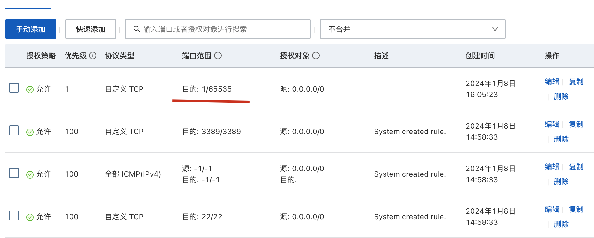

## 问题及解答：

### 1）docker 容器启动，外部却无法访问

```shell
docker run -itd -P  registry.cn-hangzhou.aliyuncs.com/acr-toolkit/ack-cube
##
1c893f5cba84   registry.cn-hangzhou.aliyuncs.com/acr-toolkit/ack-cube   "/docker-entrypoint.…"   10 minutes ago   Up 10 minutes   0.0.0.0:32768->80/tcp, :::32768->80/tcp   practical_hofstadter
```

原因：阿里云的安全组规则需要改动，允许外部访问这个端口



## 使用介绍

### 通过Helm Cli 一键部署 WordPress(Helm3)

1. 下载按照Helm

   ```shell
   curl https://raw.githubusercontent.com/helm/helm/master/scripts/get-helm-3 | bash
   ```
2. 添加仓库

   表示将一个名为 "bitnami" 的 Chart 仓库添加到 Helm 中。

   ```shell
   helm repo add bitnami https://charts.bitnami.com/bitnami 
   ```
3. 搜索wordPress

   ```shell
   helm search repo wordpress
   ```
4. 安装

   ```shell
   helm install wordpress bitnami/wordpress\
   --set mariadb.primary.persistence.enabled=true \
   --set mariadb.primary.persistence.storageClass=alicloud-disk-ssd \
   --set mariadb.primary.persistence.size=20Gi
   --set persistence.enabled=false
   ```

这个 Helm 安装命令的目的是创建一个 WordPress 应用程序，将 MariaDB 数据持久化到阿里云的 SSD 存储上，同时禁用 WordPress 本身的数据持久化。

- `helm install wordpress bitnami/wordpress`: 使用 Helm 安装 Bitnami 提供的 WordPress Helm Chart，创建 WordPress 应用程序的实例。
- `--set mariadb.primary.persistence.enabled=true`: 启用 MariaDB 主数据库的持久化存储。这意味着 MariaDB 数据将保存在持久化卷上，以确保数据在 Pod 重新启动时不会丢失。
- `--set mariadb.primary.persistence.storageClass=alicloud-disk-ssd`: 设置 MariaDB 主数据库的持久化存储的存储类为 "alicloud-disk-ssd"
  。这指定了用于创建持久化卷的存储类，通常与阿里云的 SSD 存储相关。
- `--set mariadb.primary.persistence.size=20Gi`: 设置 MariaDB 主数据库的持久化存储的大小为 20GB。这指定了分配给 MariaDB 数据的存储卷的容量。
- `--set persistence.enabled=false`: 禁用 WordPress 本身的持久化存储。这表示 WordPress 的数据和文件将不会持久化，可能会在 Pod 重新启动时丢失。


# 资料汇总

## Helm3

Helm 3 是 Helm 的最新版本，不再使用 Tiller，而是直接与 Kubernetes API 交互。以下是 Helm 3 的一些基本用法和示例：

### 安装 Helm 3

```bash
curl https://raw.githubusercontent.com/helm/helm/master/scripts/get-helm-3 | bash
```

### Helm 3 基本命令

- 初始化 Helm（不再需要 Tiller）（非必须）：

```bash
helm init
```

- 添加 Helm 仓库：

```bash
helm repo add stable https://charts.helm.sh/stable
```

- 搜索 Helm 仓库中的 Charts：

```bash
helm search repo stable
```

- 安装 Chart：

```bash
helm install my-release stable/chart-name
```

- 卸载 Chart：

```bash
helm uninstall my-release
```

### 示例：安装 Nginx Ingress Controller

```bash
# 添加 Nginx Ingress Controller 的 Helm 仓库
helm repo add ingress-nginx https://kubernetes.github.io/ingress-nginx

# 更新 Helm 仓库信息
helm repo update

# 安装 Nginx Ingress Controller
helm install my-ingress ingress-nginx/ingress-nginx
```

这是一个简单的 Helm 3 使用示例，你可以根据需要安装其他 Charts，例如 MySQL、WordPress 等。请注意，Helm 3 不再需要执行 `helm init` 和 Tiller，所有操作直接与 Kubernetes API 交互。


## `nodeSelector` 和 `nodeAffinity`

`nodeSelector` 和 `nodeAffinity` 是 Kubernetes 中用于指定 Pod 在调度时所需的节点条件的两种机制。

1. **nodeSelector（节点选择器）：**

   - `nodeSelector` 允许你在 Pod 规格中指定一组键值对，以选择符合特定标签的节点。只有具有匹配标签的节点才会被考虑用于调度该 Pod。
   - 示例：
     ```yaml
     apiVersion: v1
     kind: Pod
     metadata:
       name: my-pod
     spec:
       containers:
       - name: my-container
         image: my-image
       nodeSelector:
         diskType: ssd
     ```

     上述示例中，Pod 要求只能在具有标签 `diskType=ssd` 的节点上运行。
2. **nodeAffinity（节点亲和性）：**

   - `nodeAffinity` 是更灵活的机制，允许你指定更复杂的节点选择条件。它包括 `requiredDuringSchedulingIgnoredDuringExecution` 和 `preferredDuringSchedulingIgnoredDuringExecution` 两种方式。
   - `requiredDuringSchedulingIgnoredDuringExecution` 定义了必须满足的节点选择条件，而 `preferredDuringSchedulingIgnoredDuringExecution` 定义了优选条件，如果无法满足则尽量满足。
   - 示例：
     ```yaml
     apiVersion: v1
     kind: Pod
     metadata:
       name: my-pod
     spec:
       containers:
       - name: my-container
         image: my-image
       affinity:
         nodeAffinity:
           requiredDuringSchedulingIgnoredDuringExecution:
             nodeSelectorTerms:
             - matchExpressions:
               - key: diskType
                 operator: In
                 values:
                 - ssd
           preferredDuringSchedulingIgnoredDuringExecution:
           - weight: 1
             preference:
               matchExpressions:
               - key: memory
                 operator: In
                 values:
                 - large
     ```

     上述示例中，Pod 要求在节点上有 `diskType=ssd` 的标签，并且尽量在有 `memory=large` 的节点上运行。

这些机制允许根据节点的特定标签或其他条件，将 Pod 调度到满足特定要求的节点上。这对于在集群中的不同节点上运行特定类型的工作负载非常有用。


## Network Policy

网络策略（Network Policy）是 Kubernetes 中用于定义和控制 Pod 之间通信的一种机制。它允许集群管理员定义规则，限制 Pod 之间的网络流量，从而实现网络的安全性和分隔性。

网络策略通过定义规则来控制 Pod 的入站和出站流量，这些规则基于标签选择器来指定匹配的 Pod 集合。网络策略可以限制哪些 Pod 可以与特定 Pod 通信，以及如何通信。

实现网络策略需要满足以下条件：

1. **支持网络策略的网络插件：** 集群中使用的网络插件需要支持网络策略功能。一些网络插件，如 Calico、Cilium 和 Antrea，已经内置了对网络策略的支持。
2. **支持 NetworkPolicy API 的 Kubernetes 版本：** Kubernetes 集群的版本需要支持 NetworkPolicy API。通常，从 Kubernetes 版本 1.7 开始，NetworkPolicy API 已经成为 Kubernetes 的核心功能，大多数常用的网络插件都支持它。

网络策略允许定义以下几种规则：

- **Ingress 规则：** 控制进入特定 Pod 的流量。
- **Egress 规则：** 控制从特定 Pod 发出的流量。
- **Peer Pod 规则：** 允许或拒绝与特定标签选择器匹配的其他 Pod 之间的通信。

网络策略通过在 Pod 的标签选择器中定义匹配规则，以及在网络策略资源中定义允许或拒绝的流量规则，来实现对 Pod 之间网络通信的细粒度控制。这样可以提高集群的安全性，并确保不同的工作负载之间的网络流量符合预期的策略。

### 网络插件

#### flannel 不支持Network Policy

`flannel` 是一个通用的网络插件，它本身并不支持 Kubernetes 的网络策略（Network Policy）。`flannel` 主要用于提供容器间的基本网络连接，通过在节点之间创建 overlay 网络来实现 Pod 之间的通信。

要在 Kubernetes 中启用网络策略，需要选择支持 Network Policy API 的网络插件。一些其他网络插件，如 Calico、Cilium 和 Antrea，已经内置了对网络策略的支持，并可以通过 Kubernetes 的 Network Policy API 来定义和实施网络策略规则。

#### Terway

当使用 `Terway` 容器网络时，如果希望在 IP 地址或者端口层面控制网络流量，可以为集群中特定应用使用网络策略。
创建集群时选中 NetworkPolicy 支持配置，可自动开启网络策略功能。

#### Calico

Calico（Project Calico）是一个用于容器和云原生环境的开源网络和网络安全解决方案。以下是 Calico 的主要使用和功能：

1. **网络连接：** Calico 提供了一个高性能的容器网络解决方案，支持容器之间的直接通信，同时具备跨主机的网络连接。它使用 BGP（Border Gateway Protocol）来动态路由容器的流量。
2. **IP池和IP自动分配：** Calico 具有灵活的 IP 地址分配和管理机制。它支持自动分配和管理 IP 地址，确保容器在创建时能够获得唯一的 IP 地址。管理员可以定义 IP 池，以指定可用的 IP 地址范围。
3. **Network Policy：** Calico 支持 Kubernetes 中的 Network Policy API。通过定义网络策略，用户可以控制容器之间的流量，实现细粒度的网络隔离和访问控制。
4. **安全组：** Calico 具有内置的安全组功能，可以基于标签或 IP 地址对流量进行过滤和控制。这有助于实现安全的容器通信。
5. **跨云和混合云：** Calico 被设计为能够在多云和混合云环境中运行。这意味着可以在不同云提供商和本地环境中使用相同的 Calico 解决方案，实现统一的网络策略。
6. **网络插件：** Calico 提供了灵活的插件系统，支持与各种容器运行时和云平台的集成。它可以与 Kubernetes、Docker、OpenStack 等平台一起使用。
7. **IPv6 支持：** Calico 完全支持 IPv6，使用户能够在容器网络中使用 IPv6 地址。
8. **灵活的部署：** Calico 的部署非常灵活，可以选择使用纯软件路由或与物理网络设备集成，具体取决于用户的需求和环境。

总体而言，Calico 是一个功能强大而灵活的容器网络解决方案，它为容器和云原生应用提供了高效的网络连接和安全性。

#### 简单示例

使用 Calico 通常涉及以下步骤，以下是一个简单的示例：

**前提条件：**

- 已安装和配置好 Kubernetes 群集。

**步骤：**

1. **安装 Calico：**
   使用 Kubernetes 的 YAML 文件来安装 Calico。以下是一个简单的安装 YAML 文件示例：

   ```yaml
   kubectl apply -f https://docs.projectcalico.org/manifests/calico.yaml
   ```

   这将在 Kubernetes 群集中创建 Calico 所需的所有资源。
2. **检查安装状态：**
   等待一段时间，确保 Calico 插件正常启动。可以运行以下命令检查状态：

   ```bash
   kubectl get pods -n kube-system
   ```

   应该看到 Calico 相关的 Pod 处于运行状态。
3. **创建 NetworkPolicy：**
   Calico 支持 Kubernetes 的 Network Policy API。您可以创建一个简单的 Network Policy，以允许或禁止容器之间的流量。以下是一个示例 Network Policy YAML 文件：

   ```yaml
   apiVersion: networking.k8s.io/v1
   kind: NetworkPolicy
   metadata:
     name: allow-nginx
   spec:
     podSelector:
       matchLabels:
         run: nginx
     ingress:
     - ports:
       - protocol: TCP
         port: 80
   ```

   应用此 Network Policy：

   ```bash
   kubectl apply -f your-network-policy.yaml
   ```
4. **测试网络策略：**
   部署一些 Pod，并尝试在它们之间测试网络连接。通过使用定义的 Network Policy，可以验证网络策略是否生效。

这只是一个简单的示例，实际上您可能需要根据自己的需求定制 Network Policy，并根据实际情况进行调整。建议查阅 Calico 官方文档以获取更详细和定制化的信息。
