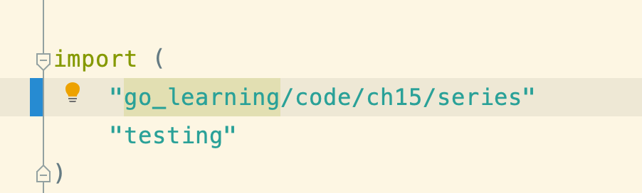
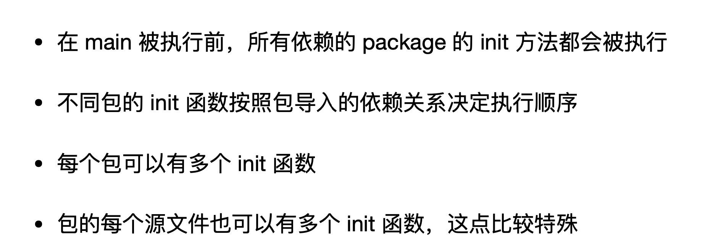
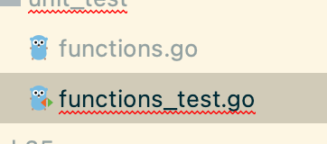
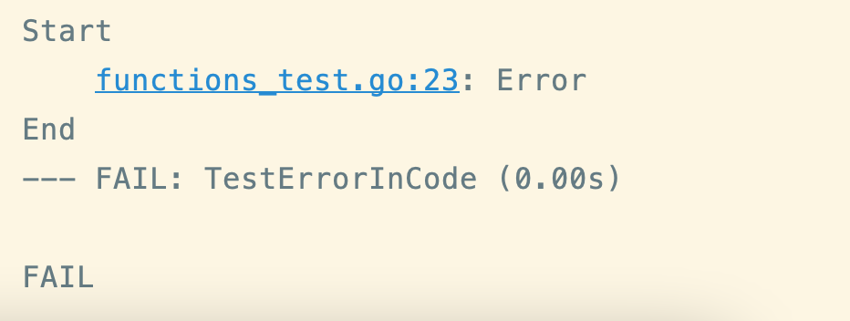
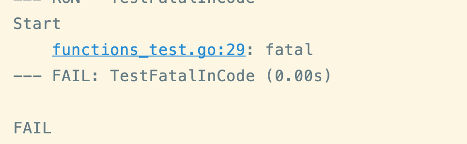
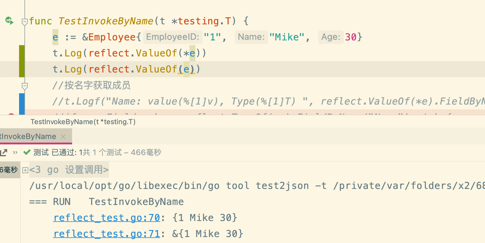

## 变量

```go
var a int =10

//如果你没有显式为变量赋予初值，Go 编译器会为变量赋予这个类型的零值
var a int // a的初值为int类型的零值：0

//变量声明块
var (
    a int = 128
    b int8 = 6
    s string = "hello"
    c rune = 'A'
    t bool = true
)

var a, b, c int = 5, 6, 7

//默认类型赋值
var b = 13//整型值的默认类型 int
// 
var b = int32(13)  //显式地为变量指定类型

// 短变量声明
a := 12
b := 'A'
c := "hello"

a, b, c := 12, 'A', "hello"
```

Go 语言的两类变量。

一类称为**包级变量 (package varible)**，也就是在包级别可见的变量。如果是导出变量（大写字母开头），那么这个包级变量也可以被视为全局变量；**包级变量只能使用带有 var 关键字的变量声明形式**
，不能使用短变量声明形式。

另一类则是**局部变量 (local varible)**，也就是 Go 函数或方法体内声明的变量，仅在函数或方法体内可见。

## 常量

```go
package main

import (
    "fmt"
    "math"
)

const s string = "constant"

func main() {
    fmt.Println(s)

    const n = 500000000

    const d = 3e20 / n
    fmt.Println(d)

    fmt.Println(int64(d))

    fmt.Println(math.Sin(n))
}
```

`const` 用于声明一个常量

## If/Else

在 Go 中，条件语句的圆括号不是必需的，但是花括号是必需的。

**在条件语句之前可以有一个声明语句；在这里声明的变量可以在这个语句所有的条件分支中使用**。

```go
package main

import "fmt"

func main() {

    if 7%2 == 0 {
        fmt.Println("7 is even")
    } else {
        fmt.Println("7 is odd")
    }

    if 8%4 == 0 {
        fmt.Println("8 is divisible by 4")
    }

    if num := 9; num < 0 {
        fmt.Println(num, "is negative")
    } else if num < 10 {
        fmt.Println(num, "has 1 digit")
    } else {
        fmt.Println(num, "has multiple digits")
    }
}
```

## Switch

在同一个 `case` 语句中，你可以使用逗号来分隔多个表达式。 在这个例子中，我们还使用了可选的 `default` 分支。

```go
package main

import (
    "fmt"
    "time"
)

func main() {

    i := 2
    fmt.Print("write ", i, " as ")
    switch i {
    case 1:
        fmt.Println("one")
    case 2:
        fmt.Println("two")
    case 3:
        fmt.Println("three")
    }

    switch time.Now().Weekday() {
    case time.Saturday, time.Sunday:
        fmt.Println("It's the weekend")
    default:
        fmt.Println("It's a weekday")
    }

    t := time.Now()
    switch {
    case t.Hour() < 12:
        fmt.Println("It's before noon")
    default:
        fmt.Println("It's after noon")
    }

    whatAmI := func(i interface{}) {
        switch t := i.(type) {
        case bool:
            fmt.Println("I'm a bool")
        case int:
            fmt.Println("I'm an int")
        default:
            fmt.Printf("Don't know type %T\n", t)
        }
    }
    whatAmI(true)
    whatAmI(1)
    whatAmI("hey")
}
// print
Write 2 as two
It's a weekday
It's after noon
I'm a bool
I'm an int
Don't know type string
```

## 数组

*数组* 是一个具有编号且长度固定的元素序列

```go
package main

import "fmt"

func main() {

    var a [5]int //创建了一个刚好可以存放 5 个 int 元素的数组 a
    fmt.Println("emp:", a)

    a[4] = 100 //可以使用 array[index] = value 语法来设置数组指定位置的值， 或者用 array[index] 得到值
    fmt.Println("set:", a)
    fmt.Println("get:", a[4])

    fmt.Println("len:", len(a))

    b := [5]int{1, 2, 3, 4, 5} //一行内声明并初始化一个数组
    fmt.Println("dcl:", b)

    var twoD [2][3]int
    for i := 0; i < 2; i++ {
        for j := 0; j < 3; j++ {
            twoD[i][j] = i + j
        }
    }
    fmt.Println("2d: ", twoD)
  

values := [5]int{1, 2, 3, 4, 5}
values[1:3] // {2, 3, } 不包含尾部
len(values) // 5
}
```

## 切片

*Slice* 是 Go 中一个重要的数据类型，它提供了比数组更强大的序列交互方式。

```go
package main

import "fmt"

func main() {

    s := make([]string, 3)//创建了一个长度为 3 的 string 类型的 slice（初始值为零值）
    fmt.Println("emp:", s)

    s[0] = "a"
    s[1] = "b"
    s[2] = "c"
    fmt.Println("set:", s)
    fmt.Println("get:", s[2])

    fmt.Println("len:", len(s))

    s = append(s, "d")
    s = append(s, "e", "f")
    fmt.Println("apd:", s) //apd: [a b c d e f]

    c := make([]string, len(s))
    copy(c, s)  //创建新的切片 copy数据，对于c的修改就不会影响到原来的切片s
    fmt.Println("cpy:", c) //cpy: [a b c d e f]

    l := s[2:5]
    fmt.Println("sl1:", l) //包含元素 s[2]、s[3] 和 s[4] 的 slice

    l = s[:5]
    fmt.Println("sl2:", l)

    l = s[2:]
    fmt.Println("sl3:", l)

    t := []string{"g", "h", "i"}
    fmt.Println("dcl:", t)

  //Slice 可以组成多维数据结构。内部的 slice 长度可以不一致，这一点和多维数组不同
    twoD := make([][]int, 3)
    for i := 0; i < 3; i++ {
        innerLen := i + 1
        twoD[i] = make([]int, innerLen)
        for j := 0; j < innerLen; j++ {
            twoD[i][j] = i + j
        }
    }
    fmt.Println("2d: ", twoD) //2d:  [[0] [1 2] [2 3 4]]
  
  ss := make([]int, 1,2)
  ss2 := []int{1,3,4}
  // make function: create a slice with length and capacity
slice := make([]int, 5, 6) // make(type, len, cap)
  // For range: iterate over a slice
slice := string["W", "o", "w"]

for i, value := range slice {
    i // 0, then 1, then 2
    value // "W", then "o", then "w"
}

// Skip index or value

for i := range slice {
    i // 0, then 1, then 2
}

for _, value := range slice {
   value // "W", then "o", then "w"
}
}
```

## Map

*map* 是 Go 内建的[关联数据类型](http://zh.wikipedia.org/wiki/关联数组) （在一些其他的语言中也被称为 *哈希(hash)* 或者 *字典(dict)* ）。

map的value可以是函数方法

```go
func TestMapWithFunValue(t *testing.T) {
	m := map[int]func(op int) int{}
	m[1] = func(op int) int { return op }
	m[2] = func(op int) int { return op * op }
	m[3] = func(op int) int { return op * op * op }
	t.Log(m[1](2), m[2](2), m[3](2))
}
```

```go
package main

import "fmt"

func main() {

    m := make(map[string]int)

    m["k1"] = 7
    m["k2"] = 13

    fmt.Println("map:", m) //使用 fmt.Println 打印一个 map，会输出它所有的键值对。

    v1 := m["k1"]
    fmt.Println("v1: ", v1)

    fmt.Println("len:", len(m))

    delete(m, "k2")
    fmt.Println("map:", m)
//选择是否接收的第二个返回值，该值表明了 map 中是否存在这个键
    _, prs := m["k2"]
    fmt.Println("prs:", prs)

    n := map[string]int{"foo": 1, "bar": 2}  //声明并初始化
    fmt.Println("map:", n)
}
// result
map: map[k1:7 k2:13]
v1:  7
len: 2
map: map[k1:7]
prs: false
map: map[foo:1 bar:2]
```

## For循环

```go
package main

import "fmt"

func main() {

    i := 1
    for i <= 3 {
        fmt.Println(i)
        i = i + 1
    }

    for j := 7; j <= 9; j++ {
        fmt.Println(j)
    }

    for {
        fmt.Println("loop")
        break
    }

    for n := 0; n <= 5; n++ {
        if n%2 == 0 {
            continue
        }
        fmt.Println(n)
    }
}
```

## Range 遍历

```go
package main

import "fmt"

func main() {

    nums := []int{2, 3, 4}
    sum := 0
    for _, num := range nums {
        sum += num
    }
    fmt.Println("sum:", sum)

    for i, num := range nums {
        if num == 3 {
            fmt.Println("index:", i)
        }
    }

    kvs := map[string]string{"a": "apple", "b": "banana"}
    for k, v := range kvs {
        fmt.Printf("%s -> %s\n", k, v)
    }

  //range 也可以只遍历 map 的键。
    for k := range kvs {
        fmt.Println("key:", k)
    }

    for i, c := range "go" {
        fmt.Println(i, c)
    }
  // range 在字符串中迭代 unicode 码点(code point)。 第一个返回值是字符的起始字节位置(相对的偏移量)，然后第二个是字符本身(码点值) 
  var s = "中国人"

for i, v := range s {
    fmt.Printf("index: %d, value: 0x%x\n", i, v)
}
//print
index: 0, value: 0x4e2d
index: 3, value: 0x56fd
index: 6, value: 0x4eba
}
可以使用 %c 格式化字符
// result
sum: 9
index: 1
a -> apple
b -> banana
key: a
key: b
0 103
1 111
```

## 函数：function

### 参数传递

```go
package main

import "fmt"

func plus(a int, b int) int {

    return a + b //需要明确的 return，它不会自动 return 最后一个表达式的值
}

//当多个连续的参数为同样类型时， 可以仅声明最后一个参数的类型
func plusPlus(a, b, c int) int {
    return a + b + c
}

func main() {

    res := plus(1, 2)
    fmt.Println("1+2 =", res)

    res = plusPlus(1, 2, 3)
    fmt.Println("1+2+3 =", res)
}
```

### 多返回值

```go
package main

import "fmt"

func vals() (int, int) {
    return 3, 7
}

func main() {

    a, b := vals()
    fmt.Println(a)
    fmt.Println(b)

    _, c := vals() //你仅仅需要返回值的一部分的话，你可以使用空白标识符 _
    fmt.Println(c)
}
```

### 可变参数函数

```go
package main

import "fmt"
//接受任意数量的 int 作为参数
func sum(nums ...int) {
    fmt.Print(nums, " ")
    total := 0
    for _, num := range nums {
        total += num
    }
    fmt.Println(total)
}

func main() {

    sum(1, 2)
    sum(1, 2, 3)

    nums := []int{1, 2, 3, 4}
    sum(nums...) //多个值的 slice，想把它们作为参数使用
}
```

### 匿名函数和闭包

当我们说一个函数是一个闭包时，我们指的是这个函数可以访问并且修改其外部作用域的变量。这些被访问的变量不是函数的参数，也不是函数内部声明的变量，而是在函数外部定义的。闭包在 Go 中通常是匿名函数。

```go
package main

import "fmt"

// intSeq 函数返回一个在其函数体内定义的匿名函数。 返回的函数使用闭包的方式 隐藏 变量 i。 返回的函数 隐藏 变量 i 以形成闭包
func intSeq() func() int {
    i := 0
    return func() int {
        i++
        return i
    }
}

func main() {

    nextInt := intSeq() // 获得了闭包函数

    fmt.Println(nextInt())
    fmt.Println(nextInt())
    fmt.Println(nextInt())

    newInts := intSeq()
    fmt.Println(newInts())
}
//result
1
2
3
1
```

### 递归

```go
package main

import "fmt"

func fact(n int) int {
    if n == 0 {
        return 1
    }
    return n * fact(n-1) // fact 函数在到达 fact(0) 前一直调用自身
}

func main() {
    fmt.Println(fact(7))

// 闭包也可以是递归的，但这要求在定义闭包之前用类型化的 var 显式声明闭包
    var fib func(n int) int 

    fib = func(n int) int {
        if n < 2 {
            return n
        }
        return fib(n-1) + fib(n-2)
    }

    fmt.Println(fib(7))
}
```

### defer() 函数

`defer` 是 Go 语言的一个关键字，用于延迟执行一个函数调用。被 `defer` 关键字修饰的函数会在包含 `defer` 语句的函数执行结束时才被调用，而不论包含 `defer` 的函数是正常返回还是发生了 panic。

`defer` 常常用于确保一些清理工作会被执行，或者在函数返回时记录日志等。`defer` 的典型应用场景包括文件操作中的关闭文件、解锁互斥锁、数据库连接的关闭等。

以下是一个使用 `defer` 关键字的简单示例：

```go
package main

import "fmt"

func main() {
    fmt.Println("Start")

    // 在函数结束时调用 cleanup 函数
    defer cleanup()

    fmt.Println("Do some work")
    // 模拟函数执行期间的其他操作

    fmt.Println("End")
}

func cleanup() {
    fmt.Println("Performing cleanup")
}
```

在这个例子中，`cleanup` 函数被使用 `defer` 关键字推迟到 `main` 函数结束时执行，即使在 `main` 函数中的某个地方发生了 `panic`，`cleanup` 函数仍然会被执行。

### panic

在 Go 语言中，`panic` 是一个内建函数，用于引发运行时恐慌。当发生某些不可恢复的错误时，可以使用 `panic` 来中断程序的正常流程。`panic` 的调用会引发堆栈跟踪，显示错误发生的位置，以便于调试。

`panic` 的基本用法是：

```go
func example() {
    // ...

    if somethingWentWrong {
        panic("Something went wrong!")
    }

    // ...
}
```

在上面的例子中，如果 `somethingWentWrong` 的条件成立，`panic` 将被调用，程序将中断并输出错误信息。

另外，Go 还提供了 `recover` 函数，用于在延迟函数（`defer`）中捕获 `panic` 引发的错误，从而实现一定程度的错误恢复。`recover` 只有在延迟函数中调用时才有效，如果在非延迟函数中调用，它将返回 `nil`。

以下是一个简单的例子，演示了 `panic` 和 `recover` 的用法：

```go
package main

import "fmt"

func recoverExample() {
    defer func() {
        if err := recover(); err != nil {
            fmt.Println("Recovered:", err)
        }
    }()

    // 引发 panic
    panic("Something went wrong!")
}

func main() {
    fmt.Println("Start")

    // 调用包含 recover 的函数
    recoverExample()

    fmt.Println("End")
}
```

在这个例子中，`recoverExample` 函数中的 `defer` 区块使用了 `recover`，用于捕获 `panic` 引发的错误，并输出错误信息。这样即使在发生 `panic` 后，程序仍然可以继续执行。

## 指针

Go 拥有指针。指针保存了值的**内存地址**。

类型 `*T` 是指向 `T` 类型值的指针。其零值为 `nil`，如果我们拥有一个类型 T，那么以 T 作为基类型的指针类型为 *T。

```go
var p *int
var a *T
```

`&` 操作符会生成一个指向其操作数的指针。&符号称为取地址符号

```
i := 42
p = &i
```

`*` 操作符表示指针指向的底层值。通过指针变量读取或修改其指向的内存地址上的变量值，这个操作被称为指针的解引用（dereference）。

```
fmt.Println(*p) // 通过指针 p 读取 i
*p = 21         // 通过指针 p 设置 i
```

这也就是通常所说的“间接引用”或“重定向”。

```go
package main

import "fmt"

func zeroval(ival int) {
    ival = 0
}

//参数为int指针
func zeroptr(iptr *int) {
    *iptr = 0 //通过指针设置值
}

func main() {
	i, j := 42, 2701

	p := &i         // 指向 i
	fmt.Println(*p) // 通过指针读取 i 的值
	*p = 21         // 通过指针设置 i 的值
	fmt.Println(i)  // 查看 i 的值

	p = &j         // 指向 j
	*p = *p / 37   // 通过指针对 j 进行除法运算
	fmt.Println(j) // 查看 j 的值
  
    i := 1
    fmt.Println("initial:", i)

    zeroval(i)
    fmt.Println("zeroval:", i)

    zeroptr(&i)
    fmt.Println("zeroptr:", i)

    fmt.Println("pointer:", &i)
}
// result
42
21
73

initial: 1
zeroval: 1
zeroptr: 0
pointer: 0x42131100


```

### 二级指针

```go

package main

func main() {
    var a int = 5
    var p1 *int = &a
    println(*p1) // 5
    var b int = 55
    var p2 *int = &b
    println(*p2) // 55

    var pp **int = &p1
    println(**pp) // 5
    pp = &p2  
    println(**pp) // 55
}  
------------------

package main

func foo(pp **int) {
    var b int = 55
    var p1 *int = &b
    (*pp) = p1
}

func main() {
    var a int = 5
    var p *int = &a
    println(*p) // 5
    foo(&p)
    println(*p) // 55
}
```

## 字符串和rune类型

Go语言中的字符串是一个只读的byte类型的切片。在Go语言当中，字符的概念被称为 `rune` - 它是一个表示 Unicode 编码的整数。

```go
package main

import (
    "fmt"
    "unicode/utf8"
)

func main() {

    const s = "สวัสดี"

    fmt.Println("Len:", len(s))

    for i := 0; i < len(s); i++ {
        fmt.Printf("%x ", s[i])
    }
    fmt.Println()

    fmt.Println("Rune count:", utf8.RuneCountInString(s))

    for idx, runeValue := range s {
        fmt.Printf("%#U starts at %d\n", runeValue, idx)
    }

    fmt.Println("\nUsing DecodeRuneInString")
    for i, w := 0, 0; i < len(s); i += w {
        runeValue, width := utf8.DecodeRuneInString(s[i:])
        fmt.Printf("%#U starts at %d\n", runeValue, i)
        w = width

        examineRune(runeValue)
    }
}

func examineRune(r rune) {

    if r == 't' {
        fmt.Println("found tee")
    } else if r == 'ส' {
        fmt.Println("found so sua")
    }
}

Len: 18
e0 b8 aa e0 b8 a7 e0 b8 b1 e0 b8 aa e0 b8 94 e0 b8 b5
Rune count: 6
U+0E2A 'ส' starts at 0
U+0E27 'ว' starts at 3
U+0E31 'ั' starts at 6
U+0E2A 'ส' starts at 9
U+0E14 'ด' starts at 12
U+0E35 'ี' starts at 15
Using DecodeRuneInString
U+0E2A 'ส' starts at 0
found so sua
U+0E27 'ว' starts at 3
U+0E31 'ั' starts at 6
U+0E2A 'ส' starts at 9
found so sua
U+0E14 'ด' starts at 12
U+0E35 'ี' starts at 15

```

1)string 类型的数据是不可变的，提高了字符串的并发安全性和存储利用率。Go 语言规定，字符串类型的值在它的生命周期内是不可改变的。

```go
var s string = "hello"
s[0] = 'k'   // 错误：字符串的内容是不可改变的
s = "gopher" // ok
```

2)原生支持“所见即所得”的原始字符串，大大降低构造多行字符串时的心智负担

通过一对反引号原生支持构造“所见即所得”的原始字符串（Raw String）。而且，Go 语言原始字符串中的任意转义字符都不会起到转义的作用

```go
var s string = `         ,_---~~~~~----._
    _,,_,*^____      _____*g*\"*,--,
   / __/ /'     ^.  /      \ ^@q   f
  [  @f | @))    |  | @))   l  0 _/
   \/   \~____ / __ \_____/     \
    |           _l__l_           I
    }          [______]           I
    ]            | | |            |
    ]             ~ ~             |
    |                            |
     |                           |`
fmt.Println(s)
```

3)对非 ASCII 字符提供原生支持，消除了源码在不同环境下显示乱码的可能。Go 语言源文件默认采用的是 Unicode 字符集，

Go 字符串的组成

Go 语言在看待 Go 字符串组成这个问题上，有两种视角。

一种是**字节视角**，也就是和所有其它支持字符串的主流语言一样，Go 语言中的字符串值也是一个**可空的字节序列**，字节序列中的字节个数称为该字符串的长度。一个个的字节只是孤立数据，不表意。

```go
var s = "中国人"
fmt.Printf("the length of s = %d\n", len(s)) // 9

for i := 0; i < len(s); i++ {
  fmt.Printf("0x%x ", s[i]) // 0xe4 0xb8 0xad 0xe5 0x9b 0xbd 0xe4 0xba 0xba
}
fmt.Printf("\n")
```

另外一个**字符视角**，也就是字符串是由一个可空的字符序列构成。这个时候我们再看下面代码，以 0x4e2d 为例，它是汉字“中”在 Unicode 字符集表中的码点（Code Point）。

```go
var s = "中国人"
fmt.Println("the character count in s is", utf8.RuneCountInString(s)) // 3

for _, c := range s {
  fmt.Printf("0x%x ", c) // 0x4e2d 0x56fd 0x4eba
}
fmt.Printf("\n")
```

### 码点

Unicode 字符集中的每个字符，都被分配了统一且唯一的字符编号。所谓 Unicode 码点，就是指将 Unicode 字符集中的所有字符“排成一队”，字符在这个“队伍”中的位次，就是它在 Unicode
字符集中的码点。也就说，一个码点唯一对应一个字符。“码点”的概念和我们马上要讲的 rune 类型有很大关系。

#### rune 类型与字符字面值

Go 使用 rune 这个类型来表示一个 Unicode 码点。rune 本质上是 int32 类型的别名类型，它与 int32 类型是完全等价的。

由于一个 Unicode 码点唯一对应一个 Unicode 字符。所以我们可以说，**一个 rune 实例就是一个 Unicode 字符，一个 Go 字符串也可以被视为 rune 实例的集合**。我们可以通过字符字面值来初始化一个 rune
变量。

```go
"abc\n"
"中国人"
"\u4e2d\u56fd\u4eba" // 中国人
"\U00004e2d\U000056fd\U00004eba" // 中国人
"中\u56fd\u4eba" // 中国人，不同字符字面值形式混合在一起
"\xe4\xb8\xad\xe5\x9b\xbd\xe4\xba\xba" // 十六进制表示的字符串字面值：中国人。  这个字节序列实际上是“中国人”这个 Unicode 字符串的 UTF-8 编码值
```

#### UTF-8 编码方案

UTF-8 编码解决的是 Unicode 码点值在计算机中如何存储和表示（位模式）的问题。那你可能会说，码点唯一确定一个 Unicode 字符，直接用码点值不行么？

和 UTF-32 方案不同，UTF-8 方案使用变长度字节，对 Unicode 字符的码点进行编码。编码采用的字节数量与 Unicode
字符在码点表中的序号有关：表示序号（码点）小的字符使用的字节数量少，表示序号（码点）大的字符使用的字节数多。

#### Go 字符串类型的内部表示

**string 类型其实是一个“描述符”，它本身并不真正存储字符串数据，而仅是由一个指向底层存储的指针和字符串的长度字段组成的**


了解了 string 类型的实现原理后，我们还可以得到这样一个结论，那就是我们直接将 string 类型通过函数 / 方法参数传入也不会带来太多的开销。**因为传入的仅仅是一个“描述符”**，而不是真正的字符串数据。

#### Go 字符串类型的常见操作

由于字符串的不可变性，针对字符串，我们更多是尝试对其进行读取

##### 第一个操作：下标操作。

在字符串的实现中，真正存储数据的是底层的数组。字符串的下标操作本质上等价于底层数组的下标操作。

```go
var s = "中国人"
fmt.Printf("0x%x\n", s[0]) // 0xe4：字符“中” utf-8编码的第一个字节
```

我们可以看到，通过下标操作，我们获取的是字符串中**特定下标上的字节**，而不是字符

##### 第二个操作：字符迭代。

Go 有两种迭代形式：常规 for 迭代与 for range 迭代。

通过常规 **for 迭代**对字符串进行的操作是一种**字节视角**的迭代，每轮迭代得到的的结果都是组成字符串内容的一个字节，以及该字节所在的下标值，这也等价于对字符串底层数组的迭代，比如下面代码：

```go
var s = "中国人"

for i := 0; i < len(s); i++ {
  fmt.Printf("index: %d, value: 0x%x\n", i, s[i])
}
//print
index: 0, value: 0xe4
index: 1, value: 0xb8
index: 2, value: 0xad
index: 3, value: 0xe5
index: 4, value: 0x9b
index: 5, value: 0xbd
index: 6, value: 0xe4
index: 7, value: 0xba
index: 8, value: 0xba
```

for range 迭代

```go
var s = "中国人"

for i, v := range s {
    fmt.Printf("index: %d, value: 0x%x\n", i, v)
}
//print
index: 0, value: 0x4e2d
index: 3, value: 0x56fd
index: 6, value: 0x4eba
```

我们看到，通过 for range 迭代，我们每轮迭代得到的是字符串中 Unicode 字符的码点值，以及该字符在字符串中的偏移值。

##### 第三个操作：字符串连接

```go
s := "Rob Pike, "
s = s + "Robert Griesemer, "
s += " Ken Thompson"

fmt.Println(s) // Rob Pike, Robert Griesemer, Ken Thompson
```

虽然通过 +/+= 进行字符串连接的开发体验是最好的，但连接性能就未必是最快的了。除了这个方法外，Go 还提供了 strings.Builder、strings.Join、fmt.Sprintf 等函数来进行字符串连接操作。

> 如果能知道拼接字符串的个数，那么使用bytes.Buffer和strings.Builder的Grows申请空间后，性能是最好的；
>
> 如果不能确定长度，那么bytes.Buffer和strings.Builder也比“+”和fmt.Sprintf性能好很多。

> bytes.Buffer与strings.Builder，strings.Builder更合适，因为bytes.Buffer 转化为字符串时重新申请了一块空间，存放生成的字符串变量，而 strings.Builder 直接将底层的 []byte 转换成了字符串类型返回了回来。
>
> bytes.Buffer 的注释中还特意提到了： To build strings more efficiently, see the strings.Builder type.

##### 第四个操作：字符串比较

Go 采用字典序的比较策略，分别从**每个字符串的起始处**，开始逐个**字节**地对两个字符串类型变量进行比较。

当两个字符串之间出现了第一个不相同的元素，比较就结束了，这两个元素的比较结果就会做为串最终的比较结果。如果出现两个**字符串长度不同**的情况，长度比较小的字符串会**用空元素补**齐，空元素比其他非空元素都小。

```go
func main() {
        // ==
        s1 := "世界和平"
        s2 := "世界" + "和平"
        fmt.Println(s1 == s2) // true

        // !=
        s1 = "Go"
        s2 = "C"
        fmt.Println(s1 != s2) // true

        // < and <=
        s1 = "12345"
        s2 = "23456"
        fmt.Println(s1 < s2)  // true
        fmt.Println(s1 <= s2) // true

        // > and >=
        s1 = "12345"
        s2 = "123"
        fmt.Println(s1 > s2)  // true
        fmt.Println(s1 >= s2) // true
}
```

## 结构体（struct）

Go 的*结构体(struct)* 是带类型的字段(fields)集合。 这在组织数据时非常有用。

```go
package main

import "fmt"

type person struct {
    name string
    age  int
}
// 代码定义了一个名为 newPerson 的函数，该函数用于创建并返回一个 person 结构体的指针
func newPerson(name string) *person {

    p := person{name: name}
    p.age = 42
    return &p
}

func main() {

    fmt.Println(person{"Bob", 20})

    fmt.Println(person{name: "Alice", age: 30})

    fmt.Println(person{name: "Fred"}) //省略的字段将被初始化为零值

    fmt.Println(&person{name: "Ann", age: 40}) //& 前缀生成一个结构体指针

    fmt.Println(newPerson("Jon"))

    s := person{name: "Sean", age: 50}
    fmt.Println(s.name) // Sean

    sp := &s
    fmt.Println(sp.age) //50    指针会被自动解引用

    sp.age = 51
    fmt.Println(sp.age)
}
// result
{Bob 20}
{Alice 30}
{Fred 0}
&{Ann 40}
&{Jon 42}
Sean
50
51
```

### 结构体方法

使用指针接收者的原因有二：

首先，方法能够修改其接收者指向的值。

其次，这样可以避免在每次调用方法时复制该值。若值的类型为大型结构体时，这样做会更加高效。

值/指针接收器都可以用值或者指针调用，Go 会在需要的时候自动进行转换

```go
package main

import "fmt"

type rect struct {
    width, height int
}

//指针接收器，可以直接修改结构体的值
func (r *rect) area() int {
    return r.width * r.height
}
// 值接收器 对原结构体的副本（拷贝）操作
func (r rect) perim() int {
    return 2*r.width + 2*r.height
}

func main() {
//这种赋值，r是这个结构体变量的值
    r := rect{width: 10, height: 5}

    fmt.Println("area: ", r.area())
    fmt.Println("perim:", r.perim())
rp := &r
    fmt.Println("area: ", rp.area())
    fmt.Println("perim:", rp.perim())

// 使用 new 创建 rect 结构体的实例，r 是指向该实例的指针
	r := new(rect)
	r.width = 3
	r.height = 4

}
//result
area:  50
perim: 30
area:  50
perim: 30

------------------------------
package main

import (
	"fmt"
	"math"
)

type Vertex struct {
	X, Y float64
}

func (v Vertex) Abs() float64 {
	return math.Sqrt(v.X*v.X + v.Y*v.Y)
}

func (v *Vertex) Scale(f float64) {
	v.X = v.X * f
	v.Y = v.Y * f
}

func main() {
	v := Vertex{3, 4}
	v.Scale(10)
	fmt.Println(v.Abs())   // 50
}
```

## 接口

方法签名的集合叫做：_接口(Interfaces)_。

多态例子：

```go
 package polymorphism

import (
	"fmt"
	"testing"
)

type Code string
type Programmer interface {
	WriteHelloWorld() Code
}

type GoProgrammer struct {
}

func (p *GoProgrammer) WriteHelloWorld() Code {
	return "fmt.Println(\"Hello World!\")"
}

type JavaProgrammer struct {
}

func (p *JavaProgrammer) WriteHelloWorld() Code {
	return "System.out.Println(\"Hello World!\")"
}

func writeFirstProgram(p Programmer) {
	fmt.Printf("%T %v\n", p, p.WriteHelloWorld())
}

func TestPolymorphism(t *testing.T) {
	goProg := &GoProgrammer{} //WriteHelloWorld是指针接收器，所以需要用指针
	javaProg := new(JavaProgrammer)
	writeFirstProgram(goProg)
	writeFirstProgram(javaProg)
}

```

这个代码演示了多态性的概念。首先，定义了两个类型 `GoProgrammer` 和 `JavaProgrammer`，它们都实现了同一个接口 `Programmer` 中的 `WriteHelloWorld` 方法。

然后，通过 `writeFirstProgram` 函数，将不同类型的程序员传入，并调用它们的 `WriteHelloWorld` 方法。这里使用了接口作为参数类型，不同类型的程序员实现了相同的接口方法，因此可以在函数中以相同的方式调用。

在 `TestPolymorphism` 测试函数中，创建了一个 `GoProgrammer` 实例和一个 `JavaProgrammer` 实例，然后分别调用了 `writeFirstProgram` 函数。在函数内部，通过 `%T` 格式化符号打印了传入的具体类型和调用方法的结果。

这样的设计体现了接口的多态性，同一个接口可以被不同的类型实现，从而在不改变接口的情况下调用不同类型的对象。

```go
package main

import (
    "fmt"
    "math"
)

type geometry interface {
    area() float64
    perim() float64
}

type rect struct {
    width, height float64
}
type circle struct {
    radius float64
}

func (r rect) area() float64 {
    return r.width * r.height
}
func (r rect) perim() float64 {
    return 2*r.width + 2*r.height
}

func (c circle) area() float64 {
    return math.Pi * c.radius * c.radius
}
func (c circle) perim() float64 {
    return 2 * math.Pi * c.radius
}
//如果一个变量实现了某个接口，我们就可以调用指定接口中的方法。 这儿有一个通用的 measure 函数，我们可以通过它来使用所有的 geometry。
func measure(g geometry) {
    fmt.Println(g)
    fmt.Println(g.area())
    fmt.Println(g.perim())
}

func main() {
    r := rect{width: 3, height: 4}
    c := circle{radius: 5}
//多态
//结构体类型 circle 和 rect 都实现了 geometry 接口， 所以我们可以将其实例作为 measure 的参数
    measure(r)
    measure(c)
}
```

```go


package main

import (
	"fmt"
	"math"
)

type I interface {
	M()
}

type T struct {
	S string
}
//指针接收器
func (t *T) M() {
	fmt.Println(t.S)
}

type F float64
//值接收器
func (f F) M() {
	fmt.Println(f)
}

func main() {
	var i I

	i = &T{"Hello"}
	describe(i)
	i.M()

	i = F(math.Pi)
	describe(i)
	i.M()
}
// describe() 函数用于打印接口的值和类型
func describe(i I) {
	fmt.Printf("(%v, %T)\n", i, i)
}
// 解释：
当我们运行 main() 函数时，
首先将 &T{"Hello"} 赋给 i，
然后调用 describe(i) 打印 (Hello, *main.T)，
最后调用 i.M() 输出 Hello。

接着，将 F(math.Pi) 赋给 i，
再次调用 describe(i) 打印 (3.141592653589793, main.F)，
最后调用 i.M() 输出 3.141592653589793。
这个里面M()方法的实现分别是指针接收器和值接收器，所以得到的接口的类型是不一样的

// result
(&{Hello}, *main.T)
Hello
(3.141592653589793, main.F)
3.141592653589793
```

## Embedding 嵌入

Go支持对于结构体(struct)和接口(interfaces)的 *嵌入(embedding)* 以表达一种更加无缝的 *组合(composition)* 类型

```go
package main

import "fmt"

type base struct {
    num int
}

func (b base) describe() string {
    return fmt.Sprintf("base with num=%v", b.num)
}
//一个 container 嵌入 了一个 base. 一个嵌入看起来像一个没有名字的字段
type container struct {
    base
    str string
}

func main() {
//当创建含有嵌入的结构体，必须对嵌入进行显式的初始化； 在这里使用嵌入的类型当作字段的名字
    co := container{
        base: base{
            num: 1,
        },
        str: "some name",
    }

    fmt.Printf("co={num: %v, str: %v}\n", co.num, co.str)

    fmt.Println("also num:", co.base.num)
//由于 container 嵌入了 base，因此base的方法 也成为了 container 的方法。在这里我们直接在 co 上 调用了一个从 base 嵌入的方法。
    fmt.Println("describe:", co.describe())

    type describer interface {
        describe() string
    }
//  可以使用带有方法的嵌入结构来赋予接口实现到其他结构上。 
//  因为嵌入了 base ，在这里我们看到 container 也实现了 describer 接口。
    var d describer = co
    fmt.Println("describer:", d.describe())
}

// result
co={num: 1, str: some name}
also num: 1
describe: base with num=1
describer: base with num=1
```

例子2：

```go
package main

import "fmt"

// Animal 是一个基础的动物类型
type Animal struct {
	Name string
}

// Dog 是一个嵌入 Animal 的类型
type Dog struct {
	Animal   // 嵌入 Animal 类型
	Breed    string
}

// Cat 是一个嵌入 Animal 的类型
type Cat struct {
	Animal   // 嵌入 Animal 类型
	Color    string
}

func main() {
	// 创建一个 Dog 实例
	dog := Dog{
		Animal: Animal{Name: "Buddy"},
		Breed:  "Labrador",
	}

	// 创建一个 Cat 实例
	cat := Cat{
		Animal: Animal{Name: "Whiskers"},
		Color:  "Orange",
	}

	// 访问 Dog 的属性
	fmt.Printf("Dog Name: %s\n", dog.Name)
	fmt.Printf("Dog Breed: %s\n", dog.Breed)

	// 访问 Cat 的属性
	fmt.Printf("Cat Name: %s\n", cat.Name)
	fmt.Printf("Cat Color: %s\n", cat.Color)
}
```

例子3：
如果将内部的struct 看作父类，外部的看作子类；
子类并不是真正的继承父类的方法，父类定义的方法无法访问子类的数据和方法

```go
package extension

import (
	"fmt"
	"testing"
)

type Pet struct {
}

func (p *Pet) Speak() {
	fmt.Print("...")
}

func (p *Pet) SpeakTo(host string) {
	// 父类定义的方法无法访问子类的数据和方法
	p.Speak()
	fmt.Println(" ", host)
}

type Dog struct {
	Pet
}

func (d *Dog) Speak() {
	fmt.Print("Wang!")
}

func TestDog(t *testing.T) {
	dog := new(Dog)
	dog.Speak() //覆盖原来的方法
	dog.SpeakTo("Chao")
}
//结果
wang!
...  Chao
```

例子4：
在 Go 语言中，如果内部的结构体嵌套在外部结构体中，而且内部结构体和外部结构体都有同名的方法，那么外部结构体的方法会覆盖内部结构体的方法。这种方式称为方法的覆写（Method Overriding）。

举例说明：

```go
package main

import "fmt"

type InnerStruct struct{}

func (i InnerStruct) Method() {
    fmt.Println("InnerStruct's Method")
}

type OuterStruct struct {
    InnerStruct
}

func (o OuterStruct) Method() {
    fmt.Println("OuterStruct's Method")
}

func main() {
    outer := OuterStruct{}

    // 调用 OuterStruct 的 Method 方法
    outer.Method() // 输出：OuterStruct's Method

    // 调用 InnerStruct 的 Method 方法
    inner := outer.InnerStruct
    inner.Method() // 输出：InnerStruct's Method
}
```

在这个例子中，`OuterStruct` 包含了 `InnerStruct`，并且它们都有同名的 `Method` 方法。
当我们通过 `OuterStruct` 实例调用 `Method` 方法时，调用的是外部结构体 `OuterStruct` 的方法。
而如果我们直接使用内部结构体 `InnerStruct` 的实例调用 `Method` 方法，那么调用的是内部结构体 `InnerStruct` 的方法。

## 错误处理

在 Go 语言中，如果一个类型实现了 Error() 方法，**那么当该类型的实例作为错误值被返回时，将自动调用其 Error() 方法**来生成错误信息的字符串表示。

在 Go 中，**一个类型的指针可以调用该类型的所有方法**，同时也可以调用该类型的指针接收器方法。

```go
package main
import (
    "errors"
    "fmt"
)
## 在函数 f1 中，如果参数 arg 的值等于 42，则返回一个错误对象。
## 这里使用了 Go 语言内置的 errors.New 函数来创建一个新的错误对象。
func f1(arg int) (int, error) {
    if arg == 42 {

        return -1, errors.New("can't work with 42")

    }

    return arg + 3, nil
}

type argError struct {
    arg  int
    prob string
}

func (e *argError) Error() string {
    return fmt.Sprintf("%d - %s", e.arg, e.prob)
}

func f2(arg int) (int, error) {
    if arg == 42 {
// 因为Error()是指针接收器，所以这个要用&取地址，在调用方法的时候，并不会自动进行转换
        return -1, &argError{arg, "can't work with it"}
    }
    return arg + 3, nil
}

func main() {

    for _, i := range []int{7, 42} {
        if r, e := f1(i); e != nil {
            fmt.Println("f1 failed:", e)
        } else {
            fmt.Println("f1 worked:", r)
        }
    }
    for _, i := range []int{7, 42} {
        if r, e := f2(i); e != nil {
            fmt.Println("f2 failed:", e)
        } else {
            fmt.Println("f2 worked:", r)
        }
    }
// 结果
f1 worked: 10
f1 failed: can't work with 42
f2 worked: 10
f2 failed: 42 - can't work with it


# 类型断言e.(*argError)，检查e 是否是 *argError 类型的指针。
# 如果转换成功，则变量ae保存了这个指针，同时变量ok的值为true。
#在这种情况下，代码会输出ae.arg和ae.prob两个属性的值，即错误值中记录的参数值和错误信息。
    _, e := f2(42)
    if ae, ok := e.(*argError); ok {
        fmt.Println(ae.arg)
        fmt.Println(ae.prob)
    }
}
```

在这个例子中，我们定义了一个自定义的错误类型 argError，并在其上实现了 Error() 方法，用于将错误信息格式化为一个字符串。 当在 f2 函数中返回该类型的指针时，由于它实现了 Error() 方法，所以在
fmt.Println() 函数打印错误信息时，会自动调用其 Error() 方法来生成错误信息字符串。

`argError`类型和`*argError`类型 有啥区别
`argError`和`*argError`分别表示不同的类型。`argError`是一个结构体类型，它包含了两个字段arg和prob。而`*argError`表示一个指向argError类型值的指针类型。

具体来说，`argError`类型表示的是一个值，这个值是argError结构体的实例，而`*argError`类型表示的是一个指针，这个指针指向一个argError结构体的实例。

Error() 函数是 `*argError` 类型的指针接收器方法。在 Go 中，一个类型的指针可以调用该类型的所有方法，同时也可以调用该类型的指针接收器方法。因此，在这个例子中，`*argError` 类型的指针可以调用 Error()
方法，而不需要使用 & 运算符来解引用指针。

### panic and recover

* panic用于不可以恢复的错误
* panic推出前会执行defer指定的内容

```go
package panic_recover

import (
	"errors"
	"fmt"
	"testing"
)

func TestPanicVxExit(t *testing.T) {

	defer func() {
		if err := recover(); err != nil {
			fmt.Println("recovered from ", err)
		}
	}()
	fmt.Println("Start")
	panic(errors.New("Something wrong!"))
	//os.Exit(-1)
	//fmt.Println("End")
}

```

## 空接口和类型断言

1.空接⼝可以表示任何类型

2.可以通过断言将空接口转换成特定的类型

Go的类型断言是指在运行时动态地判断一个接口值所持有的值的类型是否为某个特定的类型。类型断言的语法形式如下：
`x.(T)`
其中，x 是一个接口值，T 是一个类型。如果 x 所持有的值的类型是 T，则类型断言返回 x 中的值和 true，否则返回零值和 false。

例子：

```go
package empty_interface

import (
	"fmt"
	"testing"
)

func DoSomething(p interface{}) {
	// if i, ok := p.(int); ok {
	// 	fmt.Println("Integer", i)
	// 	return
	// }
	// if s, ok := p.(string); ok {
	// 	fmt.Println("stirng", s)
	// 	return
	// }
	// fmt.Println("Unknow Type")
	switch v := p.(type) {
	case int:
		fmt.Println("Integer", v)
	case string:
		fmt.Println("String", v)
	default:
		fmt.Println("Unknow Type")
	}
}

func TestEmptyInterfaceAssertion(t *testing.T) {
	DoSomething(10)
	DoSomething("10")
}
// result
Integer 10
String 10
```

## 协程(goroutine)

协程(goroutine) 是轻量级的执行线程。 在 Go 中，协程（Goroutine）是轻量级的执行线程，它由 Go 运行时（Go runtime）管理。协程的执行类似于线程，但它们的创建和销毁要比线程更快，并且它们占用的内存更少。

要创建一个协程，在 Go 中只需要在函数调用前添加 go 关键字即可

```go
package main

import (
    "fmt"
    "time"
)

func f(from string) {
    for i := 0; i < 3; i++ {
        fmt.Println(from, ":", i)
    }
}

func main() {

    f("direct")

    go f("goroutine")

    go func(msg string) {
        fmt.Println(msg)
    }("going")

    time.Sleep(time.Second)
    fmt.Println("done")
}
```

这段代码创建了两个协程（goroutine），一个在主函数中通过go关键字调用f()函数创建，另一个是通过匿名函数创建。f()
函数是一个简单的循环，打印出三个数值。匿名函数只打印一个字符串。由于协程运行在独立的线程中，因此它们可能不按照特定的顺序运行。 最后，使用time.Sleep()函数使主线程休眠一秒钟，以确保协程有足够的时间完成执行。

## CSP

CSP（Communicating Sequential Processes）是一种并发编程模型，最初由计算机科学家 Tony Hoare 在 1978 年提出。**CSP 强调通过在不同并发单元之间进行通信来协调并发活动，而不是共享数据。**

在 CSP 中，程序被组织为一组独立运行的进程或协程，这些进程之间通过通道（Channel）进行通信。通道是并发单元之间传递消息的一种机制。通过在通道上发送和接收消息，协程之间可以进行同步的数据传递，而无需显式地共享内存。这种方式有助于避免传统并发编程中可能出现的竞态条件和死锁问题。

在 Go 语言中，CSP 是一个核心概念。Goroutine 是 Go 语言中的轻量级线程，而通道则用于在这些 goroutine 之间传递数据。通过在通道上进行发送和接收操作，可以轻松实现协作并发。

例如，在 Go 中，可以这样使用 CSP：

```go
package main

import "fmt"

func main() {
    // 创建一个通道
    messages := make(chan string)

    // 启动一个 goroutine 发送消息到通道
    go func() {
        messages <- "Hello, CSP!"
    }()

    // 从通道接收消息
    msg := <-messages
    fmt.Println(msg)
}
```

这个例子中，一个 goroutine 向通道发送消息，而主 goroutine 从通道接收消息，通过通道实现了协程之间的同步通信。

## 通道(Channels)

通道(channels) 是连接多个协程的管道。 你可以从一个协程将值发送到通道，然后在另一个协程中接收。

```go
package main

import "fmt"

func main() {
// 使用 make(chan val-type) 创建一个新的通道。 通道类型就是他们需要传递值的类型。
    messages := make(chan string)
// 使用 channel <- 语法 发送 一个新的值到通道中。 这里我们在一个新的协程中发送 "ping" 到上面创建的 messages 通道中。
    go func() { messages <- "ping" }()
// 使用 <-channel 语法从通道中 接收 一个值。 这里我们会收到在上面发送的 "ping" 消息并将其打印出来。
    msg := <-messages
    fmt.Println(msg)
}
```

默认发送和接收操作是阻塞的，直到发送方和接收方都就绪。 这个特性允许我们，不使用任何其它的同步操作， 就可以在程序结尾处等待消息 "ping"。

### 通道缓冲

默认情况下，通道是**无缓冲**的，这意味着只有对应的接收（<- chan） 通道准备好接收时，才允许进行发送（chan <-）。 有缓冲通道 允许在没有**对应接收者**的情况下，缓存一定数量的值。
在这种情况下，发送者可以发送到通道而不会被阻塞，直到缓冲区填满。同样地，接收者可以从通道接收数据而不会被阻塞，直到缓冲区为空。

```go
package main

import "fmt"

func main() {
//make 了一个字符串通道，最多允许缓存 2 个值
    messages := make(chan string, 2)

    messages <- "buffered"
    messages <- "channel"

    fmt.Println(<-messages)
    fmt.Println(<-messages)
}
```

例子：

```go
package concurrency

import (
	"fmt"
	"testing"
	"time"
)

func service() string {
	time.Sleep(time.Millisecond * 50)
	return "Done"
}

func otherTask() {
	fmt.Println("working on something else")
	time.Sleep(time.Millisecond * 100)
	fmt.Println("Task is done.")
}

func TestService(t *testing.T) {
	fmt.Println(service())
	otherTask()
}

func AsyncService() chan string {
	retCh := make(chan string, 1)
	//retCh := make(chan string)
	go func() {
		ret := service()
		fmt.Println("returned result.")
		retCh <- ret
		fmt.Println("service exited.")
	}()
	return retCh
}

//
func TestAsynService(t *testing.T) {
	retCh := AsyncService()
	otherTask()
	fmt.Println(<-retCh)
	time.Sleep(time.Second * 1)
}
// 结果
working on something else
returned result.
service exited.
Task is done.
Done
```

在使用通道时，通常需要将它们与goroutine一起使用，以便可以在不同的goroutine之间发送和接收数据。可以在goroutine内部使用select语句，从多个通道接收数据。

```go
select {
case <- ch1:
    // 接收来自ch1的数据
case <- ch2:
    // 接收来自ch2的数据
default:
    // 没有通道准备好，执行默认操作
}
```

select语句可以等待多个通道中的任何一个准备好接收数据。如果没有通道准备好，select语句就会等待。可以使用default语句指定在没有通道准备好时要执行的默认操作。

### 通道方向

当使用通道作为函数的参数时，你可以指定这个通道是否为只读或只写。 该特性可以提升程序的类型安全。 通道可以是单向的或双向的。单向通道限制了通道的操作方向，即只能发送或只能接收。

```go
package main

import "fmt"
//ping 函数定义了一个只能发送数据的（只写）通道。 
//尝试从这个通道接收数据会是一个编译时错误。
func ping(pings chan<- string, msg string) {
    pings <- msg
}
//pong 函数接收两个通道，
// pings 仅用于接收数据（只读），pongs 仅用于发送数据（只写）。
func pong(pings <-chan string, pongs chan<- string) {
    msg := <-pings
    pongs <- msg
}

func main() {
    pings := make(chan string, 1)
    pongs := make(chan string, 1)
    ping(pings, "passed message")
    pong(pings, pongs)
    fmt.Println(<-pongs)
}
```

### 超时操作

```go
package main

import (
    "fmt"
    "time"
)

func main() {

//这里是使用 select 实现一个超时操作。
//res := <- c1 等待结果，<-time.After 等待超时（1秒钟）以后发送的值。
//由于 select 默认处理第一个已准备好的接收操作，
//因此如果操作耗时超过了允许的 1 秒的话，将会执行超时 case。
    c1 := make(chan string, 1)
    go func() {
        time.Sleep(2 * time.Second)
        c1 <- "result 1"
    }()

    select {
    case res := <-c1:
        fmt.Println(res)
    case <-time.After(1 * time.Second):
        fmt.Println("timeout 1")
    }
  
  //如果我们允许一个长一点的超时时间：3 秒， 就可以成功的从 c2 接收到值，并且打印出结果。  
  
  

    c2 := make(chan string, 1)
    go func() {
        time.Sleep(2 * time.Second)
        c2 <- "result 2"
    }()
    select {
    case res := <-c2:
        fmt.Println(res)
    case <-time.After(3 * time.Second):
        fmt.Println("timeout 2")
    }
}
```

### 关闭通道

```go

package main

import "fmt"

func main() {
    jobs := make(chan int, 5)
    done := make(chan bool)

    go func() {
        for {
            j, more := <-jobs
            if more {
                fmt.Println("received job", j)
            } else {
                fmt.Println("received all jobs")
                done <- true
                return
            }
        }
    }()

    for j := 1; j <= 3; j++ {
        jobs <- j
        fmt.Println("sent job", j)
    }
//表示不再有新的数据发送到通道中
    close(jobs)
    fmt.Println("sent all jobs")

    <-done
}
```

在 Go 语言中，关闭一个通道是为了告诉接收方不会再有新的数据发送到通道中。关闭通道后，接收方仍然可以从通道中读取已经发送的数据，直到通道中的所有数据都被接收完毕。

* 向关闭的channel 发送数据，会导致panic
* v，ok ＜-ch； ok为 bool值，true 表示正常接受，false 表示通道关闭
* 所有的channel 接收者都会在channel 关闭时，立刻从阻塞等待中返回且上述ok值为false。这个广播机制常被利用，进行向多个订阅者同时发送信号。如：退出信号。

## 取消任务(使用关闭通道)

因为这个通道的所有的接收者，在channel关闭的时候，都会得到一个0值，所以可以使用这个方法将所有任务都取消掉。

```go
package concurrency

import (
	"fmt"
	"testing"
	"time"
)

func isCancelled(cancelChan chan struct{}) bool {
	select {
	case <-cancelChan:
		return true
	default:
		return false
	}
}
//单次取消
func cancel_1(cancelChan chan struct{}) {
	cancelChan <- struct{}{}
}
// 全部取消
func cancel_2(cancelChan chan struct{}) {
	close(cancelChan)
}

func TestCancel(t *testing.T) {
	cancelChan := make(chan struct{}, 0)
	for i := 0; i < 5; i++ {
		go func(i int, cancelCh chan struct{}) {
			for {
				if isCancelled(cancelCh) {
					break
				}
				time.Sleep(time.Millisecond * 5)
			}
			fmt.Println(i, "Cancelled")
		}(i, cancelChan)
	}
	cancel_2(cancelChan)
	time.Sleep(time.Second * 1)
}

```

## 关联任务的取消(Context)

```go
package cancel

import (
	"context"
	"fmt"
	"testing"
	"time"
)

func isCancelled(ctx context.Context) bool {
	select {
	case <-ctx.Done():
		return true
	default:
		return false
	}
}

func TestCancel(t *testing.T) {
	//创建了一个带有取消机制的 context，并返回了一个取消函数 cancel。
	//这个 context 的初始状态是未取消的。
	ctx, cancel := context.WithCancel(context.Background())
	for i := 0; i < 5; i++ {
		go func(i int, ctx context.Context) {
			for {
				if isCancelled(ctx) {
					break
				}
				time.Sleep(time.Millisecond * 5)
			}
			fmt.Println(i, "Cancelled")
		}(i, ctx)
	}
	// 在主函数中调用 cancel() 函数，取消了 context。
	//这会导致所有的子 goroutine 检测到 ctx.Done() 通道关闭，从而退出循环。
	cancel()
	time.Sleep(time.Second * 1)
}


```

### Context

`context` 包是 Go 语言中用于处理请求范围数据、取消信号和截止时间的标准库。它提供了一种在跨 API 边界和进程边界传递请求范围数据的方式，同时支持取消信号和截止时间的传播。以下是 `context` 包的主要组件和概念：

1. **Context 接口：**

   - `Context` 是一个接口类型，定义了用于处理请求范围数据的方法。
   - 标准库提供了两个基础的 `Context` 实现，分别是 `context.Background()` 和 `context.TODO()`。
2. **`context.Background()`：**

   - `context.Background()` 返回一个空的、非取消的 `Context`。它通常用作根 `Context`。
3. **`context.TODO()`：**

   - `context.TODO()` 和 `context.Background()` 类似，但它表明代码中应该没有处理 `Context` 的具体逻辑。它通常在还没有明确的 `Context` 时使用。
4. **`context.WithCancel`：**

   - `context.WithCancel` 返回一个带有取消函数的新的 `Context`。调用取消函数会关闭该 `Context`，通知所有与之关联的 goroutine 取消操作。
5. **`context.WithTimeout` 和 `context.WithDeadline`：**

   - `context.WithTimeout` 返回一个在超时时间到达时自动取消的 `Context`。
   - `context.WithDeadline` 返回一个在指定截止时间到达时自动取消的 `Context`。
6. **`context.Value`：**

   - `context.Value` 方法用于获取请求范围的数据。这个方法在多个 API 调用之间传递请求特定的值。

使用 `context` 的主要场景包括：

- 在 HTTP 请求处理中传递取消信号和截止时间。
- 在多个 goroutine 之间传递请求范围的数据。

示例：

```go
package main

import (
	"context"
	"fmt"
	"time"
)

func main() {
	// 创建一个带有取消函数的 Context
	ctx, cancel := context.WithCancel(context.Background())
	defer cancel() // 通常通过 defer 来调用取消函数

	// 启动一个 goroutine，在取消信号到达时退出
	go func() {
		select {
		case <-ctx.Done():
			fmt.Println("Goroutine: Context canceled")
		}
	}()

	// 模拟一些工作
	time.Sleep(2 * time.Second)

	// 发送取消信号
	cancel()
	time.Sleep(1 * time.Second) // 为了确保 Goroutine 有足够的时间响应
}
```

在这个示例中，`context.WithCancel` 用于创建一个带有取消函数的 `Context`，并在稍后调用 `cancel()` 时发送取消信号。 Goroutine 通过监听 `ctx.Done()` 通道，在取消信号到达时退出。

## 互斥锁

`sync.Mutex` 是 Go 语言标准库中提供的一个用于实现互斥锁（Mutex）的类型。Mutex 是互斥器的简称，用于保护共享资源，确保在同一时间只有一个 goroutine 可以访问这些资源，从而避免竞态条件（Race Condition）。

在 Go 中，可以使用 `sync.Mutex` 来创建一个互斥锁。这个锁有两个主要的方法：

1. `Lock()`: 用于获取锁。如果锁已经被其他 goroutine 获取了，那么调用 `Lock` 的 goroutine 将被阻塞，直到锁被释放。
2. `Unlock()`: 用于释放锁。通常在临界区的最后调用，确保其他 goroutine 可以获取到锁。

以下是一个简单的示例，演示了如何使用 `sync.Mutex`：

```go
package share_mem

import (
	"sync"
	"testing"
	"time"
)

func TestCounterThreadSafe(t *testing.T) {
	var mut sync.Mutex
	counter := 0
	for i := 0; i < 5000; i++ {
		go func() {
			defer func() {
				mut.Unlock()
			}()
			mut.Lock()
			counter++
		}()
	}
	time.Sleep(1 * time.Second)
	t.Logf("counter = %d", counter)

}
```

## waitgroup

需要等待多个协程完成，可以使用wait group

```go
package share_mem

import (
	"sync"
	"testing"
	"time"
)
func TestCounterWaitGroup(t *testing.T) {
	var mut sync.Mutex
	var wg sync.WaitGroup
	counter := 0
	for i := 0; i < 5000; i++ {
//每启动一个 goroutine，就将 WaitGroup 中的计数加一，表示有一个 goroutine 需要等待
		wg.Add(1)
		go func() {
			defer func() {
				mut.Unlock()
			}()
			mut.Lock()
			counter++
//wg.Done() 减少 WaitGroup 中的计数，表示一个 goroutine 已完成。
			wg.Done()
		}()
	}
//wg.Wait(): 主函数等待 WaitGroup 中的计数变为零，即等待所有的 goroutine 完成。
	wg.Wait()
	t.Logf("counter = %d", counter)

}
```

## Timer 定时器

定时器表示在未来某一时刻的独立事件。 你告诉定时器需要等待的时间，然后它将提供一个用于通知的通道 如果你需要的仅仅是单纯的等待，使用 time.Sleep 就够了。 使用定时器的原因之一就是，你可以在定时器触发之前将其取消

```go
package main

import (
    "fmt"
    "time"
)

func main() {
//这里的定时器将等待 2 秒。
    timer1 := time.NewTimer(2 * time.Second)
//<-timer1.C 会一直阻塞， 直到定时器的通道 C 明确的发送了定时器失效的值。
    <-timer1.C
    fmt.Println("Timer 1 fired")

    timer2 := time.NewTimer(time.Second)
    go func() {
        <-timer2.C
        fmt.Println("Timer 2 fired")
    }()
    //停止了定时器 因为此时 timer2 尚未到期，所以该方法返回 true。
    stop2 := timer2.Stop()
    if stop2 {
        fmt.Println("Timer 2 stopped")
    }

    time.Sleep(2 * time.Second)
}
```

## Ticker 打点器

打点器可以和定时器一样被停止。 打点器一旦停止，将不能再从它的通道中接收到值。 我们将在运行 1600ms 后停止这个打点器。

```go
package main

import (
    "fmt"
    "time"
)

func main() {

    ticker := time.NewTicker(500 * time.Millisecond)
    done := make(chan bool)

    go func() {
        for {
            select {
            case <-done:
                return
            case t := <-ticker.C:
                fmt.Println("Tick at", t)
            }
        }
    }()

    time.Sleep(1600 * time.Millisecond)
    ticker.Stop()
    done <- true
    fmt.Println("Ticker stopped")
}
```

## 字符串处理函数

### 字符串基本操作函数：

1. len(str) int：返回字符串的长度。
2. +或fmt.Sprintf(str1, str2) string：字符串拼接。
3. strings.Split(str, sep) []string：字符串分割。
4. strings.Contains(str, substr) bool：判断字符串是否包含某个子串。
5. strings.HasPrefix(str, prefix) bool：判断字符串是否以某个前缀开头。
6. strings.HasSuffix(str, suffix) bool：判断字符串是否以某个后缀结尾。
7. strings.Index(str, substr) int：返回子串在字符串中第一次出现的位置，若不存在则返回-1。
8. strings.LastIndex(str, substr) int：返回子串在字符串中最后一次出现的位置，若不存在则返回-1。

### 字符串处理函数：

1. strings.ToUpper(str) string：将字符串中的所有字符转换为大写。
2. strings.ToLower(str) string：将字符串中的所有字符转换为小写。
3. strings.TrimSpace(str) string：去除字符串首尾的空白字符。
4. strings.Trim(str, cutset) string：去除字符串首尾指定的字符。
5. strings.Replace(str, old, new, n) string：将字符串中的某个子串替换成另一个子串，n表示替换的次数（-1表示全部替换）。
6. strings.Count(str, substr) int：返回子串在字符串中出现的次数。

## 读取文件

逐行读取

```go
package main

import (
	"bufio"
	"fmt"
	"os"
)

func main() {
	// 打开文件
	file, err := os.Open("example.txt")
	if err != nil {
		panic(err)
	}

	// 延迟关闭文件
	defer file.Close()

	// 使用 bufio 包读取文件
	scanner := bufio.NewScanner(file)

	// 逐行读取文件
	for scanner.Scan() {
		line := scanner.Text()
		fmt.Println(line)
	}

	if err := scanner.Err(); err != nil {
		panic(err)
	}
}
```

### 读取并解析CSV和TSV

对于CSV和TSV文件，可以使用Go语言内置的encoding/csv包来进行读取和解析。该包提供了一个Reader类型，它可以逐行读取CSV和TSV文件，并返回一个二维数组，每一行对应一个子数组。

```go
package main

import (
    "encoding/csv"
    "fmt"
    "os"
)

func main() {
    // 打开 CSV 文件
    f, err := os.Open("data.csv")
    if err != nil {
        panic(err)
    }
    defer f.Close()

    // 创建 CSV 读取器
    r := csv.NewReader(f)
    r.Comma = ',' // 设置分隔符为逗号，对于TSV文件，只需要将r.Comma设置为制表符即可
// r.Comma = '\t' // 设置分隔符为制表符
    // 逐行读取 CSV 文件
    for {
        record, err := r.Read()
        if err != nil {
            break
        }
        fmt.Println(record)
    }
}
值得注意的是，r.Read方法返回的是一个由字符串组成的切片，每个字符串都是CSV或TSV文件中的一个字段。如果需要将字符串转换为其他类型，例如数字或布尔值，可以使用Go语言内置的转换函数进行转换。
```

## 写入文件

### 逐行写入

该代码会将10行数据写入名为test.txt的文件中。其中，os.OpenFile()函数用于打开文件，os.O_CREATE|os.O_WRONLY|os.O_TRUNC参数表示如果文件不存在则创建，写入方式为覆盖写入，文件权限为0644。创建写入器时使用了bufio.NewWriter()函数，该函数接受一个文件操作对象作为参数，返回一个写入器对象。使用写入器对象的WriteString()方法逐行写入数据，写入完毕后使用Flush()方法将缓存中的数据写入文件。

```go
package main

import (
	"bufio"
	"fmt"
	"os"
)

func main() {
	// 打开文件，如果不存在则创建
	file, err := os.OpenFile("test.txt", os.O_CREATE|os.O_WRONLY|os.O_TRUNC, 0644)
	if err != nil {
		fmt.Println("Open file error:", err)
		return
	}
	defer file.Close()

	// 创建写入器
	writer := bufio.NewWriter(file)

	// 写入数据
	for i := 1; i <= 10; i++ {
		_, err := writer.WriteString(fmt.Sprintf("line %d\n", i))
		if err != nil {
			fmt.Println("Write file error:", err)
			return
		}
	}

	// 将缓存中的数据写入文件
	err = writer.Flush()
	if err != nil {
		fmt.Println("Flush buffer error:", err)
		return
	}
}
```

### 逐行写入TSV文件

1. 使用bufio.NewWriter创建一个带缓冲的写入器writer，可以避免频繁地写入磁盘，提高写入效率。
2. 使用strings.Join函数将每一行的数据用\t连接起来，形成一行tsv格式的数据。
3. 在写入每一行数据后，通过writer.Flush()强制将数据写入磁盘。

```go
package main

import (
    "bufio"
    "fmt"
    "os"
    "strings"
)

func main() {
    data := [][]string{
        {"Name", "Age", "Gender"},
        {"Tom", "20", "Male"},
        {"Alice", "25", "Female"},
        {"Bob", "30", "Male"},
    }

    file, err := os.Create("output.tsv")
    if err != nil {
        fmt.Println("Failed to create file:", err)
        return
    }
    defer file.Close()

    writer := bufio.NewWriter(file)

    for _, row := range data {
        line := strings.Join(row, "\t")
        _, err := writer.WriteString(line + "\n")
        if err != nil {
            fmt.Println("Failed to write data:", err)
            return
        }
    }

    writer.Flush()
    fmt.Println("Data has been written to the file.")
}
```

### 逐行写入csv文件

```go
package main

import (
	"bufio"
	"encoding/csv"
	"os"
)

func main() {
	data := [][]string{
		{"first_name", "last_name", "email"},
		{"John", "Doe", "john@example.com"},
		{"Jane", "Doe", "jane@example.com"},
		{"Joe", "Schmoe", "joe@example.com"},
	}

	file, err := os.Create("output.csv")
	if err != nil {
		panic(err)
	}
	defer file.Close()

	writer := csv.NewWriter(bufio.NewWriter(file))
	defer writer.Flush()

	for _, row := range data {
		if err := writer.Write(row); err != nil {
			panic(err)
		}
	}
}
```

## Package

### GOPATH

为不同项目指定GOPATH 在引入包的时候，会方便一点

这个GOPATH=`$HOME/go`,项目的路径是:`/Users/wangxing/go/src/go_learning/code`

### init 方法



### 管理依赖

Go 使用 Go Modules 来管理包的版本。Go Modules 是 Go 1.11 版本引入的一项功能，它提供了一种更现代和灵活的方式来管理包的依赖关系和版本。

下面是一些关于 Go Modules 的基本操作：

1. **初始化模块：** 在项目的根目录执行以下命令，初始化 Go Modules：

   ```bash
   go mod init <module-name>
   ```

   `<module-name>` 是你的项目的模块路径。
2. **添加依赖：** 在项目中引入新的依赖，Go 会自动更新 `go.mod` 文件。例如：

   ```bash
   go get <package-name>@<version>
   ```

   或者

   ```bash
   go get <package-name>@latest
   ```

   `@latest` 表示获取最新版本。
3. **查看依赖：** 使用以下命令查看当前模块的所有依赖项：

   ```bash
   go list -m all
   ```
4. **升级依赖：** 如果需要升级依赖到最新版本，可以执行：

   ```bash
   go get -u <package-name>
   ```

   这会将依赖更新到最新版本。
5. **移除依赖：** 使用以下命令移除不再需要的依赖：

   ```bash
   go get <package-name>@none
   ```

这些命令和操作使得 Go Modules 管理包的版本变得更加容易和灵活。 `go.mod` 文件会记录你的项目所使用的所有依赖以及它们的版本信息。

## 常见并发任务

### 仅执行一次-单例模式

单例模式是一种设计模式，其主要目标是确保一个类只有一个实例，并提供一个全局访问点来访问该实例。这意味着无论在应用程序的任何地方创建多少次该类的对象，该类都只有一个实例存在。这通常有助于管理全局资源，确保只有一个实例处理某些特定的任务。

单例模式通常涉及以下几个关键元素：

1. **私有构造函数**：确保类只能通过内部创建实例，而外部无法直接实例化。
2. **私有静态变量**：用于保存该类的唯一实例。
3. **公共静态方法**：用于获取该类的实例，通常是通过判断是否已经存在实例来决定是创建新实例还是返回已有实例。

#### 典型的使用场景：

1. **资源共享：** 当多个对象需要共享同一资源，而且该资源只能有一个实例时，使用单例模式可以确保只有一个实例存在，从而有效地管理资源。
2. **全局对象访问：** 当系统中有一个全局对象需要被所有其他对象访问时，使用单例模式可以提供一个统一的入口点。
3. **配置管理：** 单例模式可以用于管理全局的配置信息，确保配置信息在系统中的唯一性。
4. **日志记录：** 在某些情况下，对系统的日志记录需要唯一的记录器，单例模式可以确保只有一个日志记录器。
5. **线程池管理：** 单例模式可以用于创建线程池，以确保系统中只有一个线程池存在。

需要注意的是，单例模式的使用也带来了一些缺点，比如可能引入全局状态，使得代码难以测试和维护。因此，在使用单例模式时，需要权衡其利弊，并谨慎设计。

下方代码，`sync.Once` 用于确保在多线程环境中只执行一次某个函数，这是 Go 语言中实现单例模式的一种常见方式。

```go
package once_test

import (
	"fmt"
	"sync"
	"testing"
	"unsafe"
)
// Singleton 结构体用于表示单例对象，这里只包含了一个 data 字段作为示例。
type Singleton struct {
	data string
}
// singleInstance 用于存储单例对象，而 once 是 sync.Once 类型的变量。
var singleInstance *Singleton
var once sync.Once

//GetSingletonObj 函数返回单例对象。
//它使用 once.Do，该函数会在第一次调用时执行传入的函数，而后的调用将被忽略。
//在这里，第一次调用会创建单例对象，并输出 "Create Obj"。
func GetSingletonObj() *Singleton {
	once.Do(func() {
		fmt.Println("Create Obj")
		singleInstance = new(Singleton)
	})
	return singleInstance
}

//TestGetSingletonObj 函数启动了 10 个并发的 goroutine 来获取单例对象，并输出对象的内存地址。
//由于 sync.Once 的作用，无论有多少个 goroutine 同时调用 GetSingletonObj，实际上只会有一个 goroutine 执行 once.Do 内的函数，确保对象只被创建一次。

func TestGetSingletonObj(t *testing.T) {
	var wg sync.WaitGroup
	for i := 0; i < 10; i++ {
		wg.Add(1)
		go func() {
			obj := GetSingletonObj()
			fmt.Printf("%X\n", unsafe.Pointer(obj))
			wg.Done()
		}()
	}
	wg.Wait()
}

```

`unsafe.Pointer` 是 Go 语言中的一个特殊类型，用于表示通用指针。它可以包含任何数据类型的地址。在 Go 语言中，使用 `unsafe.Pointer` 可以绕过类型系统的一些限制，进行指针的相互转换。

在你的代码中，`fmt.Printf("%X\n", unsafe.Pointer(obj))` 的部分将 `obj` 的地址转换为 `unsafe.Pointer`，然后使用 `%X` 格式化符将其打印为十六进制数。**这种方式通常用于调试或展示内存地址。**

使用 `unsafe` 包需要谨慎，因为它可以绕过 Go 语言的类型安全性。在正常情况下，应该尽量避免使用 `unsafe` 包，除非你确切地知道你在做什么，并且了解潜在的风险。

### 仅需任意任务完成(第一个完成的任务即可结束)

```go
package concurrency

import (
	"fmt"
	"runtime"
	"testing"
	"time"
)

func runTask(id int) string {
	time.Sleep(10 * time.Millisecond)
	return fmt.Sprintf("The result is from %d", id)
}

func FirstResponse() string {
	numOfRunner := 10
//这个通道需要允许缓存，否则会导致其他协程阻塞，耗尽资源
	ch := make(chan string, numOfRunner)
	for i := 0; i < numOfRunner; i++ {
		go func(i int) {
			ret := runTask(i)
			ch <- ret
		}(i)
	}
	return <-ch
}

func TestFirstResponse(t *testing.T) {
	t.Log("Before:", runtime.NumGoroutine())
	t.Log(FirstResponse())
	time.Sleep(time.Second * 1)
	t.Log("After:", runtime.NumGoroutine())

}

```

`runtime.NumGoroutine` 函数用于获取当前程序中正在运行的goroutine的数量。这个函数返回一个整数，表示当前活跃的goroutine的数量。

### 需要所有任务完成（waitgroup类似）

```go
package util_all_done

import (
	"fmt"
	"runtime"
	"testing"
	"time"
)

func runTask(id int) string {
	time.Sleep(10 * time.Millisecond)
	return fmt.Sprintf("The result is from %d", id)
}

func AllResponse() string {
	numOfRunner := 10
	ch := make(chan string, numOfRunner)
	for i := 0; i < numOfRunner; i++ {
		go func(i int) {
			ret := runTask(i)
			ch <- ret
		}(i)
	}
	finalRet := ""
	for j := 0; j < numOfRunner; j++ {
		finalRet += <-ch + "\n"
	}
	return finalRet
}

func TestAllResponse(t *testing.T) {
	t.Log("Before:", runtime.NumGoroutine())
	t.Log(AllResponse())
	time.Sleep(time.Second * 1)
	t.Log("After:", runtime.NumGoroutine())

}

```

## 对象池

### buffered channel

```go
package object_pool

import (
	"errors"
	"time"
)

type ReusableObj struct {
}

type ObjPool struct {
	bufChan chan *ReusableObj //用于缓冲可重用对象
}

func NewObjPool(numOfObj int) *ObjPool {
	objPool := ObjPool{}
	objPool.bufChan = make(chan *ReusableObj, numOfObj)
	for i := 0; i < numOfObj; i++ {
		objPool.bufChan <- &ReusableObj{}
	}
	return &objPool
}

func (p *ObjPool) GetObj(timeout time.Duration) (*ReusableObj, error) {
	select {
	case ret := <-p.bufChan:
		return ret, nil
	case <-time.After(timeout): //超时控制
		return nil, errors.New("time out")
	}

}

func (p *ObjPool) ReleaseObj(obj *ReusableObj) error {
	select {
	case p.bufChan <- obj:
		return nil
	default:
		return errors.New("overflow")
	}
}

```

这段代码实现了一个简单的对象池（Object Pool）模式，以下是每个部分的解释：

1. `ReusableObj` 结构体：表示可重用的对象。在这个例子中，`ReusableObj` 只是一个空结构体，实际中可能包含更多属性和方法。
2. `ObjPool` 结构体：对象池结构体，包含一个缓冲通道 `bufChan`，用于存储可重用对象的指针。这个通道的缓冲大小为 `numOfObj`，在对象池初始化时，会预先创建指定数量的对象并放入通道。
3. `NewObjPool` 函数：用于创建对象池的实例。它接受一个参数 `numOfObj`，表示初始化时创建的对象数量。函数会创建一个 `ObjPool` 实例，并预先将指定数量的可重用对象放入通道。
4. `GetObj` 方法：用于从对象池中获取对象。它接受一个超时参数 `timeout`，表示等待对象的最大时间。通过 `select` 语句，它会尝试从通道中取出对象，如果超时则返回错误。
5. `ReleaseObj` 方法：用于释放对象，将对象放回对象池。通过 `select` 语句，它会尝试将对象放回通道，如果通道已满则返回错误。

这个对象池的设计允许在需要时从池中获取对象，并在使用完毕后将对象放回池中，以便其他地方继续使用。同时，通过超时机制，可以避免长时间等待。这是一种在并发环境下管理资源的常见模式。

### sync.pool

使用`sync.Pool`通常是在需要频繁创建和销毁对象时，通过对象池复用对象，从而提高性能。

协程安全，会有锁的开销

生命周期收到GC影响，不适合做连接池等：`sync.Pool`并不提供严格的对象生命周期控制，对象可能在任何时候被垃圾回收。因此，不要在对象上依赖`Finalizer`等特殊的生命周期处理。

总体而言，`sync.Pool` 是一种**用于存储临时对象的机制**，特别适用于需要频繁分配和释放对象的场景，例如在并发编程中。对象池有助于减轻垃圾收集的负担，提高性能。

```go
package object_pool

import (
	"fmt"
	"runtime"
	"sync"
	"testing"
)

func TestSyncPool(t *testing.T) {
	pool := &sync.Pool{
//提供一个 New 函数。这个函数在池中没有可用对象时会被调用，用于创建一个新的对象。
//在这个例子中，New 函数创建一个整数对象并返回。
		New: func() interface{} {
			fmt.Println("Create a new object.")
			return 100
		},
	}
//通过 Get 方法从对象池中获取一个对象，并通过断言将其转换为整数。
//如果对象池为空，则会调用 New 函数创建一个新对象。
	v := pool.Get().(int)
	fmt.Println(v)
	pool.Put(3)
//手动触发垃圾回收。 一般不会这么用
	runtime.GC() //GC 会清除sync.pool中缓存的对象
// 再次调用，因为上面执行GC，所以仍然会重新创建对象
	v1, _ := pool.Get().(int)
	fmt.Println(v1)
}

func TestSyncPoolInMultiGroutine(t *testing.T) {
	pool := &sync.Pool{
		New: func() interface{} {
			fmt.Println("Create a new object.")
			return 10
		},
	}

	pool.Put(100)
	pool.Put(100)
	pool.Put(100)

	var wg sync.WaitGroup
	for i := 0; i < 10; i++ {
		wg.Add(1)
		go func(id int) {
			fmt.Println(pool.Get())
			wg.Done()
		}(i)
	}
	wg.Wait()
}

```

## 单元测试

Go 语言中的单元测试通常使用标准库中的 `testing` 包。以下是关于 Go 单元测试的一些基本信息：

1. **测试函数的命名规范**：测试函数的命名应该以 `Test` 开头，例如 `TestMyFunction`。
2. **测试文件的命名规范**：测试文件的命名应该以 `_test.go` 结尾，例如 `my_function_test.go`。
3. **测试函数的签名**：测试函数的签名应为 `func TestXxx(t *testing.T)`，其中 `Xxx` 是被测试函数的名称，`t *testing.T` 是测试的上下文。
4. **测试框架**：Go 使用内置的 `testing` 包来提供测试框架。测试函数的主要工作是使用 `t *testing.T` 上下文对象来报告测试是否通过。
5. **测试命令**：使用 `go test` 命令运行测试。Go 会自动查找并运行所有符合测试命名规范的函数。
6. **断言**：`testing` 包提供了 `t.Errorf` 和 `t.Fatalf` 来报告测试失败，通常与 `if` 语句结合使用。

### 示例

以下是一个简单的示例：

```go
// my_function.go

package mypackage

func Add(a, b int) int {
    return a + b
}
```

```go
// my_function_test.go

package mypackage

import "testing"

func TestAdd(t *testing.T) {
    result := Add(2, 3)
    expected := 5

    if result != expected {
        t.Errorf("Add(2, 3) returned %d, expected %d", result, expected)
    }
}
```

在终端中运行测试：

```bash
go test
```

这将运行所有测试文件。你还可以通过指定文件或目录来运行特定的测试。例如：

```bash
go test mypackage
```

这将运行 `mypackage` 目录下的所有测试文件。

例子2：

内置测试框架的参数区别

* Fail，Error：该测试失败，该测试继续，其他测试继续执行
* FailNow，Fatal：该测试失败，该测试中止，其他测试继续执行

主文件和测试文件可以放在一个目录下，package 需要一致



```go
// function.go
package testing

func square(op int) int {
	return op * op
}

```

```go
//function_test.go
package testing

import (
	"fmt"
	"testing"
//一个断言的包
	"github.com/stretchr/testify/assert"
)

func TestSquare(t *testing.T) {
	inputs := [...]int{1, 2, 3}
	expected := [...]int{1, 4, 9}
	for i := 0; i < len(inputs); i++ {
		ret := square(inputs[i])
		if ret != expected[i] {
			t.Errorf("input is %d, the expected is %d, the actual %d",
				inputs[i], expected[i], ret)
		}
	}
}

func TestErrorInCode(t *testing.T) {
	fmt.Println("Start")
	t.Error("Error")
	fmt.Println("End")
}

func TestFailInCode(t *testing.T) {
	fmt.Println("Start")
	t.Fatal("Error")
	fmt.Println("End")
}

func TestSquareWithAssert(t *testing.T) {
	inputs := [...]int{1, 2, 3}
	expected := [...]int{1, 4, 9}
	for i := 0; i < len(inputs); i++ {
		ret := square(inputs[i])
		assert.Equal(t, expected[i], ret)
	}
}

```

### Error and Fatal

Error：测试失败，继续下一步：



Fatal：测试失败，本测试终止：



### go test

这个 `go test -v -cover` 命令用于在运行测试时提供更详细的输出，并生成测试覆盖率报告。

- `-v` 选项表示 "verbose"（冗长），它会输出更详细的信息，包括每个测试函数的运行情况。
- `-cover` 选项用于显示测试覆盖率的统计信息。它会告诉你代码中哪些部分被测试覆盖，以及覆盖的程度。

在终端中运行 `go test -v -cover` 会得到类似下面的输出：

```bash
=== RUN   TestMyFunction
--- PASS: TestMyFunction (0.00s)
PASS
coverage: 85.7% of statements
```

这表示你的测试通过了，并且代码的 85.7% 被测试覆盖。

这对于确保你的测试足够全面地覆盖了代码是很有帮助的。

常用：

1. **运行测试：**

   ```bash
   go test
   ```

   这将在当前目录及其子目录中查找并运行所有的测试。
2. **指定测试包：**

   ```bash
   go test package/path
   ```

   可以指定特定的包或目录来运行测试。
3. **显示详细信息：**

   ```bash
   go test -v
   ```

   使用 `-v` 标志以获取详细的测试输出。
4. **运行特定测试函数：**

   ```bash
   go test -run TestFunctionName
   ```

   使用 `-run` 标志来运行匹配测试函数名称的测试。
5. **测试覆盖率报告：**

   ```bash
   go test -cover
   ```

   使用 `-cover` 标志以获取测试覆盖率报告。
6. **显示详细覆盖率信息：**

   ```bash
   go test -coverprofile=coverage.out
   go tool cover -html=coverage.out
   ```

   使用 `-coverprofile` 标志生成详细的覆盖率信息，并使用 `go tool cover` 打开 HTML 报告。
7. **运行基准测试：**

   ```bash
   go test -bench .
   ```

   使用 `-bench` 标志运行基准测试。
8. **运行性能测试：**

   ```bash
   go test -run=XXX -bench=.
   ```

   使用 `-run=XXX` 标志运行性能测试。

这些只是 `go test` 命令的一些常用选项。你可以通过运行 `go help test` 来获取更多详细信息。

### stretchr/testify

`stretchr/testify` 是一个用于 Go 语言的测试断言库，它提供了一些额外的断言函数和工具，用于更方便地编写测试。

有关 `stretchr/testify` 的一些主要特点：

1. **断言函数：** 提供了更丰富、更直观的断言函数，使测试更易于编写和阅读。
2. **Suite 支持：** 允许你创建测试套件，将相关的测试组织在一起，并共享设置。
3. **Mock：** 提供了一些简单的 mocking 工具，用于模拟函数和方法的行为。
4. **HTTP 断言：** 用于 HTTP 测试的特殊断言，使得测试 HTTP 请求和响应变得更加容易。
5. **丰富的错误消息：** 当测试失败时，提供详细的错误消息，以便更容易诊断问题。
6. **断言失败时不停止测试：** 即使一个断言失败，测试也会继续运行，这有助于查找代码中的多个问题。

在使用 `stretchr/testify` 之前，你需要使用 `go get` 命令安装它：

```bash
go get github.com/stretchr/testify
```

然后，在你的测试文件中导入它：

```go
import (
	"testing"
	"github.com/stretchr/testify/assert"
)
```

现在你可以使用 `assert` 包中的函数来编写更清晰、更强大的测试断言。

### Benchmark

在 Go 语言中，性能测试使用基准测试（Benchmark）来衡量代码的性能。基准测试函数必须以 `Benchmark` 开头，并且接收一个 `*testing.B` 参数。以下是一个基准测试的示例：

```go
package mypackage

import (
	"testing"
)

func BenchmarkMyFunction(b *testing.B) {
//与性能测试无关的代码
b.ResetTimer()
	// 这里写需要测试性能的代码
	for i := 0; i < b.N; i++ {
		// 这里是被测试的代码
		MyFunction()
	}
b.StopTimer()
//与性能测试无关的代码
}
```

在这个例子中，`BenchmarkMyFunction` 是一个基准测试函数，它使用 `*testing.B` 参数。基准测试函数运行时，`b.N` 表示测试循环的次数，测试框架会自动调整 `b.N`，以便测量时间较长的运行。

运行基准测试的命令如下：

```bash
go test -bench .
```

这将运行所有的基准测试。你也可以只运行特定的基准测试，例如：

```bash
go test -bench=MyFunction
```

在基准测试运行后，Go 会输出每次操作的平均耗时以及每秒可以执行多少次操作等信息。

例子：

字符串连接：对比`+` 和 `bytes.Buffer`

```go
package benchmark_test

import (
	"bytes"
	"testing"
)

func BenchmarkConcatStringByAdd(b *testing.B) {

	elems := []string{"1", "2", "3", "4", "5"}
	b.ResetTimer()
	for i := 0; i < b.N; i++ {
		ret := ""
		for _, elem := range elems {
			ret += elem
		}
	}
	b.StopTimer()
}

func BenchmarkConcatStringByBytesBuffer(b *testing.B) {
	elems := []string{"1", "2", "3", "4", "5"}
	b.ResetTimer()
	for i := 0; i < b.N; i++ {
		var buf bytes.Buffer

		for _, elem := range elems {
			buf.WriteString(elem)

		}
	}
	b.StopTimer()

}

```

可以调用`go test -bench .`进行性能测试，

`go test -bench=. -benchmen`

### BDD

在 Go 语言中，BDD（行为驱动开发）通常借助测试框架和 BDD 风格的库来实现。一个流行的 BDD 风格的库是 Ginkgo，它提供了一种清晰的方式来描述和组织测试用例。

以下是使用 Ginkgo 进行 BDD 风格测试的基本步骤：

1. **安装 Ginkgo 和 Gomega：** 使用以下命令安装 Ginkgo 和 Gomega。

   ```bash
   go get github.com/onsi/ginkgo/ginkgo
   go get github.com/onsi/gomega/...
   ```
2. **在项目中初始化 Ginkgo：** 在项目的根目录下运行以下命令，以初始化 Ginkgo。

   ```bash
   ginkgo bootstrap
   ```
3. **创建测试文件：** 创建一个 `_test` 目录，并在该目录下创建一个测试文件，例如 `my_test.go`。
4. **编写 BDD 风格的测试用例：** 在 `my_test.go` 文件中，使用 Ginkgo 和 Gomega 编写 BDD 风格的测试用例。

   ```go
   package mypkg_test

   import (
   	"testing"

   	. "github.com/onsi/ginkgo"
   	. "github.com/onsi/gomega"
   )

   func TestMyPackage(t *testing.T) {
   	RegisterFailHandler(Fail)
   	RunSpecs(t, "MyPackage Suite")
   }

   var _ = Describe("My Feature", func() {
   	Context("When something happens", func() {
   		It("should do something", func() {
   			Expect(true).To(BeTrue())
   		})

   		It("should not do something", func() {
   			Expect(false).To(BeFalse())
   		})
   	})
   })
   ```
5. **运行测试：** 在项目根目录下运行以下命令以运行测试。

   ```bash
   ginkgo
   ```

上述例子中，`Describe` 和 `Context` 用于组织测试用例，而 `It` 用于编写具体的测试断言。Gomega 提供了一套丰富的断言函数，用于编写更具表达力的测试。

通过这种方式，您可以使用 Ginkgo 来以 BDD 风格编写和组织测试用例，使测试更具可读性和清晰性。

## 反射编程

反射编程是指在运行时（而不是在编译时）检查、探知和修改程序结构和行为的能力。在反射中，程序能够检查变量的类型、调用方法、获取字段值等，而这些信息在编译时是未知的。

在 Go 语言中，反射是通过 `reflect` 包实现的。`reflect` 包提供了一组类型来动态地创建和检查程序的结构。这包括检查变量的类型、获取字段值、调用方法等功能。

反射常用的一些操作有：

1. **获取类型信息：** 通过 `reflect.TypeOf` 可以获取一个变量的类型信息。

   ```go
   package main

   import (
       "fmt"
       "reflect"
   )

   func main() {
       x := 42
       fmt.Println(reflect.TypeOf(x)) // 输出: int
   }
   ```
2. **获取变量的值：** 通过 `reflect.ValueOf` 可以获取一个变量的值信息。

   ```go
   package main

   import (
       "fmt"
       "reflect"
   )

   func main() {
       x := 42
       v := reflect.ValueOf(x)
       fmt.Println(v) // 输出: 42
   }
   ```
3. **调用方法：** 通过反射可以调用结构体的方法。

   ```go
   package main

   import (
       "fmt"
       "reflect"
   )

   type MyStruct struct {
       Value int
   }

   func (m *MyStruct) Double() {
       m.Value *= 2
   }

   func main() {
       // 创建 MyStruct 类型的对象 obj，其中 Value 初始化为 21。
       obj := &MyStruct{Value: 21}

       // 使用反射获取 obj 对象的方法 "Double"。
       method := reflect.ValueOf(obj).MethodByName("Double")

       // 通过反射调用方法 "Double"，并传递 nil，表示没有参数。
       method.Call(nil)

       // 打印调用后的 obj.Value 的值。
       fmt.Println(obj.Value) // 输出: 42
   }

   ```

反射是一种强大而灵活的编程方式，但它也可能导致性能下降和代码可读性降低。因此，在使用反射时，需要权衡灵活性和性能之间的取舍。

当你使用 `reflect.ValueOf` 获取一个值的信息时，返回的是一个 `reflect.Value` 类型的对象。`reflect.Value` 是一个结构体，其中包含了值的信息，以及一些方法可以用来获取、设置、转换值等。

关于 `reflect.Value` 的常用方法：

1. **Type：** 通过 `Type()` 方法可以获取值的类型信息。

   ```go
   package main

   import (
       "fmt"
       "reflect"
   )

   func main() {
       x := 42
       v := reflect.ValueOf(x)
       fmt.Println(v.Type()) // 输出: int
   }
   ```
2. **Kind：** 通过 `Kind()` 方法可以获取值的底层类型。

   ```go
   package main

   import (
       "fmt"
       "reflect"
   )

   func main() {
       x := 42
       v := reflect.ValueOf(x)
       fmt.Println(v.Kind()) // 输出: int
   }
   ```

   `Kind` 返回的是 `reflect.Kind` 类型的常量，表示值的底层类型。常用的 `Kind` 有 `Int`, `Float64`, `String`, `Struct`, `Array`, `Map` 等。

   ```go
   package main

   import (
       "fmt"
       "reflect"
   )

   func main() {
       x := 42
       v := reflect.ValueOf(x)

       switch v.Kind() {
       case reflect.Int:
           fmt.Println("This is an integer.")
       case reflect.Float64:
           fmt.Println("This is a float.")
       }
   }
   ```

总之，`reflect.Value` 提供了对值的类型和底层类型的访问。通过这些信息，你可以在运行时动态地处理不同类型的值。

### reflect.equal()

`reflect.DeepEqual` 是 Go 语言中 `reflect` 包提供的一个函数，用于深度比较两个值是否相等。具体来说，它会递归地比较两个值的每个字段是否相等，包括嵌套结构体、切片、映射等。这个函数的签名如下：

```go
func DeepEqual(x, y interface{}) bool
```

其中 `x` 和 `y` 是待比较的两个值。

使用示例：

```go
package main

import (
	"fmt"
	"reflect"
)

type Person struct {
	Name string
	Age  int
}

func main() {
	// 创建两个相同结构的对象
	person1 := Person{Name: "John", Age: 30}
	person2 := Person{Name: "John", Age: 30}

	// 使用 DeepEqual 比较两个对象是否相等
	equal := reflect.DeepEqual(person1, person2)

	fmt.Println("Are the objects equal?", equal)
}
```

在上面的例子中，`DeepEqual` 会递归地比较 `person1` 和 `person2` 的 `Name` 和 `Age` 字段，判断它们是否相等。如果两个对象在深度上是相等的，那么 `DeepEqual` 返回 `true`。

需要注意的是，`DeepEqual` 的使用场景通常是在测试中，用于比较两个结构体实例是否相等。在一般的业务逻辑中，直接使用 `==` 运算符可能更为直观和高效。


### 利用反射编写灵活的代码

```go
package reflect_test

import (
	"fmt"
	"reflect"
	"testing"
)

type Employee struct {
	EmployeeID string
	Name       string `format:"normal"`
	Age        int
}

func (e *Employee) UpdateAge(newVal int) {
	e.Age = newVal
}

type Customer struct {
	CookieID string
	Name     string
	Age      int
}

func TestInvokeByName(t *testing.T) {
	e := &Employee{"1", "Mike", 30}
	//按名字获取成员
//%[1]v 和 %[1]T 是格式化字符串中的占位符，它们分别表示在参数列表中使用的第一个参数的值和类型。
	t.Logf("Name: value(%[1]v), Type(%[1]T) ", reflect.ValueOf(*e).FieldByName("Name"))
	if nameField, ok := reflect.TypeOf(*e).FieldByName("Name"); !ok {
		t.Error("Failed to get 'Name' field.")
	} else {
		t.Log("Tag:format", nameField.Tag.Get("format"))
	}
	reflect.ValueOf(e).MethodByName("UpdateAge").
		Call([]reflect.Value{reflect.ValueOf(1)})
	t.Log("Updated Age:", e)
}
```

相关解释：

Employee 结构体 字段name有一个 struct tag。

在 Go 语言中，结构体字段的 struct tag 是在字段声明时附加的元信息，用于提供关于该字段的额外信息。Struct tag 以反引号 `` 包裹，可以包含各种键值对。例如：

```go
type Employee struct {
    Name string `json:"name" format:"normal"`
    Age  int    `json:"age"`
}
```

在上面的例子中，`Name` 字段有两个 struct tag：`json:"name"` 和 `format:"normal"`。这些 struct tag 在运行时可以通过反射来获取，用于实现一些元编程的功能。

在常见的应用中，struct tag 常用于以下场景：

1. **序列化和反序列化**：在 JSON 或其他格式的序列化中，struct tag 可以指定字段在序列化时的名称。
2. **ORM（对象关系映射）**：在数据库映射中，struct tag 可以包含数据库字段的信息，如字段名、索引、约束等。
3. **表单处理**：在 web 开发中，struct tag 可以用于处理表单数据的绑定，指定表单字段的名称和验证规则。

在 Go 的反射中，可以通过 `reflect.StructField` 类型的 `Tag` 字段来获取 struct tag。例如：

```go
field, ok := reflect.TypeOf(Employee{}).FieldByName("Name")
if ok {
    fmt.Println("Name field tag:", field.Tag)
    fmt.Println("Value of 'format' tag:", field.Tag.Get("format"))
}
```

在这个例子中，我们获取了 `Employee` 结构体的 `Name` 字段，然后通过 `Tag` 字段获取了 struct tag 的内容。

### reflect.ValueOf 返回值的区别

```go
e := &Employee{"1", "Mike", 30}
```

从上面代码可以知道，reflect.ValueOf(*e)返回的是一个实际的结构体值 和reflect.ValueOf(e)返回的是一个指向这个结构体的指针。



`reflect.ValueOf(e)` 返回的是指针类型的 `reflect.Value`，而不是实际的结构体值。如果你尝试在指针上调用 `FieldByName` 方法，会导致 panic。

**要在指针类型上使用 `FieldByName` 方法，你需要先通过 `Elem` 方法获取指针指向的实际值**，然后再调用 `FieldByName`。下面是一个例子：

```go
package main

import (
	"fmt"
	"reflect"
)

type Employee struct {
	Name string
	Age  int
}

func main() {
	e := &Employee{Name: "John", Age: 30}

	// 通过 reflect.ValueOf(e) 获取 reflect.Value
	valueOfPointer := reflect.ValueOf(e)

	// 使用 Elem 方法获取指针指向的值
	valueOfStruct := valueOfPointer.Elem()

	// 然后可以安全地调用 FieldByName
	nameField := valueOfStruct.FieldByName("Name")
	fmt.Println("Name:", nameField.Interface()) // 输出: John
}
```

在这个例子中，`valueOfPointer.Elem()` 返回了指针 `e` 指向的实际结构体的值，然后你可以在这个结构体值上调用 `FieldByName`。


### Call方法

在 `Call([]reflect.Value{reflect.ValueOf(1)})` 中，`Call` 方法的参数是一个 `reflect.Value` 的切片。在这个特定的例子中，我们使用 `reflect.ValueOf(1)` 创建了一个 `reflect.Value` 对象，然后将其放入一个切片中，最终将这个切片传递给 `Call` 方法。

具体来说，`reflect.ValueOf(1)` 将整数 `1` 转换为 `reflect.Value` 类型的对象，然后放入了一个切片中。`Call` 方法期望的参数是一个 `reflect.Value` 类型的**切片**，因此我们将这个切片传递给了 `Call` 方法。

在这个上下文中，`1` 是传递给 "UpdateAge" 方法的参数。实际上，"UpdateAge" 方法应该是有一个参数的。

### reflect.TypeOf(*e).FieldByName 和 reflect.ValueOf(*e).FieldByName


在 Go 的反射中，`reflect.Type` 和 `reflect.Value` 是两个不同的类型，分别用于描述类型信息和值信息。

1. **`reflect.Type`：** 这个类型表示一个 Go 类型的元数据。对于结构体类型，你可以使用 `FieldByName` 方法来获取结构体的字段信息。它返回一个 `reflect.StructField`，其中包含了字段的详细信息，比如字段的名称、类型等。

   ```go
   type MyStruct struct {
       Name string
       Age  int
   }

   t := reflect.TypeOf(MyStruct{})
   field, ok := t.FieldByName("Name")
   if ok {
       fmt.Println("Field found:", field)
   }
   ```
2. **`reflect.Value`：** 这个类型表示一个值的元数据。对于结构体实例，你可以使用 `FieldByName` 方法来获取结构体字段的值。它返回一个 `reflect.Value`，你可以通过 `Interface` 方法将其转换为实际的值。

   ```go
   instance := MyStruct{Name: "John", Age: 30}
   v := reflect.ValueOf(instance)
   fieldValue := v.FieldByName("Name")
   if fieldValue.IsValid() {
       fmt.Println("Field value:", fieldValue.Interface())
   }
   ```

总的来说，`reflect.Type` 主要用于获取类型的信息，而 `reflect.Value` 主要用于获取值的信息。在访问结构体字段时，两w者都提供了 `FieldByName` 方法，但返回的结果类型不同。

### "万能"程序

例子代码：

```go
package flexible_reflect

import (
	"errors"
	"reflect"
	"testing"
)

type Employee struct {
	EmployeeID string
	Name       string `format:"normal"`
	Age        int
}

func (e *Employee) UpdateAge(newVal int) {
	e.Age = newVal
}

type Customer struct {
	CookieID string
	Name     string
	Age      int
}

//根据传入的 settings map 对结构体指针 st 进行赋值
func fillBySettings(st interface{}, settings map[string]interface{}) error {

	if reflect.TypeOf(st).Kind() != reflect.Ptr {
		return errors.New("the first param should be a pointer to the struct type.")
	}
	// Elem() 获取指针指向的值
	if reflect.TypeOf(st).Elem().Kind() != reflect.Struct {
		return errors.New("the first param should be a pointer to the struct type.")
	}

	if settings == nil {
		return errors.New("settings is nil.")
	}

	var (
		field reflect.StructField
		ok    bool
	)

	for k, v := range settings {
//结构体类型的FieldByName 是有两个返回值的
		if field, ok = (reflect.ValueOf(st)).Elem().Type().FieldByName(k); !ok {
			continue
		}
		if field.Type == reflect.TypeOf(v) {
			vstr := reflect.ValueOf(st)
			vstr = vstr.Elem()
			vstr.FieldByName(k).Set(reflect.ValueOf(v))
		}

	}
	return nil
}

func TestFillNameAndAge(t *testing.T) {
	settings := map[string]interface{}{"Name": "Mike", "Age": 30}
	e := Employee{}
	if err := fillBySettings(&e, settings); err != nil {
		t.Fatal(err)
	}
	t.Log(e)
	c := new(Customer)
	if err := fillBySettings(c, settings); err != nil {
		t.Fatal(err)
	}
	t.Log(*c)
}

```

代码解释：

1. `reflect.TypeOf(st).Kind() != reflect.Ptr`：这里首先判断 `st` 是否是一个指针，因为该函数预期的第一个参数应该是一个指向结构体的指针。
2. `reflect.TypeOf(st).Elem().Kind() != reflect.Struct`：然后检查这个指针指向的值是否是一个结构体。`Elem()` 方法用于获取指针指向的值。
3. `if settings == nil`：检查传入的 `settings` 是否为 `nil`。
4. 在 `for k, v := range settings` 循环中，函数遍历 `settings` 中的键值对。
5. `if field, ok = (reflect.ValueOf(st)).Elem().Type().FieldByName(k); !ok`：通过 `FieldByName` 获取结构体字段的元数据，`ok` 表示是否找到了这个字段。
6. `if field.Type == reflect.TypeOf(v)`：检查 `settings` 中的值的类型是否与结构体字段的类型匹配。
7. `vstr := reflect.ValueOf(st)`：获取结构体指针的 `reflect.Value`。
8. `vstr = vstr.Elem()`：通过 `Elem` 获取结构体指针指向的值的 `reflect.Value`。
9. `vstr.FieldByName(k).Set(reflect.ValueOf(v))`：使用 `FieldByName(k)` 获取结构体字段的 `reflect.Value`，然后使用 `Set` 方法将 `v` 的值赋给结构体字段。


### 不安全编程 unsafe

`unsafe` 包提供了一些操作底层内存的函数，这些操作是不安全的，因为它们绕过了 Go 语言的内存安全检查。在使用 `unsafe` 包时，需要格外小心，确保不会破坏语言的安全性和可移植性。

以下是 `unsafe` 包中一些常见的函数和类型：

1. `unsafe.Pointer`：`Pointer` 是一个通用的指针类型，可以包含任何类型的地址。通过 `unsafe.Pointer` 可以将一个具体类型的指针转换为通用指针，也可以将通用指针转换为具体类型的指针。
2. `unsafe.Sizeof`：返回给定表达式的大小（以字节为单位），但是并不会计算它指向的数据的深层结构大小。
3. `unsafe.Alignof`：返回给定表达式的对齐方式（以字节为单位），即数据在内存中的起始位置相对于其地址的对齐方式。
4. `unsafe.Offsetof`：返回给定结构体字段相对于结构体起始位置的偏移量（以字节为单位）。
5. `unsafe.ArbitraryType`：`ArbitraryType` 是一个占位符类型，用于在编写一些与具体类型无关的代码时，表示不关心具体类型。

使用 `unsafe` 包需要极大的谨慎，因为它允许绕过 Go 语言的类型安全和内存安全机制。在正常的应用程序中，应该尽量避免使用 `unsafe` 包。只有在需要与 C 语言进行交互、处理底层数据结构或进行其他一些特殊情况时，才应该考虑使用 `unsafe` 包。


#### 并发读写共享数据

```go
package unsafe_test

import (
	"fmt"
	"sync"
	"sync/atomic"
	"testing"
	"time"
	"unsafe"
)

//原子类型操作
func TestAtomic(t *testing.T) {
// unsafe.Pointer 是一种特殊的指针类型，可以容纳任何其他指针类型
	var shareBufPtr unsafe.Pointer
//writeDataFn 函数用于写入数据到共享的切片中，而 readDataFn 函数用于读取共享的切片，并打印出来。
	writeDataFn := func() {
		data := []int{}
		for i := 0; i < 100; i++ {
			data = append(data, i)
		}
//将切片的地址以原子方式存储到 shareBufPtr 中
		atomic.StorePointer(&shareBufPtr, unsafe.Pointer(&data))
	}
	readDataFn := func() {
//以原子方式加载 shareBufPtr 中的数据的地址
		data := atomic.LoadPointer(&shareBufPtr)
		fmt.Println(data, *(*[]int)(data))
	}
	var wg sync.WaitGroup
// 先调用一次 writeDataFn 初始化共享数据，
//然后启动多个 goroutine 进行并发读写。每个 goroutine 中，都会执行 10 次写入和读取操作，并且每次操作之后都会休眠 100 微秒。
	writeDataFn()
	for i := 0; i < 10; i++ {
		wg.Add(1)
		go func() {
			for i := 0; i < 10; i++ {
				writeDataFn()
				time.Sleep(time.Microsecond * 100)
			}
			wg.Done()
		}()
		wg.Add(1)
		go func() {
			for i := 0; i < 10; i++ {
				readDataFn()
				time.Sleep(time.Microsecond * 100)
			}
			wg.Done()
		}()
	}
	wg.Wait()
}

```


#### `atomic.StorePointer`

`atomic.StorePointer`是 Go 语言 `sync/atomic` 包中的一个函数，用于进行原子的指针存储操作。其函数签名为：

```go
func StorePointer(addr *unsafe.Pointer, new unsafe.Pointer)
```

这个函数用于将 `new` 存储到 `addr` 指向的地址，并且这个存储操作是原子的，即保证在多个 goroutine 之间的同步。

注意，在使用 `atomic.StorePointer` 时，`new` 和 `addr` 的类型必须是 `unsafe.Pointer`，这是为了强调这是一个不安全的操作，需要特殊的注意。

#### `atomic.StorePointer`

`atomic.StorePointer` 是 Go 语言 `sync/atomic` 包中的一个原子操作函数，用于原子性地将一个指针存储到指定的内存地址。

这个函数的签名为：

```go
func StorePointer(addr *unsafe.Pointer, new unsafe.Pointer)
```

- `addr`: 要存储值的内存地址的指针。
- `new`: 要存储的新值，必须是 `unsafe.Pointer` 类型。

这个函数的作用是将 `new` 存储到 `addr` 指向的内存地址，是一个原子操作，保证在多个 goroutine 中的并发访问时不会发生竞争条件。


## Json解析

### 反射实现

利用反射实现，通过FeildTag来标识对应的json值

例子代码：

```go
//文件struct_def.go
package jsontest

type BasicInfo struct {
	Name string `json:"name"`
	Age  int    `json:"age"`
}
type JobInfo struct {
	Skills []string `json:"skills"`
}
type Employee struct {
	BasicInfo BasicInfo `json:"basic_info"`
	JobInfo   JobInfo   `json:"job_info"`
}

```

测试

```go
package jsontest

import (
	"encoding/json"
	"fmt"
	"testing"
)

var jsonStr = `{
	"basic_info":{
	  	"name":"Mike",
		"age":30
	},
	"job_info":{
		"skills":["Java","Go","C"]
	}
}	`

func TestEmbeddedJson(t *testing.T) {
	e := new(Employee)
	//json.Unmarshal 函数将 JSON 格式的字符串 jsonStr 解码到 e 中
	err := json.Unmarshal([]byte(jsonStr), e)
	if err != nil {
		t.Error(err)
	}
	//fmt.Println(*e): 打印解码后的 Employee 结构体
	fmt.Println(*e)
	//json.Marshal 函数将 e 结构体编码为 JSON 格式的字符串，并打印出来
	if v, err := json.Marshal(e); err == nil {
		fmt.Println(string(v))
	} else {
		t.Error(err)
	}

}


```

### EasyJson(采用代码生产，而非反射) 性能更好

结构创建文件遇上面一样

测试文件：

```go
package jsontest

import (
	"fmt"
	"testing"
)

var jsonStr = `{
	"basic_info":{
	  	"name":"Mike",
		"age":30
	},
	"job_info":{
		"skills":["Java","Go","C"]
	}
}	`

func TestEasyJson(t *testing.T) {
	e := Employee{}
	//使用 easyjson 生成的 UnmarshalJSON 方法，将 JSON 格式的字符串解码到 e 结构体中
	e.UnmarshalJSON([]byte(jsonStr))
	fmt.Println(e)
	//使用 easyjson 生成的 MarshalJSON 方法，将 e 结构体编码为 JSON 格式的字符串，并打印出来
	if v, err := e.MarshalJSON(); err != nil {
		t.Error(err)
	} else {
		fmt.Println(string(v))
	}
}

func BenchmarkEasyJson(b *testing.B) {
	b.ResetTimer()
	e := Employee{}
	for i := 0; i < b.N; i++ {
		err := e.UnmarshalJSON([]byte(jsonStr))
		if err != nil {
			b.Error(err)
		}
		if _, err = e.MarshalJSON(); err != nil {
			b.Error(err)
		}
	}
}

```


## HTTP

使用 `net/http` 包，我们可以轻松实现一个简单的 HTTP 服务器。

***handlers*** 是 `net/http` 服务器里面的一个基本概念。 handler 对象实现了 `http.Handler` 接口。 编写 handler 的常见方法是，在具有适当签名的函数上使用 `http.HandlerFunc` 适配器。

handler 函数有两个参数，`http.ResponseWriter` 和 `http.Request`。 `response writer` 被用于写入 HTTP 响应数据。

使用 `http.HandleFunc` 函数，可以方便的将我们的 handler 注册到服务器路由。 它是 `net/http` 包中的默认路由，接受一个函数作为参数

```go
package main

import (
	"fmt"
	"net/http"

	"time"
)

func main() {
	http.HandleFunc("/", func(w http.ResponseWriter, r *http.Request) {
		fmt.Fprintf(w, "Hello World!")
	})
	http.HandleFunc("/time/", func(w http.ResponseWriter, r *http.Request) {
		t := time.Now()
		timeStr := fmt.Sprintf("{\"time\": \"%s\"}", t)
		w.Write([]byte(timeStr))
	})
//调用 ListenAndServe 并带上端口和 handler。 nil 表示使用我们刚刚设置的默认路由器
	http.ListenAndServe(":8080", nil)
}

```

### RESTful服务构建

使用 `httprouter`构建路由

```go
package main

import (
	"fmt"
	"log"
	"net/http"

	"github.com/julienschmidt/httprouter"
)

func Index(w http.ResponseWriter, r *http.Request, _ httprouter.Params) {
	fmt.Fprint(w, "Welcome!\n")
}

func Hello(w http.ResponseWriter, r *http.Request, ps httprouter.Params) {
//ps.ByName("name") 是用于获取参数值的方法
//当请求的路径为 /hello/somebody 时，ps.ByName("name") 将返回字符串 "somebody"
	fmt.Fprintf(w, "hello, %s!\n", ps.ByName("name"))
}

func main() {
	router := httprouter.New()
	router.GET("/", Index)
//:name 是一个参数占位符
	router.GET("/hello/:name", Hello)

	log.Fatal(http.ListenAndServe(":8080", router))
}

```

### 简明例子

```go
package main

import (
	"encoding/json"
	"fmt"
	"log"
	"net/http"

	"github.com/julienschmidt/httprouter"
)

type Employee struct {
	ID   string `json:"id"`
	Name string `json:"name"`
	Age  int    `json:"age"`
}

var employeeDB map[string]*Employee

func init() {
	employeeDB = map[string]*Employee{}
	employeeDB["Mike"] = &Employee{"e-1", "Mike", 35}
	employeeDB["Rose"] = &Employee{"e-2", "Rose", 45}
}

func Index(w http.ResponseWriter, r *http.Request, _ httprouter.Params) {
	fmt.Fprint(w, "Welcome!\n")
}

func GetEmployeeByName(w http.ResponseWriter, r *http.Request, ps httprouter.Params) {
	qName := ps.ByName("name")
	var (
		ok       bool
		info     *Employee
		infoJson []byte
		err      error
	)
	if info, ok = employeeDB[qName]; !ok {
		w.Write([]byte("{\"error\":\"Not Found\"}"))
		return
	}
	if infoJson, err = json.Marshal(info); err != nil {
		w.Write([]byte(fmt.Sprintf("{\"error\":,\"%s\"}", err)))
		return
	}

	w.Write(infoJson)
}

func main() {
	router := httprouter.New()
	router.GET("/", Index)
	router.GET("/employee/:name", GetEmployeeByName)

	log.Fatal(http.ListenAndServe(":8080", router))
}

```
