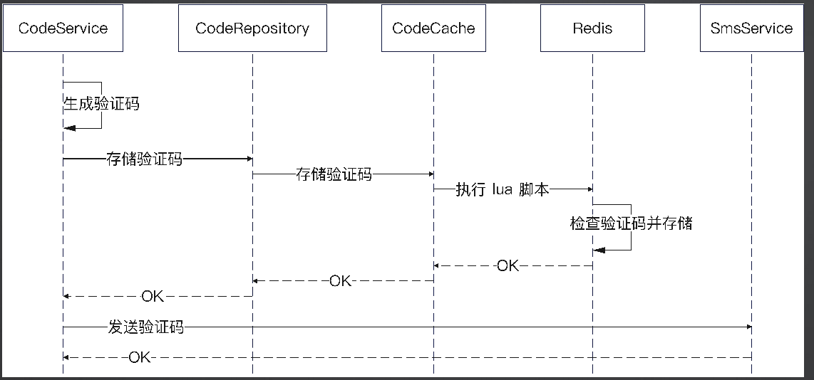

## 基础

### 项目调试运行异常，可能是IDE文件识别异常，重新下载就行了

### 调试配置需要调整模版，为package(软件包)

### main 函数特性

如果 main 函数里面引用了同一个包的其它方法、类型，那么要加上对应的文件，可以：

* go run 命令加上其它文件，例如 `go run main.go hello.go`
* `go run .`
* `go build .` 然后执行 `./hello_go`

### Package声明

每个文件必须有package声明

同一个目录下，go文件package 声明必须一致

同一个目录下，go文件和test.go文件package可以不一致可以

package名字可以和目录名字不一样

### 字符串使用注意

```go
// println("hello, " + 123) 不行
// //println("hello, " + string(123)) 也不行
println(fmt.Sprintf("hello, %d", 123))
```

字节数len()

字符个数与编码有关，默认是utf8：utf8.RuneCountInString()

```go
//字符个数
println(len("你好"))                      // 输出 6
println(utf8.RuneCountInString("你好"))   // 输出2
println(utf8.RuneCountInString("你好ab")) // 输出4
```

### iota

`iota` 是 Go 语言中的一个预定义标识符，用于在常量声明中生成连续的整数值。`iota` 在每次 `const` 关键字出现时被重置为0，然后在下一个 `const` 出现之前，每出现一次就自增1。

以下是一个简单的使用 `iota` 的示例：

```go
package main

import "fmt"

const (
    // 使用 iota 创建枚举
    Sunday = iota // 0
    Monday        // 1
    Tuesday       // 2
    Wednesday     // 3
    Thursday      // 4
    Friday        // 5
    Saturday      // 6
)

const (
    // 在同一 const 块中，iota 会继续自增
    A = iota // 0
    B        // 1
    C        // 2
)

const (
    // 可以通过空白标识符 (_) 跳过某些值
    D = iota // 0
    _        // 跳过 1
    F = iota // 2
)

func main() {
    // 输出常量值
    fmt.Println(Sunday, Monday, Tuesday, Wednesday, Thursday, Friday, Saturday)
    fmt.Println(A, B, C)
    fmt.Println(D, F)
}
```

在上述示例中：

- `Sunday` 到 `Saturday` 构成了一个星期的枚举，每个常量对应一个整数值，从0开始自增。
- `A`、`B`、`C` 在同一 `const` 块中，`iota` 会继续自增。
- 使用 `_` 可以跳过某些值，此时 `iota` 仍然会自增。

`iota` 可以用于生成一系列相关值的常量，枚举类型是 `iota` 常用的场景之一。它简化了常量声明中的重复工作。

### 函数式编程and闭包

```go
// Func3 带名字的返回值
func Func3(a int, b int) (str string, err error) {
	res := "hello"
	// 虽然带名字，但是我们并没有用
	return res, nil
}
func Func4() {
	myFunc3 := Func3
	_, _ = myFunc3(1, 2)
}

// Func6 的返回值是一个方法，
func Func6() func(name string) string {
	return func(name string) string {
		return "hello," + name
	}
}

func Closure(name string) func() string {

	// 返回的这个函数，就是一个闭包。
	// 它引用到了 Closure 这个方法的入参
	return func() string {
		return "hello, " + name
	}
}
func main() {
	sayHello := Func6()
	a := sayHello("大明")
	fa := Closure("test")
	println(a)
	println(fa())
}


```

这`Func6`和`Closure`两个函数都是返回闭包的例子，但它们之间有一些关键的区别：

1. **参数的不同：**

   - 在第一个例子中，`Func6` 函数返回的闭包接受一个字符串参数 `name`。
   - 在第二个例子中，`Closure` 函数返回的闭包不再接受参数，而是直接引用了外部函数 `Closure` 中的参数 `name`。
2. **闭包的使用场景：**

   - 第一个例子中的闭包可以多次调用，并且每次调用时可以传入不同的 `name` 参数。
   - 第二个例子中的闭包只能在外部函数 `Closure` 调用的上下文中使用，并且每个闭包都引用了 `Closure` 中相同的 `name` 参数。

以下是使用这两个函数的示例：

```go
// 第一个例子
myClosure1 := Func6()
result1 := myClosure1("Alice")
fmt.Println(result1) // 输出：hello, Alice

// 第二个例子
myClosure2 := Closure("Bob") // "Bob"其实还在下面的result2中使用，所以不会被销毁
result2 := myClosure2()
fmt.Println(result2) // 输出：hello, Bob
```

在第一个例子中，我们通过 `Func6` 获取一个闭包，并可以在多次调用中传递不同的参数。

在第二个例子中，我们通过 `Closure` 获取一个闭包，该闭包直接引用了 `name` 参数。在这种情况下，我们只能在 `Closure` 函数调用的上下文中使用闭包，并且每个闭包都引用了相同的 `name`。

总体而言，这两个例子展示了闭包如何引用外部变量，但它们的具体用途可能会因为参数的不同而有所不同。希望这能够帮助理解这两者之间的区别。

闭包如果使用不当可能会引起内存泄露。即一个对象被闭包引用的话，它是不会被垃圾回收的。

这句话的意思是，如果在闭包中引用了某个对象，而该闭包被持有（比如作为变量或返回值），那么该对象就不会被垃圾回收。这可能导致内存泄漏，因为即使在程序的其他地方不再使用这个对象，**由于闭包的存在，该对象仍然被保留在内存中**。

### defer

#### defer调用机制

`defer` 是 Go 语言中用于延迟执行函数调用的关键字。当使用 `defer` 时，函数调用不会立即执行，而是在包含 `defer` 语句的函数执行完毕后才执行。`defer` 的调用机制可以简要描述为以下几点：

1. **延迟执行：** 当一个函数中包含了 `defer` 语句时，被延迟执行的函数调用会在包含该语句的函数即将返回时执行，而不是在 `defer` 语句出现的位置立即执行。
2. **后进先出（LIFO）：** 如果一个函数中包含多个 `defer` 语句，它们会按照后进先出的顺序执行。也就是说，最后一个被推入（deferred）的函数调用会最先被执行，依此类推。

以下是一个简单的例子，用于说明 `defer` 的调用机制：

```go
package main

import "fmt"

func main() {
	fmt.Println("Start")

	defer fmt.Println("Deferred 1")
	defer fmt.Println("Deferred 2")
	defer fmt.Println("Deferred 3")

	fmt.Println("End")
}
```

在这个例子中，输出的顺序是：

```
Start
End
Deferred 3
Deferred 2
Deferred 1
```

可以看到，被 `defer` 延迟执行的函数调用是在包含 `defer` 语句的函数即将返回时执行的，而且按照后进先出的顺序执行。

`defer` 的典型用途包括资源释放、文件关闭、解锁等操作，以确保在函数执行完毕之前执行这些清理工作。

```go
func DeferClosure() {
	i := 0
	defer func() {
		println(i) // 结果是1
	}()
	i = 1
}

//参数传递
func DeferClosureV1() {
	i := 0
	defer func(val int) {
		println(val) //结果是0
	}(i)
	i = 1
}
```

* 作为参数传入的:定义defer的时候就确定了。
* 作为闭包引入的:执行defer对应的方法的时候才确定。

#### defer修改返回值


```go
func DeferClosureLoopV1() {
	for i := 0; i < 10; i++ {
		defer func() {
			println(i)
		}()
	}
}

func DeferClosureLoopV2() {
	for i := 0; i < 10; i++ {
		defer func(val int) {
			println(val)
		}(i)
	}
}

func DeferClosureLoopV3() {
	for i := 0; i < 10; i++ {
		j := i
		defer func() {
			println(j)
		}()
	}
}
func DeferClosureLoopV4() {
		var j int
		for i := 0; i < 10; i++ {
			j = i
			defer func() {
				println(j)
			}()
		}
	}
func main() {
	DeferClosureLoopV1() // 都是10
	DeferClosureLoopV2() // 9～0
	DeferClosureLoopV3() // 9～0
        DeferClosureLoopV3() // 都是9
}
```

`DeferClosureLoopV1()`：在这个方法中，`defer`语句延迟执行了一个匿名函数，而这个匿名函数中**打印的`i`是对外部循环变量的引用**。由于`defer`语句是在函数返回时才执行的，当实际执行这些`defer`语句时，循环已经执行完毕，此时`i`的值已经是 10。因此，该方法会打印出 10 个`10`。

`DeferClosureLoopV2()`:在这个方法中，通过将循环变量的值作为参数传递给闭包，**避免了闭包捕获外部变量的问题**。每个 `defer`语句中的闭包都捕获了不同的`val`值，因此在执行时，会打印出从 9 到 0 的数字。这是因为`i` 的值在每次迭代时都被传递给了闭包，而不是引用外部的循环变量。

`DeferClosureLoopV3()`:在这个方法中，通过在每次循环迭代时创建一个新的变量 `j`来**避免闭包捕获外部变量**。每个`defer`语句中的闭包都引用了不同的`j` 变量，因此在执行时，同样会打印出从 9 到 0 的数字。

`DeferClosureLoopV4()`:在这个代码中，`defer` 语句中的闭包引用了外部的变量 `j`，而且 `j` 是在循环中不断被更新的。因为 `defer` 语句是在函数返回时才执行的，所以在实际执行时，`j` 的值已经是循环结束后的值，即 `j` 的最终值为 9。因此，无论循环迭代多少次，`defer` 语句中的闭包都会引用到最终的 `j` 值

### 方法调用总结

* Go 方法的作用域和变量作用域一样，通过大小写控制。
* Go 的返回值是可以有名字的，可以通过给予名字让调用方清楚知道你返回的是什么。
* Go 中方法是一等公民，所以函数式编程非常常见。在初学的时候，不需要掌握函数式编程，确保自己能够看得懂就可以。
* 闭包是指一个方法与跟着这个方法绑定的运行时刻上下文。初学的时候不要求掌握闭包用法，确保能看懂就行。面试的时候要能回答出来。
* defer 是先进后出，或者说后进先出。

### 子切片的共享内存

核心:共享数组。
子切片和切片究竟会不会互相影响，就抓住一点:它们是不是还共享数组?

* 就是如果它们结构没有变化，那肯定是共享的;
* 但是结构变化了，就可能不是共享了。

什么情况下结构会发生变化?**扩容了**。

所以，切片与子切片，切片作为参数传递到别的方法、结构体里面，任何情况下你要判断是否内存共享，那么就一个点:有没有扩容。

```go
func ShareSlice() {
	s1 := []int{1, 2, 3, 4}
	s2 := s1[2:]
	fmt.Printf("share slice s1: %v len: %d, cap: %d \n", s1, len(s1), cap(s1))
	fmt.Printf("share slice s2: %v len: %d, cap: %d \n", s2, len(s2), cap(s2))

	s2[0] = 99

	fmt.Printf("s2[0]=99 share slice s1: %v len: %d, cap: %d \n", s1, len(s1), cap(s1))
	fmt.Printf("s2[0]=99 share slice s2: %v len: %d, cap: %d \n", s2, len(s2), cap(s2))

	s2 = append(s2, 199)
	fmt.Printf("append s2 share slice s1: %v len: %d, cap: %d \n", s1, len(s1), cap(s1))
	fmt.Printf("append s2 share slice s2: %v len: %d, cap: %d \n", s2, len(s2), cap(s2))

	s2[0] = 1999
	fmt.Printf("s2[0] = 1999 share slice s1: %v len: %d, cap: %d \n", s1, len(s1), cap(s1))
	fmt.Printf("s2[0] = 1999 share slice s2: %v len: %d, cap: %d \n", s2, len(s2), cap(s2))
}
// result
share slice s1: [1 2 3 4] len: 4, cap: 4 
share slice s2: [3 4] len: 2, cap: 2 
s2[0]=99 share slice s1: [1 2 99 4] len: 4, cap: 4 
s2[0]=99 share slice s2: [99 4] len: 2, cap: 2 
append s2 share slice s1: [1 2 99 4] len: 4, cap: 4 
append s2 share slice s2: [99 4 199] len: 3, cap: 4 
s2[0] = 1999 share slice s1: [1 2 99 4] len: 4, cap: 4 
s2[0] = 1999 share slice s2: [1999 4 199] len: 3, cap: 4 

```

### map

map 的遍历是随机的，也就是说你遍历两遍，输出的结果都不一样。

可以用delete删除， `delete(map,'key')`

### comparable

* 在switch里面，值必须是可比较的。
* 在map里面，key也必须是可比较的。

所谓可比较的(comparable)在 Go 里面就是指:Go 在编译的时候、运行的时候能够判断出来元素是不是相等。

• 基本类型和string都是可比较的。

• 如果元素是可比较的，那么该数组也是可比较的。

在 Go 语言中，以下是可比较的类型：

1. **基本数据类型：**

   - 整数类型（int、int8、int16、int32、int64、uint、uint8、uint16、uint32、uint64、uintptr）
   - 浮点数类型（float32、float64）
   - 复数类型（complex64、complex128）
   - 布尔类型（bool）
   - 字符串类型（string）
2. **指针类型：**

   - 所有指针类型，包括指向可比较类型的指针。
3. **数组类型：**

   - 具有可比较元素类型的数组。
4. **结构体类型：**

   - 具有可比较字段类型的结构体。
5. **接口类型：**

   - 具有可比较元素类型的接口。

需要注意的是，切片、映射、通道等复合类型的可比较性取决于其元素类型。如果切片、映射或通道的元素类型是可比较的，那么它们本身也是可比较的。否则，它们就不是可比较的。

以下是一个示例，展示了可比较和不可比较的类型：

```go
package main

import "fmt"

type NotComparable struct {
    Field map[string]int // 不可比较的字段类型
}

func main() {
    // 可比较的类型
    var a int = 10
    var b int = 10

    fmt.Println("整数比较：", a == b) // 输出：true

    var str1 string = "hello"
    var str2 string = "hello"

    fmt.Println("字符串比较：", str1 == str2) // 输出：true

    type Point struct {
        X, Y int
    }

    var point1 = Point{1, 2}
    var point2 = Point{1, 2}

    fmt.Println("结构体比较：", point1 == point2) // 输出：true

    // 不可比较的类型
    var slice1 = []int{1, 2, 3}
    var slice2 = []int{1, 2, 3}

    // 编译错误：slices are not comparable
    // fmt.Println("切片比较：", slice1 == slice2)

    var notComp1 = NotComparable{Field: map[string]int{"a": 1}}
    var notComp2 = NotComparable{Field: map[string]int{"a": 1}}

    // 编译错误：type containing map[string]int is not comparable
    // fmt.Println("结构体比较：", notComp1 == notComp2)
}
```

在上面的示例中，整数、字符串、结构体都是可比较的，而切片和结构体 `NotComparable` 中包含不可比较的字段类型，因此它们本身不可比较。

希望这能够帮助你理解在 Go 中哪些类型是可比较的。如果有其他问题，请随时提问。

### 结构体

#### 结构体初始化-Go 没有构造函数

* 初始化语法:Struct{}
* 获取指针:`&Struct{}`、`new(Struct)`

new 可以理解为 Go 会为你的变量分配内存，并且把内存都置为0

如果声明了一个指针，但是没有赋值，那么是nil

### 衍生类型 （类型别名赋值）

基本语法:`type TypeA TypeB`

**衍生类型是一个全新的类型**，TypeB 实现了某个接口，不等于 TypeA 也实现了某个接口。

衍生类型可以互相转换，使用 () 进行转换。

### 类型别名(一般用作向后兼容)

`type TypeA=TypeB`，这个时候 TypeA和TypeB共享方法了

```go
package main

type Integer int

func UseInt() {
	i1 := 10
	i2 := Integer(i1)
	var i3 Integer = 11
	println(i2, i3)
}

type Fish struct {
	Name string
}

func (f Fish) Swim() {
	println("fist 在游")
}

type FakeFish Fish

func UseFish() {
	f1 := Fish{}
	f2 := FakeFish(f1)
	//f2.Swim()
	f2.Name = "Tom"
	println(f1.Name)
	var y Yu
	y.Name = "yu"
	y.Swim()
}

// 向后兼容
type Yu = Fish

```

#### `type TypeA TypeB` 和 `type TypeA = TypeB`区别

`type TypeA TypeB` 和 `type TypeA = TypeB` 这两者在 Go 语言中有着不同的含义和效果。

1. **`type TypeA TypeB`：** 这种形式创建了一个新的类型 `TypeA`，它和现有类型 `TypeB` 具有相同的底层类型，但它们是不同的类型。这意味着 `TypeA` 和 `TypeB` 是两个不同的类型，它们之间不共享方法集合，也不可以直接进行赋值。

   ```go
   type TypeB struct {
       Value int
   }

   type TypeA TypeB

   func main() {
       var a TypeA
       var b TypeB

       // 编译错误，TypeA 和 TypeB 是不同的类型
       a = b
   }
   ```
2. **`type TypeA = TypeB`：** 这种形式创建了一个类型别名 `TypeA`，它和现有类型 `TypeB` 具有相同的底层类型。类型别名引入了一个新的名称，但在类型系统中它们被视为相同的类型。它们共享相同的方法集合，可以直接进行赋值。

   ```go
   type TypeB struct {
       Value int
   }

   type TypeA = TypeB

   func main() {
       var a TypeA
       var b TypeB

       // 可以直接赋值，TypeA 和 TypeB 是相同的类型
       a = b
   }
   ```

总的来说，`type TypeA TypeB` 创建了两个不同的类型，而 `type TypeA = TypeB` 创建了一个类型别名，它们在类型系统中被视为相同的类型。通常，类型别名更常用于提高代码的可读性，而不是引入新的类型。

### 组合

组合可以是以下几种情况:

* 接口组合接口
* 结构体组合结构体
* 结构体组合结构体指针（不推荐）
* 结构体组合接口

组合特性：

* 当A组合了B之后:1、可以直接在A上调用B的方法。2、B实现的所有接口，都认为A已经实现了。
* A组合B之后，在初始化A的时候将B看做普通字段来初始化。
* 组合不是继承，没有多态

### 泛型

#### 泛型约束

泛型约束（generic constraints）是指在泛型编程中对类型参数施加的一系列条件或限制，以确保泛型代码在编译时和运行时的安全性和正确性。

在泛型中，类型参数可能代表任意类型，但有时候需要对这些类型进行限制，以满足特定的需求或确保代码的正确性。泛型约束可以通过接口、基本类型、方法等方式来定义。

以下是一些常见的泛型约束示例：

1. **接口约束：** 通过指定类型参数必须实现某个接口，以确保类型参数具有特定的行为。

   ```go
   // 泛型函数，要求 T 必须实现 Stringer 接口
   func Print[T Stringer](value T) {
       fmt.Println(value.String())
   }
   ```
2. **基本类型约束：** 通过指定类型参数必须是某种基本类型，例如数字类型。

   ```go
   // 泛型函数，要求 T 必须是数字类型
   func Sum[T Numeric](a, b T) T {
       return a + b
   }
   ```
3. **方法约束：** 通过指定类型参数必须具有某个方法，以确保类型参数支持特定的操作。

   ```go
   // 泛型函数，要求 T 必须有 Add 方法
   func Addable[T Adder](a, b T) T {
       return a.Add(b)
   }
   ```

这些约束有助于在泛型代码中使用更多类型的同时，保证了代码的安全性和正确性。如果类型参数不满足约束，编译器将在编译时发出错误。

##### 例子：

```go
type Number interface {
	~int | int64 | float64 | float32 | int32 | byte
}
```

这段代码定义了一个泛型约束，其中 `Number` 是一个接口，它约束了类型参数必须是 `int`、`int64`、`float64`、`float32`、`int32` 或 `byte` 中的一种。

具体来说，这个泛型约束使用了泛型的类型约束表达式（type constraint expression），其中 `~int | int64 | float64 | float32 | int32 | byte` 表示类型参数必须是这个集合中的一种。这样定义的 `Number` 接口在编写泛型函数时，可以接受满足这些类型的参数。

下面是一个使用这个泛型约束的泛型函数的示例：

```go
package main

import "fmt"

type Number interface {
    ~int | int64 | float64 | float32 | int32 | byte
}

// 泛型函数，约束类型参数必须是 Number 接口中定义的类型之一
func PrintNumber[T Number](value T) {
    fmt.Println(value)
}

func main() {
    // 使用泛型函数
    PrintNumber(42)      // 合法
    PrintNumber(3.14)    // 合法
    PrintNumber("hello") // 编译错误，不满足 Number 约束
}
```

在这个示例中，`PrintNumber` 泛型函数接受一个类型参数 `T`，而 `T` 必须符合 `Number` 接口定义的类型约束。通过这样的约束，我们可以确保泛型函数只能处理特定类型的参数，提高了代码的类型安全性

## Gin 入门


Gin中，用Engine来监听一个端口，就是逻辑上的服务器

一个go进程可以创建多个Engine。

在Gin里面,一个Web服务器被抽象成为Engine。

可以在一个应用中创建多个engine实例，监听不同的端口。

Engine承担了路由注册，接入middleware的核心职责。

Engine组合来RouterGroup，RouterGroup再是实现路由功能的核心组件。

gin.Context是Gin的核心类型，字面意思就是上下文，核心职责：处理请求，返回响应

### 路由

```go
func main() {
	server := gin.Default()
	// 当一个 HTTP 请求，用 GET 方法访问的时候，如果访问路径是 /hello，
	server.GET("/hello", func(c *gin.Context) {
		// 就执行这段代码
		c.String(http.StatusOK, "hello, go")
	})

	server.POST("/post", func(ctx *gin.Context) {
		ctx.String(http.StatusOK, "hello, post 方法")
	})
//参数路由
	server.GET("/users/:name", func(ctx *gin.Context) {
		name := ctx.Param("name")
		ctx.String(http.StatusOK, "hello, 这是参数路由"+name)
	})
//通配符路由
	server.GET("/views/*.html", func(ctx *gin.Context) {
		page := ctx.Param(".html")
		ctx.String(http.StatusOK, "hello, 这是通配符路由"+page)
	})
//查询参数 /order?id=123
	server.GET("/order", func(ctx *gin.Context) {
		oid := ctx.Query("id")
		ctx.String(http.StatusOK, "hello, 这是查询参数"+oid)
	})
//这个是可以的
	//server.GET("/items/", func(ctx *gin.Context) {
	//	ctx.String(http.StatusOK, "hello, 这是 items")
	//})

	server.GET("/items/*abc", func(ctx *gin.Context) {
		ctx.String(http.StatusOK, "hello, 这是 items")
	})
// 错误示例
	//server.GET("/users/*/", func(context *gin.Context) {
	//
	//})

	server.Run(":8080") // 监听并在 0.0.0.0:8080 上启动服务
}
```


路由可以集中注册也可以分散注册（就是在对应model中注册，注册在handler方法中）

集中注册可以看到全部路由，分散注册可以比较有条理。

#### 分组路由

```go
func (u *UserHandler) RegisterRoutes(server *gin.Engine) {
	ug := server.Group("/users")
	ug.POST("/signup", u.SignUp)
	ug.POST("/login", u.Login)
}

func (u *UserHandler) RegisterRoutes(server *gin.Engine) {
	server.POST("/users/signup", u.SignUp)
	server.POST("/users/login", u.Login)
}
```

### 明确表示一个类型实现了某个接口(检查用)

#### `var _ handler = &UserHandler{}`

这行代码会在编译时检查 `UserHandler` 类型是否实现了 `handler` 接口的所有方法。如果没有实现，编译器会报错。这样可以帮助开发者及早发现潜在的问题。

在 Go 中，如果一个类型实现了接口的所有方法，它就被认为是实现了该接口。为了明确表示一个类型实现了某个接口，可以使用 `var _ 接口类型 = 具体实例` 的方式，编译器会检查是否符合接口的要求。

#### `var _ handler = (*UserHandler)(nil)`

`(*UserHandler)(nil)` 表示一个空指针，而 `var _ handler` 表示声明了一个变量，并将这个空指针赋值给该变量，同时表明 `UserHandler` 类型实现了 `handler` 接口。

这样的代码通常用于确保类型在编译时符合接口，但实际上不需要在代码中使用这个具体的实例。这种写法对于接口实现的一致性检查很有用，可以帮助开发者发现潜在的问题。

### Context

#### Bind

Bind方法是根据Content-Type 来决定如何处理数据的(多为application/json)

```go
func createUser(c *gin.Context) {
  var user User
  if err := c.Bind(&user); err != nil {
    c.JSON(http.StatusBadRequest, gin.H{"error": err.Error()})
    return
  }

  // 在这里可以使用绑定后的 user 对象进行处理
  // ...

  c.JSON(http.StatusOK, gin.H{"message": "User created successfully"})
}

```

在这个例子中，`c.Bind(&user)` 会将请求体中的数据绑定到 `user` 对象中，然后可以在处理函数中使用该对象进行后续的逻辑处理。如果绑定失败，会返回相应的错误信息。

#### 正则表达式

默认的 regex对于高级特性支持优先，建议替换

```
regexp "github.com/dlclark/regexp2"
````

~~~~

#### 跨域请求

前后端分离的时候：协议、域名和端口任意一个不同都是跨域请求。

前端localhost:3000 到后端 localhost:8080

解决思路：

告诉浏览器后端localhost:8080端口可以接收前端localhost:3000的请求

浏览器的`preflight`请求机制，在preflight请求中告诉浏览器，允许接收localhost:3000的请求。


##### gin中使用middlwware解决CORS问题

[github gin cors](https://github.com/gin-contrib/cors)

##### middleware 在Gin中的使用


使用例子：


##### 要点


### 数据库 GORM

[文档](https://gorm.io/zh_CN/docs/)

#### 快速入门

安装

```shell
go get -u gorm.io/gorm
go get -u gorm.io/driver/sqlite
```

例子：

```go
package main

import (
  "gorm.io/gorm"
  "gorm.io/driver/sqlite"
)

type Product struct {
  gorm.Model
  Code  string
  Price uint
}

func main() {
  db, err := gorm.Open(sqlite.Open("test.db"), &gorm.Config{})
  if err != nil {
    panic("failed to connect database")
  }

  // 迁移 schema
  db.AutoMigrate(&Product{})

  // Create
  db.Create(&Product{Code: "D42", Price: 100})

  // Read
  var product Product
  db.First(&product, 1) // 根据整型主键查找
  db.First(&product, "code = ?", "D42") // 查找 code 字段值为 D42 的记录

  // Update - 将 product 的 price 更新为 200
  db.Model(&product).Update("Price", 200)
  // Update - 更新多个字段
  db.Model(&product).Updates(Product{Price: 200, Code: "F42"}) // 仅更新非零值字段
  db.Model(&product).Updates(map[string]interface{}{"Price": 200, "Code": "F42"})

  // Delete - 删除 product
  db.Delete(&product, 1)
}
```

#### 相关结构

##### 层级关系


如何理解 service-repository-domain


##### 层级关系总结：

handler在最上层，可以调用service的方法，service则调用repository的方法，一般情况下不跨层调用。

service代表的是一个业务的完整功能或者是完整的处理流程，包含了主要的业务逻辑

repository一般代表数据存储（数据存储的抽象），但不是代表数据库

Dao代表的是数据库存储操作

domain一般认为是业务在系统中的反应，可以直接理解为一个业务对象。类似model，但是不是数据库使用的model，而是业务逻辑中使用的，和数据的存在一些差别(正常service， handler中使用的对象都是domain的)

##### 基本逻辑流程

1. main 函数中初始化 DB，WEB server（主要是middleware例如cors，session）,以及相关的业务逻辑层级（handler，service，repository，dao），还有注册路由（hanlder中的方法）
2. 随后就是在各层级中创建所需要的方法。

#### Dcoker

使用brew install，下载官网的desktop可能存在问题，termainl连接异常

```shell
brew install --cask docker
```

启动docker-compose.yaml

```shell
创建一个 docker-compose.yml 文件，定义应用程序的服务、网络和卷。

运行 docker-compose up 命令，启动应用程序。

在需要时使用 docker-compose down 命令停止和移除应用程序。
```

### 加密


#### 如何加密


#### 推荐-BCrypt


#### 邮件冲突-唯一索引冲突错误


#### 错误传导


#### 登录接口


#### cookie and session


##### sess_id


#### session插件


##### 登录校验

1. 首先引入 cookie和session

   ```go
   store := cookie.NewStore([]byte("secret"))
   	server.Use(sessions.Sessions("mysession", store))
   ```
2. 登录成功 设置session


3. 实现一个middleware

   ```go
   type LoginMiddlewareBuilder struct {
   	paths []string
   }

   func NewLoginMiddlewareBuilder() *LoginMiddlewareBuilder {
   	return &LoginMiddlewareBuilder{}
   }

   func (l *LoginMiddlewareBuilder) Build() gin.HandlerFunc {
   	return func(ctx *gin.Context) {
   		// 不需要登录校验的
   		for _, path := range l.paths {
   			if ctx.Request.URL.Path == path {
   				return
   			}
   		}
   		// 不需要登录校验的
   		//if ctx.Request.URL.Path == "/users/login" ||
   		//	ctx.Request.URL.Path == "/users/signup" {
   		//	return
   		//}
   		sess := sessions.Default(ctx)
   		id := sess.Get("userId")
   		if id == nil {
   			// 没有登录
   			ctx.AbortWithStatus(http.StatusUnauthorized)
   			return
   		}
   	}
   }
   ```

   最后就是一起调用:

```go
server.Use(middleware.NewLoginMiddlewareBuilder().Build())
```


### session 优化


##### 优先选择 redis实现


##### docker-composer redis

本机有redis，docker安装的redis映射一下端口到16379，使用redis-cli访问

```shell
redis-cli -host 127.0.0.1 -p 16379
```

##### Gin session参数可以设置

```go
sess := sessions.Default(ctx)
	// 我可以随便设置值了
	// 你要放在 session 里面的值
	sess.Set("userId", user.Id)
	sess.Options(sessions.Options{
		Secure:   true,
		HttpOnly: true,
		// 一分钟过期
		MaxAge: 60,
	})
	sess.Save()
```

### JWT

#### 简介


JWT 主要由三部分组成：

1. **Header（头部）:** 包含了描述关于该JWT的最基本的信息，例如其类型（JWT）和使用的签名算法。
2. **Payload（负载）:** 包含了要传递的信息。Payload 可以包含一些标准的声明（例如 issuer、expiration time、subject 等），也可以包含自定义的声明。
3. **Signature（签名）:** 使用指定的算法和秘密密钥对 Header 和 Payload 进行签名。签名用于验证消息的发送者以及确保消息在传递的过程中没有被篡改。

JWT 的主要优势包括：

* **自包含性：** JWT 包含了所有必要的信息，因此接收方无需再去查询服务器来验证令牌。
* **紧凑性：** JWT 是紧凑的，适用于在 URL、POST 参数、HTTP 头部等各种环境中传递。
* **可扩展性：** 可以通过添加自定义声明扩展 JWT 的功能。
* **安全性：** 通过签名可以验证 JWT 的真实性和完整性。

JWT 主要用于身份验证和信息交换，例如在 Web 开发中，用户登录成功后，服务器可以生成一个包含用户信息的 JWT，并将其返回给客户端。客户端在后续请求中可以携带这个 JWT，服务器通过验证 JWT 的签名来确认用户身份，并在需要时提取用户信息。

#### 使用


#### 步骤总结


#### 优点


### 保护系统

#### 限流


限流阈值


##### 限流算法要注意并发问题

部分使用滑动窗口算法可能出并发问题


为何使用redis实现


##### 面试要点


## K8S

### 部署WEB服务器

部署web服务器，需要将项目打包成镜像

#### 准备镜像

1. 打包可执行文件(docker 用 需要linux环境下使用)

```shell
GOOS=linux GOARCH=arm go build -o webook 
```

2. 编写Dockerfile

   ```yaml
   # 基础镜像
   FROM ubuntu:20.04
   # 把编译后的打包进来这个镜像，放到工作目录 /app。你随便换
   COPY webook /app/webook
   WORKDIR /app
   # CMD 是执行命令
   # 最佳
   ENTRYPOINT ["/app/webook"]
   ```
3. 打包镜像

```shell
docker build -t wutiao/webook:v0.0.1 . # image 名称自己定
```

4. 为了方便和后期求改 可以将上面命令打包成 make docker 命令

```makefile
.PHONY: docker
docker:
	@rm webook || true
	@GOOS=linux GOARCH=arm go build -o webook .
	@docker rmi -f wutiao/webook:v0.0.1
	@docker build -t wutiao/webook:v0.0.1 .

```

#### 编写k8s相关yaml

1. deployment.yaml
2. service.yaml

##### 注意

```yaml
# service.yaml
apiVersion: v1
kind: Service
metadata:
  name: webook-gin-svc
spec:
## 这里 type 选的是负载均衡
  type: LoadBalancer
  selector:
    app: webook-gin-test
  ports:
    - protocol: TCP
      name: http
      port: 88
      targetPort: 8080

  
```

service的信息如下，这个时候 `http://localhost:88`是可以成功访问的，但是`http://localhost:31500`是不行的，这个是负载均衡对外主动暴露的端口


如果yaml文件中type 是 `NodePort`

那么service信息如下：


我就可以通过`http://localhost:31500`访问，但是`http://localhost:88`就不行了。

**NodePort 和 LoadBalance需要到虚拟机上重新实验。**

### 部署Mysql

#### 基本步骤

1. 创建pv(persistentVolume)
2. 创建pvc(persistentVolumeClaims)
3. 创建delopment
4. 创建service

pv是实际存储器， pvc是存储器声明，如果storageClass能够匹配成功就自动绑定，pod就可以不用关系pv的具体实现。

在 PersistentVolume 里面，accessMode 是说明我这个 PV 支持什么访问模式。

在 PersistentVolumeClaim 里面，accessMode 是说明我这个 PVC 需要怎么访问

#### 注意

mysql 默认的挂载路径是`/var/lib/mysql`，但是是可以修改的

#### 结果

使用 type 是 NodePort的情况 需要使用nodeport进行连接


### 部署Redis

单机部署,不需要持久化存储只需要配置 service 和 deployment就可以

1. deployment.yaml
2. service.yaml

### 部署Nignx

nignx部署较为复杂，涉及到Ingress的概念

1. 首先自己创建 ingress.yaml 和 ingress_class.yaml
2. 在ingress_class.yaml 指定好ingressContrller，常用的是`spec: controller: nginx.org/ingress-controller`
3. 可以采用helm下载 nginx ingress controller，默认情况下，这个ingress class 就是nginx。当然还有其他方法：使用yaml文件。这个ingress controller是nignx提供的，需要到官网上下载相应对于的配置文件。（可以参考`kubernets-知识点.md:1329`）

步骤也可以是先下载对应controller，然后自己配置ingress 和 ingress class

注意：如果ingress 配置了域名，需要到`/etc/host`里面标注一下，方便解析

#### Helm 安装 nginx-ingress controller

```shell
//instakk helm
curl -fsSL -o get_helm.sh https://raw.githubusercontent.com/helm/helm/main/scripts/get-helm-3
chmod 700 get_helm.sh
./get_helm.sh

// install
helm upgrade --install ingress-nginx ingress-nginx \
--repo https://kubernetes.github.io/ingress-nginx \
--namespace ingress-nginx --create-namespace
```


## 性能

### wrk 压测

#### 步骤

1. `brew install wrk`
2. 修改部分代码

* 启用 JWT 来测试——因为比较好测试。

* 修改 /users/login 对应的登录态保持时间，修改为 30 分钟。本质上是确保在你测试 profile 接口的时候，你拿到的 JWT token 没有过期。

* 去除 ratelimit 限制。

3. 编写压测代码（lua）
4. 执行测试命令：

```shell
wrk -t1 -d1s -c2 -s ./scripts/wrk/signup.lua http://localhost:8080/users/signup
```

参数：

* -t：后面跟着的是线程数量。
* -d：后面跟着的是持续时间，比如说 1s 是一秒，也可以是 1m，是一分钟。
* -c：后面跟着的是并发数。
* -s：后面跟着的是测试的脚本

### 性能优化-缓存

#### 引入UserCache目的


1. 屏蔽过期时间设置问题。也就是说，使用这个UserCache 的人不再关心过期时间的问题。
2. 屏蔽 key 的结构。也就是调用者不用知道在缓存里面的这个 key 是怎么组成的。
3. 屏蔽序列化与反序列协议。当结构体写入到Redis 的时候，要决定如何序列化和反序列化

需要序列化是因为，结构体存入redis需要序列化的。

`json.Marshal(user)`,`json.Unmarshal([]byte(data),&user)`

user是结构体，data是序列化后存入redis的数据。

引入缓存会有可能的问题，就是缓存失效后，如何保护数据库的问题。

两种方：1、就是缓存失效直接返回错误，不去查询数据库；2、数据库加限流设置，用户本地缓存加限流（gorm的middleware）。


## 短信验证码登录

需要拆分成三个，为了后续的考虑，进行拆分

1. 一个独立的短信发送服务。
2. 在独立的短信发送服务的基础上，封装一个验证码功能。
3. 在验证码功能的基础上，封装一个登录功能。

### 短信服务-接入腾讯

### 验证码

整体分析：

两个接口：发送和验证

#### 发送：

使用redis存储这个验证码，整体思路：

1. 如果 Redis 中没有这个 key，那么就直接发送；
2. 如果 Redis 中有这个 key，但是没有过期时间，说明系统异常；
3. 如果 key 有过期时间，但是过期时间还有 9 分钟，发送太频发，拒绝；
4. 否则，重新发送一个验证码。

同时要考虑并发问题：使用lua脚本将**检查和执行**封装成一个整体行为。



#### 验证：


1. 查询验证码，如果验证码不存在，说明还没发；
2. 验证码存在，验证次数少于等于 3 次，比较输入的验证码和预期的验证码是否相等
3. 验证码存在，验证次数大于 3 次，直接返回不相等
