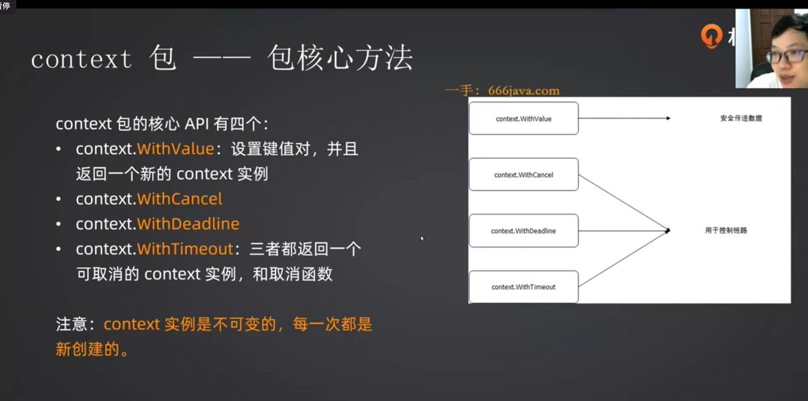
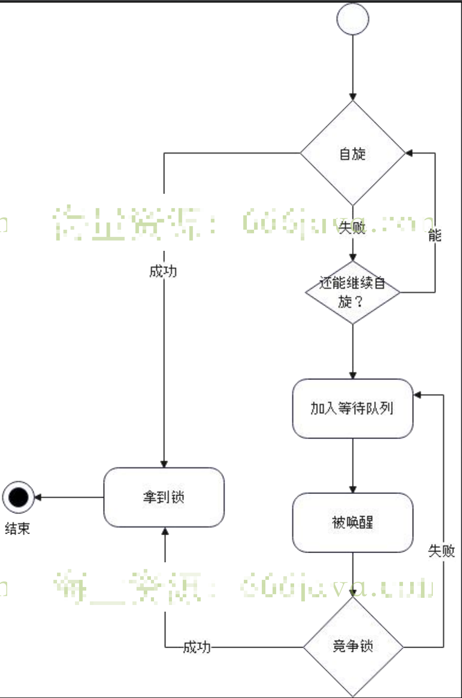

## 1.第一讲 并发编程-context



### Context

`context` 包是 Go 语言中用于处理请求范围数据、取消信号和截止时间的标准库。它提供了一种在跨 API 边界和进程边界传递请求范围数据的方式，同时支持取消信号和截止时间的传播。

**context实例是不可变的，每次都是新创建的**

在 Go 中，`Context` 实例是不可变的，这意味着一旦创建，就不能再修改。如果你需要在 `Context` 中传递新的值，你需要创建一个新的 `Context` 实例，以便在整个调用链上传递。

以下是 `context` 包的主要组件和概念：

1. **Context 接口：**

   - `Context` 是一个接口类型，定义了用于处理请求范围数据的方法。
   - 标准库提供了两个基础的 `Context` 实现，分别是 `context.Background()` 和 `context.TODO()`。
2. **`context.Background()`：**

   - `context.Background()` 返回一个空的、**非取消**的 `Context`。它通常用作根 `Context`。
3. **`context.TODO()`：**

   - `context.TODO()` 和 `context.Background()` 类似，但它表明代码中应该没有处理 `Context` 的具体逻辑。它通常在还没有明确的 `Context` 时使用。
4. **`context.WithCancel`：**

   - `context.WithCancel` 返回一个**带有取消函数**的新的 `Context`。调用取消函数会关闭该 `Context`，通知所有与之关联的 goroutine 取消操作。
   - ```go
     ctx, cancel := context.WithCancel(context.Background())
     defer cancel() // 确保在不再需要时取消
     ```
5. **`context.WithTimeout` 和 `context.WithDeadline`（本质上是一样的）：**

   - `context.WithTimeout` 返回一个在**超时时间到达时自动取消**的 `Context`。
   - `context.WithDeadline` 返回一个在**指定截止时间到达时自动取消**的 `Context`。
   - ```go
     ctx, cancel := context.WithTimeout(context.Background(), 5*time.Second)
     dlCtx, cancel2 := context.WithDeadline(ctx, time.Now().Add(time.Minute))
     defer cancel2()
     defer cancel() // 确保在不再需要时取消
     ```
6. **`context.Value`：**

   - **`context.WithValue(parent, key, value)`：** 返回一个带有键值对的新 `Context`，用于传递请求范围的数据。这是一种将元数据传递到整个调用链的方式。
   - ```go
     type key int

     const myKey key = 42

     ctx := context.WithValue(context.Background(), myKey, "some value")
     ```

使用 `context` 的主要场景包括：

- 在 HTTP 请求处理中传递取消信号和截止时间。
- 在多个 goroutine 之间传递请求范围的数据。

示例：

```go
package main

import (
	"context"
	"fmt"
	"time"
)

func main() {
	// 创建一个带有取消函数的 Context
	ctx, cancel := context.WithCancel(context.Background())
	defer cancel() // 通常通过 defer 来调用取消函数

	// 启动一个 goroutine，在取消信号到达时退出
	go func() {
		select {
		case <-ctx.Done():
			fmt.Println("Goroutine: Context canceled")
		}
	}()

	// 模拟一些工作
	time.Sleep(2 * time.Second)

	// 发送取消信号
	cancel()
	time.Sleep(1 * time.Second) // 为了确保 Goroutine 有足够的时间响应
}
```

在这个示例中，`context.WithCancel` 用于创建一个带有取消函数的 `Context`，并在稍后调用 `cancel()` 时发送取消信号。 Goroutine 通过监听 `ctx.Done()` 通道，在取消信号到达时退出。

### 父子关系

context实例之间存在父子关系：

* 父节点取消或超时，所有派生的子节点全部取消或超时
* 当找key的时候，子context先查找自己，找不到就到上一级找

**总结一下就是：控制是从上至下的，查找是从下至上的**

另外 子context重置超时时间是不会生效的，依旧收到父context的控制

一般父节点是无法访问子context的内容的，如果逼不得已，可以采用在父context中放入一个map，后续都修改map的方法得到子context数据

```go
func TestParentValueCtx(t *testing.T) {
	ctx := context.Background()
	childCtx := context.WithValue(ctx, "map", map[string]string{})
	ccChild := context.WithValue(childCtx, "key1", "value1")
	m := ccChild.Value("map").(map[string]string)
	fmt.Println(m)
	m["key1"] = "val1"
	val := childCtx.Value("key1")
	fmt.Println(val)
	val = childCtx.Value("map")
	fmt.Println(val)
}
```

### 简单例子：

#### 超时控制

```go
func MyBusiness() {
	time.Sleep(500 * time.Millisecond)
	fmt.Println("hello, world")
}
func TestBusinessTimeout(t *testing.T) {
	ctx := context.Background()
	timeoutCtx, cancel := context.WithTimeout(ctx, time.Second)
	defer cancel()
	end := make(chan struct{}, 1)
	go func() {
		MyBusiness()
		end <- struct{}{}
	}()
	ch := timeoutCtx.Done()
	select {
	case <-ch:
		fmt.Println("timeout")
	case <-end:
		fmt.Println("business end")
	}
}

// 结果
hello， world
business end
```

另一种超时控制（其实是定时任务）不是很推荐

`time.AfterFunc` 有两个问题：就是如果不主动取消，超过多长时间必然会执行的；另外有一个问题就是如果主动取消，可能是存在一个短暂的时间差

```go
func TestTimeoutTimeAfter(t *testing.T) {
	bsChan := make(chan struct{})
	go func() {
		slowBusiness()
		bsChan <- struct{}{}
	}()

	timer := time.AfterFunc(time.Second, func() {
		fmt.Println("timeout")
	})
	<-bsChan
	fmt.Println("business end")
	timer.Stop()
}
```

#### 赋值拿取

```go
func TestContext(t *testing.T) {
	ctx := context.Background()
	valCtx := context.WithValue(ctx, "abc", 123)
	val := valCtx.Value("abc")
	fmt.Println(val)
}
```

### ErrGroup

`errgroup` 是 Go 语言标准库 `golang.org/x/sync/errgroup` 包中的一个类型，用于简化 goroutine 的错误处理。它提供了一种方便的方式来等待一组 goroutine 完成，并能够在其中任何一个返回错误时取消整个组的执行。

以下是 `errgroup` 的简要用法：

1. 导入 `golang.org/x/sync/errgroup` 包。

```go
import "golang.org/x/sync/errgroup"
```

2. 创建一个 `errgroup.Group` 对象。

```go
var g errgroup.Group
```

3. 启动 goroutine，并使用 `g.Go` 方法添加到组中。

```go
g.Go(func() error {
    // Your goroutine logic here
    return nil // or an error
})
```

4. 使用 `g.Wait()` 来等待所有 goroutine 完成。如果其中任何一个返回非空的错误，`Wait` 会立即取消所有其他 goroutine 的执行。

```go
if err := g.Wait(); err != nil {
    // Handle the error
}
```

这样，`errgroup` 可以很方便地管理一组 goroutine 的执行，如果其中任何一个返回错误，它将会取消其他所有正在执行的 goroutine，并将该错误返回给调用者。

以下是一个简单的示例，演示了 `errgroup` 的基本用法：

```go
package main

import (
	"fmt"
	"golang.org/x/sync/errgroup"
)

func main() {
	var g errgroup.Group

	// Goroutine 1
	g.Go(func() error {
		fmt.Println("Goroutine 1")
		return nil
	})

	// Goroutine 2
	g.Go(func() error {
		fmt.Println("Goroutine 2")
		return fmt.Errorf("An error occurred in Goroutine 2")
	})

	// Wait for all goroutines to finish
	if err := g.Wait(); err != nil {
		fmt.Println("Error:", err)
	}
}
```

在这个例子中，尽管 Goroutine 2 返回了一个错误，但由于使用了 `errgroup`，它会导致所有 goroutine 立即停止执行，最后的 `Wait` 会捕获并输出错误。

示例2：

errgroup 使用context

```go
func TestErrgroup(t *testing.T) {
//errgroup.WithContext 创建一个与 context.Background() 关联的新 errgroup.Group，这样就可以使用 context.Context 来取消所有任务。
	eg, ctx := errgroup.WithContext(context.Background())
	var result int64 = 0
	for i := 0; i < 10; i++ {
		delta := i
		eg.Go(func() error {
//使用 atomic.AddInt64 来原子地将 delta 添加到 result 中
			atomic.AddInt64(&result, int64(delta))
			return nil
		})
	}
	if err := eg.Wait(); err != nil {
		t.Fatal(err)
	}
//虽然这里调用了 ctx.Err()，但是没有对其返回值进行处理。通常，你应该检查 ctx.Err() 是否为 context.Canceled 或 context.DeadlineExceeded，以确定是任务正常完成还是由于上下文取消或超时而退出。
	ctx.Err()
	fmt.Println(result)
}
```

`errgroup` 与 `context` 结合的主要应用场景是管理多个并发任务，同时能够及时地处理其中的错误，实现任务的同步和取消。

虽然 `errgroup` 在某个 goroutine 出现错误时会取消其他任务，但 `context` 主要用于提供对整个任务组的上下文管理，包括超时控制和手动取消。

1. **超时控制：** 使用 `context` 可以方便地为整个任务组设置超时。`context` 提供了 `WithTimeout` 和 `WithDeadline` 等方法，使得你可以在一定时间内完成一组任务，防止任务执行时间过长。
2. **手动取消：** 在某些情况下，你可能需要手动取消一组任务，而不是等待其中一个任务返回错误。使用 `context` 提供的 `WithCancel` 方法，你可以在需要的时候手动取消整个任务组。
3. **上下文传递：** `context` 不仅用于管理整个任务组的上下文，还可以传递一些共享的上下文信息给每个任务。

   ```go
   parentCtx := context.Background()
   parentCtx = context.WithValue(parentCtx, "key", "value")

   eg, ctx := errgroup.WithContext(parentCtx)
   ```
4. **更多控制：** `context` 提供了更多的控制，例如 `Done()` 方法用于接收任务组的完成信号，以及 `Err()` 方法用于获取取消的原因。

总体来说，`context` 和 `errgroup` 结合使用，可以提供更全面的控制和管理，并更好地适应不同的需求场景。使用 `context` 可以使得任务组的管理更加灵活，更容易适应不同的场景和需求。

### 源码相关

#### cancelCtx

在 Go 中，`context` 包中的 `WithCancel` 函数创建了一个新的 `context.Context`，同时返回一个用于取消的 `cancel` 函数。这个 `cancel` 函数内部会关闭一个 `cancelCtx`，该 `cancelCtx` 是 `cancelCtx` 类型的结构体。这个结构体定义如下：

```go
type cancelCtx struct {
	Context
	done chan struct{} // 用于通知已经取消的信号
	err  error          // 存储取消的原因
	mu   sync.Mutex     // 保护以下字段
}

func (c *cancelCtx) Done() <-chan struct{} {
	return c.done
}

func (c *cancelCtx) Err() error {
	c.mu.Lock()
	defer c.mu.Unlock()
	return c.err
}

func (c *cancelCtx) String() string {
	return fmt.Sprintf("%v.WithCancel", c.Context)
}
```

这个结构体实现了 `Context` 接口，其中包含一个 `done` 通道用于通知已经取消的信号，一个 `err` 字段用于存储取消的原因，以及一个互斥锁 `mu` 用于保护这些字段。

`WithCancel` 函数创建了一个 `cancelCtx` 实例，将其作为新的 `Context` 返回。当调用 `cancel` 函数时，它会向 `done` 通道发送信号，表示 `Context` 已经被取消，并设置 `err` 字段为 `context.Canceled`。这样，任何监听 `Done` 通道的 goroutine 都会收到信号，知道 `Context` 已经取消。

在实际使用中，我们可以通过调用 `cancel` 函数来手动取消 `Context`，以便通知其相关的任务停止执行。

#### valueCtx和timerCtx

在 `context` 包中，`valueCtx` 和 `timeCtx` 是 `context` 包中两个具体的类型。这两个类型分别用于实现 `WithValue` 和 `WithTimeout` 函数。

1. **valueCtx**：`valueCtx` 实现了 `Context` 接口，它的主要目的是在 `WithValue` 函数中创建一个带有新值的上下文。它包含了一个 `key` 和一个 `value`，这对应于键值对，允许我们在上下文中存储和检索值。当你调用 `WithValue` 时，它会创建一个新的 `valueCtx`，并将这个键值对添加到上下文中。

   简化的伪代码如下：

   ```go
   type valueCtx struct {
       Context
       key, val interface{}
   }

   func WithValue(parent Context, key, val interface{}) Context {
       return &valueCtx{
           Context: parent,
           key:     key,
           val:     val,
       }
   }
   ```
2. timerCtx

   `timerCtx` 是 `context` 包中的一个内部类型，用于实现具有超时功能的上下文。它的原理涉及 Go 语言的协程和定时器机制。

   1. **继承关系：** `timerCtx` 继承自 `cancelCtx`，这是因为超时是可以被取消的，而 `cancelCtx` 实现了 `Context` 接口。
   2. **定时器：** `timerCtx` 内部包含一个 `time.Timer` 对象，用于实现超时机制。`time.Timer` 是 Go 语言标准库中的一个定时器，它可以在指定的时间后发送一个事件给一个通道。
   3. **实现超时：** 当创建一个 `timerCtx` 时，会同时创建一个 `time.Timer`，并将其保存在 `timerCtx` 中。这个定时器的超时时间就是上下文的超时时间。
   4. **取消：** 如果上下文的 `cancel` 方法被调用（例如通过调用 `cancel` 函数或者超时发生），`cancelCtx` 的 `cancel` 方法会被触发。这个方法会关闭与父上下文的连接，并取消子上下文。同时，如果有定时器在运行，它也会被停止。
   5. **协程：** 在 Go 中，协程是轻量级的线程。当一个协程（goroutine）使用了 `timerCtx` 创建的上下文，并且超时时间到达，`timerCtx` 会取消它的父上下文，并通过关闭 `timerCtx.Done` 通道通知相关的协程。

   这样，通过 `timerCtx` 的机制，我们可以在一段时间后自动取消与上下文相关联的任务。这对于处理超时场景非常有用，例如在网络请求中设置超时时间，确保不会因为等待太久而导致整个程序变得不响应。

   **简单的回答**：在 Go 语言中，`timerCtx` 是 `context` 包中的一个实现，用于在一段时间后自动取消与上下文相关联的任务。它基于 `time.Timer` 实现了超时机制，当上下文的超时时间到达时，`timerCtx` 会触发取消操作，并通过关闭 `Done` 通道通知相关的协程。这使得我们能够很方便地处理一些需要在一定时间内完成的任务，比如设置网络请求的超时时间。

### 注意事项：

* 一般只用作**方法参数**，而且是作为第一个参数
* 所有的公共方法，除非是util，helper之类的，否则**都加上context参数**
* **不要用作结构体字段**，除非把你的结构体本身也是表达一个上下文的概念（http的request）

#### 面试要点

* context.Context 使用场景：上下文传递与超时控制
* context.Context 原理：父亲如何控制儿子：通过儿子主动加入到父亲的children里面，父亲只要遍历就行
* valueCtx和timeCtx的原理

### 其他

#### 装饰器模式

装饰器模式是一种结构型设计模式，它允许行为在不修改现有代码的情况下动态地添加到对象。这种模式通过**创建一个包装类，也就是装饰器，来包装原始类的实例**，从而在运行时添加新的功能。

##### 代码1

下面是一个简单的装饰器模式的例子，假设我们有一个简单的咖啡类：

```go
package main

import "fmt"

type Coffee interface {
	Cost() int
	Description() string
}

type SimpleCoffee struct{}

func (c *SimpleCoffee) Cost() int {
	return 5
}

func (c *SimpleCoffee) Description() string {
	return "Simple Coffee"
}
```

现在，我们希望能够在不修改 `SimpleCoffee` 类的情况下为其添加额外的功能，比如添加牛奶和糖。我们可以使用装饰器模式来实现：

```go
package main

import "fmt"

// 原始的咖啡类
type Coffee interface {
	Cost() int
	Description() string
}

type SimpleCoffee struct{}

func (c *SimpleCoffee) Cost() int {
	return 5
}

func (c *SimpleCoffee) Description() string {
	return "Simple Coffee"
}

// 装饰器接口
type CoffeeDecorator interface {
	Cost() int
	Description() string
}

// 牛奶装饰器
type MilkDecorator struct {
	Coffee Coffee
}

func (m *MilkDecorator) Cost() int {
	return m.Coffee.Cost() + 2
}

func (m *MilkDecorator) Description() string {
	return m.Coffee.Description() + " with Milk"
}

// 糖装饰器
type SugarDecorator struct {
	Coffee Coffee
}

func (s *SugarDecorator) Cost() int {
	return s.Coffee.Cost() + 1
}

func (s *SugarDecorator) Description() string {
	return s.Coffee.Description() + " with Sugar"
}
```

现在，我们可以创建一个原始的咖啡对象，然后通过叠加装饰器来添加额外的功能：

```go
func main() {
	coffee := &SimpleCoffee{}
	fmt.Println(coffee.Cost())        // 输出: 5
	fmt.Println(coffee.Description()) // 输出: Simple Coffee

	milkCoffee := &MilkDecorator{Coffee: coffee}
	fmt.Println(milkCoffee.Cost())        // 输出: 7
	fmt.Println(milkCoffee.Description()) // 输出: Simple Coffee with Milk

	sugarMilkCoffee := &SugarDecorator{Coffee: milkCoffee}
	fmt.Println(sugarMilkCoffee.Cost())        // 输出: 8
	fmt.Println(sugarMilkCoffee.Description()) // 输出: Simple Coffee with Milk with Sugar
}
```

通过这样的方式，我们可以在不修改原始咖啡类的情况下，通过组合装饰器来动态地添加新的功能。

###### 解释

`MilkDecorator` 结构体实现了 `CoffeeDecorator` 接口，而 `SugarDecorator` 结构体也实现了 `CoffeeDecorator` 接口。同时，由于 `MilkDecorator` 中包含了一个 `Coffee` 类型的字段，所以 `MilkDecorator` 也间接实现了 `Coffee` 接口。这使得 `MilkDecorator` 实例可以被赋值给 `Coffee` 接口类型的变量。

##### 代码2

下面是一个稍微复杂一点的装饰器模式的例子：

```go
package main

import "fmt"

// Component 接口定义了一个基础组件应该有的方法
type Component interface {
	Operation() string
}

// ConcreteComponent 是 Component 接口的具体实现
type ConcreteComponent struct{}

func (c *ConcreteComponent) Operation() string {
	return "ConcreteComponent"
}

// Decorator 接口定义了装饰器应该实现的方法
type Decorator interface {
	Component
}

// BaseDecorator 是装饰器的基础结构，包含了一个 Component 实例
//
type BaseDecorator struct {
	component Component
}

func (d *BaseDecorator) Operation() string {
	if d.component != nil {
		return d.component.Operation()
	}
	return ""
}

// ConcreteDecoratorA 是具体的装饰器，添加了一些额外的功能
type ConcreteDecoratorA struct {
	BaseDecorator
}

func (d *ConcreteDecoratorA) Operation() string {
	if d.component != nil {
		return "ConcreteDecoratorA(" + d.component.Operation() + ")"
	}
	return ""
}

// ConcreteDecoratorB 是另一个具体的装饰器，添加了不同的额外功能
type ConcreteDecoratorB struct {
	BaseDecorator
}

func (d *ConcreteDecoratorB) Operation() string {
	if d.component != nil {
		return "ConcreteDecoratorB(" + d.component.Operation() + ")"
	}
	return ""
}

func main() {
	// 创建一个基础组件
	component := &ConcreteComponent{}

	// 用 ConcreteDecoratorA 装饰基础组件
	decoratorA := &ConcreteDecoratorA{BaseDecorator{component}}
	resultA := decoratorA.Operation()
	fmt.Println(resultA)

	// 用 ConcreteDecoratorB 装饰已经被装饰过的组件
	decoratorB := &ConcreteDecoratorB{BaseDecorator{decoratorA}}
	resultB := decoratorB.Operation()
	fmt.Println(resultB)
}
```

这个例子中，`ConcreteComponent` 是基础组件，`ConcreteDecoratorA` 和 `ConcreteDecoratorB` 是两个具体的装饰器，它们分别添加了不同的额外功能。 `BaseDecorator` 是装饰器的基础结构，其中包含了一个 `Component` 实例。通过嵌套，我们可以轻松地组合多个装饰器。

###### 解释

1. 这里的 `Decorator` 接口嵌套了 `Component` 接口。这种方式被称为接口嵌套，允许一个接口包含另一个接口。通过这种方式，`Decorator` 接口既拥有自己的方法，也包含了 `Component` 接口的方法。这样，任何实现 `Decorator` 接口的类型都必须实现 `Component` 接口的方法。这种结构使得装饰器可以递归地嵌套在其他装饰器中，同时保持对基础组件的引用。
2. 这里的 `BaseDecorator` 类型中有一个 `component` 字段，它的类型是 `Component` 接口而不是 `Decorator` 接口，这是因为装饰器模式中，装饰器既可以装饰具体组件，也可以装饰其他装饰器。

考虑以下情况：

1. 如果 `BaseDecorator` 的 `component` 字段的类型是 `Decorator` 接口，那么它只能装饰其他装饰器，而不能直接装饰具体组件。这样的话，如果你希望装饰一个具体组件，就需要另外创建一个特定的装饰器类型，而不是直接使用 `BaseDecorator`。
2. 如果 `BaseDecorator` 的 `component` 字段的类型是 `Component` 接口，那么它可以装饰任何实现了 `Component` 接口的具体组件，也可以装饰其他装饰器。这样，一个装饰器可以作为另一个装饰器的基础，同时它也能装饰一个具体组件。

这种设计使得装饰器模式更加灵活，能够透明地嵌套多个装饰器，并且可以轻松地扩展系统功能。

##### 代码3

```go
type Cache interface {
	Get(key string) (string, error)
}

// 已有的，不是线程安全的
type memoryMap struct {
	// 如果你这样添加锁，那么就是一种侵入式的写法，
	// 那么你就需要测试这个类
	// 而且有些时候，这个是第三方的依赖，你都改不了
	// lock sync.RWMutex
	m map[string]string
}
func (m *memoryMap) Get(key string) (string, error) {
	return m.m[key], nil
}

// SafeCache 我要改造为线程安全的
// 无侵入式地改造
type SafeCache struct {
	Cache
	lock sync.RWMutex
}

func (s *SafeCache) Get(key string) (string, error) {
	s.lock.RLock()
	defer s.lock.RUnlock()
	return s.Cache.Get(key)
}


```

#### 适配器

新老代码兼容

这段代码涉及到适配器模式的概念，主要是为了使 `Cache` 接口能够适配 `OtherCache` 接口的使用。

1. `Cache` 接口定义了一个简单的缓存接口，其中包括 `Get` 方法用于获取缓存中的值。
2. `OtherCache` 接口是另一个缓存接口，但是它的 `GetValue` 方法与 `Cache` 接口中的 `Get` 方法的签名不同。
3. `CacheAdapter` 结构体实现了 `OtherCache` 接口，它嵌套了 `Cache` 接口，实际上通过组合的方式将 `Cache` 转化成了 `OtherCache`。
4. `GetValue` 方法实际上调用了嵌套的 `Cache` 接口的 `Get` 方法，这样就实现了 `OtherCache` 接口，同时保持了 `Cache` 接口的实现。

这种设计模式适用于以下情况：

- 当我们有一个已经存在的接口（这里是 `Cache`），但是我们需要适配一个新的接口（这里是 `OtherCache`）时，可以使用适配器模式。
- 适配器模式允许我们在不修改现有代码的情况下，使用一个已有的接口适应另一个接口。

总的来说，这个适配器模式的例子展示了如何通过适配器模式使得两个接口能够协同工作，即使它们的方法签名不同。

```go
type Cache interface {
	Get(key string) (string, error)
}

type OtherCache interface {
	GetValue(ctx context.Context, key string) (any, error)
}

// CacheAdapter 适配器强调的是不同接口之间进行适配
// 装饰器强调的是添加额外的功能
type CacheAdapter struct {
	Cache
}

func (c *CacheAdapter) GetValue(ctx context.Context, key string) (any, error) {
	return c.Cache.Get(key)
}
```

方法签名：方法的签名是指方法的名称、参数列表和返回值类型的组合。在Go中，方法的签名由这三个部分组成。例如，对于函数 `func Add(a, b int) int`，其签名为 `Add(int, int) int`。

适配器模式的目的就是让一个接口的方法签名适应另一个接口的方法签名，使得它们可以一起工作，而无需修改原有的代码。

#### 结构体类型与接口类型

##### 结构体与接口的嵌套（结构体的字段可以是一个接口类型）

结构体的字段可以是一个接口类型。这样做的好处是，结构体的**这个字段可以持有任何实现了该接口的类型的实例**。

以下是一个示例：

```go
package main

import "fmt"

// 定义一个接口
type Speaker interface {
	Speak() string
}

// 实现接口的类型
type Dog struct{}

func (d Dog) Speak() string {
	return "Woof!"
}

// 结构体包含一个接口类型的字段
type Animal struct {
	Name    string
	Speaker Speaker
}

func main() {
	// 创建一个 Dog 实例
	dog := Dog{}

	// 创建一个 Animal 实例，将 Dog 实例赋给 Speaker 接口类型的字段
	animal := Animal{
		Name:    "Buddy",
		Speaker: dog,
	}

	// 调用 Speak 方法
	fmt.Println(animal.Speaker.Speak()) // 输出: Woof!
}
```

在这个例子中，`Animal` 结构体包含一个 `Speaker` 接口类型的字段，而 `Dog` 类型实现了 `Speaker` 接口。因此，我们可以将 `Dog` 类型的实例赋给 `Animal` 结构体的 `Speaker` 字段。

##### 结构体与结构体嵌套

一个结构体的字段可以是另一个结构体。这种情况下，你可以在一个结构体中嵌套另一个结构体，这被称为结构体的嵌套。

以下是一个简单的示例：

```go
package main

import "fmt"

// 定义一个结构体
type Address struct {
	City    string
	Country string
}

// 另一个结构体，包含一个 Address 类型的字段
type Person struct {
	Name    string
	Age     int
	Address Address
}

func main() {
	// 创建一个 Address 实例
	address := Address{
		City:    "New York",
		Country: "USA",
	}

	// 创建一个 Person 实例，将 Address 实例赋给 Address 字段
	person := Person{
		Name:    "John",
		Age:     30,
		Address: address,
	}

	// 访问嵌套的字段
	fmt.Println(person.Address.City) // 输出: New York
}
```

在这个例子中，`Person` 结构体包含一个 `Address` 类型的字段，实现了结构体的嵌套。

一个结构体的实例可以同时赋值给结构体类型和实现了某个接口的接口类型。这是因为 Go 语言中的类型是基于结构的，而接口是基于方法的。

假设有以下结构体和接口定义：

```go
type MyStruct struct {
    // 结构体字段
}

type MyInterface interface {
    SomeMethod()
}
```

如果 `MyStruct` 结构体实现了 `SomeMethod` 方法，那么一个 `MyStruct` 类型的实例既可以被赋值给 `MyStruct` 类型的变量，也可以被赋值给实现了 `MyInterface` 接口的变量：

```go
var obj MyStruct
var structVar MyStruct = obj // 可以将 MyStruct 实例赋值给结构体类型的变量

var interfaceVar MyInterface = obj // 也可以将 MyStruct 实例赋值给接口类型的变量
```

这样，`MyStruct` 实例就可以在两种类型的变量中自由转换。

## 2.并发编程-sync

### 1）sync.Mutex and sync.REMutex

Mutex可以看作是锁，RWMutex则是读写锁

一般用法是将Mutex/RWMutex和需要被保护的资源封装在一个结构体内

```go
// PublicResource 你永远不知道你的用户拿了它会干啥
// 他即便不用 PublicResourceLock 你也毫无办法
// 如果你用这个resource，一定要用锁
var PublicResource interface{}
var PublicResourceLock sync.Mutex

// privateResource 要好一点，祈祷你的同事会来看你的注释，知道要用锁
// 很多库都是这么写的，我也写了很多类似的代码=。=
var privateResource interface{}
var privateResourceLock sync.Mutex

// safeResource 很棒，所有的期望对资源的操作都只能通过定义在上 safeResource 上的方法来进行
type safeResource struct {
	resource interface{}
	lock     sync.Mutex
}

func (s *safeResource) DoSomethingToResource() {
	s.lock.Lock()
	defer s.lock.Unlock()
}
```

使用锁的时候，优先使用RWMutex。

RWMutex核心四个方法：RLock、RUnlock、Lock、Unlock

Mutex是：Lock 、Unlock

### 2）代码演示 SafeMap的LoadOrStore

SafeMap可以看作是map的一个线程安全的封装，增加一个LoadOrStore的方法

需要double-check：

1. 加读锁先检查一遍
2. 释放读锁
3. 加写锁
4. 再检查一遍

```go
package sync

import "sync"

type SafeMap[K comparable, V any] struct {
	m     map[K]V
	mutex sync.RWMutex
}

// LoadOrStore loaded 代表是返回老的对象，还是返回了新的对象
// g1 (key1, 123)  g2 (key1, 456)
func (s *SafeMap[K, V]) LoadOrStore(key K, newVal V) (val V, loaded bool) {
	oldVal, ok := s.get(key)
	if ok {
		return oldVal, true
	}
	s.mutex.Lock()
	defer s.mutex.Unlock()
//这里如果不再检查一遍，g1先到了，后面的g2有可能会将数据进行覆盖
	oldVal, ok = s.m[key]
	if ok {
		return oldVal, true
	}
	s.m[key]= newVal
	return newVal, false
}

func  (s *SafeMap[K, V]) get(key K) (V, bool){
	s.mutex.RLock()
	defer s.mutex.RUnlock()
	oldVal, ok := s.m[key]
	return oldVal, ok
}
```

### 3）代码演示-线程安全的ArrayList

```go
package demo

import "sync"

type SafeList[T any] struct {
	List[T]
	lock sync.RWMutex
}

func (s *SafeList[T]) Get(index int) (T, error) {
	s.lock.RLock()
	defer s.lock.RUnlock()
	return s.List.Get(index)
}

func (s *SafeList[T]) Append(t T) error {
	s.lock.Lock()
	defer s.lock.Unlock()
	return s.List.Append(t)
}

```

思路:切片本身不是线程安全的，所以最简单的做法就是**利用读写锁封装一
下**。这也是典型的装饰器模式的应用。

如果考虑扩展性，那么需要预先定义一个 List 接口，后续可以有
ArrayList，LinkedList，锁实现的线程安全 List，以及无锁实现的线程安全List

任何非线程安全的类型、接口都可以利用读写锁 + 装饰器模式无侵入式地改
造为线程安全的类型、接口

### 4）代码示例

```go
type List[T any] interface {
	Get(index int) T
	Set(index int, t T)
	DeleteAt(index int) T
	Append(t T)
}

type ArrayList[T any] struct {
	vals []T
}

func (a *ArrayList[T]) Get(index int) T {
	return a.vals[index]
}

func (a *ArrayList[T]) Set(index int, t T) {
	if index >= len(a.vals) || index < 0 {
		panic("index 超出范围")
	}
	a.vals[index] = t
}

func (a *ArrayList[T]) DeleteAt(index int) T {
	if index >= len(a.vals) || index < 0 {
		panic("index 超出范围")
	}
	res := a.vals[index]
	a.vals = append(a.vals[:index], a.vals[index+1:]...)
	return res
}

func (a *ArrayList[T]) Append(t T) {
	a.vals = append(a.vals, t)
}

func NewArrayList[T any](initCap int) *ArrayList[T] {
	return &ArrayList[T]{vals: make([]T, 0, initCap)}
}

type SafeListDecorator[T any] struct {
	l List[T]
	mutex sync.RWMutex
}

func (s *SafeListDecorator[T]) Get(index int) T {
	s.mutex.RLock()
	defer s.mutex.RUnlock()
	return s.l.Get(index)
}
func (s *SafeListDecorator[T]) Set(index int, t T) {
	s.mutex.Lock()
	defer s.mutex.Unlock()
	s.l.Set(index, t)
}
func (s *SafeListDecorator[T]) DeleteAt(index int) T {
	s.mutex.Lock()
	defer s.mutex.Unlock()
	return s.l.DeleteAt(index)
}
func (s *SafeListDecorator[T]) Append(t T) {
	s.mutex.Lock()
	defer s.mutex.Unlock()
	s.l.Append(t)
}
```

代码解释：

这段代码定义了一个泛型接口 `List` 和一个实现该接口的泛型结构体 `ArrayList`，以及一个安全的列表修饰器 `SafeListDecorator`。

1. **List 接口：**

   - `Get(index int) T`: 获取列表指定索引位置的元素。
   - `Set(index int, t T)`: 在列表的指定索引位置设置元素。
   - `DeleteAt(index int) T`: 删除并返回列表指定索引位置的元素。
   - `Append(t T)`: 在列表末尾追加元素。
2. **ArrayList 结构体：**

   - `vals []T`: 存储元素的切片。
   - `Get(index int) T`: 实现 List 接口，获取列表指定索引位置的元素。
   - `Set(index int, t T)`: 实现 List 接口，设置列表指定索引位置的元素。
   - `DeleteAt(index int) T`: 实现 List 接口，删除并返回列表指定索引位置的元素。
   - `Append(t T)`: 实现 List 接口，在列表末尾追加元素。
   - `NewArrayList(initCap int) *ArrayList[T]`: 初始化 ArrayList，返回指定初始容量的实例。
3. **SafeListDecorator 结构体：**

   - `l List[T]`: 被修饰的 List 实例。
   - `mutex sync.RWMutex`: 读写锁，用于保护被修饰的 List 操作的并发安全性。
   - `Get(index int) T`: 通过读锁保护，调用被修饰 List 的 Get 方法。
   - `Set(index int, t T)`: 通过写锁保护，调用被修饰 List 的 Set 方法。
   - `DeleteAt(index int) T`: 通过写锁保护，调用被修饰 List 的 DeleteAt 方法。
   - `Append(t T)`: 通过写锁保护，调用被修饰 List 的 Append 方法。

修饰器 `SafeListDecorator` 的作用是在原有的列表操作上加上读写锁，保证在并发环境下对列表的操作是安全的。这是一种常见的手段，确保在多个 goroutine 中同时访问列表时不会发生数据竞争和不一致性。

希望这样解释能够帮助你理解这段代码。如果有其他问题，随时告诉我。

### 源码相关

锁实现的模版



锁的一般实现都是依赖于：自旋作为快路径，等待队列作为慢路径

Go 的 Mutex 大致符合模板，但是做了针对性的优化。
理解关键点：

1. state 就是用来控制锁状态的核心，所谓加锁，就是把 state 修改为某个值，解锁也是类似
2. sema 是用来处理沉睡、唤醒的信号量，依赖于两
   个 runtime 调用:
   * runtime_ SemacquireMutex: sema 加1并且挂起 goroutine
   * runtime Semrelease: sema减1并且唤醒sema 上等待的一个goroutine

在 `sync` 包中，`Mutex` 的实现采用了一种两阶段的策略，将并发访问的情况分为三种情况：一次拿取成功(一次自旋)、快路径和慢路径。

1. **自旋（Spin）作为快路径：** 当一个 goroutine 尝试获取锁时，它首先会采用自旋的方式进行尝试。自旋是一种忙等的策略，即在一段时间内反复检查锁的状态，而不是立即进入休眠状态。这样做是因为自旋的代价相对较低，可以在短时间内完成，避免了切换线程的开销。如果在自旋的过程中成功获取到锁，那么这就是快路径，整个操作很迅速。
2. **等待队列作为慢路径：** 如果自旋一定次数后仍然无法获取到锁，或者当前锁已经被其他 goroutine 持有，那么该 goroutine 就会进入等待队列，进入休眠状态。等待队列是一种慢路径，因为涉及到线程的挂起和唤醒，这可能需要更多的系统开销。等待队列中的 goroutine 会在锁释放时被唤醒，然后再次尝试获取锁。

通过这种两阶段的策略，`Mutex` 在低竞争和短时间的情况下可以通过自旋快速获取锁，而在高竞争或长时间的情况下，通过等待队列避免了忙等的资源浪费，提高了效率。

### 锁的拿取步骤

1. 先上来一个 CAS 操作，如果这把锁正空闲，井且没人抢，那么就直接成功
2. 否则，自旋几次，如果这个时候成功了，也不用加入队列
3. 否则，加入队列
4. 从队列中被唤醒：

* 正常模式：和新来的一起抢锁，但是大概率失败
* 饥饿模式：肯定拿到锁

下面是对描述中每个步骤的一些补充和说明：

1. **CAS 操作：** CAS（Compare-And-Swap）是一种原子操作，用于尝试将某个值更新为新值，但仅在当前值等于预期值时才成功。这是一种常见的自旋锁实现方式，通过CAS判断锁是否被占用，如果没有被占用，那么当前 goroutine 就成功获取了锁。
2. **自旋几次：** 这是一种自旋的策略，即在一定次数内忙等待锁的释放。如果在自旋的次数内成功获取到了锁，那么可以避免进入队列，提高性能。但需要注意自旋次数的选择，过少可能导致无谓的自旋，过多可能浪费CPU资源。
3. **加入队列：** 如果自旋不成功，说明锁仍然被占用，那么当前 goroutine 将加入等待队列，进入休眠状态。这是慢路径的一部分，因为涉及到线程的挂起和唤醒。
4. **从队列中被唤醒：**
   - **正常模式：** 当从队列中被唤醒时，可能与其他等待队列中的 goroutine 一起竞争锁。这里的描述是正确的，但需要注意正常模式下可能会按照先到先服务的原则，尽管有竞争。
   - **饥饿模式：** 在饥饿模式下，有可能给予等待时间较长的 goroutine 更高的优先级，使其更有可能获取锁。这是为了提高整体性能，但也可能导致某些 goroutine 长时间无法获取锁。

### Mutex 和RWMutex 应用场景

`Mutex` 和 `RWMutex` 都是 Go 语言中用于实现互斥锁的工具，但它们的应用场景有一些不同。

1. **Mutex（互斥锁）：**

   - **适用场景：** 主要用于对临界区的访问进行互斥控制，保证同一时刻只有一个 goroutine 能够进入临界区。
   - **特点：** 适用于读写操作都很频繁、但写操作时间较短的场景。在临界区内，同时只允许一个 goroutine 进行操作，其他 goroutine 需要等待。
2. **RWMutex（读写锁）：**

   - **适用场景：** 主要用于在读多写少的情况下提供更好的性能。允许多个 goroutine 同时进行读操作，但在写操作时会阻塞所有其他的读和写操作。
   - **特点：** 适用于读操作远远多于写操作的场景，可以提高并发性。在读多写少的情况下，使用 `RWMutex` 可以提高程序的并发性能。

总的来说，`Mutex` 适用于读写操作都很频繁的情况，而 `RWMutex` 则适用于读多写少的情况。

### Mutex相关面试要点

* Mutex 的公平性：GO 的锁是不公平锁。为什么它不设计为公平锁？
* Mutex 的两种模式，以及两种模式的切换时机（队列等超过1ms进入饥饿模式）：正常模式、饥饿模式
* 为什么 Mutex 要设计出来这两种模式？这个问题基本等价于为什么它不设计为公平锁。（提高性能）
* 如果队列里面有 goroutine 在等待锁，那么新来的 goroutine 有可能拿到锁吗？当然，而且大概率。
* Mutex 是不是可重入的锁？显然不是。
* RwMutex 和 Mutex 有什么区别？如何选择这两个？几乎完全是写操作的选 Mutex，其它时候优先选
  择RwMutex。
* Mutex 是怎么做到挂起 goroutine 的，以及是如何唤醒 goroutine 的？在这个语境下，只需要回答sema 这个字段以及 runtime_ Semacquire 和 runtime_ Semrelease 两个调用就可以。

### sync.Once

`sync.Once` 是 Go 语言标准库中的一个类型，用于确保某个操作只执行一次。`sync.Once` 提供了一种安全的机制，保证在并发环境中某个函数只被调用一次，无论有多少个 goroutine 尝试调用它。

使用 `sync.Once` 的一般步骤如下：

1. 创建一个 `sync.Once` 类型的变量。
2. 定义一个需要执行的函数，通常是一个初始化函数。
3. 调用 `Once` 的 `Do` 方法，并将要执行的函数作为参数传递给它。

示例代码如下：

```go
package main

import (
	"fmt"
	"sync"
)

func main() {
	var once sync.Once

	// 函数 foo 只会被执行一次
	foo := func() {
		fmt.Println("This is foo.")
	}

	// 多个 goroutine 尝试调用 foo，但只有第一个调用会执行，其他调用会被忽略
	for i := 0; i < 5; i++ {
		go func() {
			once.Do(foo)
		}()
	}

	// 等待所有 goroutine 完成
	select {}
}
```

在上面的例子中，`foo` 函数只会被执行一次，即使有多个 goroutine 尝试调用它。`sync.Once` 内部会确保 `Do` 方法只在第一次调用时执行传递的函数。

这样的设计常用于初始化操作，确保初始化代码只会被执行一次。如果在多个地方需要确保某个操作只执行一次，可以考虑使用 `sync.Once`。

有一个注意的问题，就是在结构体使用

```go
package demo

import (
	"fmt"
	"sync"
)

type OnceClose struct {
	close sync.Once
}
// 这个应该是指针接收器，如果是值接收器，会多次执行，因为值接收器是会复制新的结构体而不是使用指针指向原结构体
func (o *OnceClose) Close() error {
	o.close.Do(func() {
		fmt.Println("close")
	})
	return nil
}
```
