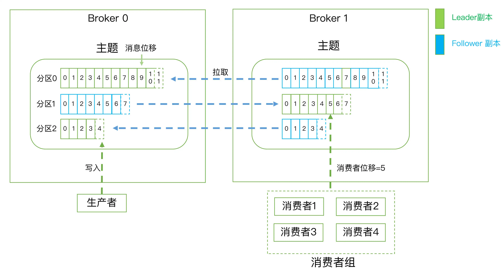

## 入门

### 01 消息引擎系统-Messaging System

* Apache Kafka是一款开源的消息引擎系统。根据维基百科的定义，消息引擎系统是一组规范。企业利用这组规范在不同系统之间传递语义准确的消息，实现松耦合的异步式数据传递。通俗来讲，就是系统A发送消息给消息引擎系统，系统B从消息引擎系统中读取A发送的消息。
* 消息引擎系统要设定具体的传输协议，即我用什么方法把消息传输出去，常见的方法有2种：点对点模型；发布／订阅模型。Kafka同时支持这两种消息引擎模型。
* 系统A不能直接发送消息给系统B，中间还要隔一个消息引擎呢，是为了“削峰填谷”。

### 02 术语

* 消息：Record。Kafka是消息引擎嘛，这里的消息就是指Kafka 处理的主要对象。
* 主题：Topic。**Kafka 中的 "topic" 是一个逻辑上的概念**。主题是承载消息的逻辑容器，在实际使用中多用来区分具体的业务。
* 分区：Partition。一个有序不变的消息序列。每个主题下可以有多个分区。
* 消息位移：Offset。表示分区中每条消息的位置信息，是一个单调递增且不变的值。
* 副本：Replica。Kafka 中同一条消息能够被拷贝到多个地方以提供数据冗余，这些地方就是所谓的副本。副本还分为领导者副本和追随者副本，各自有不同的角色划分。副本是在分区层级下的，即每个分区可配置多个副本实现高可用。
* 生产者：Producer。向主题发布新消息的应用程序。
* 消费者：Consumer。从主题订阅新消息的应用程序。
* 消费者位移：Consumer Offset。表征消费者消费进度，每个消费者都有自己的消费者位移。
* 消费者组：Consumer Group。多个消费者实例共同组成的一个组，同时消费多个分区以实现高吞吐。
* 重平衡：Rebalance。消费者组内某个消费者实例挂掉后，其他消费者实例自动重新分配订阅主题分区的过程。Rebalance 是 Kafka 消费者端实现高可用的重要手段。

Kafka体系架构=M个producer +N个broker +K个consumer+ZK集群

producer:生产者

Broker：服务代理节点，Kafka服务实例。
n个组成一个Kafka集群，通常一台机器部署一个Kafka实例，一个实例挂了其他实例仍可以使用，体现了高可用

consumer：消费者
消费topic 的消息， 一个topic 可以让若干个consumer消费，若干个consumer组成一个 consumer group ，一条消息只能被consumer group 中一个consumer消费，若干个partition 被若干个consumer 同时消费，达到消费者高吞吐量

topic ：主题

partition： 一个topic 可以拥有若干个partition（从 0 开始标识partition ），分布在不同的broker 上， 实现发布与订阅时负载均衡。producer 通过自定义的规则将消息发送到对应topic 下某个partition，以offset标识一条消息在一个partition的唯一性。
一个partition拥有多个replica，提高容灾能力。
replica 包含两种类型：leader 副本、follower副本，
leader副本负责读写请求，follower 副本负责同步leader副本消息，通过副本选举实现故障转移。
partition在机器磁盘上以log 体现，采用顺序追加日志的方式添加新消息、实现高吞吐量

#### 分区-partition

Kafka 中的一个主题（topic）可以拥有若干个分区（partition），而这些分区可以分布在不同的 Kafka Broker 上。

在 Kafka 中，分区是消息的物理存储单元，它们用于水平分割和分布消息的负载。每个分区都是一个独立的日志文件，消息按顺序附加到分区的末尾。这种分区的设计允许 Kafka 集群水平扩展，以处理大量数据和高吞吐量的情况。

这种分布方式有以下优点：

1. **负载均衡** ：将分区分布在不同的 Broker 上可以实现负载均衡，确保集群中的每个 Broker 都能均匀地处理消息流。
2. **故障容忍性** ：分区的分布使得 Kafka 集群具有冗余性。如果一个 Broker 失效，其他 Broker 上的分区仍然可用，从而确保数据的高可用性。
3. **水平扩展** ：您可以根据需求增加 Kafka Broker 的数量，以扩展集群的容量和性能，而不需要修改主题或分区的配置。
