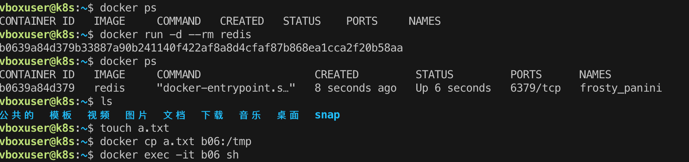

# 安装虚拟机

## 安装基本程序

```shell
sudo apt update
sudo apt install -y git vim curl jq
sudo apt install -y openssh-server
ip addr
```

## 遇到的问题及解决

### 1. sudo 无法使用必须使用root时

```shell
 su -
chmod u+w /etc/sudoers
vi /etc/sudoers
在 root ALL(ALL)ALL 下面加上自己用户名
```

### 2. 命令行工具(terminal)打不开

语言的问题，setting-regionAndLanguage中全部切换为china

### 3. sudo apt update 时 is not in the sudoers file解决

```shell
su - //切换为root 密码是root
```

### 4. 本机通过item2 连接

```shell
ssh vobxuser@192.168.56.2 changeme
ssh 主机名称@ip地址 密码
```

### 5. change root passord

```
su - // 需要密码
sudo -i //(不需要密码)

passwd // change password

```

# 虚拟机 Docker 安装

## 基本安装及拉去镜像

```
sudo apt install -y docker.io #安装Docker Engine
sudo service docker start         #启动docker服务
sudo usermod -aG docker ${USER}   #当前用户加入docker组 #需要退出重启
docker images # 它会列出当前 Docker 所存储的所有镜像：
```

## 常用基本命令

1. **镜像操作：**

   - `docker images`：显示本地所有镜像。
   - `docker pull [镜像名]`：从远程仓库拉取镜像。
   - `docker rmi [镜像ID]`：删除本地镜像。
2. **容器生命周期：**

   - `docker ps`：显示运行中的容器。
   - `docker ps -a`：显示所有容器，包括已停止的。
   - `docker run [选项] [镜像名] [命令]`：创建并启动一个容器。
     - 一些常见选项：`-d` 后台运行，`-p` 指定端口映射，`-v` 指定数据卷挂载等。
   - `docker start [容器ID]`：启动已停止的容器。
   - `docker stop [容器ID]`：停止运行中的容器。
   - `docker restart [容器ID]`：重启容器。
3. **容器操作：**

   - `docker exec -it [容器ID] [命令]`：在运行中的容器中执行命令。
   - `docker logs [容器ID]`：查看容器日志。
   - `docker rm [容器ID]`：删除已停止的容器。
   - `docker inspect [容器ID]`：查看容器详细信息。
4. **网络操作：**

   - `docker network ls`：显示 Docker 网络。
   - `docker network create [网络名]`：创建一个 Docker 网络。
   - `docker network connect [网络名] [容器ID]`：将容器连接到指定网络。
   - `docker network disconnect [网络名] [容器ID]`：将容器从指定网络断开。
5. **数据卷操作：**

   - `docker volume ls`：显示 Docker 数据卷。
   - `docker volume create [卷名]`：创建一个 Docker 数据卷。
   - `docker volume rm [卷名]`：删除 Docker 数据卷。
6. **其他常用命令：**

   - `docker info`：显示 Docker 系统信息。
   - `docker version`：显示 Docker 版本信息。
   - `docker build [路径]`：构建 Docker 镜像。
   - `docker-compose`：使用 Docker Compose 管理多容器应用。

## docker run

```bash
docker run [选项] [镜像名] [命令] [参数]
```

**常用选项：**

1. **`-d`：** 后台运行容器（在后台守护进程中运行）。

   ```bash
   docker run -d nginx
   ```
2. **`-p`：** 指定端口映射，将容器的端口映射到主机的指定端口。

   ```bash
   docker run -p 8080:80 nginx
   ```
3. **`-v`：** 指定数据卷挂载，将主机上的目录或文件挂载到容器内。

   ```bash
   docker run -v /host/path:/container/path nginx
   ```
4. **`-e`：** 设置环境变量。

   ```bash
   docker run -e MYSQL_ROOT_PASSWORD=password mysql
   ```
5. **`--name`：** 指定容器的名称。

   ```bash
   docker run --name mycontainer nginx
   ```
6. **`-it`：** 以交互模式运行容器，通常与 `-t` 和 `-i` 一起使用。

   ```bash
   docker run -it ubuntu /bin/bash
   ```
7. **`--rm`：** 容器停止后自动删除容器实例。

   ```bash
   docker run --rm nginx
   ```
8. **`--network`：** 指定容器连接的网络。

   ```bash
   docker run --network=my-network nginx
   ```
9. **`--restart`：** 定义容器的重启策略。

   ```bash
   docker run --restart=always nginx
   ```


### Dockerfile

```shell


// 第一条指令必须是 FROM
FROM alpine:3.15                # 选择Alpine镜像 镜像的安全和大小
FROM ubuntu:bionic              # 选择Ubuntu镜像 应用的运行稳定性

// copy 需要专门的文件路径，不可以随意指定
COPY ./a.txt  /tmp/a.txt    # 把构建上下文里的a.txt拷贝到镜像的/tmp目录
COPY /etc/hosts  /tmp       # 错误！不能使用构建上下文之外的文件 

//Dockerfile 里一条指令只能是一行， RUN 指令会在每行的末尾使用续行符 \，命令之间也会用 && 来连接
RUN apt-get update \
    && apt-get install -y \
        build-essential \
        curl \
        make \
        unzip \
    && cd /tmp \
    && curl -fSL xxx.tar.gz -o xxx.tar.gz\
    && tar xzf xxx.tar.gz \
    && cd xxx \
    && ./config \
    && make \
    && make clean


```

run 太长容易写错

一种变通的技巧：把这些 Shell 命令集中到一个脚本文件里，用 COPY 命令拷贝进去再用 RUN 来执行：

```shell
COPY setup.sh  /tmp/                # 拷贝脚本到/tmp目录

RUN cd /tmp && chmod +x setup.sh \  # 添加执行权限
    && ./setup.sh && rm setup.sh    # 运行脚本然后再删除
```

RUN 指令实际上就是 Shell 编程，如果你对它有所了解，就应该知道它有变量的概念，可以实现参数化运行，这在 Dockerfile 里也可以做到，需要使用两个指令 ARG 和 ENV。

**ARG 创建的变量只在镜像构建过程中可见，容器运行时不可见，**

**ENV 创建的变量不仅能够在构建镜像的过程中使用，在容器运行时也能够以环境变量的形式被应用程序使用**

```shell
ARG IMAGE_BASE="node"
ARG IMAGE_TAG="alpine"

ENV PATH=$PATH:/tmp
ENV DEBUG=OFF

//EXPOSE，它用来声明容器对外服务的端口号
EXPOSE 443           # 默认是tcp协议
EXPOSE 53/udp        # 可以指定udp协议
```

如果目录里有的文件（例如 readme/.git/.svn 等）不需要拷贝进镜像，docker 也会一股脑地打包上传，效率很低。

为了避免这种问题，你可以在“构建上下文”目录里再建立一个 .dockerignore 文件，语法与 .gitignore 类似，排除那些不需要的文件。

```shell
# docker ignore
*.swp
*.sh
```

#### 小结

```shell
docker build -f Dockerfile文件名 .  // .是当前路径 代表构建上下文 就是 context
```

好了，今天我们一起学习了容器镜像的内部结构，重点理解容器镜像是由多个只读的 Layer 构成的，同一个 Layer 可以被不同的镜像共享，减少了存储和传输的成本。

**只有 RUN, COPY, ADD 会生成新的镜像层，其它指令只会产生临时层**

1. 创建镜像需要编写 Dockerfile，写清楚创建镜像的步骤，每个指令都会生成一个 Layer。
2. Dockerfile 里，第一个指令必须是 FROM，用来选择基础镜像，常用的有 Alpine、Ubuntu 等。
3. 其他常用的指令有：COPY、RUN、EXPOSE，分别是拷贝文件，运行 Shell 命令，声明服务端口号。docker build 需要用 -f 来指定 Dockerfile，如果不指定就使用当前目录下名字是“Dockerfile”的文件。
4. docker build 需要指定“构建上下文”，其中的文件会打包上传到 Docker daemon，所以尽量不要在“构建上下文”中存放多余的文件。
5. 创建镜像的时候应当尽量使用 -t 参数，为镜像起一个有意义的名字，方便管理。

#### 编写Dockerfile的基本步骤：

1. **选择基础镜像：** 在Dockerfile的第一行，指定用作基础的镜像，通常是操作系统的一个发行版，如Alpine、Ubuntu等。
2. **设置工作目录：** 使用 `WORKDIR` 指令设置容器内的工作目录，这将影响后续指令的相对路径。
3. **复制文件：** 使用 `COPY` 或 `ADD` 指令将本地文件复制到容器内的指定路径。
4. **安装依赖：** 使用适合基础镜像的包管理工具（如`apt`、`apk`、`yum`等）安装所需的软件包和依赖。
5. **运行命令：** 使用 `RUN` 指令在容器内执行命令，例如安装软件包、配置环境等。
6. **设置环境变量：** 使用 `ENV` 指令设置容器内的环境变量。
7. **暴露端口：** 使用 `EXPOSE` 指令声明容器将监听的端口号。
8. **定义入口命令：** 使用 `CMD` 或 `ENTRYPOINT` 指令定义容器启动时要执行的命令。
9. **构建镜像：** 在Dockerfile所在的目录运行 `docker build` 命令来构建镜像，例如：`docker build -t imagename:tag .`。

* `RUN` 用于在构建阶段执行命令，对镜像进行修改。它在构建时执行，并生成一个新的镜像层。
* `ENTRYPOINT` 用于配置容器启动时的默认命令。它在运行容器时才起作用，定义了容器的主要执行程序。

通常，`RUN` 用于构建时的静态操作，而 `ENTRYPOINT` 用于指定容器的动态执行命令。在一个 Dockerfile 中，它们可以一起使用，但各自有着不同的目的和时机。

以下是一个简单的Dockerfile示例：

```shell
# 使用Alpine Linux作为基础镜像
FROM alpine:latest

# 设置工作目录
WORKDIR /app

# 复制应用程序文件到容器内
COPY app.py /app/

# 安装Python3
RUN apk add --no-cache python3

# 设置环境变量
ENV MY_ENV_VAR=myvalue

# 暴露端口
EXPOSE 80

# 定义入口命令
CMD ["python3", "app.py"]

```

### 数据交换



```shell
docker run -d --rm redis
docker ps // dedao container id
docker cp a.txt {container_id}:/tmp //数据拷贝 到容器中
docker cp {container_id}:/tmp/a.txt ./b.txt //从容器中拷贝数据
```

#### 共享主机文件

docker run 命令启动容器的时候使用 -v 参数就行，具体的格式是“宿主机路径: 容器内路径”。

我还是以 Redis 为例，启动容器，使用 -v 参数把本机的“/tmp”目录挂载到容器里的“/tmp”目录，也就是说让容器共享宿主机的“/tmp”目录：

`docker run -d --rm -v /tmp:/tmp redis`

然后我们再用 docker exec 进入容器，查看一下容器内的“/tmp”目录，应该就可以看到文件与宿主机是完全一致的。

```shell
docker ps //得到容器ID
docker exec -it {容器ID} sh 
```

我们可以在不变动本机环境的前提下，使用镜像安装任意的应用，然后直接以容器来运行我们本地的源码

比如我本机上只有 Python 2.7，但我想用 Python 3 开发，如果同时安装 Python 2 和 Python 3 很容易就会把系统搞乱，所以我就可以这么做：

* 先使用 docker pull 拉取一个 Python 3 的镜像，因为它打包了完整的运行环境，运行时有隔离，所以不会对现有系统的 Python 2.7 产生任何影响。
* 在本地的某个目录编写 Python 代码，然后用 -v 参数让容器共享这个目录。
* 现在就可以在容器里以 Python 3 来安装各种包，再运行脚本做开发了。

```shell
docker pull python:alpine
docker run -it --rm -v `pwd`:/tmp python:alpine sh
```

#### 网络互通

Docker 提供了三种网络模式，分别是 null、host 和 bridge。

1. null 是最简单的模式，也就是没有网络，但允许其他的网络插件来自定义网络连接，这里就不多做介绍了。
2. host 的意思是直接使用宿主机网络，相当于去掉了容器的网络隔离（其他隔离依然保留），所有的容器会共享宿主机的 IP 地址和网卡。这种模式没有中间层，自然通信效率高，但缺少了隔离，运行太多的容器也容易导致端口冲突。

host 模式需要在 docker run 时使用 --net=host 参数，下面我就用这个参数启动 Nginx：

```shell
docker run -d --rm --net=host nginx:alpine
```

3. 第三种 bridge，也就是桥接模式，它有点类似现实世界里的交换机、路由器，只不过是由软件虚拟出来的，容器和宿主机再通过虚拟网卡接入这个网桥

```shell
docker run -d --rm nginx:alpine    # 默认使用桥接模式
docker run -d --rm redis           # 默认使用桥接模式
```

查看ip

```shell
ip addr                    # 本机查看网卡
docker exec xxx ip addr    # 容器查看网卡
```

（Redis 容器里没有 ip 命令，所以只能在 Nginx 容器里执行）：

```shell
docker inspect xxx |grep IPAddress
```

端口映射

端口号映射需要使用 bridge 模式，并且在 docker run 启动容器时使用 -p 参数，形式和共享目录的 -v 参数很类似，用 : 分隔本机端口和容器端口。比如，如果要启动两个 Nginx 容器，分别跑在 80 和 8080 端口上：

```shell
docker run -d -p 80:80 --rm nginx:alpine
docker run -d -p 8080:80 --rm nginx:alpine
```

小结：

1. docker cp 命令可以在容器和主机之间互相拷贝文件，适合简单的数据交换。
2. docker run -v 命令可以让容器和主机共享本地目录，免去了拷贝操作，提升工作效率。
3. host 网络模式让容器与主机共享网络栈，效率高但容易导致端口冲突。
4. bridge 网络模式实现了一个虚拟网桥，容器和主机都在一个私有网段内互联互通。
5. docker run -p 命令可以把主机的端口号映射到容器的内部端口号，解决了潜在的端口冲突问题。


# 搭建kubernetes 多集群部署

准备两个机器（虚拟机建两个）- 相关文件位置：`k8s多集群布置`

```shell

master node:
192.168.56.3

work node
192.168.56.4


master节点
sudo vi /etc/hostname 改主机名
prepare.sh
admin.sh
image.sh
master.sh  修改 apiserver，复制john
kubectl apply -f kube-flannel.yml
kubectl get node # 查看节点

work节点
sudo vi /etc/hostname 改主机名
prepare.sh
admin.sh
kubeadm join 192.168.56.3:6443 --token 1rxv6a.xofyxikclcca162q \
	--discovery-token-ca-cert-hash sha256:9f82a5414a1c545c7c8bfb0e8879879266712b5a3febcbe25a65911662da8e5e
```

安装完成后可以进行测试

```shell
# 在master节点上
kubectl get node
kubectl run ngx --image=nginx:alpine
kubectl get pod -o wide
```
