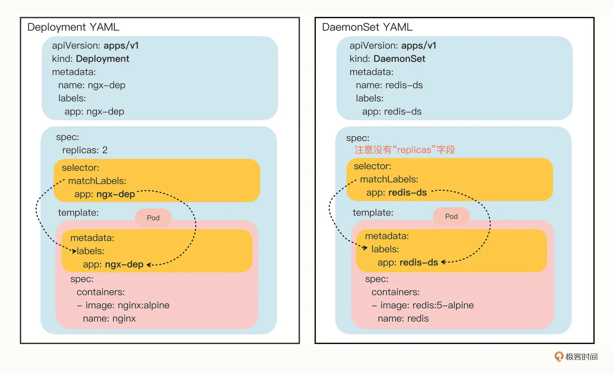

## 安装虚拟机

基本命令

```shell
sudo apt update
sudo apt install -y git vim curl jq
sudo apt install -y openssh-server
ip addr
```

sudo 无法使用必须使用root时

```shell
 su -
chmod u+w /etc/sudoers
vi /etc/sudoers
在 root ALL(ALL)ALL 下面加上自己用户名
```

### 

1.terminal打不开

语言的问题，setting-regionAndLanguage中全部切换为china

### 2.sudo apt update 时 is not in the sudoers file解决

```shell
su - //切换为root 密码是root
```

### 3.通过item2 连接

ssh vobxuser@192.168.56.2 changeme

### 4.change root

```
su - // 需要密码
sudo -i //(不需要密码)

passwd // change password

```

## Docker install

```
sudo apt install -y docker.io #安装Docker Engine
sudo service docker start         #启动docker服务
sudo usermod -aG docker ${USER}   #当前用户加入docker组 #需要退出重启
docker ps #它会列出当前系统里运行的容器
docker pull busybox      #拉取busybox镜像
docker images # 它会列出当前 Docker 所存储的所有镜像：
```

### 1.被隔离的进程

```shell
docker pull alpine

docker run -it alpine sh

```

`-it`：这是两个选项的组合，用于在容器内启动一个交互式的终端。`-i`表示标准输入保持打开，`-t`表示分配一个伪终端（TTY）。`sh`：这是在Alpine容器内要运行的命令，它启动了一个Shell终端。

这个命令的含义是：在一个新的Docker容器中，使用Alpine Linux镜像启动一个交互式的Shell会话，您可以在这个Shell终端中执行命令和操作容器的文件系统。

**容器，就是一个特殊的隔离环境，它能够让进程只看到这个环境里的有限信息，不能对外界环境施加影响**

1. 容器就是操作系统里一个特殊的“沙盒”环境，里面运行的进程只能看到受限的信息，与外部系统实现了隔离。
2. 容器隔离的目的是为了系统安全，限制了进程能够访问的各种资源。
3. 相比虚拟机技术，容器更加轻巧、更加高效，消耗的系统资源非常少，在云计算时代极具优势。
4. 容器的基本实现技术是 Linux 系统里的 namespace、cgroup、chroot。


### 镜像操作

镜像的完整名字由两个部分组成，名字和标签，中间用 : 连接起来。

```shell
docker rmi redis  
docker rmi d4c //移除镜像
```

### 容器操作

基本的格式是“docker run 设置参数”，再跟上“镜像名或 ID”，后面可能还会有附加的“运行命令”。

```shell
docker run -h srv alpine hostname
```

这里的 -h srv 就是容器的运行参数，alpine 是镜像名，它后面的 hostname 表示要在容器里运行的“hostname”这个程序，输出主机名。

`-h srv`：这是一个选项，用于指定正在创建的容器的主机名。在这个命令中，`-h` 后面的 `srv` 是所设置的主机名。

这个命令的含义是：在一个新的Docker容器中，使用Alpine Linux镜像运行`hostname`命令，并将容器的主机名设置为`srv`。执行这个命令后，容器的主机名将会变为`srv`，您可以在容器内部执行`hostname`命令来验证设置的主机名。

```shell
docker run -it alpine sh
```

docker run 常用参数

> -it 表示开启一个交互式操作的 Shell，这样可以直接进入容器内部，就好像是登录虚拟机一样。（它实际上是“-i”和“-t”两个参数的组合形式）
>
> -d 表示让容器在后台运行，这在我们启动 Nginx、Redis 等服务器程序的时候非常有用。
>
> --name 可以为容器起一个名字，方便我们查看，不过它不是必须的，如果不用这个参数，Docker 会分配一个随机的名字。

对于正在运行中的容器，我们可以使用 docker exec 命令在里面执行另一个程序

容器被停止后使用 docker ps 命令就看不到了，不过容器并没有被彻底销毁，我们可以使用 docker ps -a 命令查看系统里所有的容器，当然也包括已经停止运行的容器：

```shell
docker ps
docker ps -a //查看系统里所有的容器 
docker rm 容器的id //只是删除容器，不是删除镜像
docker run -d --rm nginx:alpine // --rm参数 是不保存容器，用完了就删除
```


### Dockerfile

```shell

// 第一条指令必须是 FROM
FROM alpine:3.15                # 选择Alpine镜像 镜像的安全和大小
FROM ubuntu:bionic              # 选择Ubuntu镜像 应用的运行稳定性

// copy 需要专门的文件路径，不可以随意指定
COPY ./a.txt  /tmp/a.txt    # 把构建上下文里的a.txt拷贝到镜像的/tmp目录
COPY /etc/hosts  /tmp       # 错误！不能使用构建上下文之外的文件 

//Dockerfile 里一条指令只能是一行， RUN 指令会在每行的末尾使用续行符 \，命令之间也会用 && 来连接
RUN apt-get update \
    && apt-get install -y \
        build-essential \
        curl \
        make \
        unzip \
    && cd /tmp \
    && curl -fSL xxx.tar.gz -o xxx.tar.gz\
    && tar xzf xxx.tar.gz \
    && cd xxx \
    && ./config \
    && make \
    && make clean


```

run 太长容易写错

一种变通的技巧：把这些 Shell 命令集中到一个脚本文件里，用 COPY 命令拷贝进去再用 RUN 来执行：

```shell
COPY setup.sh  /tmp/                # 拷贝脚本到/tmp目录

RUN cd /tmp && chmod +x setup.sh \  # 添加执行权限
    && ./setup.sh && rm setup.sh    # 运行脚本然后再删除
```

RUN 指令实际上就是 Shell 编程，如果你对它有所了解，就应该知道它有变量的概念，可以实现参数化运行，这在 Dockerfile 里也可以做到，需要使用两个指令 ARG 和 ENV。

**ARG 创建的变量只在镜像构建过程中可见，容器运行时不可见，**

**ENV 创建的变量不仅能够在构建镜像的过程中使用，在容器运行时也能够以环境变量的形式被应用程序使用**

```shell
ARG IMAGE_BASE="node"
ARG IMAGE_TAG="alpine"

ENV PATH=$PATH:/tmp
ENV DEBUG=OFF

//EXPOSE，它用来声明容器对外服务的端口号
EXPOSE 443           # 默认是tcp协议
EXPOSE 53/udp        # 可以指定udp协议
```

如果目录里有的文件（例如 readme/.git/.svn 等）不需要拷贝进镜像，docker 也会一股脑地打包上传，效率很低。

为了避免这种问题，你可以在“构建上下文”目录里再建立一个 .dockerignore 文件，语法与 .gitignore 类似，排除那些不需要的文件。

```shell
# docker ignore
*.swp
*.sh
```

#### 小结

```shell
docker build -f Dockerfile文件名 .  // .是当前路径 代表构建上下文 就是 context
```

好了，今天我们一起学习了容器镜像的内部结构，重点理解容器镜像是由多个只读的 Layer 构成的，同一个 Layer 可以被不同的镜像共享，减少了存储和传输的成本。

**只有 RUN, COPY, ADD 会生成新的镜像层，其它指令只会产生临时层**

1. 创建镜像需要编写 Dockerfile，写清楚创建镜像的步骤，每个指令都会生成一个 Layer。
2. Dockerfile 里，第一个指令必须是 FROM，用来选择基础镜像，常用的有 Alpine、Ubuntu 等。
3. 其他常用的指令有：COPY、RUN、EXPOSE，分别是拷贝文件，运行 Shell 命令，声明服务端口号。docker build 需要用 -f 来指定 Dockerfile，如果不指定就使用当前目录下名字是“Dockerfile”的文件。
4. docker build 需要指定“构建上下文”，其中的文件会打包上传到 Docker daemon，所以尽量不要在“构建上下文”中存放多余的文件。
5. 创建镜像的时候应当尽量使用 -t 参数，为镜像起一个有意义的名字，方便管理。

#### 编写Dockerfile的基本步骤：

1. **选择基础镜像：** 在Dockerfile的第一行，指定用作基础的镜像，通常是操作系统的一个发行版，如Alpine、Ubuntu等。
2. **设置工作目录：** 使用 `WORKDIR` 指令设置容器内的工作目录，这将影响后续指令的相对路径。
3. **复制文件：** 使用 `COPY` 或 `ADD` 指令将本地文件复制到容器内的指定路径。
4. **安装依赖：** 使用适合基础镜像的包管理工具（如`apt`、`apk`、`yum`等）安装所需的软件包和依赖。
5. **运行命令：** 使用 `RUN` 指令在容器内执行命令，例如安装软件包、配置环境等。
6. **设置环境变量：** 使用 `ENV` 指令设置容器内的环境变量。
7. **暴露端口：** 使用 `EXPOSE` 指令声明容器将监听的端口号。
8. **定义入口命令：** 使用 `CMD` 或 `ENTRYPOINT` 指令定义容器启动时要执行的命令。
9. **构建镜像：** 在Dockerfile所在的目录运行 `docker build` 命令来构建镜像，例如：`docker build -t imagename:tag .`。

以下是一个简单的Dockerfile示例：

```shell
# 使用Alpine Linux作为基础镜像
FROM alpine:latest

# 设置工作目录
WORKDIR /app

# 复制应用程序文件到容器内
COPY app.py /app/

# 安装Python3
RUN apk add --no-cache python3

# 设置环境变量
ENV MY_ENV_VAR=myvalue

# 暴露端口
EXPOSE 80

# 定义入口命令
CMD ["python3", "app.py"]

```

### 数据交换


```shell
docker run -d --rm redis
docker ps // dedao container id
docker cp a.txt {container_id}:/tmp //数据拷贝 到容器中
docker cp {container_id}:/tmp/a.txt ./b.txt //从容器中拷贝数据
```

#### 共享主机文件

docker run 命令启动容器的时候使用 -v 参数就行，具体的格式是“宿主机路径: 容器内路径”。

我还是以 Redis 为例，启动容器，使用 -v 参数把本机的“/tmp”目录挂载到容器里的“/tmp”目录，也就是说让容器共享宿主机的“/tmp”目录：

`docker run -d --rm -v /tmp:/tmp redis`

然后我们再用 docker exec 进入容器，查看一下容器内的“/tmp”目录，应该就可以看到文件与宿主机是完全一致的。

```shell
docker ps //得到容器ID
docker exec -it {容器ID} sh 
```

我们可以在不变动本机环境的前提下，使用镜像安装任意的应用，然后直接以容器来运行我们本地的源码

比如我本机上只有 Python 2.7，但我想用 Python 3 开发，如果同时安装 Python 2 和 Python 3 很容易就会把系统搞乱，所以我就可以这么做：

* 先使用 docker pull 拉取一个 Python 3 的镜像，因为它打包了完整的运行环境，运行时有隔离，所以不会对现有系统的 Python 2.7 产生任何影响。
* 在本地的某个目录编写 Python 代码，然后用 -v 参数让容器共享这个目录。
* 现在就可以在容器里以 Python 3 来安装各种包，再运行脚本做开发了。

```shell
docker pull python:alpine
docker run -it --rm -v `pwd`:/tmp python:alpine sh
```

#### 网络互通

Docker 提供了三种网络模式，分别是 null、host 和 bridge。

1. null 是最简单的模式，也就是没有网络，但允许其他的网络插件来自定义网络连接，这里就不多做介绍了。
2. host 的意思是直接使用宿主机网络，相当于去掉了容器的网络隔离（其他隔离依然保留），所有的容器会共享宿主机的 IP 地址和网卡。这种模式没有中间层，自然通信效率高，但缺少了隔离，运行太多的容器也容易导致端口冲突。

host 模式需要在 docker run 时使用 --net=host 参数，下面我就用这个参数启动 Nginx：

```shell
docker run -d --rm --net=host nginx:alpine
```

3. 第三种 bridge，也就是桥接模式，它有点类似现实世界里的交换机、路由器，只不过是由软件虚拟出来的，容器和宿主机再通过虚拟网卡接入这个网桥

```shell
docker run -d --rm nginx:alpine    # 默认使用桥接模式
docker run -d --rm redis           # 默认使用桥接模式
```

查看ip

```shell
ip addr                    # 本机查看网卡
docker exec xxx ip addr    # 容器查看网卡
```

（Redis 容器里没有 ip 命令，所以只能在 Nginx 容器里执行）：

```shell
docker inspect xxx |grep IPAddress
```

端口映射

端口号映射需要使用 bridge 模式，并且在 docker run 启动容器时使用 -p 参数，形式和共享目录的 -v 参数很类似，用 : 分隔本机端口和容器端口。比如，如果要启动两个 Nginx 容器，分别跑在 80 和 8080 端口上：

```shell
docker run -d -p 80:80 --rm nginx:alpine
docker run -d -p 8080:80 --rm nginx:alpine
```

小结：

1. docker cp 命令可以在容器和主机之间互相拷贝文件，适合简单的数据交换。
2. docker run -v 命令可以让容器和主机共享本地目录，免去了拷贝操作，提升工作效率。
3. host 网络模式让容器与主机共享网络栈，效率高但容易导致端口冲突。
4. bridge 网络模式实现了一个虚拟网桥，容器和主机都在一个私有网段内互联互通。
5. docker run -p 命令可以把主机的端口号映射到容器的内部端口号，解决了潜在的端口冲突问题。

### 入门导图


### 演练

```shell
docker pull registry
docker run -d -p 5000:5000 registry
//重新打包，因为上传的目标不是默认的 Docker Hub，而是本地的私有仓库，所以镜像的名字前面还必须再加上仓库的地址（域名或者 IP 地址都行），形式上和 HTTP 的 URL 非常像。
docker tag nginx:alpine 127.0.0.1:5000/nginx:alpine
docker push 127.0.0.1:5000/nginx:alpine
```

为了验证是否已经成功推送，我们可以把刚才打标签的镜像删掉，再重新下载：

```shell
docker rmi  127.0.0.1:5000/nginx:alpine
docker pull 127.0.0.1:5000/nginx:alpine
```

## 初级篇

### 搭建kubernetes环境

```shell
# Intel x86_64
curl -Lo minikube https://storage.googleapis.com/minikube/releases/latest/minikube-linux-amd64

# Apple arm64
curl -Lo minikube https://storage.googleapis.com/minikube/releases/latest/minikube-linux-arm64

sudo install minikube /usr/local/bin/
minikube version

```

kubectl 的作用有点类似之前我们学习容器技术时候的工具“docker”，它也是一个命令行工具，作用也比较类似，同样是与 Kubernetes 后台服务通信，把我们的命令转发给 Kubernetes，实现容器和集群的管理功能。

```shell
minikube kubectl
```

我们就可以在本机上运行 minikube，创建 Kubernetes 实验环境了。

```shell
minikube start --kubernetes-version=v1.23.3
# 查看状态
minikube status
minikube node list

kubectl version # 不可直接使用


```

使用 Linux 的“alias”功能，为它创建一个别名，写到当前用户目录下的 .bashrc 里，也就是这样：

```shell
alias kubectl="minikube kubectl --"
source <(kubectl completion bash) # 为了能够使用 kubectl 命令的自动补全配置脚本
```

在 Kubernetes 里运行一个 Nginx 应用，命令与 Docker 一样，也是 run，不过形式上有点区别，需要用 --image 指定镜像，然后 Kubernetes 会自动拉取并运行：

```shell
kubectl run ngx --image=nginx:alpine
```

### 自动化运维-kubernetes Node


* 控制面的节点在 Kubernetes 里叫做 Master Node，一般简称为 Master，它是整个集群里最重要的部分，可以说是 Kubernetes 的大脑和心脏。
* 数据面的节点叫做 Worker Node，一般就简称为 Worker 或者 Node，相当于 Kubernetes 的手和脚，在 Master 的指挥下干活。

#### 节点内部结构

Master 里有 4 个组件，分别是 apiserver、etcd、scheduler、controller-manager。


1. apiserver 是 Master 节点——同时也是整个 Kubernetes 系统的唯一入口，它对外公开了一系列的 RESTful API，并且加上了验证、授权等功能，所有其他组件都只能和它直接通信，可以说是 Kubernetes 里的联络员。
2. etcd 是一个高可用的分布式 Key-Value 数据库，用来持久化存储系统里的各种资源对象和状态，相当于 Kubernetes 里的配置管理员。注意它只与 apiserver 有直接联系，也就是说任何其他组件想要读写 etcd 里的数据都必须经过 apiserver。
3. scheduler 负责容器的编排工作，检查节点的资源状态，把 Pod 调度到最适合的节点上运行，相当于部署人员。因为节点状态和 Pod 信息都存储在 etcd 里，所以 scheduler 必须通过 apiserver 才能获得。
4. controller-manager 负责维护容器和节点等资源的状态，实现故障检测、服务迁移、应用伸缩等功能，相当于监控运维人员。同样地，它也必须通过 apiserver 获得存储在 etcd 里的信息，才能够实现对资源的各种操作。

Node 里的 3 个组件了，分别是 kubelet、kube-proxy、container-runtime。


1. kubelet 是 Node 的代理，负责管理 Node 相关的绝大部分操作，Node 上只有它能够与 apiserver 通信，实现状态报告、命令下发、启停容器等功能，相当于是 Node 上的一个“小管家”。
2. kube-proxy 的作用有点特别，它是 Node 的网络代理，只负责管理容器的网络通信，简单来说就是为 Pod 转发 TCP/UDP 数据包，相当于是专职的“小邮差”。
3. container-runtime 我们就比较熟悉了，它是容器和镜像的实际使用者，在 kubelet 的指挥下创建容器，管理 Pod 的生命周期，是真正干活的“苦力”。

Kubernetes 的大致工作流程了：

* 每个 Node 上的 kubelet 会定期向 apiserver 上报节点状态，apiserver 再存到 etcd 里。
* 每个 Node 上的 kube-proxy 实现了 TCP/UDP 反向代理，让容器对外提供稳定的服务。
* scheduler 通过 apiserver 得到当前的节点状态，调度 Pod，然后 apiserver 下发命令给某个 Node 的 kubelet，kubelet 调用 container-runtime 启动容器。
* controller-manager 也通过 apiserver 得到实时的节点状态，监控可能的异常情况，再使用相应的手段去调节恢复。

#### 小结：

Kubernetes 能够在集群级别管理应用和服务器，可以认为是一种集群操作系统。它使用“控制面 / 数据面”的基本架构，Master 节点实现管理控制功能，Worker 节点运行具体业务。Kubernetes 由很多模块组成，可分为核心的组件和选配的插件两类。Master 里有 4 个组件，分别是 apiserver、etcd、scheduler、controller-manager。Node 里有 3 个组件，分别是 kubelet、kube-proxy、container-runtime。通常必备的插件有 DNS 和 Dashboard。


### YAML 文件编写


因为 apiserver 是 Kubernetes 系统的唯一入口，外部用户和内部组件都必须和它通信，而它采用了 HTTP 协议的 URL 资源理念，API 风格也用 RESTful 的 GET/POST/DELETE 等等，所以，这些概念很自然地就被称为是“API 对象”了。

你可以使用 kubectl api-resources 来查看当前 Kubernetes 版本支持的所有对象：

```shell
kubectl api-resources
```

在使用 kubectl 命令的时候，你还可以加上一个参数 --v=9，它会显示出详细的命令执行过程，清楚地看到发出的 HTTP 请求，比如：

```shell
kubectl get pod --v=9
```

编写yaml文件。描述并创建API对象

```yaml
apiVersion: v1
kind: Pod
metadata:
  name: ngx-pod
  labels:
    env: demo
    owner: chrono

spec:
  containers:
  - image: nginx:alpine
    name: ngx
    ports:
    - containerPort: 80
```

因为 API 对象采用标准的 HTTP 协议，为了方便理解，我们可以借鉴一下 HTTP 的报文格式，把 API 对象的描述分成“header”和“body”两部分。

“header”包含的是 API 对象的基本信息，有三个字段：apiVersion、kind、metadata。apiVersion 表示操作这种资源的 API 版本号。

由于 Kubernetes 的迭代速度很快，不同的版本创建的对象会有差异，为了区分这些版本就需要使用 apiVersion 这个字段，比如 v1、v1alpha1、v1beta1 等等。

kind 表示资源对象的类型，这个应该很好理解，比如 Pod、Node、Job、Service 等等。

metadata 这个字段顾名思义，表示的是资源的一些“元信息”，也就是用来标记对象，方便 Kubernetes 管理的一些信息。

使用 kubectl apply、kubectl delete，再加上参数 -f，你就可以使用这个 YAML 文件，创建或者删除对象了：

```shell
kubectl apply -f ngx-pod.yml
kubectl delete -f ngx-pod.yml
```

如何编写yaml文件：

命令 kubectl explain，它相当于是 Kubernetes 自带的 API 文档，会给出对象字段的详细说明，这样我们就不必去网上查找了。比如想要看 Pod 里的字段该怎么写，就可以这样：

```shell
kubectl explain pod
kubectl explain pod.metadata
kubectl explain pod.spec
kubectl explain pod.spec.containers
```

另外一个技巧：

kubectl 的两个特殊参数 `--dry-run=client` 和 `-o yaml`，前者是空运行，后者是生成 YAML 格式，结合起来使用就会让 kubectl 不会有实际的创建动作，而只生成 YAML 文件。

```shell
# 例如，想要生成一个 Pod 的 YAML 样板示例，可以在 kubectl run 后面加上这两个参数：
# 就会生成一个绝对正确的 YAML 文件,随后根据需要，参考文档进行修改
kubectl run ngx --image=nginx:alpine --dry-run=client -o yaml
```

这个小技巧还可以再进化一下，把这段参数定义成 Shell 变量（名字任意，比如$do/$go，这里用的是$out），用起来会更省事，比如：

````shell
export out="--dry-run=client -o yaml"
kubectl run ngx --image=nginx:alpine $out
````

小结：

1. YAML 是 JSON 的超集，支持数组和对象，能够描述复杂的状态，可读性也很好。
2. Kubernetes 把集群里的一切资源都定义为 API 对象，通过 RESTful 接口来管理。描述 API 对象需要使用 YAML 语言，必须的字段是 apiVersion、kind、metadata。
3. 命令 `kubectl api-resources` 可以查看对象的 apiVersion 和 kind，命令 `kubectl explain` 可以查看对象字段的说明文档。
4. 命令 `kubectl apply`、`kubectl delete` 发送 HTTP 请求，管理 API 对象。
5. 使用参数`--dry-run=client -o yaml` 可以生成对象的 YAML 模板，简化编写工作。

### POD


```yaml
apiVersion: v1
kind: Pod
metadata:
  name: busy-pod
  labels:
    owner: chrono
    env: demo
    region: north
    tier: back
spec:
  containers:
  - image: busybox:latest
    name: busy
    imagePullPolicy: IfNotPresent
    env:
      - name: os
        value: "ubuntu"
      - name: debug
        value: "on"
    command:
      - /bin/echo
    args:
      - "$(os), $(debug)"
```

```shell
kubectl apply -f busy-pod.yml # 创建 pod
kubectl delete -f busy-pod.yml #删除 pod
```

我们可以用命令 `kubectl logs`，它会把 Pod 的标准输出流信息展示给我们看，在这里就会显示出预设的两个环境变量的值。

使用命令 `kubectl get pod` 可以查看 Pod 列表和运行状态：

我们可以使用命令 `kubectl describe` 来检查它的详细状态，它在调试排错时很有用：

`kubectl describe pod busy-pod`

`kubectl cp` 可以把本地文件拷贝进 Pod，`kubectl exec` 是进入 Pod 内部执行 Shell 命令，用法也差不多。

比如我有一个“a.txt”文件，那么就可以使用 kubectl cp 拷贝进 Pod 的“/tmp”目录里：

```shell
echo 'aaa' > a.txt
kubectl cp a.txt ngx-pod:/tmp
```

不过 kubectl exec 的命令格式与 Docker 有一点小差异，需要在 Pod 后面加上 --，把 kubectl 的命令与 Shell 命令分隔开

```shell
kubectl exec -it ngx-pod -- sh
```

虽然 Pod 是 Kubernetes 的核心概念，非常重要，但事实上在 Kubernetes 里通常并不会直接创建 Pod，因为它只是对容器做了简单的包装，比较脆弱，离复杂的业务需求还有些距离，需要 Job、CronJob、Deployment 等其他对象增添更多的功能才能投入生产使用。

### Job and CronJob

Job 和 CronJob，它们就组合了 Pod，实现了对离线业务的处理

**如何使用 YAML 描述 JobJob 的 YAML**

“文件头”部分还是那几个必备字段：

* apiVersion 不是 v1，而是 batch/v1。
* kind 是 Job，这个和对象的名字是一致的。
* metadata 里仍然要有 name 标记名字，也可以用 labels 添加任意的标签。

因为 `kubectl run` 只能创建 Pod，要创建 Pod 以外的其他 API 对象，需要使用命令 `kubectl create`，再加上对象的类型名。

```shell
export out="--dry-run=client -o yaml"              # 定义Shell变量
kubectl create job echo-job --image=busybox $out
```

```yaml
apiVersion: batch/v1
kind: Job
metadata:
  name: echo-job

spec:
  template:
    spec:
      restartPolicy: OnFailure
      containers:
      - image: busybox
        name: echo-job
        imagePullPolicy: IfNotPresent
        command: ["/bin/echo"]
        args: ["hello", "world"]
```

其实就是在 Job 对象里应用了组合模式，template 字段定义了一个“应用模板”，里面嵌入了一个 Pod，这样 Job 就可以从这个模板来创建出 Pod。

总的来说，这里的 Pod 工作非常简单，在 containers 里写好名字和镜像，command 执行 /bin/echo，输出“hello world”。

#### 操作Job

```shell
kubectl apply -f job.yml #创建job对象
# 查看状态
kubectl get job
kubectl get pod 
```

**控制离线作业的重要字段**

要注意这 4 个字段并不在 template 字段下，而是在 spec 字段下，所以它们是属于 Job 级别的，用来控制模板里的 Pod 对象。

1. activeDeadlineSeconds，设置 Pod 运行的超时时间。
2. backoffLimit，设置 Pod 的失败重试次数。
3. completions，Job 完成需要运行多少个 Pod，默认是 1 个。
4. parallelism，它与 completions 相关，表示允许并发运行的 Pod 数量，避免过多占用资源。

例子：

```yaml
apiVersion: batch/v1
kind: Job
metadata:
  name: sleep-job

spec:
  activeDeadlineSeconds: 15
  backoffLimit: 2
  completions: 4
  parallelism: 2

  template:
    spec:
      restartPolicy: OnFailure
      containers:
      - image: busybox
        name: echo-job
        imagePullPolicy: IfNotPresent
        command:
          - sh
          - -c
          - sleep $(($RANDOM % 10 + 1)) && echo done
```

使用 `kubectl apply` 创建 Job 之后，我们可以用 `kubectl get pod -w` 来实时观察 Pod 的状态，看到 Pod 不断被排队、创建、运行的过程：

```shell
kubectl apply -f sleep-job.yml
kubectl get pod -w
```

#### CronJob

* 因为 CronJob 的名字有点长，所以 Kubernetes 提供了简写 cj，这个简写也可以使用命令 `kubectl api-resources` 看到；
* CronJob 需要定时运行，所以我们在命令行里还需要指定参数 `--schedule`。

```shell
export out="--dry-run=client -o yaml"              # 定义Shell变量
kubectl create cj echo-cj --image=busybox --schedule="" $out
```

cronjob例子：

```yaml
apiVersion: batch/v1
kind: CronJob
metadata:
  name: echo-cj

spec:
  schedule: '*/1 * * * *'
  jobTemplate:
    spec:
      template:
        spec:
          restartPolicy: OnFailure
          containers:
          - image: busybox
            name: echo-cj
            imagePullPolicy: IfNotPresent
            command: ["/bin/echo"]
            args: ["hello", "world"]
```

我们还是重点关注它的 spec 字段，你会发现它居然连续有三个 spec 嵌套层次：

1. 第一个 spec 是 CronJob 自己的对象规格声明
2. 第二个 spec 从属于“jobTemplate”，它定义了一个 Job 对象。
3. 第三个 spec 从属于“template”，它定义了 Job 里运行的 Pod。

CronJob 还有一个新字段就是“schedule”，用来定义任务周期运行的规则。它使用的是标准的 Cron 语法，指定分钟、小时、天、月、周，和 Linux 上的 crontab 是一样的。

小结：

CronJob 使用定时规则控制 Job，Job 使用并发数量控制 Pod，Pod 再定义参数控制容器，容器再隔离控制进程，进程最终实现业务功能，层层递进的形式有点像设计模式里的 Decorator（装饰模式），链条里的每个环节都各司其职，在 Kubernetes 的统一指挥下完成任务。

1. Pod 是 Kubernetes 的最小调度单元，但为了保持它的独立性，不应该向它添加多余的功能。
2. Kubernetes 为离线业务提供了 Job 和 CronJob 两种 API 对象，分别处理“临时任务”和“定时任务”。
3. Job 的关键字段是 spec.template，里面定义了用来运行业务的 Pod 模板，其他的重要字段有 completions、parallelism 等
4. CronJob 的关键字段是 spec.jobTemplate 和 spec.schedule，分别定义了 Job 模板和定时运行的规则。

### 配置 ConfigMap/Secret

#### ConfigMap-明文信息

创建一个模版

```shell
export out="--dry-run=client -o yaml"        # 定义Shell变量
kubectl create cm info $out
```

```yaml
# cm.yml
apiVersion: v1
kind: ConfigMap
metadata:
  name: info

data:
  count: '10'
  debug: 'on'
  path: '/etc/systemd'
  greeting: |
    say hello to kubernetes.
```

```shell
kubectl apply -f cm.yml
kubectl get cm
kubectl describe cm info
```

#### Secret-机密信息

创建 YAML 样板的命令是 `kubectl create secret generic`

```shell
kubectl create secret generic user --from-literal=name=root $out
```

```yaml
# secret.yaml
apiVersion: v1
kind: Secret
metadata:
  name: user

data:
  name: cm9vdA==  # root
  pwd: MTIzNDU2   # 123456
  db: bXlzcWw=    # mysql
```

```shell
kubectl apply  -f secret.yml
kubectl get secret
kubectl describe secret user #kubectl describe 不能直接看到内容，只能看到数据的大小
```

#### 如何使用：环境变量和加载文件

环境变量

```yaml
apiVersion: v1
kind: Pod
metadata:
  name: env-pod

spec:
  containers:
  - env:
      - name: COUNT
        valueFrom:
          configMapKeyRef:
            name: info
            key: count
      - name: GREETING
        valueFrom:
          configMapKeyRef:
            name: info
            key: greeting
      - name: USERNAME
        valueFrom:
          secretKeyRef:
            name: user
            key: name
      - name: PASSWORD
        valueFrom:
          secretKeyRef:
            name: user
            key: pwd

    image: busybox
    name: busy
    imagePullPolicy: IfNotPresent
    command: ["/bin/sleep", "300"]
```

定义了 4 个环境变量，COUNT、GREETING、USERNAME、PASSWORD。

对于明文配置数据， COUNT、GREETING 引用的是 ConfigMap 对象，所以使用字段“configMapKeyRef”，里面的“name”是 ConfigMap 对象的名字，也就是之前我们创建的“info”，而“key”字段分别是“info”对象里的 count 和 greeting。

同样的对于机密配置数据， USERNAME、PASSWORD 引用的是 Secret 对象，要使用字段“secretKeyRef”，再用“name”指定 Secret 对象的名字 user，用“key”字段应用它里面的 name 和 pwd 。


进行验证：

```shell
kubectl apply -f env-pod.yml
kubectl exec -it env-pod -- sh

echo $COUNT
echo $GREETING
echo $USERNAME $PASSWORD
```

Volume方式使用

需要先定义两个volume，分别引用 ConfigMap 和 Secret。

随后进行挂载到指定目录下

完整的例子：

```yaml
apiVersion: v1
kind: Pod
metadata:
  name: vol-pod

spec:
  volumes:
  - name: cm-vol
    configMap:
      name: info
  - name: sec-vol
    secret:
      secretName: user

  containers:
  - volumeMounts:
    - mountPath: /tmp/cm-items
      name: cm-vol
    - mountPath: /tmp/sec-items
      name: sec-vol

    image: busybox
    name: busy
    imagePullPolicy: IfNotPresent
    command: ["/bin/sleep", "300"]
```


验证

```shell
kubectl apply -f vol-pod.yml
kubectl get pod
kubectl exec -it vol-pod -- sh
```

你会看到，ConfigMap 和 Secret 都变成了目录的形式，而它们里面的 Key-Value 变成了一个个的文件，而文件名就是 Key。

小结

两种在 Kubernetes 里管理配置信息的 API 对象 ConfigMap 和 Secret，它们分别代表了明文信息和机密敏感信息，存储在 etcd 里，在需要的时候可以注入 Pod 供 Pod 使用。

简单小结一下今天的要点：

1. ConfigMap 记录了一些 Key-Value 格式的字符串数据，描述字段是“data”，不是“spec”。
2. Secret 与 ConfigMap 很类似，也使用“data”保存字符串数据，但它要求数据必须是 Base64 编码，起到一定的保密效果。
3. 在 Pod 的“env.valueFrom”字段中可以引用 ConfigMap 和 Secret，把它们变成应用可以访问的环境变量。
4. 在 Pod 的“spec.volumes”字段中可以引用 ConfigMap 和 Secret，把它们变成存储卷，然后在“spec.containers.volumeMounts”字段中加载成文件的形式。
5. ConfigMap 和 Secret 对存储数据的大小没有限制(1MB)，但小数据用环境变量比较适合，大数据应该用存储卷，可根据具体场景灵活应用。

### 实战-WordPress

编排 maria

```yaml
apiVersion: v1
kind: ConfigMap
metadata:
  name: maria-cm

data:
  DATABASE: 'db'
  USER: 'wp'
  PASSWORD: '123'
  ROOT_PASSWORD: '123'
---
apiVersion: v1
kind: Pod
metadata:
  name: maria-pod
  labels:
    app: wordpress
    role: database

spec:
  containers:
  - image: mariadb:10
    name: maria
    imagePullPolicy: IfNotPresent
    ports:
    - containerPort: 3306

    envFrom:
    - prefix: 'MARIADB_'
      configMapRef:
        name: maria-cm

```

使用了一个新的字段“envFrom”，这是因为 ConfigMap 里的信息比较多，如果用 env.valueFrom 一个个地写会非常麻烦，容易出错，而 envFrom 可以一次性地把 ConfigMap 里的字段全导入进 Pod，并且能够指定变量名的前缀（即这里的 MARIADB_），非常方便。

```shell
kubectl apply -f mariadb-pod.yml
kubectl get pod -o wide
```

编排wordpress

```yaml
apiVersion: v1
kind: ConfigMap
metadata:
  name: wp-cm

data:
  HOST: '172.17.0.2' # 根据实际ip
  USER: 'wp'
  PASSWORD: '123'
  NAME: 'db'
---
apiVersion: v1
kind: Pod
metadata:
  name: wp-pod
  labels:
    app: wordpress
    role: website

spec:
  containers:
  - image: wordpress:5
    name: wp-pod
    imagePullPolicy: IfNotPresent
    ports:
    - containerPort: 80

    envFrom:
    - prefix: 'WORDPRESS_DB_'
      configMapRef:
        name: wp-cm
```

```shell
kubectl apply -f wp-pod.yml
kubectl get pod -o wide
```

第三步是为 WordPress Pod 映射端口号，让它在集群外可见。

本地的“8080”映射到 WordPress Pod 的“80”，kubectl 会把这个端口的所有数据都转发给集群内部的 Pod：

```shell
kubectl port-forward wp-pod 8080:80 &
```

注意在命令的末尾我使用了一个 `&` 符号，让端口转发工作在后台进行，这样就不会阻碍我们后续的操作。

如果想关闭端口转发，需要敲命令 `fg` ，它会把后台的任务带回到前台，然后就可以简单地用`“Ctrl + C”`来停止转发了。

第四步是创建反向代理的 Nginx，让我们的网站对外提供服务。

`/tmp/proxy.conf`

```yaml
server {
  listen 80;
  default_type text/html;

  location / {
      proxy_http_version 1.1;
      proxy_set_header Host $host;
      proxy_pass http://127.0.0.1:8080;
  }
}
```

然后`docker run -v `命令加载这个配置文件，以容器的方式启动这个 Nginx 代理：

```shell
docker run -d --rm \
    --net=host \
    -v /tmp/proxy.conf:/etc/nginx/conf.d/default.conf \
    nginx:alpine
```

有了 Nginx 的反向代理之后，我们就可以打开浏览器，输入本机的“127.0.0.1”或者是虚拟机的 IP 地址

## 中级

### 搭建kubernetes 多集群部署

准备两个机器（虚拟机建两个）

```shell

master node:
192.168.56.3

work node
192.168.56.4


master节点
sudo vi /etc/hostname 改主机名
prepare.sh
admin.sh
image.sh
master.sh  修改 apiserver，复制john
kubectl apply -f kube-flannel.yml
kubectl get node # 查看节点

work节点
sudo vi /etc/hostname 改主机名
prepare.sh
admin.sh
kubeadm join 192.168.56.3:6443 --token 1rxv6a.xofyxikclcca162q \
	--discovery-token-ca-cert-hash sha256:9f82a5414a1c545c7c8bfb0e8879879266712b5a3febcbe25a65911662da8e5e
```

安装完成后可以进行测试

```shell
# 在master节点上
kubectl get node
kubectl run ngx --image=nginx:alpine
kubectl get pod -o wide
```

### Deployment

创建模版文件

```shell
export out="--dry-run=client -o yaml"
kubectl create deploy ngx-dep --image=nginx:alpine $out
```

例子：

```yaml
apiVersion: apps/v1
kind: Deployment
metadata:
  labels:
    app: ngx-dep
  name: ngx-dep
  
spec:
  replicas: 2
  selector:
    matchLabels:
      app: ngx-dep
  
  template:
    metadata:
      labels:
        app: ngx-dep
    spec:
      containers:
      - image: nginx:alpine
        name: nginx
```

为了保证 Deployment 成功创建，我们必须在 YAML 里把 label 重复写两次：

一次是在“selector.matchLabels”，另一次是在“template.matadata”。像在这里，你就要在这两个地方连续写

`app: ngx-dep ：`

关系：


创建对象：

```shell
kubectl apply -f deploy.yml
kubectl get deploy # 查看状态
```


字段解释：

* READY 表示运行的 Pod 数量，前面的数字是当前数量，后面的数字是期望数量，所以“2/2”的意思就是要求有两个 Pod 运行，现在已经启动了两个 Pod。
* UP-TO-DATE 指的是当前已经更新到最新状态的 Pod 数量。因为如果要部署的 Pod 数量很多或者 Pod 启动比较慢，Deployment 完全生效需要一个过程，UP-TO-DATE 就表示现在有多少个 Pod 已经完成了部署，达成了模板里的“期望状态”。
* AVAILABLE 要比 READY、UP-TO-DATE 更进一步，不仅要求已经运行，还必须是健康状态，能够正常对外提供服务，它才是我们最关心的 Deployment 指标。
* 最后一个 AGE 就简单了，表示 Deployment 从创建到现在所经过的时间，也就是运行的时间。

最后查看pod，需要用 `kubectl get pod` 命令来看看 Pod 的状态：

扩容

在 Deployment 部署成功之后，你还可以随时调整 Pod 的数量，实现所谓的“应用伸缩”

`kubectl scale --replicas=5 deploy ngx-dep`

kubectl scale 是命令式操作，**扩容和缩容只是临时的措施**，

删除deply

```shell
kubectl delete deploy ngx-dep
```

如果应用需要长时间保持一个确定的 Pod 数量，最好还是编辑 Deployment 的 YAML 文件，改动“replicas”，再以声明式的 `kubectl apply` 修改对象的状态。

根据label查看对象

```shell
kubectl get pod -l app=nginx
kubectl get pod -l 'app in (ngx, nginx, ngx-dep)'
```

小结：

Deployment，它表示的是在线业务，和 Job/CronJob 的结构类似，也包装了 Pod 对象，通过添加额外的控制功能实现了**应用永不宕机**

1. Pod 只能管理容器，不能管理自身，所以就出现了 Deployment，由它来管理 Pod。
2. Deployment 里有三个关键字段，其中的 template 和 Job 一样，定义了要运行的 Pod 模板。
3. replicas 字段定义了 Pod 的“期望数量”，Kubernetes 会自动维护 Pod 数量到正常水平。
4. selector 字段定义了基于 labels 筛选 Pod 的规则，它必须与 template 里 Pod 的 labels 一致。
5. 创建 Deployment 使用命令 kubectl apply，应用的扩容、缩容使用命令 kubectl scale。

### DaemonSet

DaemonSet，它会在 Kubernetes 集群的每个节点上都运行一个 Pod，就好像是 Linux 系统里的“守护进程”（Daemon）。

Deployment 并不关心这些 Pod 会在集群的哪些节点上运行，在它看来，Pod 的运行环境与功能是无关的，只要 Pod 的数量足够，应用程序应该会正常工作。

但是有一些业务比较特殊，它们不是完全独立于系统运行的，而是与主机存在“绑定”关系，必须要依附于节点才能产生价值，比如说：

* 网络应用（如 kube-proxy），必须每个节点都运行一个 Pod，否则节点就无法加入 Kubernetes 网络。
* 监控应用（如 Prometheus），必须每个节点都有一个 Pod 用来监控节点的状态，实时上报信息。
* 日志应用（如 Fluentd），必须在每个节点上运行一个 Pod，才能够搜集容器运行时产生的日志数据。
* 安全应用，同样的，每个节点都要有一个 Pod 来执行安全审计、入侵检查、漏洞扫描等工作。

DaemonSet 的目标是在集群的**每个节点上运行且仅运行一个 Pod**，就好像是为节点配上一只“看门狗”，忠实地“守护”着节点，这就是 DaemonSet 名字的由来。

不支持使用`kubectl create`创建模版文件，选取折中的方案

选取网上样本进行修改：

```yaml
apiVersion: apps/v1
kind: DaemonSet
metadata:
  name: redis-ds
  labels:
    app: redis-ds

spec:
  selector:
    matchLabels:
      name: redis-ds

  template:
    metadata:
      labels:
        name: redis-ds
    spec:
      containers:
      - image: redis:5-alpine
        name: redis
        ports:
        - containerPort: 6379
      tolerations: 
#容忍度
      - key: node-role.kubernetes.io/master
      effect: NoSchedule
      operator: Exists
```

Deployment VS DamonSet



所以就有第二张方案：

你只需要用 kubectl create 先创建出一个 Deployment 对象，然后把 kind 改成 DaemonSet，再删除 spec.replicas 就行了，比如：

```shell
export out="--dry-run=client -o yaml"

# change "kind" to DaemonSet
kubectl create deploy redis-ds --image=redis:5-alpine $out
```

使用DaemonSet

```shell
kubectl apply -f ds.yml
```

因为我们的实验环境里有一个 Master 一个 Worker，而 Master 默认是不跑应用的，所以 DaemonSet 就只生成了一个 Pod，运行在了“worker”节点上。

#### 什么是污点（taint）和容忍度（toleration）

Kubernetes 在创建集群的时候会自动给节点 Node 加上一些“污点”，方便 Pod 的调度和部署。你可以用 kubectl describe node 来查看 Master 和 Worker 的状态：

```shell
kubectl describe node master

Name:     master
Roles:    control-plane,master
...
Taints:   node-role.kubernetes.io/master:NoSchedule
...

kubectl describe node worker

Name:     worker
Roles:    <none>
...
Taints:   <none>
...
```

可以看到：Master 节点默认有一个 taint，名字是 `node-role.kubernetes.io/master`，它的效果是 `NoSchedule`，也就是说这个污点会拒绝 Pod 调度到本节点上运行，而 Worker 节点的 taint 字段则是空的。

这正是 Master 和 Worker 在 Pod 调度策略上的区别所在，通常来说 Pod 都不能容忍任何“污点”，所以加上了 taint 属性的 Master 节点也就会无缘 Pod 了。

##### 如何将DaemonSet在Master节点运行

第一种方法是去掉 Master 节点上的 taint，让 Master 变得和 Worker 一样“纯洁无瑕”，DaemonSet 自然就不需要再区分 Master/Worker。

操作 Node 上的“污点”属性需要使用命令 `kubectl taint`，然后指定节点名、污点名和污点的效果，去掉污点要额外加上一个 `-`。

```shell
kubectl taint node master node-role.kubernetes.io/master:NoSchedule-
```

DaemonSet **一直在监控集群节点**的状态，命令执行后 Master 节点已经没有了“污点”，所以它立刻就会发现变化，然后就会在 Master 节点上创建一个“守护”Pod。

第二种方法，为 Pod 添加字段 tolerations，让它能够“容忍”某些“污点”，就可以在任意的节点上运行了。

如果我们想让 DaemonSet 里的 Pod 能够在 Master 节点上运行，就要写出这样的一个 tolerations，容忍节点的 node-role.kubernetes.io/master:NoSchedule 这个污点：

```yaml
tolerations:
- key: node-role.kubernetes.io/master
  effect: NoSchedule
  operator: Exists
```

添加容忍度的方法 需要重新不是ds.yml

### Service

主要用于服务发现，实现负载均衡

Kubernetes 会给它分配一个静态 IP 地址，然后它再去自动管理、维护后面动态变化的 Pod 集合，当客户端访问 Service，它就根据某种策略，把流量转发给后面的某个 Pod。


这里 Service 使用了 iptables 技术，每个节点上的 kube-proxy 组件自动维护 iptables 规则，客户不再关心 Pod 的具体地址，只要访问 Service 的固定 IP 地址，Service 就会根据 iptables 规则转发请求给它管理的多个 Pod，是典型的负载均衡架构。

如何使用

使用`kubectl expose`创建模版yaml

```shell
export out="--dry-run=client -o yaml"
kubectl expose deploy ngx-dep --port=80 --target-port=80 $out
```

```yaml
apiVersion: v1
kind: Service
metadata:
  name: ngx-svc
  
spec:
  selector:
    app: ngx-dep
  
  ports:
  - port: 80
    targetPort: 80
    protocol: TCP
```

selector 和 Deployment/DaemonSet 里的作用是一样的，用来过滤出要代理的那些 Pod。

因为我们**指定要代理 Deployment**，所以 Kubernetes 就为我们自动填上了 ngx-dep 的标签，**会选择这个 Deployment 对象部署的所有 Pod**。

两者之间的关系


使用步骤

**1.首先，我们创建一个 ConfigMap，定义一个 Nginx 的配置片段**，

它会输出服务器的地址、主机名、请求的 URI 等基本信息：

```yaml
apiVersion: v1
kind: ConfigMap
metadata:
  name: ngx-conf

data:
  default.conf: |
    server {
      listen 80;
      location / {
        default_type text/plain;
        return 200
          'srv : $server_addr:$server_port\nhost: $hostname\nuri : $request_method $host $request_uri\ndate: $time_iso8601\n';
      }
    }
```

2.然后我们在 Deployment 的“template.volumes”里定义存储卷，再用“volumeMounts”把配置文件加载进 Nginx 容器里：

```yaml
apiVersion: apps/v1
kind: Deployment
metadata:
  name: ngx-dep

spec:
  replicas: 2
  selector:
    matchLabels:
      app: ngx-dep

  template:
    metadata:
      labels:
        app: ngx-dep
    spec:
      volumes:
      - name: ngx-conf-vol
        configMap:
          name: ngx-conf

      containers:
      - image: nginx:alpine
        name: nginx
        ports:
        - containerPort: 80

        volumeMounts:
        - mountPath: /etc/nginx/conf.d
          name: ngx-conf-vol
```

3. 创建Service 对象
   ```shell
   kubectl apply -f svc.yml
   ```

查看状态：

```shell
kubectl get svc # svc是service缩写
kubectl describe svc ngx-svc 查看这个service代理哪些pod
```

测试负载均衡效果

```shell
kubectl exec -it ngx-dep-6796688696-r2j6t -- sh # 进入pod内部
curl 10.103.56.213 # 这个service的ip地址
```

进入pod在虚拟机中可能会有问题：

> 问题的原因是，virtualBox 给每个虚拟机默认一个 NAT 的网口，这个网口的 IP 是 virtualBox 自动分配的，且所有的地址都是 10.0.2.15，这个所有节点都相同的 IP 显然会对 kubernetes 造成困扰。解决问题的办法很简单，只要指定 kubelet 使用其他网口即可（网口通常使用的是 192.168 开头的你的路由器的 IP），具体方法是在 /etc/systemd/system/kubelet.service.d/10-kubeadm.conf（我使用的是 ubuntu 系统，其他系统可能是其他路径）文件中添加如下代码 Environment="KUBELET_EXTRA_ARGS=--node-ip=xxx.xxx.xxx.xxx" ，其中 xxx 就是你虚拟机分配的 IP 地址。修改完成后使用 `sudo systemctl daemon-reload` 和 `sudo systemctl restart kubelet.service` 重启 kubelet。

在 Pod 里，用 curl 访问 **Service 的 IP 地址**，就会看到它把数据转发给后端的 Pod，输出信息会显示具体是哪个 Pod 响应了请求，就表明 Service 确实完成了对 Pod 的负载均衡任务。

另外：Service 的 IP 地址是“虚”的，只用于转发流量

如何使用域名访问

Service 对象的域名完全形式是“对象. 名字空间.svc.cluster.local”，但很多时候也可以省略后面的部分，直接写“对象. 名字空间”甚至“对象名”就足够了，默认会使用对象所在的名字空间（比如这里就是 default）。

现在我们来试验一下 DNS 域名的用法，还是先 kubectl exec 进入 Pod，然后用 curl 访问 ngx-svc、ngx-svc.default 等域名：

虚拟机需要处理网卡的问题

> 卸载`kubectl delete -f kube-flannel.yml`
>
> kube-flannel.yml 文件中加入  --iface=enp0s3，位置如下
> containers:
>
> - name: kube-flannel
>   image: xxx
>   command:
>   - /opt/bin/flanneld
>     args:
>   - --ip-masq
>   - --kube-subnet-mgr
>   - --iface=enp0s3 # 这里新增这条
> - 重装flannel `kubectl apply -f kube-flannel.yml`
> - 重启kubelet：
>   systemctl restart kubelet
> - 重新apply `kubectl apply -f ngx-deploy.yml`

```shell
kubectl -n kube-system rollout restart deployment coredns # 有的时候需要重启 coredns
```

（顺便说一下，Kubernetes 也为每个 Pod 分配了域名，形式是“IP 地址. 名字空间.pod.cluster.local”，但需要把 IP 地址里的 . 改成 - 。比如地址 10.10.1.87，它对应的域名就是 10-10-1-87.default.pod。）

在集群pod上面对外暴露端口(master节点是没有的，所以访问不了，因为pod都在worker节点上来)

如果我们在使用命令 kubectl expose 的时候加上参数 --type=NodePort，或者在 YAML 里添加字段 type:NodePort，那么 Service 除了会对后端的 Pod 做负载均衡之外，还会在集群里的每个节点上创建一个独立的端口，用这个端口对外提供服务，这也正是“NodePort”这个名字的由来。


小结

* Pod 的生命周期很短暂，会不停地创建销毁，所以就需要用 Service 来实现负载均衡，它由 Kubernetes 分配固定的 IP 地址，能够屏蔽后端的 Pod 变化。
* Service 对象使用与 Deployment、DaemonSet 相同的“selector”字段，选择要代理的后端 Pod，是松耦合关系。
* 基于 DNS 插件，我们能够以域名的方式访问 Service，比静态 IP 地址更方便。
* 名字空间是 Kubernetes 用来隔离对象的一种方式，实现了逻辑上的对象分组，Service 的域名里就包含了名字空间限定。
* Service 的默认类型是“ClusterIP”，只能在集群内部访问，如果改成“NodePort”，就会在节点上开启一个随机端口号，让外界也能够访问内部的服务。

### Ingress

如何使用

先看 Ingress。

Ingress 也是可以使用 kubectl create 来创建样板文件的，和 Service 类似，它也需要用两个附加参数：

* --class，指定 Ingress 从属的 Ingress Class 对象。
* --rule，指定路由规则，基本形式是“URI=Service”，也就是说是访问 HTTP 路径就转发到对应的 Service 对象，再由 Service 对象转发给后端的 Pod。

```shell
export out="--dry-run=client -o yaml"
kubectl create ing ngx-ing --rule="ngx.test/=ngx-svc:80" --class=ngx-ink $out
```

生成的模版文件：

```yaml
apiVersion: networking.k8s.io/v1
kind: Ingress
metadata:
  name: ngx-ing
  
spec:

  ingressClassName: ngx-ink
  
  rules:
  - host: ngx.test
    http:
      paths:
      - path: /
#精确匹配（Exact）或者是前缀匹配（Prefix）
        pathType: Exact
        backend:
          service:
            name: ngx-svc
            port:
              number: 80
```

其实 Ingress Class 本身并没有什么实际的功能，**只是起到联系 Ingress 和 Ingress Controller 的作用**，所以它的定义非常简单，在“spec”里只有一个必需的字段“controller”，表示要使用哪个 Ingress Controller，具体的名字就要看实现文档了。

```yaml
apiVersion: networking.k8s.io/v1
kind: IngressClass
metadata:
  name: ngx-ink

spec:
  controller: nginx.org/ingress-controller  #使用Nginx 开发的 Ingress Controller
```


在kubernetes使用

上面两个yaml可以合成一个

```yaml
apiVersion: networking.k8s.io/v1
kind: IngressClass
metadata:
  name: ngx-ink

spec:
  controller: nginx.org/ingress-controller
---
apiVersion: networking.k8s.io/v1
kind: Ingress
metadata:
  name: ngx-ing
  annotations:
#轮询算法
    nginx.org/lb-method: round_robin
spec:

  ingressClassName: ngx-ink

  rules:
  - host: ngx.test
    http:
      paths:
      - path: /
        pathType: Exact
        backend:
          service:
            name: ngx-svc
            port:
              number: 80
```

```shell
kubectl apply -f ingress.yml
#查看状态
kubectl get ingressclass
kubectl get ing
kubectl describe ing ngx-ing #查看详情
```

使用Ingress Controller
前期准备 已经放在`setup.sh`

```shell
kubectl apply -f common/ns-and-sa.yaml
kubectl apply -f rbac/rbac.yaml
kubectl apply -f common/nginx-config.yaml
kubectl apply -f common/default-server-secret.yaml
```

* 前两条命令为 Ingress Controller 创建了一个独立的名字空间“nginx-ingress”，还有相应的账号和权限，这是为了访问 apiserver 获取 Service、Endpoint 信息用的；
* 后两条则是创建了一个 ConfigMap 和 Secret，用来配置 HTTP/HTTPS 服务。

kic.yml使用官网的并对其进行来一些修改

* metadata 里的 name 要改成自己的名字，比如 ngx-kic-dep。
* spec.selector 和 template.metadata.labels 也要修改成自己的名字，比如还是用 ngx-kic-dep。
* containers.image 可以改用 apline 版本，加快下载速度，比如 nginx/nginx-ingress:2.2-alpine。
* 最下面的 args 要加上 -ingress-class=ngx-ink，也就是前面创建的 Ingress Class 的名字，这是让 Ingress Controller 管理 Ingress 的关键。

创建 `kic.yml`

```yaml
apiVersion: apps/v1
kind: Deployment
metadata:
  name: ngx-kic-dep
  namespace: nginx-ingress
spec:
  replicas: 1
  selector:
    matchLabels:
      app: ngx-kic-dep
  template:
    metadata:
      labels:
        app: ngx-kic-dep
        app.kubernetes.io/name: nginx-ingress
    spec:
      serviceAccountName: nginx-ingress
      automountServiceAccountToken: true
      securityContext:
        seccompProfile:
          type: RuntimeDefault
      containers:
      - image: nginx/nginx-ingress:2.2-alpine
        imagePullPolicy: IfNotPresent
        name: nginx-ingress
        ports:
        - name: http
          containerPort: 80
        - name: https
          containerPort: 443
        - name: readiness-port
          containerPort: 8081
        - name: prometheus
          containerPort: 9113
        readinessProbe:
          httpGet:
            path: /nginx-ready
            port: readiness-port
          periodSeconds: 1
        resources:
          requests:
            cpu: "100m"
            memory: "128Mi"
         #limits:
         #  cpu: "1"
         #  memory: "1Gi"
        securityContext:
          allowPrivilegeEscalation: true
#          readOnlyRootFilesystem: true
          runAsUser: 101 #nginx
          runAsNonRoot: true
          capabilities:
            drop:
            - ALL
            add:
            - NET_BIND_SERVICE
        env:
        - name: POD_NAMESPACE
          valueFrom:
            fieldRef:
              fieldPath: metadata.namespace
        - name: POD_NAME
          valueFrom:
            fieldRef:
              fieldPath: metadata.name
        args:
          - --ingress-class=ngx-ink
          - -health-status
          - -ready-status
          - -nginx-status
          - -nginx-configmaps=$(POD_NAMESPACE)/nginx-config
          - -default-server-tls-secret=$(POD_NAMESPACE)/default-server-secret

```


##### 基本流程

```shell
cd cd k8s_study/ingress/
/setup.sh  #需要根据文档创建相应的yml，已经放在这个路径下
cd k8s_study/gateway/
kubectl apply -f ngx-deploy.yml 创建 Deployment 和 Service 对象
kubectl apply -f ingress.yml
kubectl apply -f kic.yml

#逐个查看状态
kubectl get ingressclass
kubectl get ing
kubectl describe ing ngx-ing
#Ingress Controller 位于名字空间“nginx-ingress”，所以查看状态需要用“-n”参数显式指定，否则我们只能看到“default”名字空间里的 Pod：
kubectl get deploy -n nginx-ingress
kubectl get pod -n nginx-ingress

#端口映射
kubectl port-forward -n nginx-ingress ngx-kic-dep-8859b7b86-cplgp 8080:80 &  ngx-kic-dep-8859b7b86-cplgp是自己生成的pod
# 因为在 Ingress 里我们设定的路由规则是 ngx.test 域名，所以要用 curl 的 resolve 参数来把它强制解析到 127.0.0.1：
curl --resolve ngx.test:8080:127.0.0.1 http://ngx.test:8080
```

测试完成后，删除相应的pod和deploy等对象

```shell
kubectl delete -f deploy.yml
kubectl delete -f svc.yml
kubectl delete -f ingress.yml
kubectl delete -f kic.yml
```

小结：

1. Service 是四层负载均衡，能力有限，所以就出现了 Ingress，它基于 HTTP/HTTPS 协议定义路由规则。
2. Ingress 只是规则的集合，自身不具备流量管理能力，需要 Ingress Controller 应用 Ingress 规则才能真正发挥作用。
3. Ingress Class 解耦了 Ingress 和 Ingress Controller，我们应当使用 Ingress Class 来管理 Ingress 资源。
4. 最流行的 Ingress Controller 是 Nginx Ingress Controller，它基于经典反向代理软件 Nginx。

目前的 Kubernetes 流量管理功能主要集中在 Ingress Controller 上，已经远不止于管理“入口流量”了，它还能管理“出口流量”，也就是 egress，甚至还可以管理集群内部服务之间的“东西向流量”。此外，Ingress Controller 通常还有很多的其他功能，比如 TLS 终止、网络应用防火墙、限流限速、流量拆分、身份认证、访问控制等等，完全可以认为它是一个全功能的反向代理或者网关。

## 虚拟机重启后，可能因为两张网卡的问题无法启动pod

解决逻辑：

1.在 `/etc/systemd/system/kubelet.service.d/10-kubeadm.conf`文件中添加如下代码 `Environment="KUBELET_EXTRA_ARGS=--node-ip=xxx.xxx.xxx.xxx" `，其中 xxx 就是你虚拟机分配的 IP 地址。修改完成后使用 `sudo systemctl daemon-reload`和`sudo systemctl restart kubelet.service` 重启 kubelet。

2.kube-flannel.yml 文件中加入  --iface=enp0s3，位置如下

```yaml
containers:

- name: kube-flannel
  image: xxx
  command:
  - /opt/bin/flanneld
    args:
  - --ip-masq
  - --kube-subnet-mgr
  - --iface=enp0s8 # 这里新增这条,这个就是虚拟机指定分配的哪个，可以通过ip addr show 查询
```

- 重装flannel `kubectl apply -f kube-flannel.yml`
- 重启kubelet： `systemctl restart kubelet`

### 实战使用wordpress

#### 1.WordPress 网站部署 MariaDB

`kubectl apply -f wp-maria.yml`

wp-maria.yml

```yaml
apiVersion: v1
kind: ConfigMap
metadata:
  name: maria-cm

data:
  DATABASE: 'db'
  USER: 'wp'
  PASSWORD: '123'
  ROOT_PASSWORD: '123'

---

apiVersion: apps/v1
kind: Deployment
metadata:
  labels:
    app: maria-dep
  name: maria-dep

spec:
  replicas: 1
  selector:
    matchLabels:
      app: maria-dep

  template:
    metadata:
      labels:
        app: maria-dep
    spec:
      containers:
      - image: mariadb:10
        name: mariadb
        ports:
        - containerPort: 3306

        envFrom:
        - prefix: 'MARIADB_'
          configMapRef:
            name: maria-cm

---

apiVersion: v1
kind: Service
metadata:
  labels:
    app: maria-dep
  name: maria-svc

spec:
  ports:
  - port: 3306
    protocol: TCP
    targetPort: 3306
  selector:
    app: maria-dep

```

#### 2.WordPress 网站部署 WordPress

```shell
kubectl apply  -f wp-dep.yml
```

wp-dep.yml

```yaml
apiVersion: v1
kind: ConfigMap
metadata:
  name: wp-cm

data:
  HOST: 'maria-svc'
  USER: 'wp'
  PASSWORD: '123'
  NAME: 'db'

---

apiVersion: apps/v1
kind: Deployment
metadata:
  labels:
    app: wp-dep
  name: wp-dep

spec:
  replicas: 2
  selector:
    matchLabels:
      app: wp-dep

  template:
    metadata:
      labels:
        app: wp-dep
    spec:
      containers:
      - image: wordpress:5
        name: wordpress
        ports:
        - containerPort: 80

        envFrom:
        - prefix: 'WORDPRESS_DB_'
          configMapRef:
            name: wp-cm

---

apiVersion: v1
kind: Service
metadata:
  labels:
    app: wp-dep
  name: wp-svc

spec:
  ports:
  - name: http80
    port: 80
    protocol: TCP
    targetPort: 80
    nodePort: 30088

  selector:
    app: wp-dep
  type: NodePort
```

#### 3.WordPress 网站部署 Nginx Ingress Controller

```shell
kubectl apply -f wp-ing.yml -f wp-kic.yml
```

wp-ing.yml

```yaml
apiVersion: networking.k8s.io/v1
kind: IngressClass
metadata:
  name: wp-ink

spec:
  controller: nginx.org/ingress-controller
---
apiVersion: networking.k8s.io/v1
kind: Ingress
metadata:
  name: wp-ing
  annotations:
    nginx.org/lb-method: round_robin
spec:

  ingressClassName: wp-ink

  rules:
  - host: wp.test
    http:
      paths:
      - path: /
        pathType: Prefix
        backend:
          service:
            name: wp-svc
            port:
              number: 80
```

wp-kic.yml

```yaml
apiVersion: apps/v1
kind: Deployment
metadata:
  name: wp-kic-dep
  namespace: nginx-ingress
spec:
  replicas: 1
  selector:
    matchLabels:
      app: wp-kic-dep
  template:
    metadata:
      labels:
        app: wp-kic-dep
        app.kubernetes.io/name: nginx-ingress
    spec:
      serviceAccountName: nginx-ingress
      hostNetwork: true
      automountServiceAccountToken: true
      securityContext:
        seccompProfile:
          type: RuntimeDefault
      containers:
      - image: nginx/nginx-ingress:2.2-alpine
        imagePullPolicy: IfNotPresent
        name: nginx-ingress
        ports:
        - name: http
          containerPort: 80
        - name: https
          containerPort: 443
        - name: readiness-port
          containerPort: 8081
        - name: prometheus
          containerPort: 9113
        readinessProbe:
          httpGet:
            path: /nginx-ready
            port: readiness-port
          periodSeconds: 1
        resources:
          requests:
            cpu: "100m"
            memory: "128Mi"
         #limits:
         #  cpu: "1"
         #  memory: "1Gi"
        securityContext:
          allowPrivilegeEscalation: true
#          readOnlyRootFilesystem: true
          runAsUser: 101 #nginx
          runAsNonRoot: true
          capabilities:
            drop:
            - ALL
            add:
            - NET_BIND_SERVICE
#        volumeMounts:
#        - mountPath: /etc/nginx
#          name: nginx-etc
#        - mountPath: /var/cache/nginx
#          name: nginx-cache
#        - mountPath: /var/lib/nginx
#          name: nginx-lib
#        - mountPath: /var/log/nginx
#          name: nginx-log
        env:
        - name: POD_NAMESPACE
          valueFrom:
            fieldRef:
              fieldPath: metadata.namespace
        - name: POD_NAME
          valueFrom:
            fieldRef:
              fieldPath: metadata.name
        args:
          - --ingress-class=wp-ink
          - -health-status
          - -ready-status
          - -nginx-status
          - -nginx-configmaps=$(POD_NAMESPACE)/nginx-config
          - -default-server-tls-secret=$(POD_NAMESPACE)/default-server-secret
         #- -include-year
         #- -enable-cert-manager
         #- -enable-external-dns
         #- -v=3 # Enables extensive logging. Useful for troubleshooting.
         #- -report-ingress-status
         #- -external-service=nginx-ingress
         #- -enable-prometheus-metrics
         #- -global-configuration=$(POD_NAMESPACE)/nginx-configuration
#      initContainers:
#      - image: nginx/nginx-ingress:3.2.1
#        imagePullPolicy: IfNotPresent
#        name: init-nginx-ingress
#        command: ['cp', '-vdR', '/etc/nginx/.', '/mnt/etc']
#        securityContext:
#          allowPrivilegeEscalation: false
#          readOnlyRootFilesystem: true
#          runAsUser: 101 #nginx
#          runAsNonRoot: true
#          capabilities:
#            drop:
#            - ALL
#        volumeMounts:
#        - mountPath: /mnt/etc
#          name: nginx-etc
---

apiVersion: v1
kind: Service
metadata:
  name: wp-kic-svc
  namespace: nginx-ingress

spec:
  ports:
  - port: 80
    protocol: TCP
    targetPort: 80
    nodePort: 30080

  selector:
    app: wp-kic-dep
  type: NodePort
```

```shell
kubectl apply -f wp-maria.yml
kubectl apply -f wp-dep.yml
kubectl apply -f wp-ing.yml
kubectl apply -f wp-kic.yml
```

查看状态

```shell
kubectl get deploy
kubectl get svc
kubectl get pod -n nginx-ingress
```

在集群外的机器上访问 wp.test

```shell
sudo vim /etc/hosts
192.168.56.4 wp.test
```

### 中级知识点脑图


