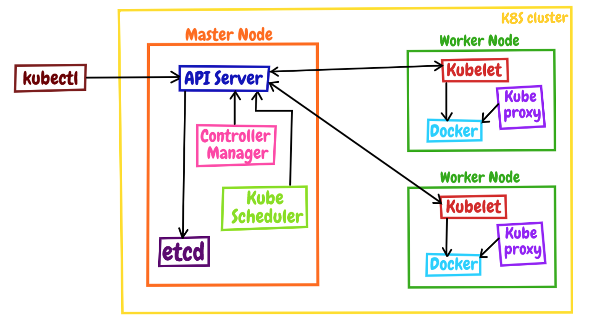

# 容器

**容器，就是一个特殊的隔离环境，它能够让进程只看到这个环境里的有限信息，不能对外界环境施加影响**

1. 容器就是操作系统里一个特殊的“沙盒”环境，里面运行的进程只能看到受限的信息，与外部系统实现了隔离。
2. 容器隔离的目的是为了系统安全，限制了进程能够访问的各种资源。
3. 相比虚拟机技术，容器更加轻巧、更加高效，消耗的系统资源非常少，在云计算时代极具优势。
4. 容器的基本实现技术是 Linux 系统里的 namespace、cgroup、chroot。

容器镜像是由多个只读的 Layer 构成的，同一个 Layer 可以被不同的镜像共享，减少了存储和传输的成本。

**只有 RUN, COPY, ADD 会生成新的镜像层，其它指令只会产生临时层**

## 编写Dockerfile的基本步骤：

1. **选择基础镜像：** 在Dockerfile的第一行，指定用作基础的镜像，通常是操作系统的一个发行版，如Alpine、Ubuntu等。
2. **设置工作目录：** 使用 `WORKDIR` 指令设置容器内的工作目录，这将影响后续指令的相对路径。
3. **复制文件：** 使用 `COPY` 或 `ADD` 指令将本地文件复制到容器内的指定路径。
4. **安装依赖：** 使用适合基础镜像的包管理工具（如`apt`、`apk`、`yum`等）安装所需的软件包和依赖。
5. **运行命令：** 使用 `RUN` 指令在容器内执行命令，例如安装软件包、配置环境等。
6. **设置环境变量：** 使用 `ENV` 指令设置容器内的环境变量。
7. **暴露端口：** 使用 `EXPOSE` 指令声明容器将监听的端口号。
8. **定义入口命令：** 使用 `CMD` 或 `ENTRYPOINT` 指令定义容器启动时要执行的命令。
9. **构建镜像：** 在Dockerfile所在的目录运行 `docker build` 命令来构建镜像，例如：`docker build -t imagename:tag .`。

* `RUN` 用于在构建阶段执行命令，对镜像进行修改。它在构建时执行，并生成一个新的镜像层。
* `ENTRYPOINT` 用于配置容器启动时的默认命令。它在运行容器时才起作用，定义了容器的主要执行程序。

通常，`RUN` 用于构建时的静态操作，而 `ENTRYPOINT` 用于指定容器的动态执行命令。在一个 Dockerfile 中，它们可以一起使用，但各自有着不同的目的和时机。

以下是一个简单的Dockerfile示例：

```shell
# 使用Alpine Linux作为基础镜像
FROM alpine:latest

# 设置工作目录
WORKDIR /app

# 复制应用程序文件到容器内
COPY app.py /app/

# 安装Python3
RUN apk add --no-cache python3

# 设置环境变量
ENV MY_ENV_VAR=myvalue

# 暴露端口
EXPOSE 80

# 定义入口命令
CMD ["python3", "app.py"]

```

## 入门导图


# K8S初级篇

## 基础概念

Kubernetes（K8s）是一个用于自动部署、扩展和管理容器化应用程序的开源容器编排平台。以下是一些 Kubernetes 中的重要概念：

1. **Pod（容器组）：**

   - Pod 是 Kubernetes 中最小的可部署单元，它包含一个或多个容器，它们共享相同的网络和存储空间。
2. **ReplicaSet：**

   - ReplicaSet 确保在集群中运行指定数量的 Pod 副本，它用于实现应用程序的横向扩展。
3. **Deployment：**

   - Deployment 是用于声明式管理 Pod 的高级控制器，它允许用户指定应用程序的期望状态，Kubernetes 将自动处理实际状态与期望状态之间的差异。
4. **Service：**

   - Service 定义了一组 Pod 的逻辑集合，并为这组 Pod 提供一个稳定的网络端点，以便其他应用程序可以访问它们。
5. **Namespace：**

   - Namespace 是用于将集群划分为多个虚拟集群的一种方式，它允许在同一物理集群中运行多个独立的环境。
6. **ConfigMap 和 Secret：**

   - ConfigMap 用于存储配置数据，而 Secret 用于存储敏感数据（如密码、API 密钥）。
7. **PersistentVolume 和 PersistentVolumeClaim：**

   - PersistentVolume 允许将持久化存储资源（如磁盘）抽象出来，而 PersistentVolumeClaim 用于声明对这些资源的需求。
8. **Ingress：**

   - Ingress 定义了从集群外部到集群内服务的规则，它允许对外暴露服务，并提供负载均衡、SSL 终止等功能。
9. **Node：**

   - Node 是集群中的一个工作节点，它可以是物理机器或虚拟机，负责运行容器和接收集群控制器的指令。
10. **Cluster：**

    - Cluster 是由一组 Node 组成的 Kubernetes 集群，包括控制平面和工作节点。
11. **Control Plane（控制平面）：**

    - 控制平面由多个组件组成，包括 API Server、Controller Manager、Scheduler 和 etcd（分布式键值存储），它们负责集群的管理和控制。

这些是 Kubernetes 中的一些核心概念，理解这些概念对于有效地使用和管理 Kubernetes 集群至关重要。

## 工作流程

Kubernetes 的大致工作流程了：

* 每个 Node 上的 kubelet 会定期向 apiserver 上报节点状态，apiserver 再存到 etcd 里。
* 每个 Node 上的 kube-proxy 实现了 TCP/UDP 反向代理，让容器对外提供稳定的服务。
* scheduler 通过 apiserver 得到当前的节点状态，调度 Pod，然后 apiserver 下发命令给某个 Node 的 kubelet，kubelet 调用 container-runtime 启动容器。
* controller-manager 也通过 apiserver 得到实时的节点状态，监控可能的异常情况，再使用相应的手段去调节恢复。

Kubernetes 能够在集群级别管理应用和服务器，可以认为是一种集群操作系统。它使用“控制面 / 数据面”的基本架构，Master 节点实现管理控制功能，Worker 节点运行具体业务。

Kubernetes由很多模块组成，可分为核心的组件和选配的插件两类。Master 里有 4 个组件，分别是 apiserver、etcd、scheduler、controller-manager。Node 里有 3 个组件，分别是kubelet、kube-proxy、container-runtime。通常必备的插件有 DNS 和 Dashboard。

## 节点

* 控制面的节点在 Kubernetes 里叫做 Master Node，一般简称为 Master，它是整个集群里最重要的部分，可以说是 Kubernetes 的大脑和心脏。
* 数据面的节点叫做 Worker Node，一般就简称为 Worker 或者 Node，相当于 Kubernetes 的手和脚，在 Master 的指挥下干活。



### master 节点

Master 里有 4 个组件，分别是 apiserver、etcd、scheduler、controller-manager。

1. apiserver 是 Master 节点——同时也是整个 Kubernetes 系统的唯一入口，它对外公开了一系列的 RESTful API，并且加上了验证、授权等功能，所有其他组件都只能和它直接通信，可以说是 Kubernetes
   里的联络员。
2. etcd 是一个高可用的分布式 Key-Value 数据库，用来持久化存储系统里的各种资源对象和状态，相当于 Kubernetes 里的配置管理员。注意它只与 apiserver 有直接联系，也就是说任何其他组件想要读写 etcd
   里的数据都必须经过 apiserver。
3. scheduler 负责容器的编排工作，检查节点的资源状态，把 Pod 调度到最适合的节点上运行，相当于部署人员。因为节点状态和 Pod 信息都存储在 etcd 里，所以 scheduler 必须通过 apiserver 才能获得。
4. controller-manager 负责维护容器和节点等资源的状态，实现故障检测、服务迁移、应用伸缩等功能，相当于监控运维人员。同样地，它也必须通过 apiserver 获得存储在 etcd 里的信息，才能够实现对资源的各种操作。


### worker节点

Node 里的 3 个组件了，分别是 kubelet、kube-proxy、container-runtime。

1. kubelet 是 Node 的代理，负责管理 Node 相关的绝大部分操作，Node 上只有它能够与 apiserver 通信，实现状态报告、命令下发、启停容器等功能，相当于是 Node 上的一个“小管家”。
2. kube-proxy 的作用有点特别，它是 Node 的网络代理，只负责管理容器的网络通信，简单来说就是为 Pod 转发 TCP/UDP 数据包，相当于是专职的“小邮差”。
3. container-runtime 我们就比较熟悉了，它是容器和镜像的实际使用者，在 kubelet 的指挥下创建容器，管理 Pod 的生命周期，是真正干活的“苦力”。


## YAML 文件

### 简单总结

* YAML 是 JSON 的超集，支持数组和对象，能够描述复杂的状态，可读性也很好。
* Kubernetes 把集群里的一切资源都定义为 API 对象，通过 RESTful 接口来管理。描述 API 对象需要使用 YAML 语言，必须的字段是 `apiVersion、kind、metadata`。
* 命令 `kubectl api-resources` 可以查看对象的 apiVersion 和 kind，命令 `kubectl explain` 可以查看对象字段的说明文档。
* 命令 `kubectl apply`、`kubectl delete` 发送 HTTP 请求，管理 API 对象。
* 使用参数`--dry-run=client -o yaml` 可以生成对象的 YAML 模板，简化编写工作。
* `kubectl get pod --v=9` 显示详细的命令执行过程，清楚地看到发出的 HTTP 请求

### yaml 示例

编写yaml文件。描述并创建API对象

```yaml
apiVersion: v1
kind: Pod
metadata:
  name: ngx-pod
  labels:
    env: demo
    owner: chrono

spec:
  containers:
    - image: nginx:alpine
      name: ngx
      ports:
        - containerPort: 80
```

可以把 API 对象的描述分成“header”和“body”两部分。

“header”包含的是 API 对象的基本信息，有三个字段：**apiVersion、kind、metadata**。

1. `apiVersion` 表示操作这种资源的 API 版本号。

由于 Kubernetes 的迭代速度很快，不同的版本创建的对象会有差异，为了区分这些版本就需要使用 apiVersion 这个字段，比如 v1、v1alpha1、v1beta1 等等。

2. `kind` 表示资源对象的类型，这个应该很好理解，比如 Pod、Node、Job、Service 等等。
3. `metadata` 这个字段顾名思义，表示的是资源的一些“元信息”，也就是用来标记对象，方便 Kubernetes 管理的一些信息。

**使用 kubectl apply、kubectl delete，再加上参数 -f，你就可以使用这个 YAML 文件，创建或者删除对象了：**

```shell
kubectl apply -f ngx-pod.yml
kubectl delete -f ngx-pod.yml
```

### 如何编写yaml文件：

命令 kubectl explain，它相当于是 Kubernetes 自带的 API 文档，会给出对象字段的详细说明，这样我们就不必去网上查找了。比如想要看 Pod 里的字段该怎么写，就可以这样：

```shell
kubectl explain pod
kubectl explain pod.metadata
kubectl explain pod.spec
kubectl explain pod.spec.containers
```

#### 一个技巧-生成标准的yaml示例文件

kubectl 的两个特殊参数 `--dry-run=client` 和 `-o yaml`，前者是空运行，后者是生成 YAML 格式，结合起来使用就会让 kubectl 不会有实际的创建动作，而只生成 YAML 文件。

```shell
# 例如，想要生成一个 Pod 的 YAML 样板示例，可以在 kubectl run 后面加上这两个参数：
# 就会生成一个绝对正确的 YAML 文件,随后根据需要，参考文档进行修改
kubectl run ngx --image=nginx:alpine --dry-run=client -o yaml
```

这个小技巧还可以再进化一下，把这段参数定义成 Shell 变量（名字任意，比如$do/$go，这里用的是$out），用起来会更省事，比如：

````shell
export out="--dry-run=client -o yaml"
kubectl run ngx --image=nginx:alpine $out
````

### yaml 图


## POD

### pod 常用命令

以下是一些常用的 `kubectl` 命令，用于操作 Pod：

1. **查看 Pod：**

   - `kubectl get pods`：显示所有 Pod。
   - `kubectl get pods -n [命名空间]`：显示特定命名空间中的所有 Pod。
2. **查看 Pod 详细信息：**

   - `kubectl describe pod [Pod名称]`：显示特定 Pod 的详细信息。
3. **查看 Pod 日志：**

   - `kubectl logs [Pod名称]`：查看 Pod 的日志。
   - `kubectl logs -f [Pod名称]`：实时跟踪 Pod 的日志。
4. **进入 Pod 内部：**

   - `kubectl exec -it [Pod名称] -- /bin/bash`：在 Pod 内部启动交互式 shell。
5. **在 Pod 中运行命令：**

   - `kubectl exec [Pod名称] -- [命令]`：在 Pod 内部执行单次命令，例如 `kubectl exec mypod -- ls /app`。
6. **删除 Pod：**

   - `kubectl delete pod [Pod名称]`：删除特定 Pod。
   - `kubectl delete pods --all`：删除所有 Pod。
7. **查看 Pod 中的环境变量：**

   - `kubectl exec [Pod名称] -- env`：查看 Pod 中运行的容器的环境变量。
8. **查看 Pod 中的资源使用情况：**

   - `kubectl top pod [Pod名称]`：查看特定 Pod 中的 CPU 和内存使用情况。
9. **复制文件到/从 Pod：**

   - `kubectl cp [本地文件路径] [Pod名称]:[目标路径]`：将本地文件复制到 Pod 内部。
   - `kubectl cp [Pod名称]:[源路径] [本地目标路径]`：从 Pod 内部复制文件到本地。

### pod示例

#### metadata

“metadata”一般写上 name 和 labels 就足够了。

#### spec

##### container

“containers”是一个数组，里面的每一个元素又是一个 container 对象，也就是容器。

* `name` 表示名称 （必须）
* `image` 使用的镜像（必须）
* ports：列出容器对外暴露的端口，和 Docker 的 -p 参数有点像。
* imagePullPolicy：指定镜像的拉取策略，可以是 Always/Never/IfNotPresent，一般默认是 IfNotPresent，也就是说只有本地不存在才会远程拉取镜像，可以减少网络消耗。
* env：定义 Pod 的环境变量，和 Dockerfile 里的 ENV 指令有点类似，但它是运行时指定的，更加灵活可配置。
* command：定义容器启动时要执行的命令，相当于 Dockerfile 里的 ENTRYPOINT 指令。
* args：它是 command 运行时的参数，相当于 Dockerfile 里的 CMD 指令，这两个命令和 Docker 的含义不同，要特别注意。

```yaml
apiVersion: v1
kind: Pod
metadata:
  name: busy-pod
  labels:
    owner: chrono
    env: demo
    region: north
    tier: back
spec:
  containers:
    - image: busybox:latest
      name: busy
      imagePullPolicy: IfNotPresent
      env:
        - name: os
          value: "ubuntu"
        - name: debug
          value: "on"
      command:
        - /bin/echo
      args:
        - "$(os), $(debug)"
```

### kubectl apply

`kubectl apply` 是 Kubernetes 中一个用于应用配置文件的命令。它可以用来创建、更新或删除资源，如 Pod、Service、Deployment 等。

**基本用法：**

```bash
kubectl apply -f [配置文件路径]
```

其中，`[配置文件路径]` 是指包含 Kubernetes 资源定义的 YAML 或 JSON 文件的路径。

```bash
kubectl apply -f my-pod.yaml
```

这个命令会将 `my-pod.yaml` 文件中定义的 Pod 配置应用到 Kubernetes 集群中。如果资源不存在，则创建新的资源；如果资源已经存在，则更新现有资源的配置。

`kubectl apply` 的优势在于它是一种声明式的方式来定义资源状态。你只需描述你想要的最终状态，而不用关心如何达到这个状态，Kubernetes 会负责处理资源的创建、更新和删除。

**注意事项：**

- 如果你的配置文件包含多个资源定义，`kubectl apply` 会一次性应用所有资源。
- 在更新资源时，`kubectl apply` 会根据新的配置文件进行智能合并，以确保资源的最终状态符合你所期望的状态。

### Pod 为中心的 Kubernetes 资源对象关系图


## Job and CronJob-离线业务

Job 和 CronJob，它们就组合了 Pod，实现了对离线业务的处理

离线业务就是：必定会退出，不会无期限地运行下去，所以它的调度策略也就与“在线业务”存在很大的不同，需要考虑运行超时、状态检查、失败重试、获取计算结果等管理事项。

**CronJob 使用定时规则控制 Job，**

**Job 使用并发数量控制 Pod，**

**Pod 再定义参数控制容器，容器再隔离控制进程，进程最终实现业务功能**

1. Pod 是 Kubernetes 的最小调度单元，但为了保持它的独立性，不应该向它添加多余的功能。
2. Kubernetes 为离线业务提供了 Job 和 CronJob 两种 API 对象，分别处理“临时任务”和“定时任务”。
3. Job 的关键字段是 spec.template，里面定义了用来运行业务的 Pod 模板，其他的重要字段有 completions、parallelism 等
4. CronJob 的关键字段是 spec.jobTemplate 和 spec.schedule，分别定义了 Job 模板和定时运行的规则。

### **如何使用 YAML 描述 Job**

“文件头”部分还是那几个必备字段：

* apiVersion 不是 `v1`，而是 `batch/v1`。
* kind 是 Job，这个和对象的名字是一致的。
* metadata 里仍然要有 `name` 标记名字，也可以用 `labels` 添加任意的标签。

#### kubectl create job

因为 `kubectl run` 只能创建 Pod，要创建 Pod 以外的其他 API 对象，需要使用命令 `kubectl create`，再加上对象的类型名。

```shell
export out="--dry-run=client -o yaml"              # 定义Shell变量
kubectl create job echo-job --image=busybox $out
```

生成后根据需要修改

```yaml
apiVersion: batch/v1
kind: Job
metadata:
  name: echo-job

spec:
  template:
    spec:
      restartPolicy: OnFailure
      containers:
        - image: busybox
          name: echo-job
          imagePullPolicy: IfNotPresent
          command: [ "/bin/echo" ]
          args: [ "hello", "world" ]
```

**Job 对象里应用了组合模式**，template 字段定义了一个“应用模板”，里面嵌入了一个 Pod，这样 Job 就可以从这个模板来创建出 Pod。这个pod受job管理，不直接和 apiserver 打交道，也就没必要重复 apiVersion 等“头字段”。

`restartPolicy` 是：确定 Pod 运行失败时的策略。

OnFailure 是失败原地重启容器，而 Never 则是不重启容器，让 Job 去重新调度生成一个新的 Pod。


### 操作Job

```shell
kubectl apply -f job.yml #创建job对象
# 查看状态
kubectl get job
kubectl get pod 
```

**控制离线作业的重要字段**

要注意这 4 个字段并不在 template 字段下，而是在 spec 字段下，所以它们是属于 Job 级别的，用来控制模板里的 Pod 对象。

1. `activeDeadlineSeconds`，设置 Pod 运行的超时时间。
2. `backoffLimit`，设置 Pod 的失败重试次数。
3. `completions`，Job 完成需要运行多少个 Pod，默认是 1 个。
4. `parallelism`，它与 completions 相关，表示允许并发运行的 Pod 数量，避免过多占用资源。

#### 例子：

```yaml
apiVersion: batch/v1
kind: Job
metadata:
  name: sleep-job

spec:
  activeDeadlineSeconds: 15
  backoffLimit: 2
  completions: 4
  parallelism: 2

  template:
    spec:
      restartPolicy: OnFailure
      containers:
        - image: busybox
          name: echo-job
          imagePullPolicy: IfNotPresent
          command:
            - sh
            - -c
            - sleep $(($RANDOM % 10 + 1)) && echo done
```

```shell
kubectl apply -f sleep-job.yml
kubectl get pod -w # 试试观察pod状态
```

### YAML描述CronJob

* 因为 CronJob 的名字有点长，所以 Kubernetes 提供了简写 cj，这个简写也可以使用命令 `kubectl api-resources` 看到；
* CronJob 需要定时运行，所以我们在命令行里还需要指定参数 `--schedule`。

```shell
export out="--dry-run=client -o yaml"              # 定义Shell变量
kubectl create cj echo-cj --image=busybox --schedule="" $out
```

#### cronjob例子：

```yaml
apiVersion: batch/v1
kind: CronJob
metadata:
  name: echo-cj

spec:
  schedule: '*/1 * * * *'
  jobTemplate:
    spec:
      template:
        spec:
          restartPolicy: OnFailure
          containers:
            - image: busybox
              name: echo-cj
              imagePullPolicy: IfNotPresent
              command: [ "/bin/echo" ]
              args: [ "hello", "world" ]
```

我们还是重点关注它的 spec 字段，你会发现它居然连续有三个 spec 嵌套层次：

1. 第一个 `spec` 是 CronJob 自己的对象规格声明
2. 第二个`spec` 从属于“jobTemplate”，**它定义了一个 Job 对象**
3. 第三个 `spec` 从属于“template”，它**定义了 Job 里运行的 Pod**。

* `schedule`，用来定义任务周期运行的规则。它使用的是标准的 Cron 语法，指定分钟、小时、天、月、周，和 Linux 上的 crontab 是一样的。


#### 操作cronjob

```shell
kubectl apply -f cronjob.yml
kubectl get cj
kubectl get pod
```

## 配置 ConfigMap/Secret

### 要点

* ConfigMap 记录了一些 Key-Value 格式的字符串数据，描述字段是“data”，不是“spec”。
* Secret 与 ConfigMap 很类似，也使用“data”保存字符串数据，但它要求数据必须是 Base64 编码，起到一定的保密效果。
* 在 Pod 的“env.valueFrom”字段中可以引用 ConfigMap 和 Secret，把它们变成应用可以访问的环境变量。
* 在 Pod 的“spec.volumes”字段中可以引用 ConfigMap 和 Secret，把它们变成存储卷，然后在“spec.containers.volumeMounts”字段中加载成文件的形式。
* ConfigMap 和 Secret 对存储数据的大小没有限制(1MB)，但小数据用环境变量比较适合，大数据应该用存储卷，可根据具体场景灵活应用。

### ConfigMap-明文信息

#### 创建样板

```shell
export out="--dry-run=client -o yaml"        # 定义Shell变量
kubectl create cm info $out
kubectl create cm info --from-literal=k=v $out // 生成带有data字段的样板
```

```yaml
# cm.yml
apiVersion: v1
kind: ConfigMap
metadata:
  name: info

data:
  count: '10'
  debug: 'on'
  path: '/etc/systemd'
  greeting: |
    say hello to kubernetes.
```

```shell
kubectl apply -f cm.yml
kubectl get cm
kubectl describe cm info # 查看状态
```

### Secret-机密信息

会对数据进行简单的编码，使用Base64

创建 YAML 样板的命令是 `kubectl create secret generic`

```shell
kubectl create secret generic user --from-literal=name=root $out
```

```yaml
# secret.yaml
apiVersion: v1
kind: Secret
metadata:
  name: user

data:
  name: cm9vdA==  # root
  pwd: MTIzNDU2   # 123456
  db: bXlzcWw=    # mysql
```

```shell
echo -n "123456" | base64
MTIzNDU2
```

```shell
kubectl apply  -f secret.yml
kubectl get secret
kubectl describe secret user #kubectl describe 不能直接看到内容，只能看到数据的大小
```

### 如何使用：环境变量和加载文件

#### 环境变量

`valueFrom`字段指定了环境变量值的来源，可以是`configMapKeyRef`或者`secretKeyRef`

#### 示例

```yaml
apiVersion: v1
kind: Pod
metadata:
  name: env-pod

spec:
  containers:
    - env:
        - name: COUNT
          valueFrom:
            configMapKeyRef:
              name: info
              key: count
        - name: GREETING
          valueFrom:
            configMapKeyRef:
              name: info
              key: greeting
        - name: USERNAME
          valueFrom:
            secretKeyRef:
              name: user
              key: name
        - name: PASSWORD
          valueFrom:
            secretKeyRef:
              name: user
              key: pwd

      image: busybox
      name: busy
      imagePullPolicy: IfNotPresent
      command: [ "/bin/sleep", "300" ]
```

解释：

定义了 4 个环境变量，`COUNT`、`GREETING`、`USERNAME`、`PASSWORD`。

1. 对于明文配置数据

`COUNT`、`GREETING` 引用的是 ConfigMap 对象，所以使用字段`configMapKeyRef`，**里面的“name”是 ConfigMap
对象的名字(configmap 的metadata的name)**，也就是之前我们创建的“info”，而“key”字段分别是“info”对象里的 count 和 greeting。

2. 对于机密配置数据

`USERNAME`、`PASSWORD` 引用的是 Secret 对象，要使用字段“secretKeyRef”，再用“name”指定 Secret 对象的名字 user，用“key”字段应用它里面的 name 和 pwd。

#### 关系图


进行验证：

```shell
kubectl apply -f env-pod.yml
kubectl exec -it env-pod -- sh

echo $COUNT
echo $GREETING
echo $USERNAME $PASSWORD
```

### Volume方式使用

Kubernetes 为 Pod 定义了一个“Volume”的概念，可以翻译成是“存储卷”。如果把 Pod 理解成是一个虚拟机，那么 Volume 就相当于是虚拟机里的磁盘。

**要注意的是 Volume 属于 Pod，不属于容器，所以它和字段“containers”是同级的，都属于“spec”。**

需要先定义两个volume，分别引用 ConfigMap 和 Secret。随后进行挂载到指定目录下， pod挂载的时候，需要明确指出 挂载路径和 Volume的名字。

#### 示例：

```yaml
apiVersion: v1
kind: Pod
metadata:
  name: vol-pod

spec:
  volumes:
    - name: cm-vol
      configMap:
        name: info
    - name: sec-vol
      secret:
        secretName: user

  containers:
    - volumeMounts:
        - mountPath: /tmp/cm-items
          name: cm-vol
        - mountPath: /tmp/sec-items
          name: sec-vol

      image: busybox
      name: busy
      imagePullPolicy: IfNotPresent
      command: [ "/bin/sleep", "300" ]
```

#### 关系图


验证

```shell
kubectl apply -f vol-pod.yml
kubectl get pod
kubectl exec -it vol-pod -- sh
```

你会看到，ConfigMap 和 Secret 都变成了目录的形式，而它们里面的 Key-Value 变成了一个个的文件，而文件名就是 Key。

#### 好处：

以 Volume 的概念统一抽象了所有的存储，不仅现在支持 ConfigMap/Secret，以后还能够支持临时卷、持久卷、动态卷、快照卷等许多形式的存储，扩展性非常好。

### 使用对比

以 Volume 的方式来使用 ConfigMap/Secret，就和环境变量不太一样。环境变量用法简单，更适合存放**简短的字符串**，而 Volume 更适合存放**大数据量**的配置文件，在 Pod 里加载成文件后让应用直接读取使用。

小结

两种在 Kubernetes 里管理配置信息的 API 对象 ConfigMap 和 Secret，它们分别代表了明文信息和机密敏感信息，存储在 etcd 里，在需要的时候可以注入 Pod 供 Pod 使用。

## 导图


# 中级

## Deployment-在线业务，管理pod

Deployment 的简称是“deploy”，

`apiVersion` 是“apps/v1”，

`kind` 是“Deployment”。

Deployment，它表示的是在线业务，和 Job/CronJob 的结构类似，也包装了 Pod 对象，通过添加额外的控制功能实现了**应用永不宕机**

1. Pod 只能管理容器，不能管理自身，所以就出现了 Deployment，由它来管理 Pod。
2. Deployment 里有三个关键字段，其中的 template 和 Job 一样，定义了要运行的 Pod 模板。
3. replicas 字段定义了 Pod 的“期望数量”，Kubernetes 会自动维护 Pod 数量到正常水平。
4. selector 字段定义了基于 labels 筛选 Pod 的规则，它必须与 template 里 Pod 的 labels 一致。
5. 创建 Deployment 使用命令 kubectl apply，应用的扩容、缩容使用命令 kubectl scale。

### 示例

创建模版文件

```shell
export out="--dry-run=client -o yaml"
kubectl create deploy ngx-dep --image=nginx:alpine $out
```

```yaml
apiVersion: apps/v1
kind: Deployment
metadata:
  labels:
    app: ngx-dep
  name: ngx-dep

spec:
  replicas: 2
  selector:
    matchLabels:
      app: ngx-dep

  template:
    metadata:
      labels:
        app: ngx-dep
    spec:
      containers:
        - image: nginx:alpine
          name: nginx
```

### 关键字段

#### replicas-副本数量

#### selector-筛选出被管理的pod

**下属的字段`matchLabels`定义了 Pod 对象应该携带的 label，它必须和`template`里 Pod 定义的“labels”完全相同**。否则 Deployment 就会找不到要控制的 Pod 对象，apiserver 也会告诉你 YAML 格式校验错误无法创建。

**原因**：Deployment 和 Pod 实际上是一种松散的组合关系，Deployment 实际上并不“持有”Pod 对象，它只是帮助 Pod 对象能够有足够的副本数量运行，仅此而已。

Kubernetes 采用的是这种“贴标签”的方式，通过在 API 对象的“metadata”元信息里加各种标签（labels），我们就可以使用类似关系数据库里查询语句的方式，筛选出具有特定标识的那些对象。**通过标签这种设计，Kubernetes 就解除了 Deployment 和模板里 Pod 的强绑定，把组合关系变成了“弱引用”。**

为了保证 Deployment 成功创建，我们必须在 YAML 里把 label 重复写两次：

一次是在“selector.matchLabels”，

另一次是在“template.matadata”。

像在这里，你就要在这两个地方连续写`app: ngx-dep ：`

##### 关系图：


### 使用Deployment

创建对象：

```shell
kubectl apply -f deploy.yml
kubectl get deploy # 查看状态
```


字段解释：

* READY 表示运行的 Pod 数量，前面的数字是当前数量，后面的数字是期望数量，所以“2/2”的意思就是要求有两个 Pod 运行，现在已经启动了两个 Pod。
* UP-TO-DATE 指的是当前已经更新到最新状态的 Pod 数量。因为如果要部署的 Pod 数量很多或者 Pod 启动比较慢，Deployment 完全生效需要一个过程，UP-TO-DATE 就表示现在有多少个 Pod
  已经完成了部署，达成了模板里的“期望状态”。
* AVAILABLE 要比 READY、UP-TO-DATE 更进一步，不仅要求已经运行，还必须是健康状态，能够正常对外提供服务，它才是我们最关心的 Deployment 指标。
* 最后一个 AGE 就简单了，表示 Deployment 从创建到现在所经过的时间，也就是运行的时间。

最后查看pod，需要用 `kubectl get pod` 命令来看看 Pod 的状态：

### 应用伸缩-调整pod数量

kubectl scale 是命令式操作，**扩容和缩容只是临时的措施**, 最好是更改yaml文件，

```shell
kubectl scale --replicas=5 deploy ngx-dep # Nginx 应用扩容到了 5 个
```

#### label

在yaml文件中给贴了各种标签，可以通过标签查找 `-l`

根据label查看对象

```shell
kubectl get pod -l app=nginx
kubectl get pod -l 'app in (ngx, nginx, ngx-dep)'
```

## DaemonSet- 守护进程集

DaemonSet，它会在 Kubernetes 集群的每个节点上都运行一个 Pod，就好像是 Linux 系统里的“守护进程”（Daemon）。

Deployment 并不关心这些 Pod 会在集群的哪些节点上运行，在它看来，Pod 的运行环境与功能是无关的，只要 Pod 的数量足够，应用程序应该会正常工作。

但是有一些业务比较特殊，它们不是完全独立于系统运行的，而是与主机存在“绑定”关系，必须要依附于节点才能产生价值，比如说：

* 网络应用（如 kube-proxy），必须每个节点都运行一个 Pod，否则节点就无法加入 Kubernetes 网络。
* 监控应用（如 Prometheus），必须每个节点都有一个 Pod 用来监控节点的状态，实时上报信息。
* 日志应用（如 Fluentd），必须在每个节点上运行一个 Pod，才能够搜集容器运行时产生的日志数据。
* 安全应用，同样的，每个节点都要有一个 Pod 来执行安全审计、入侵检查、漏洞扫描等工作。

DaemonSet 的目标是在集群的**每个节点上运行且仅运行一个 Pod**，就好像是为节点配上一只“看门狗”，忠实地“守护”着节点，这就是 DaemonSet 名字的由来。

#### 要点

1. DaemonSet 的目标是为集群里的每个节点部署唯一的 Pod，常用于监控、日志等业务。
2. DaemonSet 的 YAML 描述与 Deployment 非常接近，只是没有 replicas 字段。
3. “污点”和“容忍度”是与 DaemonSet 相关的两个重要概念，分别从属于 Node 和 Pod，共同决定了 Pod 的调度策略。
4. 静态 Pod 也可以实现和 DaemonSet 同样的效果，但它不受 Kubernetes 控制，必须在节点上纯手动部署，应当慎用。

### 创建方法

不支持使用`kubectl create`创建模版文件，选取折中的方案

选取网上样本进行修改：

```yaml
apiVersion: apps/v1
kind: DaemonSet
metadata:
  name: redis-ds
  labels:
    app: redis-ds

spec:
  selector:
    matchLabels:
      name: redis-ds

  template:
    metadata:
      labels:
        name: redis-ds
    spec:
      containers:
        - image: redis:5-alpine
          name: redis
          ports:
            - containerPort: 6379
      tolerations:
        #容忍度
        - key: node-role.kubernetes.io/master
      effect: NoSchedule
      operator: Exists
```

#### Deployment VS DamonSet


#### 第二张方案：

你只需要用 `kubectl create` 先创建出一个 Deployment 对象，然后把 kind 改成 DaemonSet，再删除 `spec.replicas` 就行了，比如：

```shell
export out="--dry-run=client -o yaml"

# change "kind" to DaemonSet
kubectl create deploy redis-ds --image=redis:5-alpine $out
```

### 使用DaemonSet

```shell
kubectl apply -f ds.yml
```

因为我们的实验环境里有一个 Master 一个 Worker，而 Master 默认是不跑应用的，所以 DaemonSet 就只生成了一个 Pod，运行在了“worker”节点上。

### 什么是污点（taint）和容忍度（toleration）

Kubernetes 在创建集群的时候会自动给节点 Node 加上一些“污点”，方便 Pod 的调度和部署。你可以用 kubectl describe node 来查看 Master 和 Worker 的状态：

```shell
//master
kubectl describe node master

Name:     master
Roles:    control-plane,master
...
Taints:   node-role.kubernetes.io/master:NoSchedule
...

// worker
kubectl describe node worker

Name:     worker
Roles:    <none>
...
Taints:   <none>
...
```

可以看到：Master 节点默认有一个 `taint`，名字是 `node-role.kubernetes.io/master`，它的效果是 `NoSchedule`，也就是说这个污点会拒绝 Pod 调度到本节点上运行，而 Worker 节点的`taint` 字段则是空的。

这正是 Master 和 Worker 在 Pod 调度策略上的区别所在，通常来说 Pod 都不能容忍任何“污点”，所以加上了 taint 属性的 Master 节点也就会无缘 Pod 了。

#### 如何将DaemonSet在Master节点运行

##### 去掉污点（taint）

第一种方法是去掉 Master 节点上的 taint，让 Master 变得和Worker 一样“纯洁无瑕”，DaemonSet 自然就不需要再区分 Master/Worker。

操作 Node 上的“污点”属性需要使用命令 `kubectl taint`，然后指定节点名、污点名和污点的效果，去掉污点要额外加上一个 `-`。

```shell
// Master 节点的“NoSchedule”
kubectl taint node master node-role.kubernetes.io/master:NoSchedule-
```

DaemonSet **一直在监控集群节点**的状态，命令执行后 Master 节点已经没有了“污点”，所以它立刻就会发现变化，然后就会在 Master 节点上创建一个“守护”Pod。

##### 添加 tolerations

第二种方法，为 Pod 添加字段 tolerations，让它能够“容忍”某些“污点”，就可以在任意的节点上运行了。

如果我们想让 DaemonSet 里的 Pod 能够在 Master 节点上运行，就要写出这样的一个 tolerations，容忍节点的 `node-role.kubernetes.io/master:NoSchedule` 这个污点：

```yaml
tolerations:
  - key: node-role.kubernetes.io/master
    effect: NoSchedule
    operator: Exists
```

添加容忍度的方法 后需要重新部署

容忍度是从属于pod的，可以在Job/CronJob、Deployment 里为它们管理的 Pod 也加上 tolerations，从而能够更灵活地调度应用。

tolerations 与 containers在同一层级

示例：

```yaml
apiVersion: v1
kind: Pod
metadata:
  name: nginx
  labels:
    env: test
spec:
  containers:
  - name: nginx
    image: nginx
    imagePullPolicy: IfNotPresent
  tolerations:
  - key: "example-key"
    operator: "Exists"
    effect: "NoSchedule"

```

## Service

Service，它是集群内部的负载均衡机制，用来解决服务发现的关键问题。主要用于服务发现，实现负载均衡。

### 基本原理：

Kubernetes 会给它分配一个静态 IP 地址，然后它再去自动管理、维护后面动态变化的 Pod 集合，当客户端访问 Service，它就根据某种策略，把流量转发给后面的某个 Pod。

**这里 Service 使用了 iptables 技术**，每个节点上的 kube-proxy 组件自动维护 iptables 规则，客户不再关心 Pod 的具体地址，只要访问 Service 的固定 IP 地址，Service 就会根据iptables 规则转发请求给它管理的多个 Pod，是典型的负载均衡架构。


### 要点

* Pod 的生命周期很短暂，会不停地创建销毁，所以就需要用 Service 来实现负载均衡，它由 Kubernetes 分配固定的 IP 地址，能够屏蔽后端的 Pod 变化。
* Service 对象使用与 Deployment、DaemonSet 相同的“selector”字段，选择要代理的后端 Pod，是松耦合关系。
* 基于 DNS 插件，我们能够以域名的方式访问 Service，比静态 IP 地址更方便。
* 名字空间是 Kubernetes 用来隔离对象的一种方式，实现了逻辑上的对象分组，Service 的域名里就包含了名字空间限定。
* Service 的默认类型是“ClusterIP”，只能在集群内部访问，如果改成“NodePort”，就会在节点上开启一个随机端口号，让外界也能够访问内部的服务。

### 如何yaml描述Service

#### 自动创建-kubectl expose

使用`kubectl expose`创建模版yaml

因为在 Kubernetes 里提供服务的是 Pod，而 Pod 又可以用 Deployment/DaemonSet 对象来部署，所以 kubectl expose 支持从多种对象创建服务，Pod、Deployment、DaemonSet 都可以。

用参数 `--port` 和 `--target-port` 分别指定映射端口和容器端口

```shell
export out="--dry-run=client -o yaml"
kubectl expose deploy ngx-dep --port=80 --target-port=80 $out
```

#### yaml 示例

```yaml
apiVersion: v1
kind: Service
metadata:
  name: ngx-svc

spec:
  selector:
    app: ngx-dep

  ports:
    - port: 80
      targetPort: 80
      protocol: TCP
```

两个关键字 `selector` 和 `ports`

selector 和 Deployment/DaemonSet 里的作用是一样的，用来过滤出要代理的那些 Pod。因为我们**指定要代理 Deployment**，所以 Kubernetes 就为我们自动填上了 ngx-dep 的标签，**会选择这个 Deployment 对象部署的所有 Pod(其实是pod的labels，因为一个deoloyment中pod名称是一致的)**。

ports 就很好理解了，里面的三个字段分别表示外部端口、内部端口和使用的协议，在这里就是内外部都使用 80 端口，协议是 TCP。

两者之间的关系


### 使用步骤

**1.首先，我们创建一个 ConfigMap，定义一个 Nginx 的配置片段**，

它会输出服务器的地址、主机名、请求的 URI 等基本信息：

```yaml
apiVersion: v1
kind: ConfigMap
metadata:
  name: ngx-conf

data:
  default.conf: |
    server {
      listen 80;
      location / {
        default_type text/plain;
        return 200
          'srv : $server_addr:$server_port\nhost: $hostname\nuri : $request_method $host $request_uri\ndate: $time_iso8601\n';
      }
    }
```

2.然后我们在 Deployment 的“template.volumes”里定义存储卷，再用“volumeMounts”把配置文件加载进 Nginx 容器里：

```yaml
apiVersion: apps/v1
kind: Deployment
metadata:
  name: ngx-dep

spec:
  replicas: 2
  selector:
    matchLabels:
      app: ngx-dep

  template:
    metadata:
      labels:
        app: ngx-dep
    spec:
      volumes:
        - name: ngx-conf-vol
          configMap:
            name: ngx-conf

      containers:
        - image: nginx:alpine
          name: nginx
          ports:
            - containerPort: 80

          volumeMounts:
            - mountPath: /etc/nginx/conf.d
              name: ngx-conf-vol
```

3. 创建Service 对象
   ```shell
   kubectl apply -f svc.yml
   ```

查看状态：

```shell
kubectl get svc # svc是service缩写
kubectl describe svc ngx-svc 查看这个service代理哪些pod
```

测试负载均衡效果

```shell
kubectl exec -it ngx-dep-6796688696-r2j6t -- sh # 进入pod内部
curl 10.103.56.213 # 这个service的ip地址
```

在 Pod 里，用 curl 访问 **Service 的 IP 地址**，就会看到它把数据转发给后端的 Pod，输出信息会显示具体是哪个 Pod 响应了请求，就表明 Service 确实完成了对 Pod 的负载均衡任务。

另外：Service 的 IP 地址是“虚”的，只用于转发流量

#### 如何使用域名访问

查看当前集群里都有哪些名字空间

```shell
kubectl get ns
```

Kubernetes 有一个默认的名字空间，叫“default”，如果不显式指定，API 对象都会在这个“default”名字空间里。而其他的名字空间都有各自的用途，比如“kube-system”就包含了 apiserver、etcd 等核心组件的 Pod。

Service 对象的域名完全形式是**对象.名字空间.svc.cluster.local**，但很多时候也可以省略后面的部分，直接写“**对象.名字空间**”甚至“**对象名**”就足够了，默认会使用对象所在的名字空间（比如这里就是 default）。

现在我们来试验一下 DNS 域名的用法，还是先 kubectl exec 进入 Pod，然后用 curl 访问 ngx-svc、ngx-svc.default 等域名：

（顺便说一下，Kubernetes 也为每个 Pod 分配了域名，形式是“IP 地址. 名字空间.pod.cluster.local”，但需要把 IP 地址里的 . 改成 - 。比如地址 10.10.1.87，它对应的域名就是10-10-1-87.default.pod。）

#### 如何让 Service 对外暴露服务

在集群pod上面对外暴露端口(master节点是没有的，所以访问不了，因为pod都在worker节点上来)

如果我们在使用命令 `kubectl expose` 的时候加上参数 `--type=NodePort`，或者在 YAML 里添加字段 `type:NodePort`，那么 Service 除了会对后端的 Pod做负载均衡之外，还会在集群里的每个节点上创建一个独立的端口，用这个端口对外提供服务，这也正是“NodePort”这个名字的由来。


## Ingress-七层负载-流量总入口

Kubernetes（K8s）中的 Ingress 是一种 API 对象，用于管理集群中服务的外部访问。Ingress 允许你定义规则，将外部流量引导到集群内部的服务。它提供了一种灵活的方式来配置 HTTP 和 HTTPS 路由，并支持负载均衡、SSL 终止、路径基础的路由等功能

1. Service 是四层负载均衡，能力有限，所以就出现了 Ingress，它基于 HTTP/HTTPS 协议定义路由规则。
2. Ingress 只是规则的集合，自身不具备流量管理能力，需要 Ingress Controller 应用 Ingress 规则才能真正发挥作用。
3. Ingress Class 解耦了 Ingress 和 Ingress Controller，我们应当使用 Ingress Class 来管理 Ingress 资源。
4. 最流行的 Ingress Controller 是 Nginx Ingress Controller，它基于经典反向代理软件 Nginx。

### Ingress、IngressClass 和 Ingress Controller

Ingress、IngressClass 和 Ingress Controller 是 Kubernetes 中用于管理集群中服务外部访问的三个关键概念。让我分别解释一下：

1. **Ingress（入口）：**

   - Ingress 是 Kubernetes 中的 API 对象，用于定义将外部流量引导到集群内服务的规则。它定义了外部请求的路由规则、TLS 终止、负载均衡等设置。Ingress 提供了一种灵活的方式来配置 HTTP 和 HTTPS 的路由。
2. **Ingress Class（入口类）：**

   - Ingress Class 是 Kubernetes 中的 API 对象，用于标识 Ingress 控制器的类型。不同的 Ingress 控制器可以支持不同的功能和特性，Ingress Class 允许你为每个 Ingress 对象指定所使用的 Ingress 控制器。通过 Ingress Class，你可以定义不同 Ingress 对象使用不同的控制器。
3. **Ingress Controller（入口控制器）：**

   - Ingress Controller 是一个运行在集群中的软件组件，负责实现 Ingress 规则。它监听 Ingress 对象的变化，并根据规则配置负载均衡、路由等。不同的 Ingress 控制器实现可能会有不同的功能，例如 Nginx Ingress Controller、Traefik、HAProxy 等。

通过这三个概念的结合，Kubernetes 提供了一种灵活的方式来管理集群中服务的外部访问。

**Ingress 定义规则，Ingress Class 标识使用哪个控制器，而 Ingress Controller 则负责将这些规则转化为实际的负载均衡和路由配置**。这种分层的设计允许集群管理员根据需要选择和配置适合其需求的 Ingress 控制器。

### Ingress yaml描述

Ingress 也是可以使用 kubectl create 来创建样板文件的，和 Service 类似，它也需要用两个附加参数：

* `--class`，指定 Ingress 从属的 Ingress Class 对象。
* `--rule`，指定路由规则，基本形式是“URI=Service”，也就是说是访问 HTTP 路径就转发到对应的 Service 对象，再由 Service 对象转发给后端的 Pod。

```shell
export out="--dry-run=client -o yaml"
kubectl create ing ngx-ing --rule="ngx.test/=ngx-svc:80" --class=ngx-ink $out
```

生成的模版文件：

```yaml
apiVersion: networking.k8s.io/v1
kind: Ingress
metadata:
  name: ngx-ing

spec:

  ingressClassName: ngx-ink

  rules:
    - host: ngx.test
      http:
        paths:
          - path: /
            #精确匹配（Exact）或者是前缀匹配（Prefix）
            pathType: Exact
            backend:
              service:
                name: ngx-svc
                port:
                  number: 80
```

### IngressClass yaml描述

其实 Ingress Class 本身并没有什么实际的功能，**只是起到联系 Ingress 和 Ingress Controller 的作用**，所以它的定义非常简单，在“spec”里只有一个必需的字段“controller”，表示要使用哪个 Ingress Controller，具体的名字就要看实现文档了。

```yaml
apiVersion: networking.k8s.io/v1
kind: IngressClass
metadata:
  name: ngx-ink

spec:
  controller: nginx.org/ingress-controller  #使用Nginx 开发的 Ingress Controller
```

## ingress 和ingress class关系图


## 在kubernetes使用

因为 Ingress Class 很小，上面两个yaml可以合成一个。

```yaml
apiVersion: networking.k8s.io/v1
kind: IngressClass
metadata:
  name: ngx-ink

spec:
  controller: nginx.org/ingress-controller
---
apiVersion: networking.k8s.io/v1
kind: Ingress
metadata:
  name: ngx-ing
  annotations:
    #轮询算法
    nginx.org/lb-method: round_robin
spec:

  ingressClassName: ngx-ink

  rules:
    - host: ngx.test
      http:
        paths:
          - path: /
            pathType: Exact
            backend:
              service:
                name: ngx-svc
                port:
                  number: 80
```

#### 命令：

```shell
kubectl apply -f ingress.yml
#查看状态
kubectl get ingressclass
kubectl get ing
kubectl describe ing ngx-ing #查看详情
```

### Ingress Controller

使用Ingress Controller 前期准备 已经放在 `k8s多集群布置/ingress/setup.sh`

```shell
kubectl apply -f common/ns-and-sa.yaml
kubectl apply -f rbac/rbac.yaml
kubectl apply -f common/nginx-config.yaml
kubectl apply -f common/default-server-secret.yaml
```

* 前两条命令为 Ingress Controller 创建了一个独立的名字空间“nginx-ingress”，还有相应的账号和权限，这是为了访问 apiserver 获取 Service、Endpoint 信息用的；
* 后两条则是创建了一个 ConfigMap 和 Secret，用来配置 HTTP/HTTPS 服务。

kic.yml使用官网的并对其进行来一些修改

* metadata 里的 name 要改成自己的名字，比如 ngx-kic-dep。
* spec.selector 和 template.metadata.labels 也要修改成自己的名字，比如还是用 ngx-kic-dep。
* containers.image 可以改用 apline 版本，加快下载速度，比如 nginx/nginx-ingress:2.2-alpine。
* 最下面的 args 要加上 -ingress-class=ngx-ink，也就是前面创建的 Ingress Class 的名字，这是让 Ingress Controller 管理 Ingress 的关键。

### 创建 `kic.yml`

```yaml
apiVersion: apps/v1
kind: Deployment
metadata:
  name: ngx-kic-dep
  namespace: nginx-ingress
spec:
  replicas: 1
  selector:
    matchLabels:
      app: ngx-kic-dep
  template:
    metadata:
      labels:
        app: ngx-kic-dep
        app.kubernetes.io/name: nginx-ingress
    spec:
      serviceAccountName: nginx-ingress
      automountServiceAccountToken: true
      securityContext:
        seccompProfile:
          type: RuntimeDefault
      containers:
        - image: nginx/nginx-ingress:2.2-alpine
          imagePullPolicy: IfNotPresent
          name: nginx-ingress
          ports:
            - name: http
              containerPort: 80
            - name: https
              containerPort: 443
            - name: readiness-port
              containerPort: 8081
            - name: prometheus
              containerPort: 9113
          readinessProbe:
            httpGet:
              path: /nginx-ready
              port: readiness-port
            periodSeconds: 1
          resources:
            requests:
              cpu: "100m"
              memory: "128Mi"
            #limits:
            #  cpu: "1"
            #  memory: "1Gi"
          securityContext:
            allowPrivilegeEscalation: true
            #          readOnlyRootFilesystem: true
            runAsUser: 101 #nginx
            runAsNonRoot: true
            capabilities:
              drop:
                - ALL
              add:
                - NET_BIND_SERVICE
          env:
            - name: POD_NAMESPACE
              valueFrom:
                fieldRef:
                  fieldPath: metadata.namespace
            - name: POD_NAME
              valueFrom:
                fieldRef:
                  fieldPath: metadata.name
          args:
            - --ingress-class=ngx-ink
            - -health-status
            - -ready-status
            - -nginx-status
            - -nginx-configmaps=$(POD_NAMESPACE)/nginx-config
            - -default-server-tls-secret=$(POD_NAMESPACE)/default-server-secret

```

注意 Ingress Controller 位于名字空间“nginx-ingress”，所以查看状态需要用“-n”参数显式指定，否则我们只能看到“default”名字空间里的 Pod：

```shell
kubectl get deploy -n nginx-ingress
kubectl get pod -n nginx-ingress
```

不过还有最后一道工序，因为 Ingress Controller 本身也是一个 Pod，想要向外提供服务还是要依赖于 Service 对象。所以你至少还要再为它定义一个 Service，使用 NodePort 或者 LoadBalancer 暴露端口，才能真正把集群的内外流量打通。

为ingres-controller设置Service:

```bash
kubectl expose deploy nginx-kic-dep -n nginx-ingress --port=80 --target-port=80 $=out>ingress-svc.yml

cat ingress-svc.yml

apiVersion: v1
kind: Service
metadata:
name: nginx-kic-svc
namespace: nginx-ingress
spec:
ports:

- port: 80
  protocol: TCP
  targetPort: 80
  selector:
  app: nginx-kic-dep
  type: NodePort

kubectl get svc -n nginx-ingress
kubectl get node -o wide
curl --resolve ngx.test:32519:10.211.55.5 http://ngx.test:32519
curl --resolve ngx.test:32519:10.211.55.5 http://ngx.test:32519
```

### 总关系图


### 基本流程

```shell
cd cd k8s_study/ingress/
/setup.sh  #需要根据文档创建相应的yml，已经放在这个路径下
cd k8s_study/gateway/
kubectl apply -f ngx-deploy.yml 创建 Deployment 和 Service 对象
kubectl apply -f ingress.yml
kubectl apply -f kic.yml

#逐个查看状态
kubectl get ingressclass
kubectl get ing
kubectl describe ing ngx-ing
#Ingress Controller 位于名字空间“nginx-ingress”，所以查看状态需要用“-n”参数显式指定，否则我们只能看到“default”名字空间里的 Pod：
kubectl get deploy -n nginx-ingress
kubectl get pod -n nginx-ingress

#端口映射 它可以直接把本地的端口映射到 Kubernetes 集群的某个 Pod 里
kubectl port-forward -n nginx-ingress ngx-kic-dep-8859b7b86-cplgp 8080:80 &  #ngx-kic-dep-8859b7b86-cplgp是自己生成的pod
# 因为在 Ingress 里我们设定的路由规则是 ngx.test 域名，所以要用 curl 的 resolve 参数来把它强制解析到 127.0.0.1：
curl --resolve ngx.test:8080:127.0.0.1 http://ngx.test:8080
```

测试完成后，删除相应的pod和deploy等对象

```shell
kubectl delete -f deploy.yml
kubectl delete -f svc.yml
kubectl delete -f ingress.yml
kubectl delete -f kic.yml
```

## 中级知识点脑图


