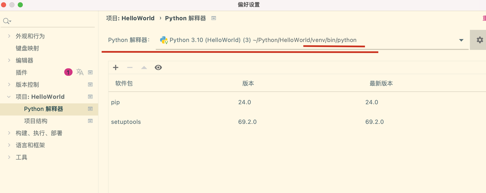

## 1、字符串是不可以变得

`input()` 函数返回的是一个字符串对象，而字符串是不可变的（immutable），因此你无法对字符串中的单个字符进行修改。


## 2、字符串反转和数组反转，可用[::-1]

字符串的反转应该使用切片操作 `[::-1]` 或者转换为列表后使用列表的反转方法 `reverse()` 或者利用循环逐个交换字符的位置来实现。在这个例子中，使用循环逐个交换字符的位置的方法，也需要将字符串转换为列表。


# 配置相关

在项目中启用不同的python，需要启用虚拟环境

1、可以指定不同的python版本

```shell
python3.10 -m venv myenv  
python3.9 -m venv myenv  
```

2、激活虚拟环境

```shell
source myenv/bin/active 
```

3、退出当前环境

```shell
deactivate
rm -rf myenv // 移除不用的虚拟环境
```

4、激活虚拟环境后，可以使用pip安装依赖库

5、在pycharm中，使用当前虚拟环境，需要配置


配置好了后，选择则会解释器就好了。


