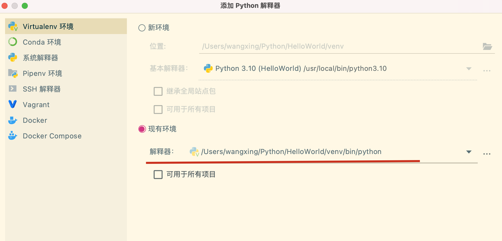
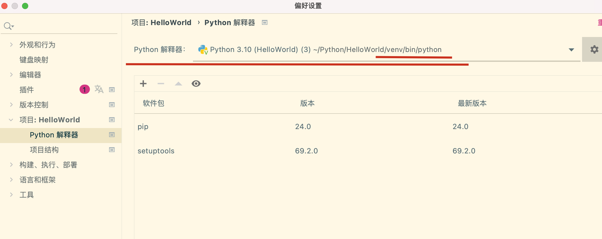

# 配置相关

在项目中启用不同的python，需要启用虚拟环境

1、可以指定不同的python版本

```shell
python3.10 -m venv myenv  
python3.9 -m venv myenv  
```

2、激活虚拟环境

```shell
source myenv/bin/active 
```

3、退出当前环境

```shell
deactivate
rm -rf myenv // 移除不用的虚拟环境
```

4、激活虚拟环境后，可以使用pip安装依赖库

5、在pycharm中，使用当前虚拟环境，需要配置



配置好了后，选择则会解释器就好了。



# 常用语法

## 1、字符串是不可以变得

`input()` 函数返回的是一个字符串对象，而字符串是不可变的（immutable），因此你无法对字符串中的单个字符进行修改。

## 2、字符串反转和数组反转，可用[::-1]

字符串的反转应该使用切片操作 `[::-1]` 或者转换为列表后使用列表的反转方法 `reverse()` 或者利用循环逐个交换字符的位置来实现。在这个例子中，使用循环逐个交换字符的位置的方法，也需要将字符串转换为列表。

## 基本语法相关

9. `dict()`: 创建一个空的字典对象或将其他可迭代对象转换为字典。例如：

   ```python
   my_dict = dict()  # 创建一个空字典
   my_dict = dict([('a', 1), ('b', 2)])  # 将包含键值对元组的列表转换为字典
   ```
10. `range()`: 创建一个整数范围的可迭代对象，常用于循环中。`range()` 函数的参数可以是一个、两个或三个，分别表示起始值、结束值和步长。例如：

    ```python
    numbers = range(5)  # 生成一个从0到4的整数范围
    numbers = range(1, 10, 2)  # 生成一个从1到9，步长为2的整数范围
    ```
11. `sorted()`: 对可迭代对象进行排序，返回一个新的已排序列表。可以通过传递关键字参数 `reverse=True` 来实现降序排序。例如：

    ```python
    my_list = [3, 1, 4, 1, 5, 9, 2, 6, 5]
    sorted_list = sorted(my_list)  # 对列表进行升序排序
    ```
12. `enumerate()`: 返回一个包含索引和对应元素的枚举对象，常用于循环迭代时获取索引和元素。例如：

    ```python
    my_list = ['a', 'b', 'c', 'd']
    for index, value in enumerate(my_list):
        print(index, value)  # 输出索引和对应元素
    ```
13. `zip()`: 将多个可迭代对象按顺序组合成元组，返回一个可迭代的 `zip` 对象。`zip()` 函数会将最短的输入可迭代对象作为基准进行组合。例如：

    ```python
    names = ['Alice', 'Bob', 'Charlie']
    ages = [25, 30, 35]
    zipped = zip(names, ages)  # 将两个列表按顺序组合成元组
    ```
14. `map()`: 对可迭代对象的每个元素应用指定的函数，并返回一个结果列表。`map()` 函数接受一个函数和一个或多个可迭代对象作为参数，将函数应用于可迭代对象的对应元素。例如：

    ```python
    numbers = [1, 2, 3, 4, 5]
    doubled = map(lambda x: x * 2, numbers)  # 对列表中的每个元素进行加倍
    ```
15. `filter()`: 使用指定的函数过滤可迭代对象中的元素，并返回一个结果列表。`filter()` 函数接受一个函数和一个可迭代对象作为参数，将函数应用于可迭代对象的每个元素，返回使函数返回 `True` 的元素。例如：

    ```python
    numbers = [1, 2, 3, 4, 5]
    even_numbers = filter(lambda x: x % 2 == 0, numbers)  # 过滤出列表中的偶数
    ```

这些函数在 Python 编程中经常被用于处理数据、转换对象以及进行各种操作，能够提高代码的效率和可读性。

## sorted()和 .sort()

在 Python 中，`sorted()` 函数和 `.sort()` 方法都用于对列表进行排序，但它们之间有一些重要的区别：

1. **sorted() 函数**：

   - `sorted()` 函数是一个内置函数，接受一个可迭代对象作为参数，并返回一个新的已排序的列表，原始列表保持不变。
   - 它不会修改原始列表，而是返回一个新的已排序列表。
   - 可以接受额外的参数，如 `reverse`（是否降序排序）和 `key`（用于指定排序依据的函数）。

   ```python
   original_list = [3, 1, 4, 1, 5, 9, 2, 6, 5]
   sorted_list = sorted(original_list)
   print(sorted_list)  # 输出: [1, 1, 2, 3, 4, 5, 5, 6, 9]
   ```
2. **.sort() 方法**：

   - `.sort()` 方法是列表对象的方法，作用是对列表进行就地排序，即修改原始列表，而不返回新的列表。
   - 它直接在原列表上进行排序，不会创建新的副本。
   - 与 `sorted()` 函数不同，`.sort()` 方法不返回排序后的列表，而是就地修改原列表，因此调用该方法后原列表会被改变。

   ```python
   original_list = [3, 1, 4, 1, 5, 9, 2, 6, 5]
   original_list.sort()
   print(original_list)  # 输出: [1, 1, 2, 3, 4, 5, 5, 6, 9]
   ```

总之，如果你希望保留原始列表并获取一个新的已排序列表，则应该使用 `sorted()` 函数；如果你想直接修改原始列表并无需创建新的副本，则应该使用 `.sort()` 方法。
