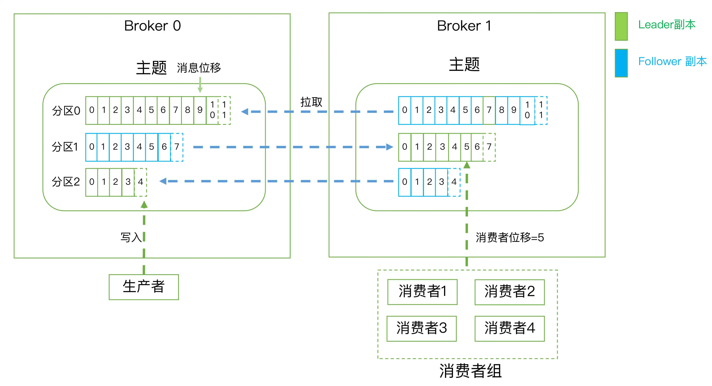
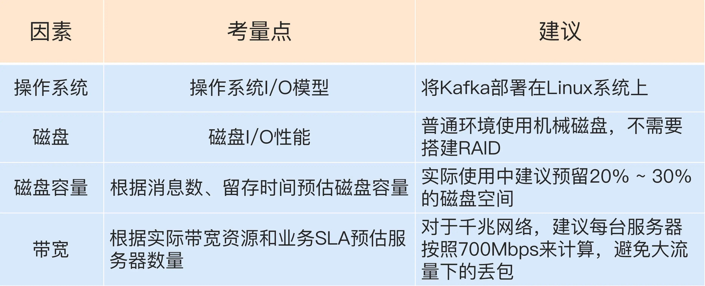
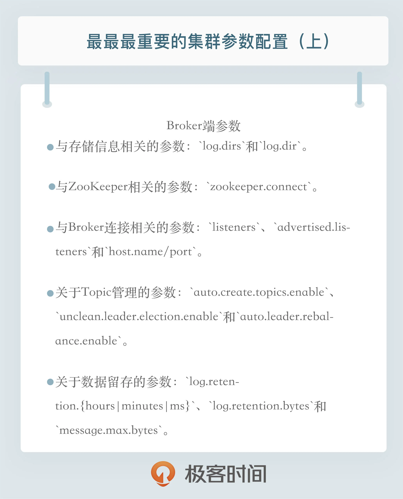
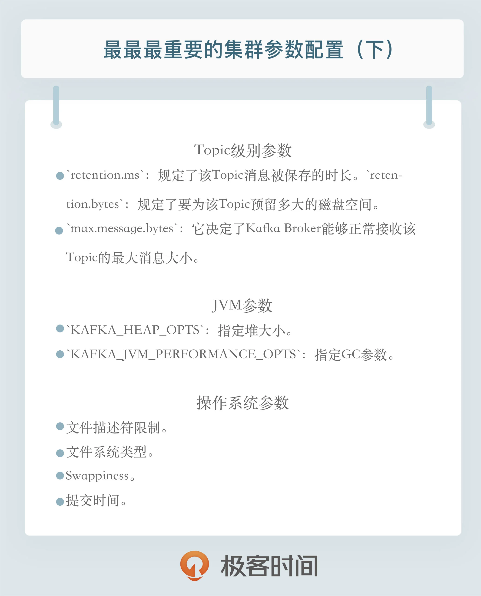
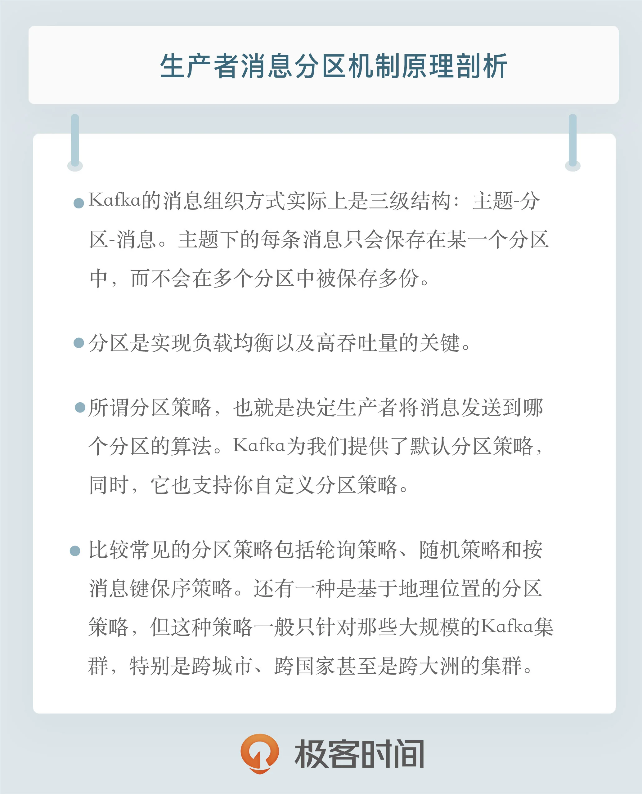
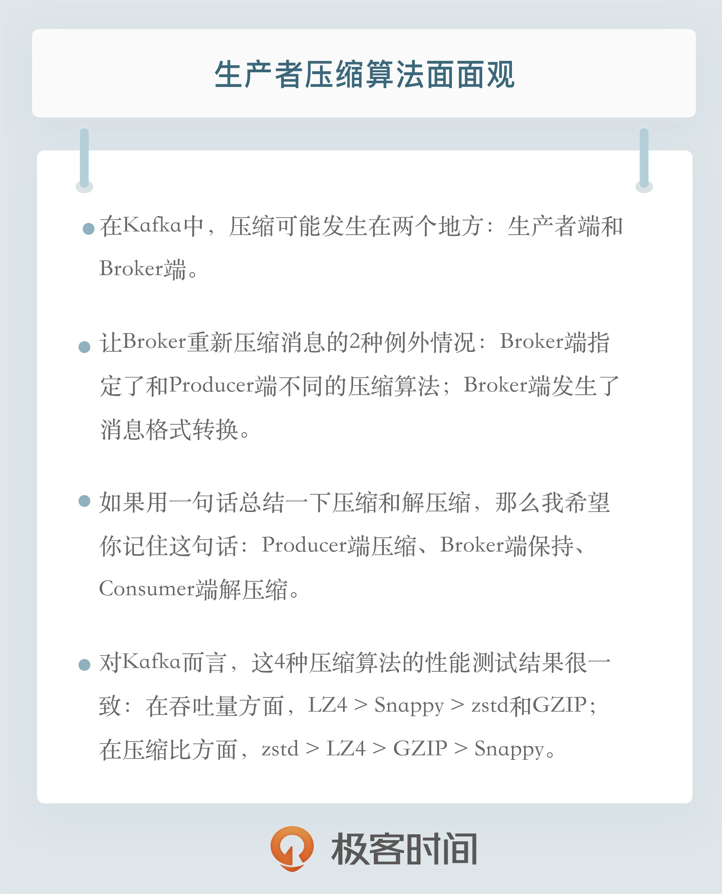
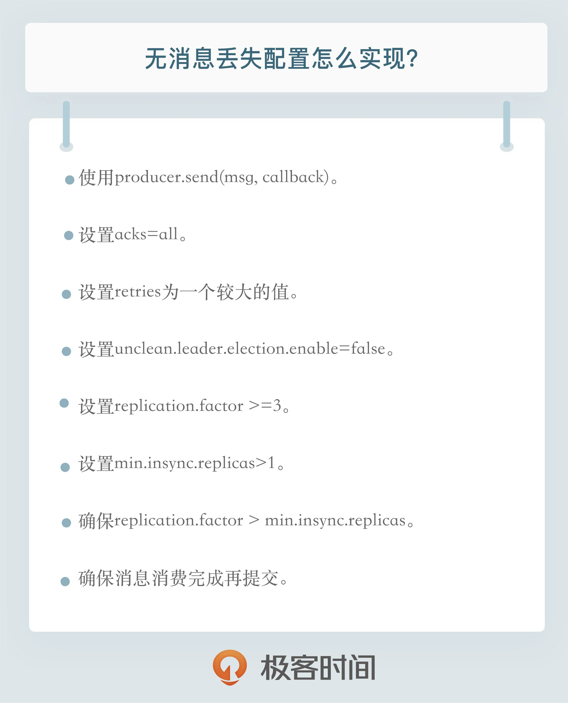

## 入门

### 01 消息引擎系统-Messaging System

* Apache Kafka是一款开源的消息引擎系统。根据维基百科的定义，消息引擎系统是一组规范。企业利用这组规范在不同系统之间传递语义准确的消息，实现松耦合的异步式数据传递。通俗来讲，就是系统A发送消息给消息引擎系统，系统B从消息引擎系统中读取A发送的消息。
* 消息引擎系统要设定具体的传输协议，即我用什么方法把消息传输出去，常见的方法有2种：点对点模型；发布／订阅模型。Kafka同时支持这两种消息引擎模型。
* 系统A不能直接发送消息给系统B，中间还要隔一个消息引擎呢，是为了“削峰填谷”。

### 02 术语

* 消息：`Record`。Kafka是消息引擎嘛，这里的消息就是指Kafka 处理的主要对象。
* 主题：`Topic`。**Kafka 中的 "topic" 是一个逻辑上的概念**。主题是承载消息的逻辑容器，在实际使用中多用来区分具体的业务。
* 分区：`Partition`。一个有序不变的消息序列。每个主题下可以有多个分区。
* 消息位移：`Offset`。表示分区中每条消息的位置信息，是一个单调递增且不变的值。
* 副本：`Replica`。Kafka 中同一条消息能够被拷贝到多个地方以提供数据冗余，这些地方就是所谓的副本。副本还分为领导者副本和追随者副本，各自有不同的角色划分。**副本是在分区层级下的**，即每个分区可配置多个副本实现高可用。
* 生产者：Producer。向主题发布新消息的应用程序。
* 消费者：Consumer。从主题订阅新消息的应用程序。
* 消费者位移：Consumer Offset。表征消费者消费进度，每个消费者都有自己的消费者位移。
* 消费者组：Consumer Group。多个消费者实例共同组成的一个组，同时消费多个分区以实现高吞吐。
* 重平衡：Rebalance。消费者组内某个消费者实例挂掉后，其他消费者实例自动重新分配订阅主题分区的过程。Rebalance 是 Kafka 消费者端实现高可用的重要手段。



Kafka体系架构=M个producer +N个broker +K个consumer+ZK集群

producer:生产者

Broker：服务代理节点，Kafka服务实例。
n个组成一个Kafka集群，通常一台机器部署一个Kafka实例，一个实例挂了其他实例仍可以使用，体现了高可用

consumer：消费者
消费topic 的消息， 一个topic 可以让若干个consumer消费，若干个consumer组成一个 consumer group ，**一条消息只能被consumer group 中一个consumer消费，**若干个partition 被若干个consumer 同时消费，达到消费者高吞吐量

topic ：主题

partition： 一个topic 可以拥有若干个partition（从 0 开始标识partition ），**分布在不同的broker 上**， 实现发布与订阅时负载均衡。producer 通过自定义的规则将消息发送到对应topic 下某个partition，以offset标识一条消息在一个partition的唯一性。
一个partition拥有多个replica，提高容灾能力。
replica 包含两种类型：leader 副本、follower副本，
leader副本负责读写请求，follower 副本负责同步leader副本消息，通过副本选举实现故障转移。
partition在机器磁盘上以log 体现，采用顺序追加日志的方式添加新消息、实现高吞吐量

#### 分区-partition

Kafka 中的一个主题（topic）可以拥有若干个分区（partition），而这些分区可以分布在不同的 Kafka Broker 上。

在 Kafka 中，分区是消息的物理存储单元，它们用于水平分割和分布消息的负载。每个分区都是一个独立的日志文件，消息按顺序附加到分区的末尾。这种分区的设计允许 Kafka 集群水平扩展，以处理大量数据和高吞吐量的情况。

这种分布方式有以下优点：

1. **负载均衡** ：将分区分布在不同的 Broker 上可以实现负载均衡，确保集群中的每个 Broker 都能均匀地处理消息流。
2. **故障容忍性** ：分区的分布使得 Kafka 集群具有冗余性。如果一个 Broker 失效，其他 Broker 上的分区仍然可用，从而确保数据的高可用性。
3. **水平扩展** ：您可以根据需求增加 Kafka Broker 的数量，以扩展集群的容量和性能，而不需要修改主题或分区的配置。

### 03 Kafka是消息引擎系统，也是一个分布式流处理平台

* Kafka在设计之初就旨在提供三个方面的特性：提供一套API实现生产者和消费者；降低网络传输和磁盘存储开销；实现高伸缩性架构。
* 作为流处理平台，Kafka与其他主流大数据流式计算框架相比，优势有两点：更容易实现端到端的正确性；它自己对于流式计算的定位。
* Apache Kafka是消息引擎系统，也是一个分布式流处理平台。除此之外，Kafka还能够被用作分布式存储系统。不过我觉得你姑且了解下就好了，我从没有见过在实际生产环境中，有人把Kafka当作持久化存储来用。

### 04 有哪些Kafka 选择

#### 现有的三种：

* Apache Kafka，也称社区版 Kafka。优势在于迭代速度快，社区响应度高，使用它可以让你有更高的把控度；缺陷在于仅提供基础核心组件，缺失一些高级的特性。
* Confluent Kafka，Confluent 公司提供的Kafka。优势在于集成了很多高级特性且由Kafka原班人马打造，质量上有保证；缺陷在于相关文档资料不全，普及率较低，没有太多可供参考的范例。
* CDH／HDP Kafka，大数据云公司提供的Kafka，内嵌 Apache Kafka。优势在于操作简单，节省运维成本；缺陷在于把控度低，演进速度较慢。

#### 选择

* Apache Kafka，是开发人数最多、版本迭代速度最快的Kafka。如果你仅仅需要一个消息引擎系统抑或是简单的流处理应用场景，同时需要对系统有较大把控度，那么我推荐你使用Apache Kafka。
* Confluent Kafka，目前分为免费版和企业版两种。企业版提供了很多功能，最有用的当属跨数据中心备份和集群监控了。如果你需要用到Kafka的一些高级特性，那么推荐你使用Confluent Kafka。
* CDH／HDP Kafka，如果你需要快速地搭建消息引擎系统，或者你需要搭建的是多框架构成的数据平台且Kafka只是其中一个组件，那么我推荐你使用这些大数据云公司提供的Kafka。

### 05 Kafka版本选择

### 版本的区别和改进

* 0.7版本：只提供了最基础的消息队列功能。
* 0.8版本：引入了副本机制，至此Kafka成为了一个真正意义上完备的分布式高可靠消息队列解决方案。
* 0.9.0.0版本：增加了基础的安全认证／权限功能；使用Java重写了新版本消费者API；引入了Kafka Connect组件。
* 0.10.0.0版本：引入了Kafka Streams，正式升级成分布式流处理平台
* 0.11.0.0版本：提供了幂等性Producer API以及事务API；对Kafka消息格式做了重构。
* 1.0和2.0版本：主要还是Kafka Streams的各种改进。

> Kafka 版本演进
>
> Kafka 目前总共演进了7个大版本，分别是0.7、0.8、0.9、0.10、0.11、1.0和2.0，其中的小版本和Patch版本很多。哪些版本引入了哪些重大的功能改进？关于这个问题，我建议你最好能做到如数家珍，因为这样不仅令你在和别人交谈Kafka时显得很酷，而且如果你要向架构师转型或者已然是架构师，那么这些都是能够帮助你进行技术选型、架构评估的重要依据。
> 我们先从0.7版本说起，实际上也没什么可说的，这是最早开源时的“上古”版本了，以至于我也从来都没有接触过。这个版本只提供了最基础的消息队列功能，甚至连副本机制都没有，我实在想不出有什么理由你要使用这个版本，因此一旦有人向你推荐这个版本，果断走开就好了。
> Kafka 从0.7时代演进到0.8之后正式引入了副本机制，至此Kafka成为了一个真正意义上完备的分布式高可靠消息队列解决方案。有了副本备份机制，Kafka就能够比较好地做到消息无丢失。那时候生产和消费消息使用的还是老版本的客户端API，所谓的老版本是指当你用它们的API开发生产者和消费者应用时，你需要指定ZooKeeper的地址而非Broker的地址。
> 如果你现在尚不能理解这两者的区别也没关系，我会在专栏的后续文章中详细介绍它们。老版本客户端有很多的问题，特别是生产者API，它默认使用同步方式发送消息，可以想见其吞吐量一定不会太高。虽然它也支持异步的方式，但实际场景中可能会造成消息的丢失，因此0.8.2.0版本社区引入了新版本Producer API，即需要指定 Broker地址的Producer。
> **国内依然有少部分用户在使用0.8.1.1、0.8.2版本。我的建议是尽量使用比较新的版本。如果你不能升级大版本，我也建议你至少要升级到0.8.2.2这个版本，因为该版本中老版本消费者API是比较稳定的。另外即使你升到了0.8.2.2，也不要使用新版本 Producer API，此时它的Bug还非常多**。
>
> 时间来到了 2015 年 11 月，社区正式发布了 0.9.0.0 版本。在我看来这是一个重量级的大版本更迭，0.9 大版本增加了基础的安全认证 / 权限功能，同时使用 Java 重写了新版本消费者 API，另外还引入了 Kafka Connect 组件用于实现高性能的数据抽取。如果这么多眼花缭乱的功能你一时无暇顾及，那么我希望你记住这个版本的另一个好处，那就是新版本 Producer API 在这个版本中算比较稳定了。如果你使用 0.9 作为线上环境不妨切换到新版本 Producer，这是此版本一个不太为人所知的优势。但和 0.8.2 引入新 API 问题类似，不要使用新版本 Consumer API，因为 Bug 超多的，绝对用到你崩溃。即使你反馈问题到社区，社区也不会管的，它会无脑地推荐你升级到新版本再试试，因此千万别用 0.9 的新版本 Consumer API。对于国内一些使用比较老的 CDH 的创业公司，鉴于其内嵌的就是 0.9 版本，所以要格外注意这些问题。
> 0.10.0.0 是里程碑式的大版本，因为该版本引入了 Kafka Streams。从这个版本起，Kafka 正式升级成分布式流处理平台，虽然此时的 Kafka Streams 还基本不能线上部署使用。0.10 大版本包含两个小版本：0.10.1 和 0.10.2，它们的主要功能变更都是在 Kafka Streams 组件上。如果你把 Kafka 用作消息引擎，实际上该版本并没有太多的功能提升。不过在我的印象中自 0.10.2.2 版本起，新版本 Consumer API 算是比较稳定了。如果你依然在使用 0.10 大版本，我强烈建议你至少升级到 0.10.2.2 然后使用新版本 Consumer API。还有个事情不得不提，0.10.2.2 修复了一个可能导致 Producer 性能降低的 Bug。基于性能的缘故你也应该升级到 0.10.2.2。

## 基本使用

### 06 线上集群部署

#### 操作系统

如果考虑操作系统与 Kafka 的适配性，Linux 系统显然要比其他两个特别是 Windows 系统更加适合部署 Kafka。主要是在下面这三个方面上，Linux 的表现更胜一筹。I/O 模型的使用、数据网络传输效率、社区支持度

主流的 I/O 模型通常有 5 种类型：阻塞式 I/O、非阻塞式 I/O、I/O 多路复用、信号驱动 I/O 和异步 I/O。

每种 I/O 模型都有各自典型的使用场景，

* 比如 Java 中 Socket 对象的阻塞模式和非阻塞模式就对应于前两种模型；
* 而 Linux 中的系统调用 select 函数就属于 I/O 多路复用模型；
* 大名鼎鼎的 epoll 系统调用则介于第三种和第四种模型之间；
* 至于第五种模型，其实很少有 Linux 系统支持，反而是 Windows 系统提供了一个叫 IOCP 线程模型属于这一种。

通常情况下我们认为后一种模型会比前一种模型要高级，比如 epoll 就比 select 要好，了解到这一程度应该足以应付我们下面的内容了。说了这么多，I/O 模型与 Kafka 的关系又是什么呢？**实际上 Kafka 客户端底层使用了 Java 的 selector**，selector 在 Linux 上的实现机制是 epoll，而在 Windows 平台上的实现机制是 select。**因此在这一点上将 Kafka 部署在 Linux 上是有优势的，因为能够获得更高效的 I/O 性能。**

其次是网络传输效率的差别。

Kafka 生产和消费的消息都是通过网络传输的，而消息保存在哪里呢？肯定是磁盘。故 Kafka 需要在磁盘和网络间进行大量数据传输。

如果你熟悉 Linux，你肯定听过**零拷贝（Zero Copy）**技术，就是当数据在磁盘和网络进行传输时避免昂贵的内核态数据拷贝从而实现快速的数据传输。Linux 平台实现了这样的零拷贝机制，但有些令人遗憾的是在 Windows 平台上必须要等到 Java 8 的 60 更新版本才能“享受”到这个福利。**一句话总结一下，在 Linux 部署 Kafka 能够享受到零拷贝技术所带来的快速数据传输特性。**

Windows 平台上部署 Kafka 只适合于个人测试或用于功能验证，千万不要应用于生产环境。

#### 磁盘

应该选择普通的机械磁盘还是固态硬盘？前者成本低且容量大，但易损坏；后者性能优势大，不过单价高。我给出的建议是**使用普通机械硬盘即可。**

Kafka 大量使用磁盘不假，可它使用的方式多是顺序读写操作，一定程度上规避了机械磁盘最大的劣势，**即随机读写操作慢**。从这一点上来说，使用 SSD 似乎并没有太大的性能优势，毕竟从性价比上来说，机械磁盘物美价廉，而它因易损坏而造成的可靠性差等缺陷，又由 Kafka 在软件层面提供机制来保证，故使用普通机械磁盘是很划算的。

1. 追求性价比的公司可以不搭建 RAID，使用普通磁盘组成存储空间即可。
2. 使用机械磁盘完全能够胜任 Kafka 线上环境。

#### 磁盘容量

Kafka 需要将消息保存在底层的磁盘上，这些消息默认会被保存一段时间然后自动被删除。虽然这段时间是可以配置的，但你应该如何结合自身业务场景和存储需求来规划 Kafka 集群的存储容量呢？

规划磁盘容量时你需要考虑下面这几个元素：

**新增消息数、消息留存时间、平均消息大小、备份数、是否启用压缩**

例子：

每天 1 亿条 1KB 大小的消息，保存两份且留存两周的时间，那么总的空间大小就等于 1 亿 * 1KB * 2 / 1000 / 1000 = 200GB。一般情况下 Kafka 集群除了消息数据还有其他类型的数据，比如索引数据等，故我们再为这些数据预留出 10% 的磁盘空间，因此总的存储容量就是 220GB。既然要保存两周，那么整体容量即为 220GB * 14，大约 3TB 左右。Kafka 支持数据的压缩，假设压缩比是 0.75，那么最后你需要规划的存储空间就是 0.75 * 3 = 2.25TB。

#### 带宽

对于 Kafka 这种通过网络大量进行数据传输的框架而言，带宽特别容易成为瓶颈。事实上，在我接触的真实案例当中，**带宽资源不足导致 Kafka 出现性能问题的比例至少占 60% 以上**。如果你的环境中还涉及跨机房传输，那么情况可能就更糟了。

与其说是带宽资源的规划，其实真正要规划的是所需的 Kafka 服务器的数量。

例子：

假设你公司的机房环境是千兆网络，即 1Gbps，现在你有个业务，其业务目标或 SLA 是在 1 小时内处理 1TB 的业务数据。那么问题来了，你到底需要多少台 Kafka 服务器来完成这个业务呢？

让我们来计算一下，由于带宽是 1Gbps，即每秒处理 1Gb 的数据，假设每台 Kafka 服务器都是安装在专属的机器上，也就是说每台 Kafka 机器上没有混部其他服务，**毕竟真实环境中不建议这么做**。通常情况下你只能**假设 Kafka 会用到 70% 的带宽资源**，因为总要为其他应用或进程留一些资源。

根据实际使用经验，超过 70% 的阈值就有网络丢包的可能性了，故 70% 的设定是一个比较合理的值，也就是说单台 Kafka 服务器最多也就能使用大约 700Mb 的带宽资源。

稍等，这只是它能使用的最大带宽资源，**你不能让 Kafka 服务器常规性使用这么多资源，故通常要再额外预留出 2/3 的资源**，即单台服务器使用带宽 700Mb / 3 ≈ 240Mbps。需要提示的是，这里的 2/3 其实是相当保守的，你可以结合你自己机器的使用情况酌情减少此值。

好了，有了 240Mbps，我们就可以计算 1 小时内处理 1TB 数据所需的服务器数量了。根据这个目标，我们每秒需要处理 2336Mb 的数据，除以 240，约等于 10 台服务器。如果消息还需要额外复制两份，那么总的服务器台数还要乘以 3，即 30 台。



### 07 集群配置参数

#### Broker端参数

首先Broker是需要配置存储信息的，即Broker 使用哪些磁盘。那么针对存储信息的重要参数有以下这么几个：

1. log.dirs：这是非常重要的参数，指定了Broker 需要使用的若干个文件目录路径。要知道这个参数是没有默认值的，这说明什么？这说明它必须由你亲自指定。(新版是有默认值的，默认配置为：log.dirs=/tmp/kafka-logs)
2. log.dir：注意这是dir，结尾没有s，说明它只能表示单个路径，它是补充上一个参数用的。(这个参数在2.7.0已经没有了)

这两个参数应该怎么设置呢？很简单，你只要设置log.dirs，即第一个参数就好了，不要设置log.dir。而且更重要的是，在线上生产环境中 一定要为log.dirs配置多个路径，具体格式是一个CSV格式，也就是用逗号分隔的多个路径，比如`／home／kafka1,／home／kafka2,／home／kafka3`这样。如果有条件的话你最好保证这些目录挂载到不同的物理磁盘上。这样做有两个好处：

1. 提升读写性能：比起单块磁盘，多块物理磁盘同时读写数据有更高的吞吐量。
2. 能够实现故障转移：即 Failover。这是 Kafka 1.1 版本新引入的强大功能。要知道在以前，只要 Kafka Broker 使用的任何一块磁盘挂掉了，整个 Broker 进程都会关闭。但是自 1.1 开始，这种情况被修正了，坏掉的磁盘上的数据会自动地转移到其他正常的磁盘上，而且 Broker 还能正常工作。还记得上一期我们关于 Kafka 是否需要使用 RAID 的讨论吗？这个改进正是我们舍弃 RAID 方案的基础：没有这种 Failover 的话，我们只能依靠 RAID 来提供保障。

##### ZooKeeper相关

首先 ZooKeeper 是做什么的呢？它是一个分布式协调框架，**负责协调管理并保存 Kafka 集群的所有元数据信息**，比如集群都有哪些 Broker 在运行、创建了哪些 Topic，每个 Topic 都有多少分区以及这些分区的 Leader 副本都在哪些机器上等信息。

Kafka 与 ZooKeeper 相关的最重要的参数当属`zookeeper.connect`。

这也是一个 CSV 格式的参数，比如我可以指定它的值为`zk1:2181,zk2:2181,zk3:2181。2181 是 ZooKeeper 的默认端口。

现在问题来了，如果我让**多个 Kafka 集群**使用同一套 ZooKeeper 集群，那么这个参数应该怎么设置呢？这时候 chroot 就派上用场了。这个 chroot 是 ZooKeeper 的概念，类似于别名。

如果你有两套 Kafka 集群，假设分别叫它们 kafka1 和 kafka2，那么两套集群的zookeeper.connect参数可以这样指定：`zk1:2181,zk2:2181,zk3:2181/kafka1`和`zk1:2181,zk2:2181,zk3:2181/kafka2`。**切记 chroot 只需要写一次，而且是加到最后的**。我经常碰到有人这样指定：`zk1:2181/kafka1,zk2:2181/kafka2,zk3:2181/kafka3`，**这样的格式是不对的**。

##### Broker 连接相关

1. listeners：学名叫监听器，其实就是告诉外部连接者要通过什么协议访问指定主机名和端口开放的 Kafka 服务。
2. advertised.listeners：和 listeners 相比多了个 advertised。Advertised 的含义表示宣称的、公布的，就是说这组监听器是 Broker 用于对外发布的。
3. host.name/port：列出这两个参数就是想说你把它们忘掉吧，压根不要为它们指定值，毕竟都是过期的参数了。

listeners 用于内网访问，advertised.listeners 用于外网访问

常见的玩法是：你的Kafka Broker机器上配置了双网卡，一块网卡用于内网访问（即我们常说的内网IP）；另一个块用于外网访问。那么你可以配置listeners为内网IP，advertised.listeners为外网IP。

我们具体说说监听器的概念，从构成上来说，它是若干个逗号分隔的三元组，每个三元组的格式为`＜协议名称，主机名，端口号＞`。这里的协议名称可能是标准的名字，比如PLAINTEXT 表示明文传输、SSL表示使用SSL或TLS加密传输等；也可能是你自己定义的协议名字，比如CONTROLLER: //localhost:9092。

如果自己定义了协议名称，你必须还要指定`listener.security.protocol.map`参数告诉这个协议底层使用了哪种安全协议，比如指定`listener.security.protocol.map＝CONTROLLER：PLAINTEXT`表示CONTROLLER这个自定义协议底层使用明文不加密传输数据。
至于三元组中的主机名和端口号则比较直观，不需要做过多解释。不过有个事情你还是要注意一下，经常有人会问主机名这个设置中我到底使用IP地址还是主机名。这里我给出统一的建议：**最好全部使用主机名，即Broker端和 Client 端应用配置中全部填写主机名**。Broker 源代码中也使用的是主机名，如果你在某些地方使用了IP地址进行连接，可能会发生无法连接的问题。

##### Topic管理

* auto.create.topics.enable：是否允许自动创建Topic。
* unclean.leader.election.enable：是否允许 Unclean Leader 选举。
* auto.leader.rebalance.enable：是否允许定期进行 Leader 选举。

auto.create.topics.enable参数**最好设置成 false，即不允许自动创建 Topic**。在我们的线上环境里面有很多名字稀奇古怪的 Topic，我想大概都是因为该参数被设置成了 true 的缘故。

第二个参数unclean.leader.election.enable是关闭 Unclean Leader 选举的，建议你还是显式地把它设置成 false，坚决不能让那些落后太多的副本竞选 Leader。

第三个参数auto.leader.rebalance.enable的影响貌似没什么人提，但其实对生产环境影响非常大。设置它的值为 true 表示允许 Kafka 定期地对一些 Topic 分区进行 Leader 重选举，建议False

严格来说它与上一个参数中 Leader 选举的最大不同在于，它不是选 Leader，而是换 Leader！比如 Leader A 一直表现得很好，但若auto.leader.rebalance.enable=true，那么有可能一段时间后 Leader A 就要被强行卸任换成 Leader B。

你要知道换一次 Leader 代价很高的，原本向 A 发送请求的所有客户端都要切换成向 B 发送请求，而且这种换 Leader 本质上没有任何性能收益，因此我建议你在生产环境中把这个参数设置成 false。

##### 数据留存

* `log.retention.{hours|minutes|ms}`：这是个“三兄弟”，都是控制一条消息数据被保存多长时间。从优先级上来说ms设置最高、minutes 次之、hours 最低。
* log.retention.bytes：这是指定Broker为消息保存的总磁盘容量大小。
* message.max.bytes：控制Broker 能够接收的最大消息大小。

先说这个“三兄弟”，虽然 ms 设置有最高的优先级，但是通常情况下我们还是设置 hours 级别的多一些，比如log.retention.hours=168表示默认保存 7 天的数据，自动删除 7 天前的数据。很多公司把 Kafka 当作存储来使用，那么这个值就要相应地调大。

其次是这个log.retention.bytes。**这个值默认是 -1，表明你想在这台 Broker 上保存多少数据都可以**，至少在容量方面 Broker 绝对为你开绿灯，不会做任何阻拦。这个参数真正发挥作用的场景其实是在云上构建多租户的 Kafka 集群：设想你要做一个云上的 Kafka 服务，每个租户只能使用 100GB 的磁盘空间，为了避免有个“恶意”租户使用过多的磁盘空间，设置这个参数就显得至关重要了。

最后说说message.max.bytes。实际上今天我和你说的重要参数都是指那些不能使用默认值的参数，这个参数也是一样，默认的 1000012 太少了，还不到 1MB。实际场景中突破 1MB 的消息都是屡见不鲜的，因此在线上环境中设置一个**比较大的值**还是比较保险的做法。毕竟它只是一个标尺而已，仅仅衡量 Broker 能够处理的最大消息大小，即使设置大一点也不会耗费什么磁盘空间的。



#### Topic 级别

如果同时设置了 Topic 级别参数和全局 Broker 参数，**Topic 级别参数会覆盖全局 Broker 参数的值**，而每个 Topic 都能设置自己的参数值，这就是所谓的 Topic 级别参数。例如消息数据的留存时间参数，不同Topic可以根据需要设置。

##### 消息保存参数

* retention.ms：规定了该 Topic 消息被保存的时长。默认是 7 天，即该 Topic 只保存最近 7 天的消息。一旦设置了这个值，它会覆盖掉 Broker 端的全局参数值。
* retention.bytes：规定了要为该 Topic 预留多大的磁盘空间。和全局参数作用相似，这个值通常在多租户的 Kafka 集群中会有用武之地。当前默认值是 -1，表示可以无限使用磁盘空间。
* max.message.bytes：它决定了 Kafka Broker 能够正常接收该 Topic 的最大消息大小(**该参数跟 message.max.bytes 参数的作用是一样的，只不过 max.message.bytes 是作用于某个 topic，而 message.max.bytes 是作用于全局。**)

##### 参数设置

两种设置方式：创建 Topic 时进行设置、修改 Topic 时设置

例子：

1、如何在创建 Topic 时设置这些参数

设想你的部门需要将交易数据发送到 Kafka 进行处理，需要保存最近半年的交易数据，同时这些数据很大，通常都有几 MB，但一般不会超过 5MB。现在让我们用以下命令来创建 Topic：

```shell
bin/kafka-topics.sh --bootstrap-server localhost:9092 --create --topic transaction --partitions 1 --replication-factor 1 --config retention.ms=15552000000 --config max.message.bytes=5242880
```

我们只需要知道 Kafka 开放了`kafka-topics`命令供我们来创建 Topic 即可。对于上面这样一条命令，请注意结尾处的`--config`设置，我们就是在 config 后面指定了想要设置的 Topic 级别参数。

下面看看使用另一个自带的命令kafka-configs来修改 Topic 级别参数。假设我们现在要发送最大值是 10MB 的消息，该如何修改呢？命令如下：

```shell
bin/kafka-configs.sh --zookeeper localhost:2181 --entity-type topics --entity-name transaction --alter --add-config max.message.bytes=10485760
```

总体来说，你只能使用这么两种方式来设置 Topic 级别参数。**最好始终坚持使用第二种方式来设置**，并且在未来，Kafka 社区很有可能统一使用kafka-configs脚本来调整 Topic 级别参数。

#### JVM 参数

Kafka 服务器端代码是用 Scala 语言编写的，但终归还是编译成 Class 文件在 JVM 上运行，因此 JVM 参数设置对于 Kafka 集群的重要性不言而喻。

JVM 端设置，堆大小这个参数至关重要，将你的 JVM 堆大小设置成 6GB 吧，这是目前业界比较公认的一个合理值。

JVM 端垃圾回收器的设置，也就是平时常说的 GC 设置：

如果你依然在使用 **Java 7**，那么可以根据以下法则选择合适的垃圾回收器：

* 如果 Broker 所在机器的 CPU 资源非常充裕，建议使用 CMS 收集器。启用方法是指定-XX:+UseCurrentMarkSweepGC。否则，使用吞吐量收集器。开启方法是指定-XX:+UseParallelGC。

如果使用Java 8，那么可以手动设置使用 G1 收集器

##### 如何为kafka设置：

设置下面两个参数：KAFKA_HEAP_OPTS：指定堆大小。KAFKA_JVM_PERFORMANCE_OPTS：指定 GC 参数。

```shell
$> export KAFKA_HEAP_OPTS=--Xms6g  --Xmx6g
$> export KAFKA_JVM_PERFORMANCE_OPTS= -server -XX:+UseG1GC -XX:MaxGCPauseMillis=20 -XX:InitiatingHeapOccupancyPercent=35 -XX:+ExplicitGCInvokesConcurrent -Djava.awt.headless=true
$> bin/kafka-server-start.sh config/server.properties
```

#### 操作系统参数

* 文件描述符限制
* 文件系统类型
* Swappiness
* 提交时间

首先是ulimit -n。我觉得任何一个 Java 项目最好都调整下这个值。实际上，文件描述符系统资源并不像我们想象的那样昂贵，你不用太担心调大此值会有什么不利的影响。通常情况下将它设置成一个超大的值是合理的做法，比如ulimit -n 1000000。

(在 Linux 系统中，一个长连接会占用一个 Socket 句柄（文件描述符），像 Ubuntu 默认是 1024，也就是最多 1024 个 Socket 长连接，Kafka 网络通信中大量使用长连接，这对比较大的 Kafka 集群来说可能是不够的。 为了避免 Socket 句柄不够用，将这个设置为一个比较大值是合理的。)

其次是文件系统类型的选择。这里所说的文件系统指的是如 ext3、ext4 或 XFS 这样的日志型文件系统。根据官网的测试报告，XFS 的性能要强于 ext4，所以**生产环境最好还是使用 XFS**。对了，最近有个 Kafka 使用 ZFS 的数据报告，貌似性能更加强劲，有条件的话不妨一试。

第三是 swap 的调优。网上很多文章都提到设置其为 0，将 swap 完全禁掉以防止 Kafka 进程使用 swap 空间。我个人反倒觉得还是不要设置成 0 比较好，我们可以设置成一个较小的值。为什么呢？因为一旦设置成 0，当物理内存耗尽时，操作系统会触发 OOM killer 这个组件，它会随机挑选一个进程然后 kill 掉，即根本不给用户任何的预警。但如果设置成一个比较小的值，当开始使用 swap 空间时，你至少能够观测到 Broker 性能开始出现急剧下降，从而给你进一步调优和诊断问题的时间。基于这个考虑，我个人建议将 swappniess 配置成一个接近 0 但不为 0 的值，比如 1。

最后是提交时间或者说是 Flush 落盘时间。向 Kafka 发送数据并不是真要等数据被写入磁盘才会认为成功，而是只要数据被写入到操作系统的页缓存（Page Cache）上就可以了，随后操作系统根据 LRU 算法会定期将页缓存上的“脏”数据落盘到物理磁盘上。这个定期就是由提交时间来确定的，默认是 5 秒。一般情况下我们会认为这个时间太频繁了，可以适当地增加提交间隔来降低物理磁盘的写操作。当然你可能会有这样的疑问：如果在页缓存中的数据在写入到磁盘前机器宕机了，那岂不是数据就丢失了。的确，这种情况数据确实就丢失了，但鉴于 Kafka 在软件层面已经提供了多副本的冗余机制，因此这里稍微拉大提交间隔去换取性能还是一个合理的做法。



## 客户端实践

### 09生产者消息分区机制原理剖析

Kafka 的消息组织方式实际上是三级结构：主题 - 分区 - 消息。主题下的每条消息只会保存在某一个分区中，而不会在多个分区中被保存多份。

#### 为何分区：

**其实分区的作用就是提供负载均衡的能力**，或者说对数据进行分区的主要原因，就是为了实现系统的高伸缩性（Scalability）。不同的分区能够被放置到不同节点的机器上，而数据的读写操作也都是针对分区这个粒度而进行的，这样每个节点的机器都能独立地执行各自分区的读写请求处理。并且，我们还可以通过添加新的节点机器来增加整体系统的吞吐量。

#### 分区策略

所谓分区策略是**决定生产者将消息发送到哪个分区的算法**。Kafka 为我们提供了默认的分区策略，同时它也支持你自定义分区策略。

如果要自定义分区策略，你需要显式地配置生产者端的参数`partitioner.class`。这个参数该怎么设定呢？方法很简单，在编写生产者程序时，你可以编写一个具体的类实现`org.apache.kafka.clients.producer.Partitioner`接口。这个接口也很简单，只定义了两个方法：`partition()`和`close()`，通常你只需要实现最重要的 partition 方法。我们来看看这个方法的方法签名：

```java
int partition(String topic, Object key, byte[] keyBytes, Object value, byte[] valueBytes, Cluster cluster);
```

这里的topic、key、keyBytes、value和valueBytes都属于消息数据，cluster则是集群信息（比如当前 Kafka 集群共有多少主题、多少 Broker 等）。Kafka 给你这么多信息，就是希望让你能够充分地利用这些信息对消息进行分区，计算出它要被发送到哪个分区中。只要你自己的实现类定义好了 partition 方法，同时设置partitioner.class参数为你自己实现类的 Full Qualified Name(类全限定名称)，那么生产者程序就会按照你的代码逻辑对消息进行分区。

##### 轮询策略

也称 Round-robin 策略，即顺序分配。比如一个主题下有 3 个分区，那么第一条消息被发送到分区 0，第二条被发送到分区 1，第三条被发送到分区 2，以此类推。当生产第 4 条消息时又会重新开始，即将其分配到分区 0

这就是所谓的轮询策略。轮询策略是 Kafka Java 生产者 API **默认提供的分区策略**。如果你未指定partitioner.class参数，那么你的生产者程序会按照轮询的方式在主题的所有分区间均匀地“码放”消息。

轮询策略有非常优秀的负载均衡表现，它总是能保证消息最大限度地被平均分配到所有分区上，故默认情况下它是最合理的分区策略，也是我们最常用的分区策略之一。

##### 随机策略

也称 Randomness 策略。所谓随机就是我们随意地将消息放置到任意一个分区上

```java
List<PartitionInfo> partitions = cluster.partitionsForTopic(topic);
return ThreadLocalRandom.current().nextInt(partitions.size());
```

先计算出该主题总的分区数，然后随机地返回一个小于它的正整数。

本质上看随机策略也是力求将数据均匀地打散到各个分区，**但从实际表现来看，它要逊于轮询策略**，所以如果追求数据的均匀分布，还是使用轮询策略比较好。事实上，随机策略是老版本生产者使用的分区策略，在新版本中已经改为轮询了。

##### Key-ordering 策略

Kafka 允许为每条消息定义消息键，简称为 Key。

这个 Key 的作用非常大，它可以是一个有着明确业务含义的字符串，比如客户代码、部门编号或是业务 ID 等；也可以用来表征消息元数据。特别是在 Kafka 不支持时间戳的年代，在一些场景中，工程师们都是直接将消息创建时间封装进 Key 里面的。一旦消息被定义了 Key，那么你就可以保证同一个 Key 的所有消息都进入到相同的分区里面，由于每个分区下的消息处理都是有顺序的，故这个策略被称为按消息键保序策略。

```java
List<PartitionInfo> partitions = cluster.partitionsForTopic(topic);
return Math.abs(key.hashCode()) % partitions.size();
```

**前面提到的 Kafka 默认分区策略实际上同时实现了两种策略：如果指定了 Key，那么默认实现按消息键保序策略；如果没有指定 Key，则使用轮询策略。**

切记分区是实现负载均衡以及高吞吐量的关键，故在生产者这一端就要仔细盘算合适的分区策略，避免造成消息数据的“倾斜”，使得某些分区成为性能瓶颈，这样极易引发下游数据消费的性能下降。



### 10 生产者压缩算法

它秉承了用时间去换空间的经典 trade-off 思想，具体来说就是用 CPU 时间去换磁盘空间或网络 I/O 传输量，希望以较小的 CPU 开销带来更少的磁盘占用或更少的网络 I/O 传输。

#### 怎么压缩

目前 Kafka 共有两大类消息格式，社区分别称之为 V1 版本和 V2 版本。V2 版本是 Kafka 0.11.0.0 中正式引入的。

不论是哪个版本，Kafka 的消息层次都分为两层：消息集合（message set）以及消息（message）。一个消息集合中包含若干条日志项（record item），而日志项才是真正封装消息的地方。

V2 版本还有一个和压缩息息相关的改进，就是保存压缩消息的方法发生了变化。之前 V1 版本中保存压缩消息的方法是把多条消息进行压缩然后保存到外层消息的消息体字段中；而 V2 版本的做法是对整个消息集合进行压缩。显然后者应该比前者有更好的压缩效果。

#### 何时压缩

在 Kafka 中，压缩可能发生在两个地方：生产者端和 Broker 端。

##### 生产者端：

生产者程序中配置 compression.type 参数即表示启用指定类型的压缩算法。比如下面这段程序代码展示了如何构建一个开启 GZIP 的 Producer 对象：

```java
 Properties props = new Properties();
 props.put("bootstrap.servers", "localhost:9092");
 props.put("acks", "all");
 props.put("key.serializer", "org.apache.kafka.common.serialization.StringSerializer");
 props.put("value.serializer", "org.apache.kafka.common.serialization.StringSerializer");
 // 开启GZIP压缩
 props.put("compression.type", "gzip");
 
 Producer<String, String> producer = new KafkaProducer<>(props);
```

这里比较关键的代码行是 `props.put(“compression.type”, “gzip”)`，它表明该 Producer 的压缩算法使用的是 GZIP。这样 Producer 启动后生产的每个消息集合都是经 GZIP 压缩过的，故而能很好地节省网络传输带宽以及 Kafka Broker 端的磁盘占用。

##### Broker端

大部分情况下 Broker 从 Producer 端接收到消息后仅仅是原封不动地保存而不会对其进行任何修改，但这里的“大部分情况”也是要满足一定条件的。有两种例外情况就可能让 Broker 重新压缩消息。

1.Broker 端指定了和 Producer 端不同的压缩算法。

Broker 端也有一个参数叫 `compression.type`，但是这个参数的默认值是 producer，这表示 **Broker 端会“尊重”Producer 端使用的压缩算法**。

可一旦你在 Broker 端设置了不同的 `compression.type` 值，就一定要小心了，因为可能会发生预料之外的压缩/解压缩操作，通常表现为 Broker 端 CPU 使用率飙升。

2.Broker 端发生了消息格式转换。

所谓的消息格式转换主要是为了兼容老版本的消费者程序

在一个生产环境中，Kafka 集群中同时保存多种版本的消息格式非常常见。

为了兼容老版本的格式，Broker 端会对新版本消息执行向老版本格式的转换。这个过程中会涉及消息的解压缩和重新压缩。一般情况下这种消息格式转换对性能是有很大影响的，除了这里的压缩之外，它还让 Kafka 丧失了引以为豪的 Zero Copy 特性。

所谓“Zero Copy”就是“零拷贝”，说的是当数据在磁盘和网络进行传输时避免昂贵的内核态数据拷贝，从而实现快速的数据传输（”零拷贝“发生在broker到consumer的链路）。

#### 何时解压缩

有压缩必有解压缩！通常来说解压缩发生在消费者程序中。

Kafka 会将启用了哪种压缩算法封装进消息集合中，这样当 Consumer 读取到消息集合时，它自然就知道了这些消息使用的是哪种压缩算法。如果用一句话总结一下压缩和解压缩：**Producer 端压缩、Broker 端保持、Consumer 端解压缩**。

除了在 Consumer 端解压缩，Broker 端也会进行解压缩。注意了，这和前面提到消息格式转换时发生的解压缩是不同的场景。每个压缩过的消息集合在 Broker 端写入时都要发生解压缩操作，目的就是为了对消息执行各种验证。(这个解压缩的过程并不是为了还原消息的可读形式，而是为了在存储之前执行各种验证操作，以确保消息的质量和合法性。解压缩后的消息仍然保留在 Kafka 内部的二进制格式，而不是还原为原始的、可读的消息)

#### 压缩算法对比

在实际使用中，GZIP、Snappy、LZ4 甚至是 zstd 的表现各有千秋。

但对于 Kafka 而言，它们的性能测试结果却出奇得一致，

即在吞吐量方面：LZ4 > Snappy > zstd 和 GZIP；

而在压缩比方面，zstd > LZ4 > GZIP > Snappy。

具体到物理资源，使用 Snappy 算法占用的网络带宽最多，zstd 最少，这是合理的，毕竟 zstd 就是要提供超高的压缩比；在 CPU 使用率方面，各个算法表现得差不多，只是在压缩时 Snappy 算法使用的 CPU 较多一些，而在解压缩时 GZIP 算法则可能使用更多的 CPU。

* 用压缩的一个条件就是 Producer 程序运行机器上的 CPU 资源要很充足
* 如果你的客户端机器 CPU 资源有很多富余，我强烈建议你开启 zstd 压缩，这样能极大地节省网络资源消耗。



### 11 无消息丢失

**一句话概括，Kafka 只对“已提交”的消息（committed message）做有限度的持久化保证。**

这句话里面有两个核心要素，我们一一来看。

第一个核心要素是“已提交的消息”。

什么是已提交的消息？当 Kafka 的若干个 Broker 成功地接收到一条消息并写入到日志文件后，它们会告诉生产者程序这条消息已成功提交。此时，这条消息在 Kafka 看来就正式变为“已提交”消息了。

> 向 Kafka 发送数据并不是真要等数据被写入磁盘才会认为成功，而是只要数据被写入到操作系统的页缓存（Page Cache）上就可以了，随后操作系统根据 LRU 算法会定期将页缓存上的“脏”数据落盘到物理磁盘上。这个定期就是由提交时间来确定的，默认是 5 秒。

那为什么是若干个 Broker 呢？这取决于你对“已提交”的定义。你可以选择只要有一个 Broker 成功保存该消息就算是已提交，也可以是令所有 Broker 都成功保存该消息才算是已提交。不论哪种情况，Kafka 只对已提交的消息做持久化保证这件事情是不变的。

第二个核心要素就是“有限度的持久化保证”。

也就是说 Kafka 不可能保证在任何情况下都做到不丢失消息。假如你的消息保存在 N 个 Kafka Broker 上，那么这个前提条件就是这 N 个 Broker 中至少有 1 个存活。只要这个条件成立，Kafka 就能保证你的这条消息永远不会丢失。

#### 常见消息丢失案例

##### 案例 1：生产者程序丢失数据

目前 Kafka Producer 是异步发送消息的，也就是说如果你调用的是 producer.send(msg) 这个 API，那么它通常会立即返回，**但此时你不能认为消息发送已成功完成**。这种发送方式有个有趣的名字，叫“fire and forget”，翻译一下就是“发射后不管”

如果用这个方式，可能会有哪些因素导致消息没有发送成功呢？其实原因有很多，例如网络抖动，导致消息压根就没有发送到 Broker 端；或者消息本身不合格导致 Broker 拒绝接收（比如消息太大了，超过了 Broker 的承受能力）等。Kafka 不认为消息是已提交的，因此也就没有 Kafka 丢失消息这一说了。

实际上，解决此问题的方法非常简单：Producer 永远要使用带有回调通知的发送 API，也就是说不要使用 producer.send(msg)，而**要使用 producer.send(msg, callback)**。不要小瞧这里的 callback（回调），它能准确地告诉你消息是否真的提交成功了。一旦出现消息提交失败的情况，你就可以有针对性地进行处理。

##### 案例 2：消费者程序丢失数据

Consumer 端丢失数据主要体现在 Consumer 端要消费的消息不见了。

要对抗这种消息丢失，办法很简单：**维持先消费消息（阅读），再更新位移（书签）的顺序即可**。这样就能最大限度地保证消息不丢失。先位移可能导致消息丢失，这种处理方式可能带来的问题是**消息的重复处理**，类似于同一页书被读了很多遍，但这不属于消息丢失的情形

#### 最佳实践🎉️

如何保证Kafka不丢失消息： 从producer broker consumer 三端考虑，进行配置

1. 不要使用 producer.send(msg)而要使用 producer.send(msg,callback)。记住，一定要使用带有回调通知的send方法。
2. 设置acks＝all。acks是Producer的一个参数，代表了你对“已提交”消息的定义。如果设置成all，则表明所有副本Broker 都要接收到消息，该消息才算是“已提交”。这是最高等级的“已提交”定义。

> 具体来说，当`acks`设置为`all`时，生产者将等待所有副本都成功接收到消息并返回确认之后，才会认为写入操作是成功的。这意味着只有当分区的所有副本都已成功写入消息，生产者才会收到成功的确认。
>
> 使用`acks = all` 提供了最高级别的数据可靠性，确保消息不会因为某个副本的故障而丢失。然而，这也意味着生产者在等待所有副本确认的过程中，可能会引入一些延迟，因为需要等待网络传输和副本确认的时间。
>
> 这个参数的选择通常取决于应用程序对数据可靠性和延迟的需求。如果对数据的一致性和不丢失有很高的要求，可以选择`acks = all`。如果对延迟要求比较敏感，可以选择更低的确认级别，例如`acks = 1`，表示只需要等待 Leader 副本确认即可。
>
> 总体而言，`acks = all` 是 Kafka 中用于控制数据可靠性的一个重要参数，需要根据具体场景和需求进行合理的配置。

1. 设置retries为一个较大的值。这里的retries 同样是Producer的参数，对应前面提到的 Producer 自动重试。当出现网络的瞬时抖动时，消息发送可能会失败，此时配置了retries>0的Producer能够自动重试消息发送，避免消息丢失。
2. 设置unclean.leader.election.enable＝false。这是 Broker 端的参数，它控制的是哪些Broker 有资格竞选分区的Leader。如果一个 Broker落后原先的Leader太多，那么它一旦成为新的Leader，必然会造成消息的丢失。故一般都要将该参数设置成false，即不允许这种情况的发生。
3. 设置replication.factor＞＝3。这也是Broker端的参数。其实这里想表述的是，最好将消息多保存几份，毕竟目前防止消息丢失的主要机制就是冗余。
4. 设置 min.insync.replicas＞1。这依然是Broker 端参数，控制的是消息至少要被写入到多少个副本才算是“已提交”。设置成大于1可以提升消息持久性。在实际环境中千万不要使用默认值1。
5. 确保replication.factor＞min.insync.replicas。如果两者相等，那么只要有一个副本挂机，整个分区就无法正常工作了。我们不仅要改善消息的持久性，防止数据丢失，还要在不降低可用性的基础上完成。推荐设置成 replication.factor ＝ min.insync.replicas ＋ 1。

> 具体来说，如果 `replication.factor` 等于 `min.insync.replicas`，则表示 ISR 中的每个副本都必须确认接收到写入消息，否则生产者不会得到写入成功的确认。这就意味着，如果有一个副本挂机（不可用），整个分区将无法正常工作，因为无法满足 `min.insync.replicas` 的要求。
>
> 举例来说，假设有一个分区的 `replication.factor` 设置为 3，`min.insync.replicas` 设置为 2。这就意味着 ISR 中至少需要有 2 个副本与 Leader 副本保持同步。
>
> 如果 `replication.factor` 也设置为 2，那么 ISR 中的每个副本都必须确认接收到写入消息，而只有一个副本是不够的。如果有一个副本挂机，就无法满足 ISR 的要求，导致整个分区无法正常工作。

1. 确保消息消费完成再提交。Consumer 端有个参数 enable.auto.commit，最好把它设置成false，并采用手动提交位移的方式。就像前面说的，这对于单Consumer 多线程处理的场景而言是至关重要的。

定义解释：

1. `replication.factor` 是 Kafka 分区的所有副本数。在 Kafka 中，每个分区都有多个副本，其中包括一个 Leader 副本和若干个 Follower 副本。`replication.factor` 参数指定了一个分区的总副本数，包括 Leader 和 Follower 副本。
2. `min.insync.replicas`（最小同步副本数）是用于设置 ISR（In-Sync Replica，与 Leader 副本同步的副本集合）的参数。
3. `acks` 和 `min.insync.replicas` 是 Kafka 中与数据可靠性和一致性相关的两个配置参数，它们之间存在一定的关系。总体而言，`acks` 和 `min.insync.replicas` 在配置上都涉及到生产者等待副本确认的问题，但`acks` 更关注的是具体的确认级别，而 `min.insync.replicas` 更关注的是 ISR 的配置，两者协同工作确保了消息的可靠性和一致性。

1）**acks（Acknowledgment）**：`acks` 参数用于指定生产者在发送消息时，需要等待多少个副本确认接收到消息才算成功写入。`acks` 的取值可以是以下之一：

- `acks = 0`：生产者不等待任何确认，直接将消息发送出去。这是最低的确认级别，写入操作被认为是立即成功的，但可能会导致消息丢失。
- `acks = 1`：生产者等待 Leader 副本确认接收到消息。这提供了一定程度的数据可靠性，但仍可能因为 Leader 副本故障而导致消息丢失。
- `acks = all`：生产者等待所有副本都确认接收到消息。这提供了最高级别的数据可靠性，确保消息不会因为副本故障而丢失。

2）**min.insync.replicas**：`min.insync.replicas` 参数用于设置 ISR（In-Sync Replica，与 Leader 副本同步的副本集合）的最小数量。生产者只有在等待达到这个数量的 ISR 副本确认接收到消息后，才会认为写入操作是成功的。如果无法满足这个条件，生产者将抛出异常，表示写入失败。


