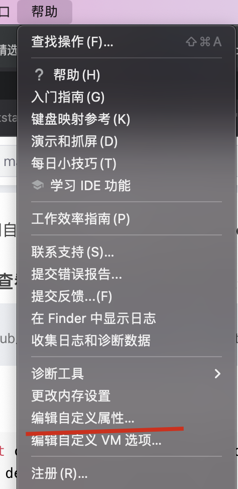
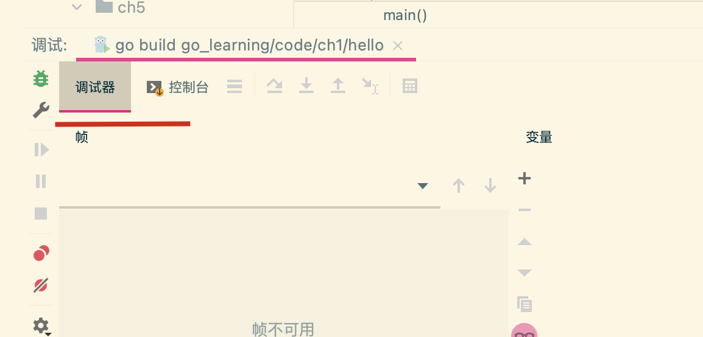

## 1.Goland调试器断点失效

2021.1版本

解决方法:重新设置 delve

1.安装dlv

```shell
$ git clone https://github.com/go-delve/delve
$ cd delve
$ go install github.com/go-delve/delve/cmd/dlv
```

安装完成后在 GOPATH下的bin目录会有一个dlv

2.在 Goland的 `帮助->编辑自定义属性`

在这个文件中添加一行

```shell
dlv.path=GOPATH的目录/bin
```

随后重启IDE，然后进行调试的时候发现，他走的路径其实是`GOPATH/bin/mac/dlv`

3.所以要在对应的文件夹下面创建这个`mac`目录，然后将这个`dlv`放到`mac`文件夹下面






## 2. IDEA 识别项目失败

```shell
rm -rf .idea
```

重启idea
