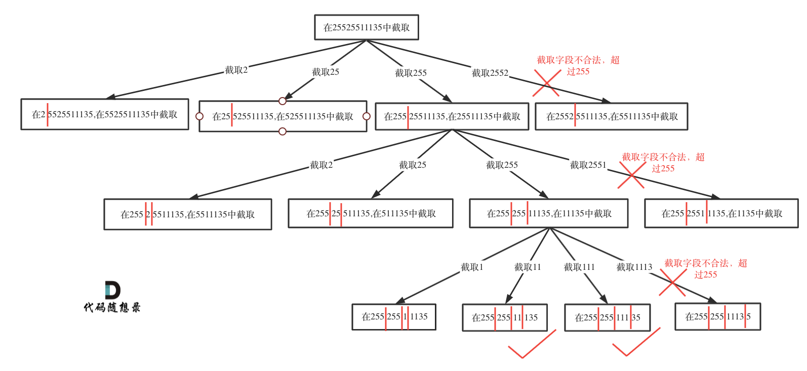

# 二分查找

## 二分法两种写法

1. 左闭右开区间 [left, right)

```python
class Solution:
    def search(self, nums: List[int], target: int) -> int:
        left, right = 0, len(nums)
        while left < right:
            mid = left + (right-left)//2
            if nums[mid] == target:
                return mid 
            elif nums[mid] > target:
                right = mid
            else:
                left = mid+1
        return -1

```

2. 左右都是闭区间[left,right]

```python
class Solution:
    def search(self, nums: List[int], target: int) -> int:
        left, right = 0, len(nums)-1
        while left <= right:
            mid = left + (right-left)//2
            if nums[mid] == target:
                return mid 
            elif nums[mid] > target:
                right = mid-1
            else:
                left = mid+1
        return -1
```

## 首个大于目标值的位置

```python
class Solution:
    def search(self, nums: List[int], target: int) -> int:
        # 初始二分查找范围为整个数组[0, n)
        left, right = 0, len(nums)
        # 找到首个大于target的值
        while left < right:
            mid = left + ((right - left) >> 1) # 获取中间值
            if nums[mid] > target:
                right = mid    # 找到一个大于target的值，暂存并在左半区间继续查找
            else:
                left = mid + 1 # 没有找到大于target的值，在右半区间继续查找
  
        return -1 if right == len(nums) else right  # 如果right没有更新，说明没有找到首个大于target的值，返回-1
```

## 首个大于等于目标值的位置

```python
class Solution:
    def search(self, nums: List[int], target: int) -> int:
        # 初始二分查找范围为整个数组[0, n)
        left, right = 0, len(nums)
        # 找到首个大于等于target的值
        while left < right:
            mid = left + ((right - left) >> 1) # 获取中间值
            if nums[mid] >= target:
                right = mid    # 找到一个大于等于target的值，暂存并在左半区间继续查找
            else:
                left = mid + 1 # 没有找到大于等于target的值，在右半区间继续查找
  
        return -1 if right == len(nums) else right  # 如果right没有更新，说明没有找到首个大于target的值，返回-1
```

## 最后小于目标值的位置

```python
class Solution:
    def search(self, nums: List[int], target: int) -> int:
        # 初始二分查找范围为整个数组[0, n)
        left, right = 0, len(nums)
        # 找到最后小于target的值
        while left < right:
            mid = left + ((right - left) >> 1)
            if nums[mid] < target:
                left = mid + 1  # 找到一个小于target的值，暂存并在右半区间继续查找更大的小于target的值
            else:
                right = mid    # 没有找到小于target的值，则在左半区间去寻找更小的数
  
        return left - 1    # left始终为暂存结果的后一位
```

## 最后小于等于目标值的位置

```python
class Solution:
    def search(self, nums: List[int], target: int) -> int:
        # 初始二分查找范围为整个数组[0, n)
        left, right = 0, len(nums)
        # 找到最后小于target的值
        while left < right:
            mid = left + ((right - left) >> 1)
            if nums[mid] <= target:
                left = mid + 1  # 找到一个小于target的值，暂存并在右半区间继续查找更大的小于target的值
            else:
                right = mid    # 没有找到小于target的值，则在左半区间去寻找更小的数
  
        return left - 1    # left始终为暂存结果的后一位
```

## 题目

### [35. 搜索插入位置](https://leetcode.cn/problems/search-insert-position/)

思路：

找到目标值或者返回按照顺序的插入吧位置

可以转化为：找到首个大于等于target的位置

```python
class Solution:
    def searchInsert(self, nums: List[int], target: int) -> int:
        # 初始化两个指针 left 和 right 分别指向数组的起始和末尾
        left, right = 0, len(nums)

        # 使用二分查找法
        while left < right:
            # 计算中间位置 mid，避免溢出使用 left + (right - left) // 2
            mid = left + (right - left) // 2

            #找到一个大于等于target的值，暂存并在左半区间继续查找
            if nums[mid] >= target:
                right = mid
            else:
                left = mid+1

        return right
        
```

### [74. 搜索二维矩阵](https://leetcode.cn/problems/search-a-2d-matrix/)

思路：

整个数组矩阵是连续的

```python
class Solution:
    def searchMatrix(self, matrix: List[List[int]], target: int) -> bool:
        # 二分查找
        # 因为其实整个数组是连续的
        # 使用 // 向下取整比较方便

        if not matrix: return False

        m, n = len(matrix), len(matrix[0])
        left, right = 0, m * n

        while left < right:
            mid = (left + right) // 2
            num = matrix[mid // n][mid % n]

            if num == target:
                return True

            if num > target:
                right = mid 
            else:
                left = mid + 1
        return False
```

### [34. 在排序数组中查找元素的第一个和最后一个位置](https://leetcode.cn/problems/find-first-and-last-position-of-element-in-sorted-array/)

思路：

1. 定义辅助函数，找到首个大于target的位置
2. 将num和num-1传入函数中，就可以得到target的开始结束位置

```python
class Solution:
    def searchRange(self, nums: List[int], target: int) -> List[int]:
        """
        返回首个大于target的元素索引，如果不存在，返回数组长度n
         @param nums: 输入数组
         @param target: 目标值
         @return: 目标值索引
        """
        def search(target: int) -> int:
            # 初始二分查找范围为整个数组[0, n)
            left, right = 0, len(nums)
            # 找到首个大于target的值
            while left < right:
                mid = left + ((right - left) >> 1) # 获取中间值
                if nums[mid] > target:
                    right = mid    # 找到一个大于target的值，暂存并在左半区间继续查找
                else:
                    left = mid + 1 # 没有找到大于target的值，在右半区间继续查找
            return right

        if not nums:
            return [-1, -1]
        # 首个target如果存在，一定是首个大于target-1的元素
        start = search(target - 1)
        if start == len(nums) or nums[start] != target:
            return [-1, -1]    # 首个target不存在，即数组中不包含target
        # 找到首个大于target的元素，最后一个target一定是其前一位
        end = search(target)
        return [start, end - 1]
```

### [33. 搜索旋转排序数组](https://leetcode.cn/problems/search-in-rotated-sorted-array/)

思路：

旋转数组：本来是升序数组，在某个位置发生旋转

二分查找，需要判断左半部分还是右半部分是有序的

```python
class Solution:
    def search(self, nums: List[int], target: int) -> int:
        # 二分查找
        # 0～mid不包含旋转，且target在此范围内：nums[0] <= target <= nums[mid] 时  向前规约
        # 0 - mid包含旋转，分两两种情况：1，target <= nums[mid] < nums[0] 时向前规约（target 在旋转位置到 mid 之间）；
        # 2，nums[mid] < nums[0] <= target 时向前规约（target 在 0 到旋转位置之间）；

        # 上述三种情况可以总结如下：
        # nums[0] <= target <= nums[mid]
                   # target <= nums[mid] < nums[0]
                             # nums[mid] < nums[0] <= target

        # (nums[0] <= target)， (target <= nums[mid]) ，(nums[mid] < nums[0])，
        # 现在我们想知道这三项中有哪两项为真（明显这三项不可能均为真（因为这三项可能已经包含了所有情况））
        # 所以我们现在只需要区别出这三项中有两项为真还是只有一项为真。
        # 使用 “异或” 操作可以轻松的得到上述结果（两项为真时异或结果为假，一项为真时异或结果为真

        # 换句话说就是： nums[mid] < nums[0]，nums[0] > target，target > nums[mid] 三项均为真或者只有一项为真时向后规约。

        if not nums: return -1
        size = len(nums)
        left, right = 0, size-1

        while left<=right:
            mid = (left+right)//2
            if nums[mid] == target:
                return mid

            # if (nums[left]>nums[mid])^(nums[left]>target)^(target>nums[mid]):
            #     left = mid+1
            # else:
            #     right = mid-1

            # 判断左半部分是否有序
            if nums[left] <= nums[mid]:
                if nums[left] <= target <= nums[mid]:
                    right = mid - 1
                else:
                    left = mid + 1
            else:
                if nums[mid] <= target <= nums[right]:
                    left = mid + 1
                else:
                    right = mid - 1
  
        return -1
```

### [153. 寻找旋转排序数组中的最小值](https://leetcode.cn/problems/find-minimum-in-rotated-sorted-array/)

```python
       # 二分查找

        # 找到最小值，mid与right比较，
        # 如果mid大，则说明mid到right之间一定发生了旋转，那么最小值在mid+1到right之间
        # 如果right大，说明mid到right之间是单调递增的，最小值会在 left到mid之间

        left, right = 0, len(nums)-1
        while left<right:
            mid = (left+right)//2
            if nums[mid]>nums[right]:
                left = mid+1
            else:
                right = mid
        return nums[left]
```

# 栈

## 题目

### [20. 有效的括号](https://leetcode.cn/problems/valid-parentheses/)

思路：括号左右对应，遇到右括号就弹出stack, 判断是否是对应

```python
class Solution:
    def isValid(self, s: str) -> bool:
        # stack
        # 为了减少边界条件的判断，stack放入一个不相干的值
        # 以左括号为key，右括号为value

        stack, dic = ['?'], {'(':')', '[':']', '{':'}'}

        for i in s:
            if i in dic:
                stack.append(dic[i])
            else:
                if i != stack.pop():
                    return False

        return len(stack) == 1
```

### [155. 最小栈](https://leetcode.cn/problems/min-stack/)

思路：使用辅助栈，保证getMin快速得到数据

```python
class MinStack:

    def __init__(self):
        # 数据栈，用于存储元素
        self.data = []
        # 辅助栈，用于存储当前最小值
        self.helper = []

    def push(self, val: int) -> None:
        # 将元素入栈到数据栈
        self.data.append(val)
        # 如果辅助栈为空或者新元素小于辅助栈的栈顶元素，则将新元素入栈到辅助栈，否则将辅助栈的栈顶元素再次入栈
        if len(self.helper) == 0 or val < self.helper[-1]:
            self.helper.append(val)
        else:
            self.helper.append(self.helper[-1])

    def pop(self) -> None:
        # 弹出数据栈和辅助栈的栈顶元素
        if self.data:
            self.helper.pop()
            return self.data.pop()

    def top(self) -> int:
        # 返回数据栈的栈顶元素
        if self.data:
            return self.data[-1]

    def getMin(self) -> int:
        # 返回辅助栈的栈顶元素，即当前最小值
        if self.helper:
            return self.helper[-1]

```

### [394. 字符串解码](https://leetcode.cn/problems/decode-string/)

思路：

1. 如果是'[',则将当前的数字和字符串都放入栈中
2. 如果是']',则将栈中数据弹出，更新解码结果
3. 遇到数字需要累加
4. 遇到字符，更新当前字符

```python
class Solution:
    def decodeString(self, s: str) -> str:
        # 初始化栈、当前解码结果和当前数字的累积值
        stack, res, multi = [], "", 0

        # 遍历字符串
        for c in s:
            # 处理左括号 '['
            if c == '[':
                # 将当前数字和解码结果入栈，然后重置当前解码结果和数字
                stack.append([multi, res])
                res, multi = "", 0
            # 处理右括号 ']'
            elif c == ']':
                # 弹出栈顶元素，获取数字和栈顶解码结果，更新当前解码结果
                cur_multi, last_res = stack.pop()
                res = last_res + cur_multi * res
            # 处理数字
            elif '0' <= c <= '9':
                # 更新当前数字的累积值
                multi = multi * 10 + int(c)
            # 处理其他字符（字母）
            else:
                # 直接添加到当前解码结果中
                res += c

        # 返回最终解码结果
        return res

```

### [739. 每日温度](https://leetcode.cn/problems/daily-temperatures/)

思路：需要下一个升温的日期

需要建立一个单调栈，栈内元素单调递减

当前value 大于栈内元素时，就是得到升温了，就弹出元素，记录index差值

```python
class Solution:
    def dailyTemperatures(self, temperatures: List[int]) -> List[int]:
        # 单调递减栈
        size = len(temperatures)
        stack = []
        result = [0] *size

        for key, value in enumerate(temperatures):
            # 当前value 大于栈内元素时，就是得到升温了，就弹出元素，记录index差值
            while stack and value> temperatures[stack[-1]]:
                temp = stack.pop()
                result[temp] = key-temp
            stack.append(key)
        return result
```

### [84. 柱状图中最大的矩形](https://leetcode.cn/problems/largest-rectangle-in-histogram/)

思路：

1. 建立单调栈，单调递增的，
2. 当栈不为空且当前柱子的高度小于栈顶柱子的高度时，说明找到右边界
3. 为了处理边界问题，stack加入初始值-1，height尾部加入0，方便处理剩余元素

```python
class Solution:
    def largestRectangleArea(self, heights: List[int]) -> int:

        # stack, 类似于找左右边界，左边界在stack中
        # 传入栈的是元素的下标，但是保证这些元素是单调递增的 height[stack[-1]是栈中最大的元素
        # 遍历数组，如果heights[i] < heights[stack[-1]]，右边界找到(找到比栈顶元素小的数);
        # 一次遍历之后，需要考虑栈里的剩余元素的出栈，需要最后有一个最小的元素0，来帮助其他的元素出栈，所以heights.append(0)
        # 为了减少边界条件判断，stack有初始值[-1]

        # 初始化高度数组，最后添加一个高度为0的柱子，方便处理栈中剩余元素
        heights.append(0)
        # 获取数组长度
        size = len(heights)
        # 初始化单调递增栈，栈中存储的是柱子的下标
        stack = [-1]
        # 初始化最大面积
        result = 0

        # 遍历数组
        for i in range(size):
            # 当栈不为空且当前柱子的高度小于栈顶柱子的高度时，说明找到右边界
            while stack and heights[i] < heights[stack[-1]]:
                # 弹出栈顶元素，计算面积
                height = heights[stack.pop()]
                width = i - stack[-1] - 1
                result = max(result, height * width)

            # 将当前柱子的下标入栈
            stack.append(i)

        # 返回最大面积
        return result

```

# 堆

使用python的heapq

## 题目

### [215. 数组中的第K个最大元素](https://leetcode.cn/problems/kth-largest-element-in-an-array/)

思路：使用堆排序，然后弹出对应的元素

heapq 默认小顶堆

```python
class Solution:
    def findKthLargest(self, nums: List[int], k: int) -> int:
        hp = []
        for num in nums:
            heapq.heappush(hp, -num)
  
        for i in range(k-1):
            heapq.heappop(hp)
        return -heapq.heappop(hp)
```

### [347. 前 K 个高频元素](https://leetcode.cn/problems/top-k-frequent-elements/)

思路：counter得到出现频次，然后建立小顶堆，依次弹出元素

```python
class Solution:
    def topKFrequent(self, nums: List[int], k: int) -> List[int]:
        # 统计 nums 中每个元素的出现次数
        dic = collections.Counter(nums)

        # 创建一个最小堆（heap），堆中每个元素是一个元组 (-value, key)，其中 value 是元素出现的次数，key 是元素本身
        hp = [(-value, key) for key, value in dic.items()]

        # 堆化，将列表 hp 转换为最小堆
        heapq.heapify(hp)

        # 初始化结果列表
        result = []

        # 从堆中弹出前 k 个元素，将它们添加到结果列表中
        for i in range(k):
            result.append(heapq.heappop(hp)[1])

        # 返回结果列表
        return result

```

# 贪心算法

## 题目

### [55. 跳跃游戏](https://leetcode.cn/problems/jump-game/)

思路 判断是否能够从数组第一个下标，跳到最后一个

1. 从头遍历，记录能够到的最远距离
2. 实时更新这个最远距离

```python
class Solution:
    def canJump(self, nums: List[int]) -> bool:
        # 从头开始跳， 记录当前能到的最远距离
        # 如果 碰到i > 最远距离，则失败，若能一直跳下去就成功了
        # 因为是依次遍历，这个需要保证max_reach是最大的，
        # max_reach = 0
        # for i in range(len(nums)):
        #     if i > max_reach:
        #         return False
        #     max_reach = max(max_reach, nums[i] + i)
  
        # return True

        # 从后向前
        # 最远可以到达的位置 >= reach时， reach可以向前移动
        # 当reach==0时，即从数组头部可以到达最后一个元素
        reach = len(nums) - 1

        for i in range(reach, -1, -1):
            if nums[i] + i >= reach:
                reach = i

#如果最终 reach 等于 0，说明能够到达起始位置
        return reach == 0
```

### [45. 跳跃游戏 II](https://leetcode.cn/problems/jump-game-ii/)

思路：肯定可以到底最后，但是需要计算多少步

1. 和上面类似，需要记录最远距离 max_reach
2. 需要记录当前 步数内 可以达到的最远距离 end
3. 当遍历时发现 i 超过end，意思需要跳跃（加步数）

```python
class Solution:
    def jump(self, nums: List[int]) -> int:
         # 贪心算法 从前往后
        # 从头开始跳， 记录当前能到的最远距离 max_reach
        # end 表示当前步数内能够到达的最远位置
        # max_reach 表示当前能够到达的最远位置，是在遍历数组时不断更新的变量。
        # 如果当前位置 i 超过了 end，说明需要进行一次跳跃。
        max_reach, end = 0, 0
        step = 0

        for i in range(len(nums)):
            if i > end:
                end = max_reach
                step += 1

            max_reach = max(nums[i] + i, max_reach)

        return step
```

### [763. 划分字母区间](https://leetcode.cn/problems/partition-labels/)

思路：为了满足同一个字母，只在一个片段中出现

尽量将同一个字母最后一次出现的位置作为片段的结束位置

```python
class Solution:
    def partitionLabels(self, S: str) -> List[int]:
        # 同一个字母只能出现在同一个片段中
        # 也就是说同一个字母 第一次出现和最后一次出现 必须在同一个片段
        dic = {s: index for index, s in enumerate(S)}   #存储某个字母对应地最后一个序号
        num = 0  #直接计数
        result = []
        j = dic[S[0]]  #当前片段的最后位置

        for i in range(len(S)):  #逐个遍历
            num += 1  #找到一个就加1个长度，表示当前片段长度
            if dic[S[i]] > j:  #如果最后位置比刚才的大，就更新最后位置
                j = dic[S[i]]
            if i == j:  #片段结束，当前位置和这个字母在字典里的最后位置是相同的
                result.append(num)  # 加入result
                num = 0 # 归0
        return result
```

### [135. 分发糖果](https://leetcode.cn/problems/candy/)

思路：要先确定一边，再确定另一边

1. 先确定右边评分大于左边的，从左到右遍历。此时局部最优：只要右边评分比左边大，右边的孩子就多一个糖果，全局最优：相邻的孩子中，评分高的右孩子获得比左边孩子更多的糖果。如果ratings[i] > ratings[i - 1] 那么candyVec[i] = candyVec[i - 1] + 1
2. 然后确定左边评分大于右边的，从右到左遍历。如果 ratings[i] > ratings[i + 1]，此时candyVec[i]（第i个小孩的糖果数量）就有两个选择了，一个是candyVec[i + 1] + 1（从右边这个加1得到的糖果数量），一个是candyVec[i]（之前比较右孩子大于左孩子得到的糖果数量）。取大的值

```python
class Solution:
    def candy(self, ratings: List[int]) -> int:
        candyVec = [1] * len(ratings)
  
        # 从前向后遍历，处理右侧比左侧评分高的情况
        for i in range(1, len(ratings)):
            if ratings[i] > ratings[i - 1]:
                candyVec[i] = candyVec[i - 1] + 1
  
        # 从后向前遍历，处理左侧比右侧评分高的情况
        for i in range(len(ratings) - 2, -1, -1):
            if ratings[i] > ratings[i + 1]:
                candyVec[i] = max(candyVec[i], candyVec[i + 1] + 1)
  
        # 统计结果
        result = sum(candyVec)
        return result

```

### [406. 根据身高重建队列](https://leetcode.cn/problems/queue-reconstruction-by-height/)

思路：类似，首先确定身高的顺序，然后再确认k

```python
class Solution:
    def reconstructQueue(self, people: List[List[int]]) -> List[List[int]]:
        res = []  # 用于存储重新构造的队列
        people = sorted(
            people, key=lambda x: (-x[0], x[1])
        )  # 根据身高降序、人数升序排序

        # 第一个元素，降序排序，
        # 保证在这个元素之前的个数，就是大于等于它的元素的数量
        for p in people:
            # 遍历排序后的人群
            if len(res) <= p[1]:
                # 如果当前队列长度小于等于p[1]，直接在队列末尾添加当前人的信息
                res.append(p)
            elif len(res) > p[1]:
                # 如果当前队列长度大于p[1]，则插入到指定位置，保持前面高于或等于他的人数的条件
                res.insert(p[1], p)

        return res

```

可以简化，排序后直接按照 k来插入

```python
class Solution:
    def reconstructQueue(self, people: List[List[int]]) -> List[List[int]]:
        result = []
        people = sorted(people, key=lambda x: (-x[0], x[1]))

        for value in people:
            result.insert(value[1], value)

        return result
```

### [452. 用最少数量的箭引爆气球](https://leetcode.cn/problems/minimum-number-of-arrows-to-burst-balloons/)

思路： 按照左边界排序，然后遍历让气球尽可能的重叠，如果重叠了，那么**重叠气球中右边边界的最小值 之前的区间一定需要一个弓箭** 。

```python
class Solution:
    def findMinArrowShots(self, points: List[List[int]]) -> int:
        # 如果气球列表为空，直接返回0
        if len(points) == 0:
            return 0
  
        # 根据气球的起始位置对气球列表进行排序
        points.sort(key=lambda x: x[0])
  
        # 初始化箭的数量为1，因为至少需要一支箭
        result = 1
  
        # 遍历气球列表
        for i in range(1, len(points)):
            # 如果当前气球的起始位置大于前一个气球的结束位置，
            # 表示两个气球不相交，需要额外的一支箭
            if points[i][0] > points[i - 1][1]:
                result += 1
            else:
                # 如果两个气球相交，更新当前气球的结束位置为两者的最小结束位置
                points[i][1] = min(points[i - 1][1], points[i][1])
  
        # 返回最终的箭数量
        return result

```

### [435. 无重叠区间](https://leetcode.cn/problems/non-overlapping-intervals/)

思路：两个方法，找到重叠的区间，剔除；另一个记录有多少不重叠的区间，然后size-count

```python
class Solution:
    def eraseOverlapIntervals(self, intervals: List[List[int]]) -> int:
        if not intervals:
            return 0
  
        intervals.sort(key=lambda x: x[0])  # 按照左边界升序排序
        count = 0  # 记录重叠区间数量
  
        for i in range(1, len(intervals)):
            if intervals[i][0] < intervals[i - 1][1]:  # 存在重叠区间
                intervals[i][1] = min(intervals[i - 1][1], intervals[i][1])  # 更新重叠区间的右边界
                count += 1
  
        return count
```

类似射箭问题，射箭是找到不重叠的区间

```python
class Solution:
    def eraseOverlapIntervals(self, intervals: List[List[int]]) -> int:
        if not intervals:
            return 0
  
        intervals.sort(key=lambda x: x[0])  # 按照左边界升序排序
  
        result = 1  # 不重叠区间数量，初始化为1，因为至少有一个不重叠的区间
  
        for i in range(1, len(intervals)):
            if intervals[i][0] >= intervals[i - 1][1]:  # 没有重叠
                result += 1
            else:  # 重叠情况
                intervals[i][1] = min(intervals[i - 1][1], intervals[i][1])  # 更新重叠区间的右边界
  
        return len(intervals) - result

```

### [56. 合并区间](https://leetcode.cn/problems/merge-intervals/)

思路：先排序，后比较区间

```python
class Solution:
    def merge(self, intervals: List[List[int]]) -> List[List[int]]:
        # 先排序
        if not intervals:
            return []  # 如果输入为空列表，则直接返回空列表

        intervals = sorted(intervals, key=lambda x: x[0])  # 对区间列表按照起始位置进行排序
        result = [intervals[0]]  # 初始化结果列表，将第一个区间添加到结果列表

        for e in intervals[1:]:
            # 如果当前区间的起始位置大于结果列表中最后一个区间的结束位置，直接将当前区间添加到结果列表
            if e[0] > result[-1][1]:
                result.append(e)  
                # 否则，合并当前区间与结果列表中最后一个区间
            else:
                result[-1] = [result[-1][0], max(result[-1][1], e[1])]  

        return result  # 返回合并后的结果列表

```

# 动态规划

**动态规划中每个状态是由上个状态推导出来的**。

动态规划的五步骤：

1. 确定dp数组及下标的含义
2. 确定递推公式
3. 确定如何初始化
4. 确定遍历顺序
5. 举例推导dp数组

## 理论-背包问题

### 0-1背包

#### 问题：

有n件物品和一个最多能背重量为w 的背包。第i件物品的重量是weight[i]，得到的价值是value[i] 。 **每件物品只能用一次** ，求解将哪些物品装入背包里物品价值总和最大。

**每一件物品其实只有两个状态，取或者不取**

#### 解题思路

**dp[i][j] 表示从下标为[0-i]的物品里任意取，放进容量为j的背包，价值总和最大是多少** 。

1. 不放物品i:(当前物品i的重量超过背包能够负担的j，无法放入)，所以`dp[i][j]=dp[i-1][j]`
2. 放入物品i: `dp[i][j]=dp[i - 1][j - weight[i]] + value[i]`
3. 递推公式：

```python
dp[i][j] = max(dp[i - 1][j], dp[i - 1][j - weight[i]] + value[i])
```

4. 初始化

   * 如果背包容量j为0的话，即dp[i][0]，无论是选取哪些物品，背包价值总和一定为0
   * dp[0][j]，即：i为0，存放编号0的物品的时候，各个容量的背包所能存放的最大价值。需要根据j和weight[0]判断：j < weight[0]的时候，dp[0][j] 应该是 0；j >= weight[0]时，dp[0][j] 应该是value[0]
5. 遍历顺序

**先遍历物品，后遍历背包重量更好理解**

```python
def test_2_wei_bag_problem1(weight, value, bagweight):
    # 二维数组
    dp = [[0] * (bagweight + 1) for _ in range(len(weight))]

    # 初始化
    for j in range(weight[0], bagweight + 1):
        dp[0][j] = value[0]

    # weight数组的大小就是物品个数
    for i in range(1, len(weight)):  # 遍历物品
        for j in range(bagweight + 1):  # 遍历背包容量
            if j < weight[i]:
                dp[i][j] = dp[i - 1][j]
            else:
                dp[i][j] = max(dp[i - 1][j], dp[i - 1][j - weight[i]] + value[i])

    return dp[len(weight) - 1][bagweight]
```

### 0-1背包 -滚动数组

滚动数组就是将上面的二维dp数组压缩

能够压缩需要满足条件：上层可以重复利用

1. dp[j]表示：容量为j的背包，所背的物品价值可以最大为dp[j]。
2. dp[j] = max(dp[j], dp[j - weight[i]] + value[i]);dp[j]有两个选择，一个是取自己dp[j] 相当于 二维dp数组中的dp[i-1][j]，即不放物品i，一个是取dp[j - weight[i]] + value[i]，即放物品i
3. 初始化，dp[0]就是0；如果value都是正的，那么不需要手动初始化，默认全是0就行，dp数组在推导的时候一定是取价值最大的数
4. 遍历的时候需要注意，只能先遍历物品
5. 遍历的时候，背包容量要从大到小，遍历；目的保证物品i只被放入一次。

例子：

> 物品0的重量weight[0] = 1，价值value[0] = 15如果正序遍历
>
> dp[1] = dp[1 - weight[0]] + value[0] = 15
>
> dp[2] = dp[2 - weight[0]] + value[0] = 30
>
> 此时dp[2]就已经是30了，意味着物品0，被放入了两次，所以不能正序遍历。
>
> 为什么倒序遍历，就可以保证物品只放入一次呢？
>
> 倒序就是先算dp[2]
>
> dp[2] = dp[2 - weight[0]] + value[0] = 15 （dp数组已经都初始化为0）
>
> dp[1] = dp[1 - weight[0]] + value[0] = 15
>
> 所以从后往前循环，每次取得状态不会和之前取得状态重合，这样每种物品就只取一次了。

```python
def test_2_wei_bag_problem1(weight, value, bagweight):
    # 创建一个一维数组dp，dp[j]表示在背包容量为j的情况下的最大价值
    dp = [0] * (bagweight + 1)

    # 初始化第一行，即只考虑第一件物品的情况
    for j in range(weight[0], bagweight + 1):
        dp[j] = value[0]

    # 从第二个物品开始遍历
    for i in range(1, len(weight)):
        # 从右往左遍历背包容量，更新dp数组
        for j in range(bagweight, weight[i] - 1, -1):
            dp[j] = max(dp[j], dp[j - weight[i]] + value[i])

    # 返回dp数组中最后一个元素的值，即考虑所有物品在背包容量为bagweight时的最大价值
    return dp[bagweight]

```

### 完全背包问题

和0-1背包基本一致，区别就是物品可以被放很多次。

所以背包容量遍历的时候，从小到大遍历

```python
def test_2_wei_bag_problem1(weight, value, bagweight):
    # 创建一个一维数组dp，dp[j]表示在背包容量为j的情况下的最大价值
    dp = [0] * (bagweight + 1)

    # 初始化第一行，即只考虑第一件物品的情况
    for j in range(weight[0], bagweight + 1):
        dp[j] = value[0]

    # 从第二个物品开始遍历
    for i in range(1, len(weight)):
        # 从左往右遍历背包容量，更新dp数组
        for j in range(weight[i], bagweight+1):
            dp[j] = max(dp[j], dp[j - weight[i]] + value[i])

    # 返回dp数组中最后一个元素的值，即考虑所有物品在背包容量为bagweight时的最大价值
    return dp[bagweight]
```

### 多维动态规划-股票买卖问题

// 买卖股票问题 套路公式  DP方法,穷举框架，列出所有的可能性的结果
//
// for 状态1 in 状态1的所有值：
//     for 状态2 in 状态2的所有值：
//         for .....:
//             dp[状态1][状态2][...] = 选择

// dp[i][k][o], i是天数，k是已经操作的次数，o=[0,1],0是手上无股票，1是有
// dp[i][k][0] = max(dp[i-1][k][0], dp[i-1][k][1]+prices[i])
// dp[i][k][1] = max(dp[i-1][k][1], dp[i-1][k-1][0]-prices[i])
// dp[i][0][1] 不存在 没有交易下是不可能持有股票的，不存在
// dp[i][0][0] = 0

## 题目

### [70. 爬楼梯](https://leetcode.cn/problems/climbing-stairs/)

思路：斐波拉契数列

每次可以爬 1阶或两阶

dp[i] = dp[i-1]+dp[i-2]

```python
class Solution:
    def climbStairs(self, n: int) -> int:
        if n<3:
            return n

        dp=[0]*n
        dp[0]=1
        dp[1]=2
        for i in range(2,n):
            dp[i]=dp[i-1]+dp[i-2]

        return dp[-1]
```

### [746. 使用最小花费爬楼梯](https://leetcode.cn/problems/min-cost-climbing-stairs/)

思路：

1. **dp[i]的定义：到达第i台阶所花费的最少体力为dp[i]**
2. **可以有两个途径得到dp[i]，一个是dp[i-1] 一个是dp[i-2]**

dp[i - 1] 跳到 dp[i] 需要花费 dp[i - 1] + cost[i - 1]。

dp[i - 2] 跳到 dp[i] 需要花费 dp[i - 2] + cost[i - 2]。

```python
class Solution:
    def minCostClimbingStairs(self, cost: List[int]) -> int:
        dp = [0] * (len(cost) + 1)
        dp[0] = 0  # 初始值，表示从起点开始不需要花费体力
        dp[1] = 0  # 初始值，表示经过第一步不需要花费体力
  
        for i in range(2, len(cost) + 1):
            # 在第i步，可以选择从前一步（i-1）花费体力到达当前步，或者从前两步（i-2）花费体力到达当前步
            # 选择其中花费体力较小的路径，加上当前步的花费，更新dp数组
            dp[i] = min(dp[i - 1] + cost[i - 1], dp[i - 2] + cost[i - 2])
  
        return dp[len(cost)]  # 返回到达楼顶的最小花费

```

### [118. 杨辉三角](https://leetcode.cn/problems/pascals-triangle/)

思路：每个数是 左上方和右上方数字的和

1. 转换成数组，其实就是上一个行的 斜上方和正上方 的和
2. 初始化要注意，每行头尾都是1

```python
class Solution:
    def generate(self, numRows: int) -> List[List[int]]:
        # 初始化一个空列表用于存储结果
        result = []

        # 遍历每一行
        for i in range(numRows):
            # 初始化当前行的列表
            row = [0] * (i + 1)

            # 第一个和最后一个元素为1
            row[0], row[-1] = 1, 1

            # 计算当前行的中间元素
            for j in range(1, i):
                row[j] = result[i - 1][j - 1] + result[i - 1][j]

            # 将当前行加入结果列表
            result.append(row)

        return result

```

### [198. 打家劫舍](https://leetcode.cn/problems/house-robber/)

思路：不能连续偷两家

1. dp[i] 是当前最高金额， 判断偷i-1或是偷i和i-2
2. dp[i] = max(dp[i-1], dp[i-2]+nums[i])

```python
class Solution:
    def rob(self, nums: List[int]) -> int:
        # DP: 1、重复子问题；2、状态的定义；3、DP方程
        # 不能偷连续两家
        # a[i][0,1]: 0:i偷， 1:i不偷
        # a[i][0] = max(a[i-1][0], a[i-1][1])
        # a[i][1] = a[i-1][0] + nums[i]

        # if not nums:
        #     return 0
  
        # size = len(nums)
        # dp = [[0, 0] for _ in range(size)]
        # dp[0][1] = nums[0]
  
        # for i in range(1, size):
        #     dp[i][0] = max(dp[i - 1][0], dp[i - 1][1])
        #     dp[i][1] = dp[i - 1][0] + nums[i]
        # return max(dp[-1][0], dp[-1][1])

        # 优化：不增加新的维度
        # a[i]: MAX Value，结果返回 max(a)
        # a[i] = max(a[i-1]+0, a[i-2]+nums[i]) 偷i-1或是偷i和i-2

        if not nums:
            return 0

        size = len(nums)
        if size==1:
            return nums[0]

        dp = [0 for _ in range(size)]
        dp[0] = nums[0]
        dp[1] = max(nums[0], nums[1])

        for i in range(2, size):
            dp[i] = max(dp[i - 1], dp[i - 2] + nums[i])

        return dp[-1]
```

### [213. 打家劫舍 II](https://leetcode.cn/problems/house-robber-ii/)

思路：房屋围成一圈了，那就是第一家和最后一家只能偷1个

其他和198一样

1. 将198代码构造成一个辅助函数
2. 比较偷第1和最后一个，谁更高

```python
class Solution:
    def rob(self, nums: List[int]) -> int:
        # 有一个环
        # 第一家和最后一家，只能偷一家，其他的和198题目一致
        if not nums:
            return 0
        if len(nums)<=2:
            return max(nums)

        r1 = self.helper(nums[:-1])
        r2 = self.helper(nums[1:])
        return max(r1,r2)

    def helper(self, nums):
        size = len(nums)
        if size==1:
            return nums[0]

        dp = [0 for _ in range(size)]
        dp[0] = nums[0]
        dp[1] = max(nums[0], nums[1])

        for i in range(2, size):
            dp[i] = max(dp[i - 1], dp[i - 2] + nums[i])

        return dp[-1]
```

### [152. 乘积最大子数组](https://leetcode.cn/problems/maximum-product-subarray/)

思路： 乘积最大的 非空连续子数组

1. 因为可能包含负数，所以要保留一个最小值(负负得正)
2. 在nums[i]<0时，最大值最小值交换

```python
class Solution:
    def maxProduct(self, nums: List[int]) -> int:

        # DP 因为存在负数，负负得正，所以需要维护一个最小值
        # dp[i][0]max, dp[i][1]min
        # 如果nums[i] < 0；dp[i][0]得到结果前需要dp[i-1][0], dp[i-1][1]交换数值；dp[i-1][0]就变成负的了
        # 因为dp中的数据是会随时改变的，需要维护一个最大乘积result值；dp[i-1][0]就变成负的了

        # if not nums:
        #     return 0
        # size = len(nums)

        # dp = [[0 for _ in range(2)] for _ in range(size)]
        # result = dp[0][1] = dp[0][0] = nums[0]
  
        # for i in range(1, size):
        #     # 如果当前元素为负数，交换最大值和最小值
        #     if nums[i] < 0:
        #         dp[i - 1][0], dp[i - 1][1] = dp[i - 1][1], dp[i - 1][0]
  
        #     dp[i][0] = max(dp[i - 1][0] * nums[i], nums[i])
        #     dp[i][1] = min(dp[i - 1][1] * nums[i], nums[i])
        #     result = max(result, dp[i][0])
        # return result

        # DP 本元素的结果只和前一个元素有关
        # 优化空间

        if not nums:
            return 0
        size = len(nums)
        result = imax = imin = nums[0]

        for i in range(1, size):
            # 如果当前元素为负数，交换最大值和最小值
            if nums[i] < 0:
                imax, imin = imin, imax

            imax = max(imax * nums[i], nums[i])
            imin = min(imin * nums[i], nums[i])
            result = max(result, imax)
        return result
```

### [53. 最大子数组和](https://leetcode.cn/problems/maximum-subarray/)

思路：

1. dp[i]到i位置，连续子数组最大的和
2. dp[i] = max(dp[i-1]+nums[i], nums[i])

```python
class Solution:
    def maxSubArray(self, nums: List[int]) -> int:

        # dp[i] 是到第i个为止，连续子数组最大的和
        # dp[i] = max(dp[i-1]+nums[i], nums[i])，
        # num[i]是要加入到前面的dp,还是单独，取决于dp[i-1]+nums[i]是否对自己有增益，
        # 即dp[i-1]+nums[i], nums[i]谁比较大
        # 最后返回dp中的最大值

        # if not nums:
        #     return 0
        # size = len(nums)
        # dp = [0 for _ in range(size)]
        # dp[0] = nums[0]
        # 
        # for i in range(1, size):
        #     dp[i] = max(dp[i - 1] + nums[i], nums[i])
        # 
        # return max(dp)

        # 空间优化

        if not nums:
            return 0
        size = len(nums)

        cur = result = nums[0]
        for i in range(1, size):
            cur = max(cur + nums[i], nums[i])
            result = max(result, cur)
        return result
```

### [674. 最长连续递增序列](https://leetcode.cn/problems/longest-continuous-increasing-subsequence/)

思路：最长的，连续的，递增 子序列

1. 只需要比较 nums[i] 和 nums[i-1]
2. **dp[i]：以下标i为结尾的连续递增的子序列长度为dp[i]**
3. dp[i] = dp[i-1]+1

```python
class Solution:
    def findLengthOfLCIS(self, nums: List[int]) -> int:
        # 连续递增
        # 比较比较nums[i]与nums[i - 1]
        # dp[i] = dp[i - 1] + 1

        if not nums: return 0
        dp = [1] * len(nums)
        for i in range(1,len(nums)):
            if nums[i] > nums[i - 1]:
                dp[i] = dp[i - 1] + 1
        return max(dp)
```

### [300. 最长递增子序列](https://leetcode.cn/problems/longest-increasing-subsequence/)

思路： 最长的 递增子序列

1. 和上面的区别就是 可以是不连续的
2. dp[i] 的值代表 nums 以 nums[i]结尾的最长递增子序列长度。
3. 因为是不连续的，所以需要另一个for循环不断的更新dp
4. 位置i的最长递增子序列 等于 j从0到i-1各个位置的最长递增子序列 + 1 的最大值。
5. 所以：if (nums[i] > nums[j]) dp[i] = max(dp[i], dp[j] + 1);

```python
class Solution:
    def lengthOfLIS(self, nums: List[int]) -> int:
        #dp[i] 的值代表 nums 以 nums[i]结尾的最长递增子序列长度。
        # 位置i的最长递增子序列 等于 j从0到i-1各个位置的最长递增子序列 + 1 的最大值。
        # 所以：if (nums[i] > nums[j]) dp[i] = max(dp[i], dp[j] + 1);
        if not nums: return 0
        dp = [1] * len(nums)
        for i in range(1,len(nums)):
            for j in range(i):
                if nums[j] < nums[i]: # 如果要求非严格递增，将此行 '<' 改为 '<=' 即可。
                    dp[i] = max(dp[i], dp[j] + 1)
        return max(dp)
```

### [139. 单词拆分](https://leetcode.cn/problems/word-break/)

思路： 完全背包问题，需要确认给的字符串是否可以拆分

1. dp[i] 意思长度为i的字符串s[0:i] 是否能拆成单词
2. i<j, dp[i]是true 然后 s[i:j]也是单词，则 dp[j]就是true

```python
class Solution:
    def wordBreak(self, s: str, wordDict: List[str]) -> bool:
        #dp[i]：长度为i的s[0:i]子串是否能拆分成单词
        # i<j, dp[i]是true 然后 s[i:j]也是单词，则 dp[j]就是true
        # dp 长度为 len(str)+1
        # dp[0] = true

        n=len(s)
        dp=[False]*(n+1)
        dp[0]=True
        for i in range(n):
            for j in range(i+1,n+1):
                if dp[i] and (s[i:j] in wordDict):
                    dp[j]=True
        return dp[-1]

```

### [322. 零钱兑换](https://leetcode.cn/problems/coin-change/)

思路：需要使用最少的硬币个数

完全背包问题

1. dp[i]是凑齐价值为i的需要最少的硬币数
2. 那凑到amount，就是 dp[amount-coin]+1
3. 所以要选所有当中最小的

```python
class Solution:
    def coinChange(self, coins: List[int], amount: int) -> int:
        # 类比上楼梯问题，
        # dp[i]是凑齐价值为i需要的最少硬币数量
        # 首先将dp[i]设置为一个不可能的数
        # 想凑到amount，那么凑到amount-coins[i]时的硬币个数+1

        dp = [0] + [float('inf') for _ in range(amount)]
  
        for coin in coins:
            for i in range(coin, amount + 1):
                dp[i] = min(dp[i], dp[i - coin] + 1)
  
        if dp[-1] == float('inf'):
            return -1
        return dp[-1]
```

### [279. 完全平方数](https://leetcode.cn/problems/perfect-squares/)

思路： 使用完全平方数最少的

1. 和凑硬币类似
2. dp[i] = min(dp[i], dp[i-$nums[j]]+1)
3. 牛顿法得到最大的平方根

```python
class Solution:
    def numSquares(self, n: int) -> int:
        # 和凑硬币类似
        # dp[i] = min(dp[i], dp[i-$nums[j]]+1)
        # 先找的最小的sqrt, 然后按照凑硬币的方法

        # 初始化 res 为 n，表示要寻找的最小平方数和的边界
        res = n

        # 初始化 dp 列表，用于存储每个正整数对应的最小平方数和
        dp = [n + 1 for _ in range(n + 1)]
        dp[0] = 0  # 0 的最小平方数和为 0

        # 当 res 的平方大于 n 时，使用牛顿法逼近 res 的平方根，直到找到平方根接近 n 的边界
        while res * res > n:
            res = (res + n // res) // 2

        # 从 1 到 res 进行循环，表示考虑每个平方数作为可能的组成元素
        for e in range(1, res + 1):
            # 对于每个 e * e 开始到 n 的范围，计算 dp[i]
            for i in range(e * e, n + 1):
                # 更新 dp[i]，将其设为当前值和 dp[i - e * e] + 1 中的较小者
                dp[i] = min(dp[i], dp[i - e * e] + 1)

        # 最终，dp[-1] 就是 n 的最小平方数和
        return dp[-1]

```

### [416. 分割等和子集](https://leetcode.cn/problems/partition-equal-subset-sum/)

思路：类比 0-1背包问题

1. 背包容量就是sum/2
2. weight 和 value 都是一样的
3. 也就是说 dp[i]本来是： 容量为i的包，背的物品的最大价值，转换到这个就是 总容量是i的包，背的最大重量是dp[i]，所以dp[i]<=i
4. 如果背包能够装满，说明找到了，dp[target]=target
5. 公式：dp[i]=max(dp[i], dp[i-nums[j]]+nums[j])

```python
class Solution:
    def canPartition(self, nums: List[int]) -> bool:
        if sum(nums) % 2 != 0:
            return False
        target = sum(nums) // 2
        dp = [0] * (target + 1)
        for num in nums:
            for j in range(target, num-1, -1):
                dp[j] = max(dp[j], dp[j-num] + num)
        return dp[-1] == target
```

### [1049. 最后一块石头的重量 II](https://leetcode.cn/problems/last-stone-weight-ii/)

思路：0-1 背包问题

石头一起粉碎，得到最后最小可能重量

转化一下就是：将石头分成尽可能重量相等的两堆，然后一起粉碎，这样就喝上面的很像了，唯一区别就是最后的结果处理，需要sum-dp[-1]*2

1. dp[j]就是容量为j的包，能够装的最大重量

```python
class Solution:
    def lastStoneWeightII(self, stones: List[int]) -> int:
        total_sum = sum(stones)
        target = total_sum // 2
        dp = [0] * (target + 1)
        for stone in stones:
            for j in range(target, stone - 1, -1):
                dp[j] = max(dp[j], dp[j - stone] + stone)
        return total_sum - 2* dp[-1]
```

### [494. 目标和](https://leetcode.cn/problems/target-sum/)

思路，可以转化为背包问题

1. 所有使用'+'的元素和为 x，所有使用'-'的元素和就是 sum(nums)-x
2. 然后要求 x-（sum-x）=target，=> x=(target+sum)/2
3. 转化为装满 容量是x的背包
4. 边界条件 x是整数，所以 不能出现//2 向下取整的
5. dp[j]就是 填满这个容量j的包的方法数
6. 推导：只要搞到nums[i]，凑成dp[j]就有dp[j - nums[i]] 种方法。

> 例如：dp[j]，j 为5，
>
> * 已经有一个1（nums[i]） 的话，有 dp[4]种方法 凑成 容量为5的背包。
> * 已经有一个2（nums[i]） 的话，有 dp[3]种方法 凑成 容量为5的背包。
> * 已经有一个3（nums[i]） 的话，有 dp[2]中方法 凑成 容量为5的背包
> * 已经有一个4（nums[i]） 的话，有 dp[1]中方法 凑成 容量为5的背包
> * 已经有一个5 （nums[i]）的话，有 dp[0]中方法 凑成 容量为5的背包
>
> 那么凑整dp[5]有多少方法呢，也就是把 所有的 dp[j - nums[i]] 累加起来

7. dp[j]+=dp[j-nums[i]]
8. 初始化，dp[0]=1,其他都初始化为0

```python
class Solution:
    def findTargetSumWays(self, nums: List[int], target: int) -> int:
        total_sum = sum(nums)  # 计算nums的总和
        if abs(target) > total_sum:
            return 0  # 此时没有方案
        if (target + total_sum) % 2 == 1:
            return 0  # 此时没有方案
        target_sum = (target + total_sum) // 2  # 目标和
        dp = [0] * (target_sum + 1)  # 创建动态规划数组，初始化为0
        dp[0] = 1  # 当目标和为0时，只有一种方案，即什么都不选
        for num in nums:
            for j in range(target_sum, num - 1, -1):
                dp[j] += dp[j - num]  # 状态转移方程，累加不同选择方式的数量
        return dp[target_sum]  # 返回达到目标和的方案数
```

### [518. 零钱兑换 II](https://leetcode.cn/problems/coin-change-ii/)

思路：需要知道凑成总金额的组合数

完全背包问题，需要注意是组合数不是排序数

就像上面，需要知道多多少组合数或者排序数，一般递推公式：

**dp[j] += dp[j-coins[i]]**

dp[j] 就是所有的dp[j - coins[i]]（考虑coins[i]的情况）相加。

```python
class Solution:
    def change(self, amount: int, coins: List[int]) -> int:
        #dp[j]：凑成总金额j的货币组合数为dp[j]
        #组合数就是：dp[j] 就是所有的dp[j - coins[i]]（考虑coins[i]的情况）相加。
        # dp[j] += dp[j-coins[i]]

        #本题求的是组合数，所以和元素顺序没有关系
        # 如果求组合数就是外层for循环遍历物品，内层for遍历背包。
        # 如果求排列数就是外层for遍历背包，内层for循环遍历物品。

        dp = [0]*(amount + 1)
        dp[0] = 1
        # 遍历物品
        for i in range(len(coins)):
            # 遍历背包
            for j in range(coins[i], amount + 1):
                dp[j] += dp[j - coins[i]]
        return dp[amount]

```

### [377. 组合总和 Ⅳ](https://leetcode.cn/problems/combination-sum-iv/)

思路：说是组合，其实是排序数

总体思路和上面问题一致，不同的是 内外for循环要调整

因为是排序数，所以num不同的位置也是计算在哪的。

需要背包容量循环在外，物品循环在内。

遍历nums（物品）放在外循环，遍历target的作为内循环的话，

举一个例子：计算dp[4]的时候，结果集只有 {1,3} 这样的集合，

不会有{3,1}这样的集合，因为nums遍历放在外层，3只能出现在1后面

```python
class Solution:
    def combinationSum4(self, nums: List[int], target: int) -> int:
        # 其实是求排序数
        # dp[i]: 凑成目标正整数为i的排列个数为dp[i]
        # dp[i] += dp[i - nums[j]]


        dp =[0]*(target+1)
        dp[0]=1
        for i in range(1,target+1):
            for j in range(len(nums)):
                if i-nums[j]>=0:
                    dp[i]+= dp[i-nums[j]]

        return dp[target]
```

---

### [62. 不同路径](https://leetcode.cn/problems/unique-paths/)

思路：只能向下或向右

1. dp[i][j], 到达[i,j]的位置，由多少路径
2. 机器人能向下或者向右一步，公式就是 `dp[i][j]= dp[i-1][j]+dp[i][j-1]`
3. 初始化，最上边和最右边的dp都是1
4. 遍历就是两个for循环，顺序可以调整

```python
class Solution:
    def uniquePaths(self, m: int, n: int) -> int:
        # f[i][j] = f[i-1][j] + f[i][j-1]
        dp = [[1 for _ in range(n)] for _ in range(m)]
  
        for i in range(1, m):
            for j in range(1, n):
                dp[i][j] = dp[i - 1][j] + dp[i][j - 1]
  
        return dp[-1][-1]
```

### [64. 最小路径和](https://leetcode.cn/problems/minimum-path-sum/)

思路：只能向下或向右

1. dp[i][j] 就是到达[i,j]路径上数字和最小的数
2. 公式： dp[i][j] = min(dp[i-1][j], dp[i][j-1]) + grid[i][j]
3. 初始化：数字都是正数，最上边和最右边要按照边界情况初始化，其他都是0
4. 两个for循环

```python
class Solution:
    def minPathSum(self, grid: List[List[int]]) -> int:
        # dp[i][j] = min(dp[i-1][j],dp[i][j-1])+grid[i][j]

        m, n = len(grid), len(grid[0])
        dp = [[0 for _ in range(n)]for _ in range(m)]
  
        dp[0][0] = grid[0][0]
  
        for i in range(1, m):
            dp[i][0] = dp[i-1][0] + grid[i][0]
  
        for j in range(1, n):
            dp[0][j] = dp[0][j-1] + grid[0][j]
  
        for i in range(1,m):
            for j in range(1,n):
                dp[i][j] = min(dp[i-1][j], dp[i][j-1]) + grid[i][j]
  
        return dp[-1][-1]
```

可以优化一下，不用额外的空间

```python
class Solution:
    def minPathSum(self, grid: List[List[int]]) -> int:
        m, n = len(grid), len(grid[0])
        for i in range(1, m):
            grid[i][0] += grid[i - 1][0]

        for j in range(1, n):
            grid[0][j] += grid[0][j - 1]

        for i in range(1, m):
            for j in range(1, n):
                grid[i][j] += min(grid[i - 1][j], grid[i][j - 1])

        return grid[-1][-1]
```

### [5. 最长回文子串](https://leetcode.cn/problems/longest-palindromic-substring/)

思路： 动态规划 或者 双指针

1. dp[i][j] 表示子串s[i:j]是否是回文子串，这里是左闭右闭的区间
2. 公式：`dp[i][j] = s[i] == s[j] and (j - i < 2 or dp[i + 1][j - 1])`,其实就是`j-i<2 即 i，j相同位置或两者间隔1个时；只要s[i] == s[j]肯定是回文串`，另外如果dp[i + 1][j - 1])是true，那么只要s[i] == s[j]肯定也是。
3. 初始化，都是false
4. 遍历 要保证i<=j

```python
class Solution:
    def longestPalindrome(self, s: str) -> str:
        # dp[i][j] 表示子串 s[i..j] 是否为回文子串，
        # 这里子串 s[i..j] 定义为左闭右闭区间，可以取到 s[i] 和 s[j]。
        # 空的或长度为1的子串是回文串
        # dp[i][j] = dp[i+1][j-1] and s[i] == s[j]
        # j-i<2 即 i，j相同位置或两者间隔1个时；只要s[i] == s[j]肯定是回文串，
        # 否则就要依据dp[i + 1][j - 1]进行判定了
  
        size = len(s)
        if size < 2: 
            return s  # 如果字符串长度小于2，直接返回原字符串，因为单字符必定是回文子串
  
        dp = [[0 for _ in range(size)] for _ in range(size)]  # 初始化二维动态规划表
        result = ""  # 用于记录最长回文子串
  
        for j in range(size):
            for i in range(j + 1):
                # 判断 s[i..j] 是否为回文子串
                dp[i][j] = s[i] == s[j] and (j - i < 2 or dp[i + 1][j - 1])
        
                # 如果当前子串是回文串，并且长度超过之前记录的最长回文串长度
                if dp[i][j] and j - i + 1 > len(result):
                    result = s[i:j + 1]  # 更新最长回文子串的值
        return result  # 返回最长回文子串
```

双指针法，从中间向两边

```python
class Solution:
    def longestPalindrome(self, s: str) -> str:
        # 获取字符串 s 的长度
        size = len(s)

        # 如果字符串长度小于 2，则直接返回 s，因为任何长度小于 2 的字符串都是回文字符串
        if size < 2: 
            return s

        # 初始化一个空字符串 result，用于存储最长回文子串
        result = ""

        # 枚举所有可能的回文中心位置，总共有 2*size-1 个中心位置（包括字符间隔）
	    #为了处理奇偶性的问题
	    # 如果i是奇数， 如i=1，left=0，right=0+1; 如i=3，left=1，right=1+1;
	    # 如果i是偶数， 如i=2，left=1，right=1+0; 如i=4，left=2，right=2+0;
        for i in range(2 * size - 1):
            # 计算回文中心位置的左右索引
            left = i // 2
            right = left + i % 2

            # 不断扩展左右索引，直到不满足回文条件
            while left >= 0 and right < len(s) and s[left] == s[right]:
                left -= 1
                right += 1

            # 计算当前回文子串，并更新 result 为较长的那个
            result = max(result, s[left + 1: right], key=len)

        # 返回最长回文子串 result
        return result


```

### [1143. 最长公共子序列](https://leetcode.cn/problems/longest-common-subsequence/)

思路：

1. dp[i][j] 代表原 text1 的前i-1个字符和text2的前j-1个字符的最长公共子序列的长度
2. 推导：if text[i] == text[j]时，dp[i][j] = 1+ dp[i-1][j-1];否则就是dp[i][j] = max(dp[i-1][j], dp[i][j-1])

```python
class Solution:
    def longestCommonSubsequence(self, text1: str, text2: str) -> int:
        #	//  dp[i][j] 表示 text1 的前 i-1 个字符和 text2 的前 j-1 个字符的最长公共子序列的长度。
                # if text1[i] == text2[j]:
                #     dp[i][j] = 1+dp[i-1][j-1]
                # else:
                #     dp[i][j] = max(dp[i-1][j], dp[i][j-1])

        if not text1 or not text2:
            return 0

        m, n = len(text1), len(text2)
        dp = [[0 for _ in range(n+1)] for _ in range(m+1)]
        text1 = " " + text1
        text2 = " " + text2

        for i in range(1, m+1):
            for j in range(1, n+1):
                if text1[i] == text2[j]:
                    dp[i][j] = 1+dp[i-1][j-1]
                else:
                    dp[i][j] = max(dp[i-1][j], dp[i][j-1])
        return dp[-1][-1]

```

### [72. 编辑距离](https://leetcode.cn/problems/edit-distance/)

思路：

1. dp[i][j] 代表word1 前i-1个字符到word2前j-1个字符的编辑距离
2. `if word1[i] == word2[j]: dp[i][j] = dp[i-1][j-1]`；否则
   ```
   dp[i][j] = min(
               dp[i-1][j-1]+1,
               dp[i-1][j] +1,
               dp[i][j-1]+1
           )
   ```

```python
class Solution:
    def minDistance(self, word1: str, word2: str) -> int:
        # dp[i][j] 代表 word1[0:1]与 word2[0:j]之间的编辑距离
        # if word1[i] == word2[j]: dp[i][j] = dp[i-1][j-1]
        # else:
        # dp[i][j] = min(
        #     dp[i-1][j-1]+1,
        #     dp[i-1][j] +1,
        #     dp[i][j-1]+1
        # )
        # dp[i-1][j-1] 表示替换操作，dp[i-1][j] 表示删除操作，dp[i][j-1] 表示插入操作。
        # 注意⚠️：第一行和第一列引入""，即word1和word2变成空需要的步数

        # 例子
        # 'acd', 'abc'
        # dp[1][1] = 0; dp[1][2] = dp[1][1]+1(插入);dp[1][3] = dp[1][2]+1(插入);
        # dp[2][1] =dp[1][1] = 0+1(删除) ;dp[2][2] =dp[1][1] = 0+1(替换) ;

        m, n = len(word1), len(word2)
        dp = [[0 for _ in range(n + 1)] for _ in range(m + 1)]

        for i in range(1, m + 1):
            dp[i][0] = i

        for j in range(1, n + 1):
            dp[0][j] = j

        word1 = " "+word1
        word2 = " "+word2

        for i in range(1, m + 1):
            for j in range(1, n + 1):
                if word1[i] == word2[j]:
                    dp[i][j] = dp[i - 1][j - 1]
                    continue
                dp[i][j] = min(dp[i - 1][j - 1], dp[i - 1][j], dp[i][j - 1]) + 1

        return dp[-1][-1]
```

### [121. 买卖股票的最佳时机](https://leetcode.cn/problems/best-time-to-buy-and-sell-stock/)

买卖一次

```python
class Solution:
    def maxProfit(self, prices: List[int]) -> int:
        if not prices:
            return 0
        size = len(prices)
        dp = [[0,0] for _ in range(size)]
        dp[0][1] = -prices[0]

        for i in range(1,size):
            dp[i][0] = max(dp[i-1][0], dp[i-1][1]+prices[i])
            dp[i][1] = max(dp[i-1][1], 0-prices[i])
  
        return dp[-1][0]

```

### [122. 买卖股票的最佳时机 II](https://leetcode.cn/problems/best-time-to-buy-and-sell-stock-ii/)

可以买卖无数次

```python
class Solution(object):
    def maxProfit(self, prices):
        """
        :type prices: List[int]
        :rtype: int
        """
        # 7月24号 第2遍
        # 买卖股票问题 套路公式  DP方法,穷举框架，列出所有的可能性的结果
        #
        # for 状态1 in 状态1的所有值：
        #     for 状态2 in 状态2的所有值：
        #         for .....:
        #             dp[状态1][状态2][...] = 选择

        # dp[i][k][o], i是天数，k是已经操作的次数，o=[0,1],0是手上无股票，1是有
        # dp[i][k][0] = max(dp[i-1][k][0], dp[i-1][k][1]+prices[i])
        # dp[i][k][1] = max(dp[i-1][k][1], dp[i-1][k-1][0]-prices[i])
        # dp[i][0][1] 不存在 没有交易下是不可能持有股票的，不存在
        # dp[i][0][0] = 0

        # k=无穷，其实也就是每天都可交易，所以只和前一天有关系，k可以省略
        if not prices:
            return 0
        size = len(prices)
        dp = [[0, 0] for _ in range(size)]
        dp[0][1] = -prices[0]

        for i in range(1, size):
            dp[i][0] = max(dp[i - 1][0], dp[i - 1][1] + prices[i])
            dp[i][1] = max(dp[i - 1][1], dp[i - 1][0] - prices[i])

        return dp[-1][0]

```

### [23. 买卖股票的最佳时机 III](https://leetcode.cn/problems/best-time-to-buy-and-sell-stock-iii/)

最多可以完成两笔

```python
class Solution(object):
    def maxProfit(self, prices):
        """
        :type prices: List[int]
        :rtype: int
        """
        # 7月24号 第3遍
        # 买卖股票问题 套路公式  DP方法,穷举框架，列出所有的可能性的结果
        #
        # for 状态1 in 状态1的所有值：
        #     for 状态2 in 状态2的所有值：
        #         for .....:
        #             dp[状态1][状态2][...] = 选择

        # dp[i][k][o], i是天数，k是已经操作的次数，o=[0,1],0是手上无股票，1是有
        # dp[i][k][0] = max(dp[i-1][k][0], dp[i-1][k][1]+prices[i])
        # dp[i][k][1] = max(dp[i-1][k][1], dp[i-1][k-1][0]-prices[i])
        # dp[i][0][1] 不存在 没有交易下是不可能持有股票的，不存在
        # dp[i][0][0] = 0

        # k=2
        if not prices:
            return 0
        size = len(prices)
        dp = [[[0, 0] for _ in range(2 + 1)] for _ in range(size)]

        for i in range(size):
            for k in range(2, 0, -1):
                if i == 0:
                    dp[i][k][0] = 0
                    dp[i][k][1] = -prices[0]
                    continue
            
                dp[i][k][0] = max(dp[i - 1][k][0], dp[i - 1][k][1] + prices[i])
                dp[i][k][1] = max(dp[i - 1][k][1], dp[i - 1][k - 1][0] - prices[i])

        return dp[-1][2][0]

```

### [188. 买卖股票的最佳时机 IV](https://leetcode.cn/problems/best-time-to-buy-and-sell-stock-iv/)

最多买k次，区分k的大小和 len(prices)/2对比

```python
class Solution:
    def maxProfit(self, k: int, prices: List[int]) -> int:
        # 买卖股票问题 套路公式  DP方法,穷举框架，列出所有的可能性的结果
        #
        # for 状态1 in 状态1的所有值：
        #     for 状态2 in 状态2的所有值：
        #         for .....:
        #             dp[状态1][状态2][...] = 选择

        # dp[i][k][o], i是天数，k是已经操作的次数，o=[0,1],0是手上无股票，1是有
        # dp[i][k][0] = max(dp[i-1][k][0], dp[i-1][k][1]+prices[i])
        # dp[i][k][1] = max(dp[i-1][k][1], dp[i-1][k-1][0]-prices[i])
        # dp[i][0][1] 不存在 没有交易下是不可能持有股票的，不存在
        # dp[i][0][0] = 0

        # 一次交易由买入和卖出构成，至少需要两天。
        # 所以说有效的限制 k 应该不超过 n/2，如果超过，就没有约束作用了，相当于 k = +infinity。

        if not prices:
            return 0
        size = len(prices)
        if k > size // 2:
            return self.helper1(prices, size)
        else:
            return self.helper2(prices, size, k)

    def helper1(self, prices, size):
        dp = [[0, 0] for _ in range(size)]
        dp[0][0], dp[0][1] = 0, -prices[0]
        for i in range(1, size):
            dp[i][0] = max(dp[i - 1][0], dp[i - 1][1] + prices[i])
            dp[i][1] = max(dp[i - 1][1], dp[i - 1][0] - prices[i])
        return dp[-1][0]

    def helper2(self, prices, size, k):
        dp = [[[0, 0] for _ in range(k + 1)] for _ in range(size)]

        for i in range(size):
            for j in range(k, 0, -1):
                if i == 0:
                    dp[i][j][0] = 0
                    dp[i][j][1] = -prices[i]
                    continue
                dp[i][j][0] = max(dp[i - 1][j][0], dp[i - 1][j][1] + prices[i])
                dp[i][j][1] = max(dp[i - 1][j][1], dp[i - 1][j - 1][0] - prices[i])
        return dp[-1][k][0]

```

### [714. 买卖股票的最佳时机含手续费](https://leetcode.cn/problems/best-time-to-buy-and-sell-stock-with-transaction-fee/)

选择卖出的时候扣除手续费

```python
class Solution:
    def maxProfit(self, prices: List[int], fee: int) -> int:
        # for 状态1 in 状态1的所有值：
        #     for 状态2 in 状态2的所有值：
        #         for .....:
        #             dp[状态1][状态2][...] = 选择

        # dp[i][k][o], i是天数，k是已经操作的次数，o=[0,1],0是手上无股票，1是有
        # dp[i][0][1] 不存在 没有交易下是不可能持有股票的，不存在
        # dp[i][0][0] = 0

        # 有手续费期，DP方程需要修改
        # dp[i][k][0] = max(dp[i-1][k][0], dp[i-1][k][1]+prices[i]-fee)
        # dp[i][k][1] = max(dp[i-1][k][1], dp[i-1][k-1][0]-prices[i])
        # k=无穷，其实也就是每天都可交易，所以只和前一天有关系，k可以省略

        if not prices:
            return 0
        size = len(prices)
        dp = [[0, 0] for _ in range(size)]
        dp[0][0], dp[0][1] = 0, -prices[0]

        for i in range(1, size):
            dp[i][0] = max(dp[i - 1][0], dp[i - 1][1] + prices[i]-fee)
            dp[i][1] = max(dp[i - 1][1], dp[i - 1][0] - prices[i])

        return dp[-1][0]

```

### [309. 买卖股票的最佳时机含冷冻期](https://leetcode.cn/problems/best-time-to-buy-and-sell-stock-with-cooldown/)

一天的冷冻期

```python
class Solution:
    def maxProfit(self, prices: List[int]) -> int:
        # for 状态1 in 状态1的所有值：
        #     for 状态2 in 状态2的所有值：
        #         for .....:
        #             dp[状态1][状态2][...] = 选择

        # dp[i][k][o], i是天数，k是已经操作的次数，o=[0,1],0是手上无股票，1是有
        # dp[i][0][1] 不存在 没有交易下是不可能持有股票的，不存在
        # dp[i][0][0] = 0

        #有冷冻期，DP方程需要修改
        # dp[i][k][0] = max(dp[i-1][k][0], dp[i-1][k][1]+prices[i])
        # dp[i][k][1] = max(dp[i-1][k][1], dp[i-2][k-1][0]-prices[i])
        # k=无穷，其实也就是每天都可交易，所以只和前一天有关系，k可以省略
        if not prices:
            return 0
        size = len(prices)
        dp = [[0, 0] for _ in range(size)]
        dp[0][0], dp[0][1] = 0, -prices[0]

        for i in range(1, size):
            dp[i][0] = max(dp[i - 1][0], dp[i - 1][1] + prices[i])
            dp[i][1] = max(dp[i - 1][1], dp[i - 2][0] - prices[i])

        return dp[-1][0]
```

# 回溯算法

回溯是递归的副产品，有递归就会有回溯

回溯模版

```python
backtracking(参数) {
    if (终止条件) {
        存放结果;
        return;
    }

    for (选择：本层集合中元素（树中节点孩子的数量就是集合的大小）) {
        处理节点;
        backtracking(路径，选择列表); // 递归
        回溯，撤销处理结果
    }
}

```

## 组合-题目

### [77. 组合](https://leetcode.cn/problems/combinations/)

```python
给定两个整数 n 和 k，返回范围 [1, n] 中所有可能的 k 个数的组合。
```

思路：

使用回溯算法，将这个问题抽象为树结构

回溯三部曲

1. 递归函数参数及返回值：定义两个全局变量，`result`存放所有符合条件的结果，`path` 为当前符合条件的某个结果；另外需要一个变量区分遍历的开始位置 start_index
2. 回溯函数终止条件：即什么时候到达叶子节点，len(path) == k,保存当前path，并终止本层递归
3. 单层的搜索过程：回溯法的搜索过程就是一个树型结构的遍历过程，for循环开启本层横向遍历，递归是实现纵向遍历

```python
class Solution:
    def combine(self, n: int, k: int) -> List[List[int]]:
        result = []
        self.helper(n,k,1,[],result)
        return result

    def helper(self, n,k,start,path,result):
        if len(path)==k:
            result.append(path[:]) # 保存数据，但是需要注意，path可能会被其他影响，所以使用path[:]返回一个新的list
            return
        for i in range(start, n+1):
            path.append(i) # 处理节点
            self.helper(n,k,i+1, path, result)
            path.pop() # 回溯，撤销这个处理，准备for的下一循环

```

#### 剪枝优化

如果剩余元素已经不能满足需要了，那就不需要循环了

1. 已经选择的元素个数：len(path)
2. 剩余所需的元素个数：k-len(path)
3. 当前列表剩余元素（n-i）>= k-len(path)才可以继续进行
4. 所以遍历的时候，需要保证 i的起始位置要满足：i<= n-(k-len(path))+1，（+1是因为要包含自己）

```python
 class Solution:
    def combine(self, n: int, k: int) -> List[List[int]]:
        result = []
        self.helper(n,k,1,[],result)
        return result

    def helper(self, n,k,start,path,result):
        if len(path)==k:
            result.append(path)
            return
        for i in range(start, n-(k-len(path))+2): #剪枝优化
            self.helper(n,k,i+1, path+[i], result) # 这个是因为 path+[i] 会返回一个新的list，对原来的path不影响

```

### [216. 组合总和 III](https://leetcode.cn/problems/combination-sum-iii/)

找出所有相加之和为 `n` 的 `k` 个数的组合，且满足下列条件：

* 只使用数字1到9
* 每个数字 **最多使用一次**

思路：

1. 和上面的类似，k为数的深度，9为宽度
2. 参数选定：current_sum 当前path的和，其他和上面类似

```python
class Solution:
    def combinationSum3(self, k: int, n: int) -> List[List[int]]:
        # 回溯法
        # 树形结构 k是深度，9是宽度
        # 递归结束条件就是 和=n 且 len(path) == k

        result = []
        self.helper(n,k,0,1,[],result)
        return result

    def helper(self,targetNum, k, current,start, path,result):
        if current>targetNum: # 剪枝
            return
        if len(path) == k: # 判断没有问题就放入result
            if current == targetNum:
                result.append(path)
            return
        for i in range(start,9 - (k - len(path)) + 2): # 剪枝
            current += i
            self.helper(targetNum, k, current, i+1,path+[i], result)
            current -= i


```

### [17. 电话号码的字母组合](https://leetcode.cn/problems/letter-combinations-of-a-phone-number/)

思路：

1. 数字字母映射
2. 树的深度就是digits的的长度，for循环的就是某个数字对应的字母集合
3. 参数：path当前结果， index遍历到digits哪个数字了
4. 终止条件：path的长度等于digits的长度

```python
class Solution:
    def letterCombinations(self, digits: str) -> List[str]:
        mapping = {'2': 'abc', '3': 'def', '4': 'ghi', '5': 'jkl',
                   '6': 'mno', '7': 'pqrs', '8': 'tuv', '9': 'wxyz'}

        def helper(index, path):
            if len(digits) == index:
                result.append(path)
                return
            for letter in mapping[digits[index]]:
                helper(index + 1, path + letter)

        if len(digits) == 0:
            return []
        result = []
        helper(0, "")
        return result
```

### [39. 组合总和](https://leetcode.cn/problems/combination-sum/)

思路：

组合的总数，元素无限重复选取

1. 因为是组合数，参数需要一个start，保证前面出现过的元素，后面不再出现
2. 其他和上面组合数类似，需要参数path，total(当前和)
3. 排序之后可以优化剪枝

```python
class Solution:
    def combinationSum(self, candidates: List[int], target: int) -> List[List[int]]:
        # 回溯
        # 组合总数，元素无限重复选取
        # 因为是作何不是排序，需要一个startindex参数，保证前面选过的元素不出现在后面
        # 其他类似组合，path，result
        # 排序后+剪枝

        def helper(total, path, start):
            if total == target:
                result.append(path)
                return
  
            for i in range(start, size):
                if total+candidates[i]>target:
                    break
                helper(total+candidates[i], path+[candidates[i]], i)
        result = []
        size = len(candidates)
        candidates.sort()
        helper(0,[], 0)
        return result

```

### [40. 组合总和 II](https://leetcode.cn/problems/combination-sum-ii/)

思路：

和上面类似，区别在于一个元素只能用一次，并且元素中存在重复。

1. 不能无限使用，那么自己用过后就不能再选择自己了，递归时候 start +1
2. 因为有重复元素，但是最后的结果组合是不包含重复，所以需要排序后将重复元素跳过（其实就是同一层级的不能重复元素）

```python
class Solution:
    def combinationSum2(self, candidates: List[int], target: int) -> List[List[int]]:
        # 回溯
        # 组合总数，元素无限重复选取
        # 因为是作何不是排序，需要一个startindex参数，保证前面选过的元素不出现在后面
        # 其他类似组合，path，result
        # 排序后+剪枝

        def helper(total, path, start):
            if total == target:
                result.append(path)
                return
  
            for i in range(start, size):
                if total+candidates[i]>target:
                    break
# 这边就是跳过同样的元素，保证不出现一摸一样的结果
                if i>start and candidates[i] == candidates[i-1]:
                    continue
# 元素只能取一次，i+1
                helper(total+candidates[i], path+[candidates[i]], i+1)
        result = []
        size = len(candidates)
        candidates.sort()
        helper(0,[], 0)
        return result

```

### [131. 分割回文串](https://leetcode.cn/problems/palindrome-partitioning/)

思路

1. 回文串的判断方式，双指针法判断
2. python语法`s[start_index: i + 1] == s[start_index: i + 1][::-1]`
3. `[::-1]` 是 Python 中的切片语法，用于反转列表、字符串或其他可迭代对象，就是`start:stop:step`

举个例子 'aab':


```python

class Solution:
    def partition(self, s: str) -> List[List[str]]:
        # 回溯法，其实还是组合问题
        # 参数 path，start， result
        # 终止条件 全部切割完毕： start=len(s)
        # 需要一个判断是否是回文串的方法
        # 这边截取的都不仅仅是单个元素，而是一个范围

        result = []
        self.backtracking(s, 0, [], result)
        return result

    def backtracking(self, s, start_index, path, result ):
        # Base Case
        if start_index == len(s):
            result.append(path)
            return
  
        # 单层递归逻辑
        for i in range(start_index, len(s)):
            # 此次比其他组合题目多了一步判断：
            # 判断被截取的这一段子串([start_index, i])是否为回文串
            #if self.is_palindrome(s, start_index, i):
            if s[start_index: i + 1] == s[start_index: i + 1][::-1]:
  
                self.backtracking(s, i+1, path+[s[start_index:i+1]], result)   # 递归纵向遍历：从下一处进行切割，判断其余是否仍为回文串


    def is_palindrome(self, s: str, start: int, end: int) -> bool:
        i: int = start  
        j: int = end
        while i < j:
            if s[i] != s[j]:
                return False
            i += 1
            j -= 1
        return True 

```

### [93. 复原 IP 地址](https://leetcode.cn/problems/restore-ip-addresses/)

思路：和上面的分割问题类似

1. 参数：start_index起始位置,path当前分割情况
2. 终止条件：len(path)=4并且start_index 已经到最后一个数了
3. 判断分割情况是否合法的函数：以0开头不行；大于255不行；有不是正整数的不行
4. 单层逻辑：在`for i in range(start, size):`循环中 [start, i] 这个区间就是截取的子串，需要判断这个子串是否合法。



```python
class Solution:
    def restoreIpAddresses(self, s: str) -> List[str]:
        result, size = [], len(s)
        def is_valid(start, end):
            if start > end:
                return False
            if s[start] == '0' and start != end:  # 0开头的数字不合法
                return False
            num = int(s[start:end+1])
            return 0 <= num <= 255

        def helper(start, path):
            if start== size and len(path)==4:  # 到最后一个并且path=4
                result.append('.'.join(path))
                return

            if len(path)>4: #剪枝
                return

            for i in range(start, size):
                if is_valid(start, i):
                    helper(i+1, path+[s[start:i+1]])
        helper(0,[])
        return result

  

```

## 子集

### [78. 子集](https://leetcode.cn/problems/subsets/)

给你一个整数数组 `nums` ，数组中的元素 **互不相同** 。返回该数组所有可能的子集

解集 **不能** 包含重复的子集。你可以按 **任意顺序** 返回解集。

思路：回溯法，子集就是获取树的所有节点

1. 参数 start，path， result
2. 终止条件就是start到最后一个数了
3. 单层逻辑就是找到一个path就放进result，然后进入下一层循环

```python
class Solution:
    def subsets(self, nums: List[int]) -> List[List[int]]:
        # 子集问题是找树中所有的节点
        # 组合问题是找叶子节点
        # 参数 start，path，result
        result= []
        size = len(nums)

        def helper(start, path):
            result.append(path)
            if start>=size:
                return

            for i in range(start, size):
                helper(i+1, path+[nums[i]])

        helper(0, [])
        return result

```

### [90. 子集 II](https://leetcode.cn/problems/subsets-ii/)

给你一个整数数组 `nums` ，其中可能包含重复元素，请你返回该数组所有可能的子集

解集 **不能** 包含重复的子集。返回的解集中，子集可以按 **任意顺序** 排列。

思路：基本和上面一致，就是需要一个去重逻辑

1. 参数 start，path， result
2. 终止条件就是start到最后一个数了
3. 单层逻辑就是找到一个path就放进result，然后进入下一层循环，进入循环前，判断是否重复，重复就跳过

```python
class Solution:
    def subsetsWithDup(self, nums: List[int]) -> List[List[int]]:
        # 子集问题是找树中所有的节点
        # 组合问题是找叶子节点
        # 参数 start，path，result
        result= []
        size = len(nums)

        def helper(start, path):
            result.append(path)
            if start>=size:
                return
            for i in range(start, size):
                if i>start:
                    if nums[i] == nums[i-1]:
                        continue
                helper(i+1, path+[nums[i]])

        nums.sort()
        helper(0, [])
        return result
```

### [491. 非递减子序列](https://leetcode.cn/problems/non-decreasing-subsequences/)

思路：类似上面有重复元素的子集问题，但是这个是不能重新排序，需要按照原数组的顺序

1. 同一层数据进行去重，需要辅助的map或者set
2. 递归参数 start， path， result
3. 终止条件其实没有，但是题目限制len(path)>1 才能放入result
4. 非递减就是遍历的时候， nums[i]>= path[-1]

```python
class Solution:
    def findSubsequences(self, nums: List[int]) -> List[List[int]]:
        # 这个是不能排序的
        # 所以要在同一层剔除重复的数据，需要一个辅助的 map或set
        # 参数 start, path, result 
        # 终止条件：获取所有的子节点，其实没有终止条件，但是这里 len(path)>1才能进入result
        # 非递减，那么nums[i]>= path[-1]

        result = []

        def helper(start, path):
            if len(path)>1:
                result.append(path)

            used = set()
            for i  in range(start, len(nums)):
                if nums[i] in used or (path and nums[i]<path[-1]):
                    continue

                used.add(nums[i])
                helper(i+1, path+[nums[i]])

        helper(0,[])
        return result
```

## 排列

### [46. 全排列](https://leetcode.cn/problems/permutations/)

给定一个不含重复数字的数组 `nums` ，返回其 *所有可能的全排列* 。你可以 **按任意顺序** 返回答案。

思路：回溯法，结果是所有叶子节点

1. 递归参数，path，used。used辅助，主要是树枝链路上不能有重复的元素。不需要start，因为是排列
2. 终止条件是 len(nums) == len(path)

```python
class Solution:
    def permute(self, nums: List[int]) -> List[List[int]]:
        # 回溯法
        # 参数选择 不需要start了，因为是排列
        # 需要维护一个used参数，或者将自己剔除后再进入下一层递归
        # 终止条件就是 len(path) == len(nums)

        result, size = [], len(nums)

        def helper(used, path):
            if len(path) == size:
                result.append(path)
                return
            for i in range(size):
# 当前这个索引是否用过，其实是再同一树枝上是否使用过
                if used[i]:
                    continue
                used[i] = True
                helper(used, path+[nums[i]])
                used[i] = False
        helper([False]*size, [])
        return result

```

如果不设置used进行记录元素的使用情况，那么就每次进入下一循环的时候，将自己剔除

```python
class Solution:
    def permute(self, nums: List[int]) -> List[List[int]]:
        # 回溯法
        # 参数选择 不需要start了，因为是排列
        # 需要维护一个used参数，或者将自己剔除后再进入下一层递归
        # 终止条件就是 len(path) == len(nums)

        result, size = [], len(nums)

        def helper(new_nums, path):
            if len(path) == size:
                result.append(path)
                return

            for i in range(len(new_nums)):
                # 将自己剔除，放入下一递归
                helper(new_nums[:i] + new_nums[i+1:], path + [new_nums[i]])

  
        helper(nums, [])
        return result

```

### [47. 全排列 II](https://leetcode.cn/problems/permutations-ii/)

给定一个可包含重复数字的序列 `nums` ，***按任意顺序*** 返回所有不重复的全排列。

思路：这个和上面的区别就是可能有重复的元素

1. 其实就是要剔除树 同一层的重复情况，同一个树枝的重复是允许的
2. 说和和上面的区别就是 排序后，进行去重

```python
class Solution:
    def permuteUnique(self, nums: List[int]) -> List[List[int]]:
        result, size = [], len(nums)

        def helper(new_nums, path):
            if len(path) == size:
                result.append(path)
                return

            for i in range(len(new_nums)):
# 出现重复，去重
                if (i>0 and new_nums[i]==new_nums[i-1]):
                    continue
                # 将自己剔除，放入下一递归
                helper(new_nums[:i] + new_nums[i+1:], path + [new_nums[i]])

        nums.sort()
        helper(nums, [])
        return result
```

另外一种需要used辅助的写法，需要仔细理解一下

```python
class Solution:
    def permuteUnique(self, nums: List[int]) -> List[List[int]]:
        result, size = [], len(nums)

        def helper(used, path):
            if len(path) == size:
                result.append(path)
                return
            for i in range(size):
# 当前这个索引是否用过，其实是再同一树枝上是否使用过
# used[i-1]  是false 代表 i-1 是已经经过计算，刚刚恢复原状的，所以剪枝
                if used[i] or (i>0 and nums[i]==nums[i-1] and not used[i-1]):
                    continue
                used[i] = True
                helper(used, path+[nums[i]])
                used[i] = False

        nums.sort()
        helper([False]*size, [])
        return result
```

# 图论

## 题目

### [797. 所有可能的路径](https://leetcode.cn/problems/all-paths-from-source-to-target/)

思路：DFS 深度优先搜索

* 接受两个参数，`path` 表示当前的路径，`cur_node` 表示当前节点。
* 如果当前节点是目标节点（图中最后一个节点），将当前路径加入结果列表 `result`。
* 否则，遍历当前节点的所有邻居节点，对每个邻居节点递归调用 `helper` 函数，并将邻居节点加入当前路径。

```python
class Solution:
    def allPathsSourceTarget(self, graph: List[List[int]]) -> List[List[int]]:
        result, size = [], len(graph)

        # 定义递归辅助函数
        def helper(path, cur_node):
            # 如果当前节点是目标节点，将路径加入结果列表
            if cur_node == size - 1:
                result.append(path)
                return

            # 遍历当前节点的所有邻居节点
            for node in graph[cur_node]:
                # 递归调用，将邻居节点加入路径
                helper(path + [node], node)

        # 调用递归辅助函数，初始路径为包含起始节点的列表 [0]
        helper([0], 0)
  
        # 返回所有路径结果
        return result

```

### [200. 岛屿数量](https://leetcode.cn/problems/number-of-islands/)

思路：深度优先和广度优先都行

```python
class Solution:
    def numIslands(self, grid: List[List[str]]) -> int:
        # 遍历grid的每个元素，如果这个元素=='1'，则将其设置为'#'；
        # 随后在对其周围的上下左右是个元素进行判定是否为'1', =='1'则设为'#'；
        # bfs时不需要设置visited，因为判定周围元素时，如果grid[x][y] != '1',是不会继续的


        if not grid:
            return 0

        m, n = len(grid), len(grid[0])
        count = 0

        for i in range(m):
            for j in range(n):
                if grid[i][j] == '1':
                  # 调用 dfs 函数进行深度优先搜索，同时将岛屿数量加一
                    self.BFS(grid, i, j)
                    count += 1

        return count

    def DFS(self, grid, x, y):
        # 判断当前位置是否合法，是否是陆地
        if 0 <= x < len(grid) and 0 <= y < len(grid[0]) and grid[x][y] == '1':
            grid[x][y] = '#'
            # 递归调用 dfs 函数，搜索上、下、左、右四个方向的陆地
            for i, j in [[x - 1, y], [x + 1, y], [x, y - 1], [x, y + 1]]:
                self.DFS(grid, i, j)
  
    def BFS(self, grid, i, j):
        m, n = len(grid), len(grid[0])
        queue = collections.deque()
        queue.append([i, j])

        while queue:
            i, j = queue.popleft()
#遍历当前位置的上、下、左、右四个方向
            for x, y in [[i - 1, j], [i + 1, j], [i, j - 1], [i, j + 1]]:
                #判断新位置是否在合法范围内，并且是陆地（'1'）
                if 0 <= x < m and 0 <= y < n and grid[x][y] == '1':
                    queue.append([x, y])
                    grid[x][y] = '#'
```

### [695. 岛屿的最大面积](https://leetcode.cn/problems/max-area-of-island/)

思路：与岛屿问题，基本一致，就是要记录当前岛屿的大小

```python
class Solution:
    def maxAreaOfIsland(self, grid: List[List[int]]) -> int:
        # 如果输入的网格为空，直接返回 0
        if not grid:
            return 0

        # 获取网格的行数和列数
        m, n = len(grid), len(grid[0])
        result = 0

        # 定义深度优先搜索函数 DFS
        def DFS(x, y):
            # 判断当前位置是否合法，是否是陆地
            if 0 <= x < len(grid) and 0 <= y < len(grid[0]) and grid[x][y] == 1:
                # 将当前位置标记为已访问过的陆地，用字符 '#' 表示
                grid[x][y] = '#'
                # 初始化岛屿面积为 1
                count = 1
                # 递归调用 DFS 函数，搜索当前位置的上、下、左、右四个方向的陆地
                for i, j in [[x - 1, y], [x + 1, y], [x, y - 1], [x, y + 1]]:
                    # 将每个相邻的陆地的面积累加到 count 变量中
                    count += DFS(i, j)
                return count
            # 如果当前位置不是陆地，则返回 0
            return 0

        # 遍历整个网格
        for i in range(m):
            for j in range(n):
                # 如果当前位置是陆地
                if grid[i][j] == 1:
                    # 调用 DFS 函数进行深度优先搜索，并获取当前岛屿的面积
                    island_area = DFS(i, j)
                    # 更新最大岛屿面积
                    result = max(result, island_area)

        # 返回最大岛屿面积
        return result

```

### [130. 被围绕的区域](https://leetcode.cn/problems/surrounded-regions/)

思路：边界及与边界相连接的，全部都不是被围绕的

1. 将边界上的以及和边界相连的'O'变成'#'
2. 将所有的'O'变成'X'，'#'变成'O'

```python
class Solution:
    def solve(self, board: List[List[str]]) -> None:
        """
        Do not return anything, modify board in-place instead.
        """
        # 1. 将边界上的以及和边界相连的'O'变成'#'
        # 2. 将所有的'O'变成'X'，'#'变成'O'

        # DFS / BFS
        if not board or not board[0]:
            return []
        m, n = len(board), len(board[0])

# 对边界操作
        for i in range(m):
            for j in range(n):
                if (i in [0, m - 1] or j in [0, n - 1]) and board[i][j] == 'O':
                    self.DFS(i, j, board)

        for i in range(m):
            for j in range(n):
                if board[i][j] == 'O':
                    board[i][j] = 'X'
                elif board[i][j] == '#':
                    board[i][j] = 'O'

    def DFS(self, i, j, board):
        if 0 <= i < len(board) and 0 <= j < len(board[0]) and board[i][j] == 'O':
            board[i][j] = '#'
            for x, y in [[i - 1, j], [i + 1, j], [i, j - 1], [i, j + 1]]:
                self.DFS(x, y, board)
```

### [1020. 飞地的数量](https://leetcode.cn/problems/number-of-enclaves/)

思路：和上面的类似，得到具体的岛屿大小

```python
class Solution:
    def numEnclaves(self, grid: List[List[int]]) -> int:
        # 先将边界及边界相邻的 1 改成0
        # 然后再计算岛屿数量
        if not grid or not grid[0]:
            return 0
        m, n = len(grid), len(grid[0])

        # 将与边界相连的陆地标记为水域
        for i in range(m):
            for j in range(n):
                if (i in [0, m - 1] or j in [0, n - 1]) and grid[i][j] == 1:
                    # 如果当前位置在边界上且为陆地（1），则进行深度优先搜索，将与边界相连的陆地标记为水域（0）
                    self.DFS(i, j, grid)

        # 统计剩余的陆地数量
        count = 0
        for i in range(m):
            for j in range(n):
                if grid[i][j] == 1:
                    count += 1

        return count

    def DFS(self, i, j, grid):
        # 深度优先搜索，将当前位置相邻的陆地标记为水域
        if 0 <= i < len(grid) and 0 <= j < len(grid[0]) and grid[i][j] == 1:
            grid[i][j] = 0
            # 遍历当前位置的上、下、左、右四个方向
            for x, y in [[i - 1, j], [i + 1, j], [i, j - 1], [i, j + 1]]:
                # 递归调用 DFS 函数，对相邻的陆地进行标记
                self.DFS(x, y, grid)

```

# 矩阵

## 题目

### [73. 矩阵置零](https://leetcode.cn/problems/set-matrix-zeroes/)

思路：

两次遍历，第一次记录哪些行和列需要置0

第二次就实际执行

```python
class Solution:
    def setZeroes(self, matrix: List[List[int]]) -> None:
        m, n = len(matrix), len(matrix[0])
        row, col = [False] * m, [False] * n

        for i in range(m):
            for j in range(n):
                if matrix[i][j] == 0:
                    row[i] = col[j] = True
  
        for i in range(m):
            for j in range(n):
                if row[i] or col[j]:
                    matrix[i][j] = 0
```

优化空间使用的

```python
class Solution:
    def setZeroes(self, matrix: List[List[int]]) -> None:
        # 获取矩阵的行数和列数
        m, n = len(matrix), len(matrix[0])

        # 初始化标志变量，用于标记第一列和第一行是否需要置零
        flag_col0 = any(matrix[i][0] == 0 for i in range(m))
        flag_row0 = any(matrix[0][j] == 0 for j in range(n))
  
        # 遍历矩阵，将每个值为0的元素所在的行和列的第一个元素置为0
        for i in range(1, m):
            for j in range(1, n):
                if matrix[i][j] == 0:
                    matrix[i][0] = matrix[0][j] = 0
  
        # 遍历矩阵，将第一个元素为0的行和列的其他元素置为0
        for i in range(1, m):
            for j in range(1, n):
                if matrix[i][0] == 0 or matrix[0][j] == 0:
                    matrix[i][j] = 0
  
        # 如果第一列需要置零，则将第一列的所有元素置为0
        if flag_col0:
            for i in range(m):
                matrix[i][0] = 0
  
        # 如果第一行需要置零，则将第一行的所有元素置为0
        if flag_row0:
            for j in range(n):
                matrix[0][j] = 0

```

### [54. 螺旋矩阵](https://leetcode.cn/problems/spiral-matrix/)

思路：设置上下左右边界

```python
class Solution:
    def spiralOrder(self, matrix: List[List[int]]) -> List[int]:
        if not matrix:
            return []  # 如果矩阵为空，则返回空列表

        # 初始化边界和结果数组
        left, right, top, bottom = 0, len(matrix[0]) - 1, 0, len(matrix) - 1
        result = []

        while True:
            # 从左到右遍历顶部边界
            for i in range(left, right + 1):
                result.append(matrix[top][i])
            top += 1
            if top > bottom:
                break

            # 从上到下遍历右边界
            for i in range(top, bottom + 1):
                result.append(matrix[i][right])
            right -= 1
            if left > right:
                break

            # 从右到左遍历底部边界
            for i in range(right, left - 1, -1):
                result.append(matrix[bottom][i])
            bottom -= 1
            if top > bottom:
                break

            # 从下到上遍历左边界
            for i in range(bottom, top - 1, -1):
                result.append(matrix[i][left])
            left += 1
            if left > right:
                break

        return result  # 返回螺旋遍历的结果数组

```

### [48. 旋转图像](https://leetcode.cn/problems/rotate-image/)

思路：暂存一个数，然后依次替换


```python
class Solution:
    def rotate(self, matrix: List[List[int]]) -> None:
        # 获取矩阵的大小
        n = len(matrix)
  
        # 对矩阵进行旋转操作
        for i in range(n // 2):  # 遍历矩阵的上半部分行（不包括中间行）
            for j in range((n + 1) // 2):  # 遍历矩阵的左半部分列（包括中间列）
                # 交换四个对应位置的元素，完成旋转操作
                tmp = matrix[i][j]
                matrix[i][j] = matrix[n - 1 - j][i]
                matrix[n - 1 - j][i] = matrix[n - 1 - i][n - 1 - j]
                matrix[n - 1 - i][n - 1 - j] = matrix[j][n - 1 - i]
                matrix[j][n - 1 - i] = tmp

```

### [240. 搜索二维矩阵 II](https://leetcode.cn/problems/search-a-2d-matrix-ii/)

编写一个高效的算法来搜索 `m`x <em>`n`矩阵matrix中的一个目标值`target` 。该矩阵具有以下特性：

* 每行的元素从左到右升序排列。
* 每列的元素从上到下升序排列。

```python
class Solution:
    def searchMatrix(self, matrix: List[List[int]], target: int) -> bool:
        # 初始化起始搜索位置为矩阵的左下角
        i, j = len(matrix) - 1, 0
  
        # 使用循环进行搜索，直到搜索范围越界
        while i >= 0 and j < len(matrix[0]):
            # 如果当前位置的元素大于目标值，则向上移动一行（因为当前列的下方元素都大于当前元素）
            if matrix[i][j] > target:
                i -= 1
            # 如果当前位置的元素小于目标值，则向右移动一列（因为当前行的左侧元素都小于当前元素）
            elif matrix[i][j] < target:
                j += 1
            # 如果当前位置的元素等于目标值，则找到目标，返回 True
            else:
                return True
  
        # 如果搜索范围越界仍未找到目标元素，则返回 False
        return False

```

# 滑动窗口

适用范围

* 1、一般是字符串或者列表
* 2、一般是要求最值（最大长度，最短长度等等）或者子序列

算法思想

1. 在序列中使用双指针中的左右指针技巧，初始化 left = right = 0，把索引闭区间 [left, right] 称为一个窗口。
2. 不断地增加 right 指针扩大窗口 [left, right]，直到窗口中的序列符合要求。
3. 此时，停止增加 right，转而不断增加 left 指针缩小窗口 [left, right]，直到窗口中的序列不再符合要求。同时，每次增加 left前，都要更新一轮结果。
4. 重复第 2 和第 3 步，直到 right 到达序列的尽头。
5. 思路其实很简单：第 2 步相当于在寻找一个可行解，然后第 3 步在优化这个可行解，最终找到最优解。左右指针轮流前进，窗口大小增增减减，窗口不断向右滑动。

## 题目

### [3. 无重复字符的最长子串](https://leetcode.cn/problems/longest-substring-without-repeating-characters/)

给定一个字符串 `s` ，请你找出其中不含有重复字符的 **最长子串**的长度。

思路：

1. 一个map记录字符的出现位置，left right=0
2. right开始递增，如果这个right的字符已经再dic中了，那么就是字符重复了，如果这个right的位置比当前的left大，那么就要更新left的位置了，
3. 每次遍历都要记录字符的位置，并且更新当前的最大长度

```python
class Solution:
    def lengthOfLongestSubstring(self, s: str) -> int:
        n = len(s)
        if n == 0:
            return 0

        char_index_map = {}  # 用于记录字符的最新出现位置
        max_len = 0
        left = 0

        for right in range(n):
            # 如果当前字符已经在映射中，并且其最新出现位置在当前子字符串范围内，（就是有重复字符了）
            # 则更新左指针位置，使其跳过上一次出现的位置
            if s[right] in char_index_map and char_index_map[s[right]] >= left:
                left = char_index_map[s[right]] + 1

            char_index_map[s[right]] = right  # 更新字符的最新出现位置
            max_len = max(max_len, right - left + 1)  # 更新最大长度

        return max_len

```

稍微复杂一点的代码，但是逻辑是模版的

```python
class Solution:
    def lengthOfLongestSubstring(self, s: str) -> int:
        n = len(s)
        if n == 0:
            return 0
        #使用双端队列，模拟窗口
        queue = collections.deque()
        max_len = 0
        right = 0

        while right<len(s):
            value = s[right]
            if value not in queue:
                queue.append(value)
                right +=1 
            else:
                #找到重复的元素来，表示找到一个可能的解
                # 更新 max_len
                max_len = max(max_len, len(queue))
                # 将这个重复元素左侧及这个重复元素 弹出窗口，及窗口左端开始向右滑动
                while value in queue:
                    queue.popleft()
        return max(max_len, len(queue))

```

### [424. 替换后的最长重复字符](https://leetcode.cn/problems/longest-repeating-character-replacement/)

思路：可以转换成 最长重复字符的意思，逻辑是一样的

1. 需要记录 窗口内 历史最大的字符的频率 max_freq
2. 要比较当前窗口大小 如果大于 max_freq，说明 当前这个窗口可定不全是 **重复字符**，因此需要缩小窗口，left向前滑动
3. char_freq是当前窗口内的字符的频率

```python
class Solution:
    def characterReplacement(self, s: str, k: int) -> int:
        from collections import defaultdict
        if not s:  # 如果输入字符串为空，则直接返回 0
            return 0
  
        left = 0  # 初始化滑动窗口的左指针
        right = 0  # 初始化滑动窗口的右指针
        char_freq = defaultdict(int)  # 创建一个字典，用于记录每个字符的频率
        max_freq = 0  # 记录历史窗口内字符的最大频率
        max_length = 0  # 记录滑动窗口的最大长度

        while right < len(s):  # 当右指针未到达字符串末尾时，执行循环
            # 更新当前字符的频率
            char_freq[s[right]] += 1
            # 更新窗口内字符的最大频率
            max_freq = max(max_freq, char_freq[s[right]])

            # 如果窗口大小超过最大频率加上允许替换的次数
            # 即窗口内不可能出现全是重复的字符，因此需要将窗口的左端向前滑动（缩小窗口）
            if right - left + 1 > max_freq + k:
                # 移动左指针，缩小窗口
                char_freq[s[left]] -= 1
                left += 1

            # 更新窗口的最大长度
            max_length = max(max_length, right - left + 1)

            # 移动右指针，扩大窗口
            right += 1

        return max_length  # 返回滑动窗口的最大长度

```

### [1438. 绝对差不超过限制的最长连续子数组](https://leetcode.cn/problems/longest-continuous-subarray-with-absolute-diff-less-than-or-equal-to-limit/)

思路：

1. 窗口内最大值和最小值 差额小于等于limit
2. 需要一个辅助函数，作为一个有序列表，存储窗口内的数字

```python
from sortedcontainers import SortedList

class Solution:
    def longestSubarray(self, nums: List[int], limit: int) -> int:
        # 初始化一个有序列表，用于存储窗口内的数字
        sorted_nums = SortedList()
        left, right = 0, 0  # 初始化窗口的左右指针
        max_length = 0  # 记录最长子数组的长度

        # 当右指针未到达数组末尾时，执行循环
        while right < len(nums):
            sorted_nums.add(nums[right])  # 将当前数字加入有序列表

            # 如果窗口内的最大值和最小值之差大于限制值
            while sorted_nums[-1] - sorted_nums[0] > limit:
                sorted_nums.remove(nums[left])  # 移除左边界对应的数字
                left += 1  # 左指针右移，缩小窗口

            # 更新最长子数组的长度
            max_length = max(max_length, right - left + 1)
            right += 1  # 右指针右移，扩大窗口

        return max_length  # 返回最长子数组的长度

```

### [76. 最小覆盖子串](https://leetcode.cn/problems/minimum-window-substring/)

给你一个字符串 `s` 、一个字符串 `t` 。返回 `s` 中涵盖 `t` 所有字符的最小子串。如果 `s` 中不存在涵盖 `t` 所有字符的子串，则返回空字符串 `""` 。

t可能存在重复字符，所以s中寻找的也是需要相同的数量

思路

1. 因为可能存在重复，所以需要一个map来记录t中字符
2. right移动时，需要注意字母是否是目标字母且窗口内出现了足够的次数
3. 如果窗口内包含了所有的目标字符，开始尝试收缩left

```python
from collections import defaultdict

class Solution:
    def minWindow(self, s: str, t: str) -> str:
        # 初始化 need 和 window 字典，用于记录字符串 t 中每个字符的出现次数和窗口中每个字符的出现次数
        need, window = defaultdict(int), defaultdict(int)
        for c in t:
            need[c] += 1

        # 初始化左右指针、有效字符计数以及最小覆盖子串的起始索引和长度
        left, right = 0, 0
        valid = 0
        start, length = 0, float("inf")

        # 右指针移动直到字符串结束
        while right < len(s):
            c = s[right]
            right += 1

            # 如果右指针指向的字符是目标字符，则更新窗口中该字符的出现次数和有效字符计数
            if c in need:
                window[c] += 1
                if window[c] == need[c]:
                    valid += 1

            # 如果窗口中包含了所有目标字符，尝试收缩左指针
            while valid == len(need):
                # 更新最小覆盖子串的起始索引和长度
                if right - left < length:
                    start = left
                    length = right - left

                d = s[left]
                left += 1

                # 如果左指针指向的字符是目标字符，则更新窗口中该字符的出现次数和有效字符计数
                if d in need:
                    if window[d] == need[d]:
                        valid -= 1
                    window[d] -= 1

        # 返回最小覆盖子串
        return "" if length == float("inf") else s[start : start + length]

```

### [438. 找到字符串中所有字母异位词](https://leetcode.cn/problems/find-all-anagrams-in-a-string/)

给定两个字符串 `s` 和 `p`，找到 `s` 中所有 `p` 的异位词的子串，返回这些子串的起始索引。不考虑答案输出的顺序。

思路：与上面类似

1. 与上面类似，区别在于获取异位词，那么窗口大小是有限制的。这个right-left+1 等于 p的长度
2. 起始索引就是left的位置

```python
class Solution:
    def findAnagrams(self, s: str, t: str) -> List[int]:
        from collections import defaultdict

        # 创建一个字典，用于存储字符串 t 中每个字符出现的次数
        need = defaultdict(int)
        # 创建一个字典，用于表示当前窗口内每个字符出现的次数
        window = defaultdict(int)
        # 统计字符串 t 中每个字符出现的次数
        for c in t:
            need[c] += 1

        left, right = 0, 0  # 定义窗口的左右边界
        valid = 0  # 记录当前窗口内满足条件的字符个数
        res = []  # 记录结果的起始索引
        # 右指针向右移动，扩大窗口，直到右边界达到字符串 s 的末尾
        while right < len(s):
            c = s[right]  # 获取右指针所指向的字符
            right += 1  # 右指针向右移动一位
            # 如果当前字符是字符串 t 中的字符，则更新窗口内字符的出现次数
            if c in need:
                window[c] += 1
                # 如果窗口内当前字符的出现次数满足要求，则 valid 加 1
                if window[c] == need[c]:
                    valid += 1
            # 当窗口的大小达到 t 的长度时，开始检查是否是符合条件的字母异位词
            while right - left == len(t):
                # 当窗口内满足条件的字符个数与字符串 t 中字符个数相同时，将左指针所指向的索引添加到结果列表中
                if valid == len(need):
                    res.append(left)
                d = s[left]  # 获取左指针所指向的字符
                left += 1  # 左指针向右移动一位，缩小窗口
                # 更新窗口内字符的出现次数
                if d in need:
                    # 如果移除的字符在窗口内的出现次数等于字符串 t 中的出现次数，则 valid 减 1
                    if window[d] == need[d]:
                        valid -= 1
                    # 更新窗口内当前字符的出现次数
                    window[d] -= 1
        # 返回结果列表，包含了所有符合条件的字母异位词的起始索引
        return res

```

### [567. 字符串的排列](https://leetcode.cn/problems/permutation-in-string/)

给你两个字符串 `s1` 和 `s2` ，写一个函数来判断 `s2` 是否包含 `s1` 的排列。如果是，返回 `true` ；否则，返回 `false` 。

换句话说，`s1` 的排列之一是 `s2` 的 **子串** 。

思路：这个就是上面异位词的变种，代码是类似的

```python
class Solution:
    def checkInclusion(self, t: str, s: str) -> bool:
        from collections import defaultdict

        # 创建一个字典，用于存储字符串 t 中每个字符出现的次数
        need = defaultdict(int)
        # 创建一个字典，用于表示当前窗口内每个字符出现的次数
        window = defaultdict(int)
        # 统计字符串 t 中每个字符出现的次数
        for c in t:
            need[c] += 1

        left, right = 0, 0  # 定义窗口的左右边界
        valid = 0  # 记录当前窗口内满足条件的字符个数
        res = []  # 记录结果的起始索引
        # 右指针向右移动，扩大窗口，直到右边界达到字符串 s 的末尾
        while right < len(s):
            c = s[right]  # 获取右指针所指向的字符
            right += 1  # 右指针向右移动一位
            # 如果当前字符是字符串 t 中的字符，则更新窗口内字符的出现次数
            if c in need:
                window[c] += 1
                # 如果窗口内当前字符的出现次数满足要求，则 valid 加 1
                if window[c] == need[c]:
                    valid += 1
            # 当窗口的大小达到 t 的长度时，开始检查是否是符合条件的字母异位词
            if right - left == len(t):
                # 当窗口内满足条件的字符个数与字符串 t 中字符个数相同时，将左指针所指向的索引添加到结果列表中
                if valid == len(need):
                    return True
                d = s[left]  # 获取左指针所指向的字符
                left += 1  # 左指针向右移动一位，缩小窗口
                # 更新窗口内字符的出现次数
                if d in need:
                    # 如果移除的字符在窗口内的出现次数等于字符串 t 中的出现次数，则 valid 减 1
                    if window[d] == need[d]:
                        valid -= 1
                    # 更新窗口内当前字符的出现次数
                    window[d] -= 1
        # 返回结果列表，包含了所有符合条件的字母异位词的起始索引
        return False

```

### [239. 滑动窗口最大值](https://leetcode.cn/problems/sliding-window-maximum/)

思路

1. 维护一个队列，存放当前窗口的最大值的索引，保证单调递减，当前窗口的最大值是在队首
2. 这个队列，在当前遍历的索引i比队首元素大k时，窗口肯定是要调整了，需要弹出队首元素
3. i大于k时，result就要开始记录数据了，记录当前的最大值

```python
class Solution:
    def maxSlidingWindow(self, nums: List[int], k: int) -> List[int]:
        # 初始化一个双端队列，用于存储滑动窗口中的元素索引
        queue = collections.deque()
        # 存储滑动窗口的最大值
        result = []

        # 遍历数组中的每个元素
        for i in range(len(nums)):
            # 当队列不为空且当前元素大于队尾元素时，弹出队尾元素，直到队列为空或当前元素小于等于队尾元素
            while queue and nums[i] > nums[queue[-1]]:
                queue.pop()
            # 将当前元素的索引加入队列
            queue.append(i)

            # # 如果队列中第一个元素索引超出滑动窗口的范围k，弹出队首元素
            if i - queue[0] >= k:
                queue.popleft()

            # 如果遍历的元素个数大于等于滑动窗口的大小k，则将队首元素对应的值加入结果列表中
            if i + 1 >= k:
                result.append(nums[queue[0]])

        return result

```

```python
from sortedcontainers import SortedList


class Solution:
    def maxSlidingWindow(self, nums: List[int], k: int) -> List[int]:
        result = []
        left = 0
        window = SortedList()

        for right in range(len(nums)):
            window.add(nums[right])

            if right - left + 1 == k:
                result.append(window[-1])
                window.remove(nums[left])
                left += 1

        return result

```

# 哈希

## 题目

### [两数之和](https://leetcode.cn/problems/two-sum/)

一个数组，一个目标值，给出和等于目标值的元素的下标

思路：dic，将target-nums[i] 放入其中，下一个元素nums[j]时比较一下，如果在dic中，表示找到了两个数了

```python
class Solution:
    def twoSum(self, nums: List[int], target: int) -> List[int]:
        dic, size = {}, len(nums)
        for i in range(size):
            if nums[i] in dic:
                return [i, dic[nums[i]]]
            dic[target-nums[i]] = i
        return []
```

### [字母异位词分组](https://leetcode.cn/problems/group-anagrams/)

给你一个字符串数组，请你将 **字母异位词** 组合在一起。可以按任意顺序返回结果列表。

思路：排序+哈希

1. 遍历数组，将元素排序
2. 然后看看dic中是否有这个key，有的话就+元素，没有就将自己放入

```python
class Solution:
    def groupAnagrams(self, strs: List[str]) -> List[List[str]]:
        # 排序+哈希
        dic = collections.defaultdict(list)
        for s in strs:
            key = tuple(sorted(s))
#看看有没有这个key，如果没有就将自己放入，有的话就append
            dic[key] = dic.get(key, []) + [s]
#dic.values() 返回的是一个视图对象，需要转换一下
        return list(dic.values())
```

### [128. 最长连续序列](https://leetcode.cn/problems/longest-consecutive-sequence/)

思路：

1. 不能直接排序
2. 方便判定，将数组放到set中
3. 遍历某个元素，这个元素依次加1并且都在这个set中，说明长度也可以依次加1

```python
class Solution:
    def longestConsecutive(self, nums: List[int]) -> int:
        res = 0  # 记录最长连续序列的长度
        num_set = set(nums)  # 记录nums中的所有数值

        for num in num_set:
            # 如果当前的数是一个连续序列的起点，统计这个连续序列的长度
            if (num - 1) not in num_set:
                current_num = num
                seq_len = 1  # 连续序列的长度，初始为1

                # 优化点：只对连续序列的起点进行迭代，直到下一个数不在这个数组中
                while (current_num + 1) in num_set:
                    seq_len += 1
                    current_num += 1  # 不断查找连续序列，直到num的下一个数不存在于数组中

                res = max(res, seq_len)  # 更新最长连续序列长度

        return res

```

### [560. 和为 K 的子数组](https://leetcode.cn/problems/subarray-sum-equals-k/)

给你一个整数数组 `nums` 和一个整数 `k` ，请你统计并返回  *该数组中和为 `k` 的子数组的个数 * 。

思路：前缀和+hash

```python
class Solution:
    def subarraySum(self, nums: List[int], k: int) -> int:
        # 前缀和+hash
        # 如果当前的前缀和=（cur-k）在字典中出现，即cur和 之前某一位的前缀和 之间的差等于k
        # 当前前缀和的结果需要放入dic中

        # 前缀和 就是前面所有元素的和 prefixSum[i] = nums[0] + nums[1] + ... + nums[i]
        # subarraySum(nums[i:j]) = prefixSum[j] - prefixSum[i-1] = k
        # prefixSum[j] = prefixSum[i-1] + k

        # 在遍历数组时，对于每个位置 `j`，我们检查 `map[prefixSum[j] - k]` 是否存在，
        # 如果存在，则说明从某个位置 `i` 到 `j` 的子数组和为 `k`，并将这个次数累加到结果中。
        dic = {0: 1}
        cur = result = 0
        for num in nums:
            cur += num
            result += dic.get(cur - k, 0)
            dic[cur] = dic.get(cur, 0) + 1
        return result

```

# 双指针

## 题目

### [283. 移动零](https://leetcode.cn/problems/move-zeroes/)

给定一个数组 `nums`，编写一个函数将所有 `0` 移动到数组的末尾，同时保持非零元素的相对顺序。

思路

1. zero 是记录0的位置
2. 快排的思想
3. 遍历时，当前元素不是0，就交换，将0放到后面。

```python
class Solution:
    def moveZeroes(self, nums: List[int]) -> None:
        """
        Do not return anything, modify nums in-place instead.
        """
        # j = 0
        # for num in nums:
        #     if num != 0:
        #         nums[j] = num
        #         j +=1
        # nums[j:] = [0]*(len(nums)-j)

        # zero是0的下标，用来记录0的位置
        # 利用快排的思想
        # 以0为标杆，遍历数组，将不等于0的元素放到0的左侧
        zero = 0
        for i in range(len(nums)):
            if nums[i] !=0:
                nums[i], nums[zero] = nums[zero], nums[i]
                zero +=1
```

### [11. 盛最多水的容器](https://leetcode.cn/problems/container-with-most-water/)

思路

1. 双指针，移动较小的边

```python
class Solution:
    def maxArea(self, height: List[int]) -> int:
        # 8月2号 第4遍
        # 双指针 夹逼法
        # 移动 较小的边

        left, right = 0, len(height) - 1  # 初始化左右两个指针，分别指向容器的两侧
        area_max = 0  # 初始化最大面积为0

        while left < right:
            height_cur = min(height[left], height[right])  # 获取当前容器的高度，取较小的边作为高度
            width = right - left  # 计算当前容器的宽度
            area_max = max(area_max, height_cur * width)  # 更新最大面积

            if height[left] > height[right]:
                right -= 1  # 移动较小的边，即向内侧移动右边的指针
            else:
                left += 1  # 移动较小的边，即向内侧移动左边的指针

        return area_max  # 返回最大面积

```

### [15. 三数之和](https://leetcode.cn/problems/3sum/)

思路：三个数和是0

1. 排序，因为可能有重复元素，需要排除重复元素影响
2. 双指针，两个元素的和是另一个的负数
3. 遍历元素，对每个元素的左右边界进行移动，找到结果

```python
class Solution:
    def threeSum(self, nums: List[int]) -> List[List[int]]:
        # 7月22号 第4遍
        # 双指针法
        # 从小到大排序
        # 两个元素的和是另一个元素的负数
        # 注意要去除重复的数字

        size = len(nums)
        result = []
        nums.sort()

        for i in range(size):
            if nums[i] > 0:
                return result

            if i > 0 and nums[i] == nums[i - 1]:
                continue

            left = i + 1
            right = size - 1

            while left < right:
                res = nums[i] + nums[left] + nums[right]

                if res > 0:
                    right -= 1
                elif res < 0:
                    left += 1
                else:
                    result.append([nums[i], nums[left], nums[right]])

                    while left < right and nums[left] == nums[left + 1]:
                        left += 1
                    while left < right and nums[right] == nums[right - 1]:
                        right -= 1

                    left += 1
                    right -= 1
        return result
```

### [18. 四数之和](https://leetcode.cn/problems/4sum/)

思路：和三数之和类似，先排序，后递归，+双指针

```python
class Solution:
    def fourSum(self, nums: List[int], target: int) -> List[List[int]]:
        # 先排序
        # 递归方法+双指针 => N数之和
        # N 需要 小于 end-start+1，保证剩余的数字足够

        # N sum
        def helper(N, target, cur, start, end):
            if 2 <= N <= end - start + 1 and nums[start] * N <= target <= nums[end] * N:
                if N == 2:
                    while start < end:
                        two_sum = nums[start] + nums[end]
                        if two_sum < target:
                            start += 1
                        elif two_sum > target:
                            end -= 1
                        else:
                            result.append(cur + [nums[start], nums[end]])
                            while start < end and nums[start] == nums[start + 1]:
                                start += 1
                            while start < end and nums[end] == nums[end - 1]:
                                end -= 1

                            start += 1
                            end -= 1
                else:
                    for i in range(start, end):
                        if i > start and nums[i] == nums[i - 1]:
                            continue
                        helper(N - 1, target - nums[i], cur + [nums[i]], i + 1, end)

        result = []
        nums.sort()
        helper(4, target, [], 0, len(nums) - 1)
        return result


```

### [26. 删除有序数组中的重复项](https://leetcode.cn/problems/remove-duplicates-from-sorted-array/)

思路：

1. 需要原地删除，但是其实是保证前k个元素都是唯一的就行
2. 双指针，slow和fast，fast找到不重复的，就赋值给slow并slow向前一步
3. 保证[0..slow]是不重复的

```python
class Solution:
    def removeDuplicates(self, nums: List[int]) -> int:
        size =len(nums)
        slow = 0
        for fast in range(1, size):
            if nums[slow] != nums[fast]:
                slow+=1
                nums[slow] = nums[fast]

        return slow+1
```

### [27. 移除元素](https://leetcode.cn/problems/remove-element/)

思路和上面基本一致

```python
class Solution:
    def removeElement(self, nums: List[int], val: int) -> int:
        if not nums:
            return 0
        size = len(nums)
        slow = 0
        for fast in range(size):
            if nums[fast] != val:
                nums[slow] = nums[fast]
                slow += 1

        return slow


```

```python
class Solution:
    def removeElement(self, nums: List[int], val: int) -> int:
        if not nums:
            return 0
        # 初始化指针 j，用于指向新的位置
        j = 0
        for value in nums:
            if val != value:
                nums[j] =value
                j+=1

        return j
```

### [189. 轮转数组](https://leetcode.cn/problems/rotate-array/)

给定一个整数数组 `nums`，将数组中的元素向右轮转 `k` 个位置，其中 `k` 是非负数。

思路：三次反转

1. 整体反转，前面k的反转，后面length-k反转

```python
class Solution:
    def rotate(self, nums: List[int], k: int) -> None:
        # 8月3号 第4遍
        # 三次翻转：整体翻转；前k翻转；后length-k翻转
        k = k % len(nums)
        self.helper(0, len(nums) - 1, nums)
        self.helper(0, k - 1, nums)
        self.helper(k, len(nums) - 1, nums)

    def helper(self, start, end, nums):
        i, j = start, end

        while i < j:
            nums[i], nums[j] = nums[j], nums[i]
            j -= 1
            i += 1
```

# 其他

### [238. 除自身以外数组的乘积](https://leetcode.cn/problems/product-of-array-except-self/)

思路：因为限制只能用乘法，所以要区分一下


```python
class Solution:
    def productExceptSelf(self, nums: List[int]) -> List[int]:
        ans, tmp = [1] * len(nums), 1  # 初始化结果数组 ans，以及临时变量 tmp
        for i in range(1, len(nums)):
            ans[i] = ans[i - 1] * nums[i - 1]  # 构建下三角，每个元素存储它左侧所有元素的乘积
        for i in range(len(nums) - 2, -1, -1):
            tmp *= nums[i + 1]  # 构建上三角，临时变量 tmp 存储当前位置右侧所有元素的乘积
            ans[i] *= tmp  # 下三角元素乘以上三角元素，得到最终结果
        return ans  # 返回最终结果数组

```
