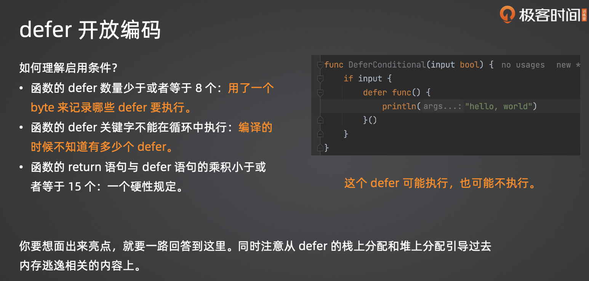

## 1.手写一个hashmap

手写一个哈希表（hashmap）需要考虑以下几个关键点：

1. **哈希函数：** 哈希函数负责将键映射到数组的索引。一个好的哈希函数应该能够均匀地分布键，减少冲突。
2. **冲突解决：** 不同的键可能映射到相同的索引，这就是哈希冲突。常见的解决冲突的方法有链地址法和开放地址法。
3. **数组：** 用于存储哈希表的数据结构。每个索引对应一个桶，每个桶可以存储一个或多个键值对。

下面是一个简单的示例实现，使用链地址法来解决冲突：

### 示例代码1

```go
package main

import (
	"fmt"
	"hash/fnv"
)

// Entry 表示哈希表中的一个键值对
type Entry struct {
	key   string
	value int
	next  *Entry
}

// HashMap 是哈希表的结构
type HashMap struct {
	buckets []*Entry
	size    int
}

// NewHashMap 创建一个新的哈希表
func NewHashMap(size int) *HashMap {
	return &HashMap{
		buckets: make([]*Entry, size),
		size:    size,
	}
}

// hash 计算字符串的哈希值
func hash(key string, size int) uint32 {
	h := fnv.New32a()
	h.Write([]byte(key))
	return h.Sum32() % uint32(size)
}

// Put 向哈希表中插入键值对
func (hm *HashMap) Put(key string, value int) {
	index := hash(key, hm.size)

	// 如果桶为空，直接插入
	if hm.buckets[index] == nil {
		hm.buckets[index] = &Entry{key: key, value: value}
		return
	}

	// 如果桶非空，使用链地址法处理冲突
	entry := hm.buckets[index]
	for entry.next != nil {
		if entry.key == key {
			// 键已存在，更新值
			entry.value = value
			return
		}
		entry = entry.next
	}

	// 插入新的键值对到链表末尾
	entry.next = &Entry{key: key, value: value}
}

// Get 从哈希表中获取键对应的值
func (hm *HashMap) Get(key string) (int, bool) {
	index := hash(key, hm.size)
	entry := hm.buckets[index]

	for entry != nil {
		if entry.key == key {
			return entry.value, true
		}
		entry = entry.next
	}

	return 0, false
}

func main() {
	hashMap := NewHashMap(10)

	hashMap.Put("one", 1)
	hashMap.Put("two", 2)
	hashMap.Put("three", 3)

	val, found := hashMap.Get("two")
	if found {
		fmt.Println("Value for key 'two':", val)
	} else {
		fmt.Println("Key 'two' not found.")
	}

	val, found = hashMap.Get("four")
	if found {
		fmt.Println("Value for key 'four':", val)
	} else {
		fmt.Println("Key 'four' not found.")
	}
}
```

这只是一个简单的例子，实际中可能需要考虑更多的因素，例如动态扩容、性能优化等。

### 示例代码2

这是一个基于拉链法的简单 hashmap 实现：

```go
package main

import (
	"fmt"
	"sync"
)

// Entry 表示 hashmap 中的一个键值对
type Entry struct {
	Key   string
	Value interface{}
}

// HashMap 是我们的 hashmap 结构
type HashMap struct {
	buckets map[int][]Entry
	mu      sync.RWMutex
}

// NewHashMap 创建一个新的 hashmap
func NewHashMap() *HashMap {
	return &HashMap{
		buckets: make(map[int][]Entry),
	}
}

// hash 计算字符串的哈希值
func hash(s string) int {
	h := 0
	for i := 0; i < len(s); i++ {
		h = 31*h + int(s[i])
	}
	return h
}

// Insert 插入键值对
func (hm *HashMap) Insert(key string, value interface{}) {
	hm.mu.Lock()
	defer hm.mu.Unlock()

	hashCode := hash(key)
	bucket := hm.buckets[hashCode]
	entry := Entry{Key: key, Value: value}
	hm.buckets[hashCode] = append(bucket, entry)
}

// Get 获取键对应的值
func (hm *HashMap) Get(key string) (interface{}, bool) {
	hm.mu.RLock()
	defer hm.mu.RUnlock()

	hashCode := hash(key)
	bucket := hm.buckets[hashCode]

	for _, entry := range bucket {
		if entry.Key == key {
			return entry.Value, true
		}
	}

	return nil, false
}

// Delete 删除键值对
func (hm *HashMap) Delete(key string) {
	hm.mu.Lock()
	defer hm.mu.Unlock()

	hashCode := hash(key)
	bucket := hm.buckets[hashCode]

	var updatedBucket []Entry
	for _, entry := range bucket {
		if entry.Key != key {
			updatedBucket = append(updatedBucket, entry)
		}
	}

	hm.buckets[hashCode] = updatedBucket
}

// Print 打印 hashmap 的内容（用于调试）
func (hm *HashMap) Print() {
	hm.mu.RLock()
	defer hm.mu.RUnlock()

	for index, bucket := range hm.buckets {
		fmt.Printf("%d: ", index)
		for _, entry := range bucket {
			fmt.Printf("(%s, %v) ", entry.Key, entry.Value)
		}
		fmt.Println()
	}
}

func main() {
	hm := NewHashMap()

	hm.Insert("one", 1)
	hm.Insert("two", 2)
	hm.Insert("three", 3)

	hm.Print()

	val, exists := hm.Get("two")
	if exists {
		fmt.Println("Value for key 'two':", val)
	} else {
		fmt.Println("Key 'two' not found.")
	}

	hm.Delete("two")

	hm.Print()
}
```

这个例子使用了基本的字符串哈希函数和简单的拉链法来处理碰撞。请注意，这只是一个基本示例，实际上，一个健壮的 hashmap 需要考虑更多的细节和性能优化。

**上面两个代码实现方式略有差异**

这两个 `HashMap` 的定义涉及到了不同的实现方式，其中一个是使用了切片的方式，另一个使用了 `map`。

1. **使用切片的实现方式**:

```go
type HashMap struct {
    buckets []*Entry
    size    int
}
```

这个实现使用了一个切片 (`buckets`) 来存储哈希表的桶，每个桶包含了一个 `Entry` 结构。这个结构可以看作是一个链表节点，因为在哈希冲突的情况下，多个键可能会映射到同一个桶。这种方式的优点是简单，但在高并发环境中可能需要考虑并发访问的安全性。

2. **使用 map 的实现方式**:

```go
type HashMap struct {
    buckets map[int][]Entry
    mu      sync.RWMutex
}
```

这个实现使用了一个 `map` (`buckets`)，其中的键是哈希码，值是一个切片，存储在哈希码下的所有 `Entry`。这种方式在解决冲突时也使用了链表的概念，但是在并发环境中引入了读写锁 (`sync.RWMutex`) 来确保并发访问的安全性。这使得在读多写少的场景中更为高效。

选择其中一种实现方式通常取决于应用的需求和对并发性能的要求。使用 `map` 的实现方式在某些情况下可能更为方便，而使用切片的实现方式可能更为简单。

## 2.go的defer机制

defer 的内部实现分成三种机制:

* 堆上分配:是指整个 defer 直接分配到堆上，缺点就是要被 GC 管理。
* 栈上分配:整个 defer 分配到了 goroutine 栈上，不需要被 GC 管理。比堆上分配性能提升了30%
* 开放编码(Open Code):启用内联的优化，你直观理解就是相当于把你的 defer 内容放到了你的函数最后。

开放编码的启用条件:

* 函数的 defer 数量少于或者等于 8 个;
* 函数的 defer 关键字不能在循环中执行;
* 函数的 return 语句与 defer 语句的乘积小于或者等于 15 个。

开放编码理解：




## 3.切片扩容

切片扩容的原理非常简单，就是重新分配一段连续内存，而后把原本的数据拷贝过去。


在面试中，刷亮点的地方在于你要进一步解释切片扩容的系数。
总结为:
* 当容量小于256的时候，两倍扩容;
* 否则，按照1.25扩容。

低版本是 1024 作为分界点。
面试你要强调几个点:
• 为什么一开始是两倍扩容，后面是1.25倍扩容?
• 为什么低版本是1024作为分界点，而高版本是256?
还有一个问题是，面试官可能会问为什么切片没有缩容?如果你已经实现了泛型工具库，那么你可以说你提供
了切片的删除辅助方法，而后引入了缩容机制。
