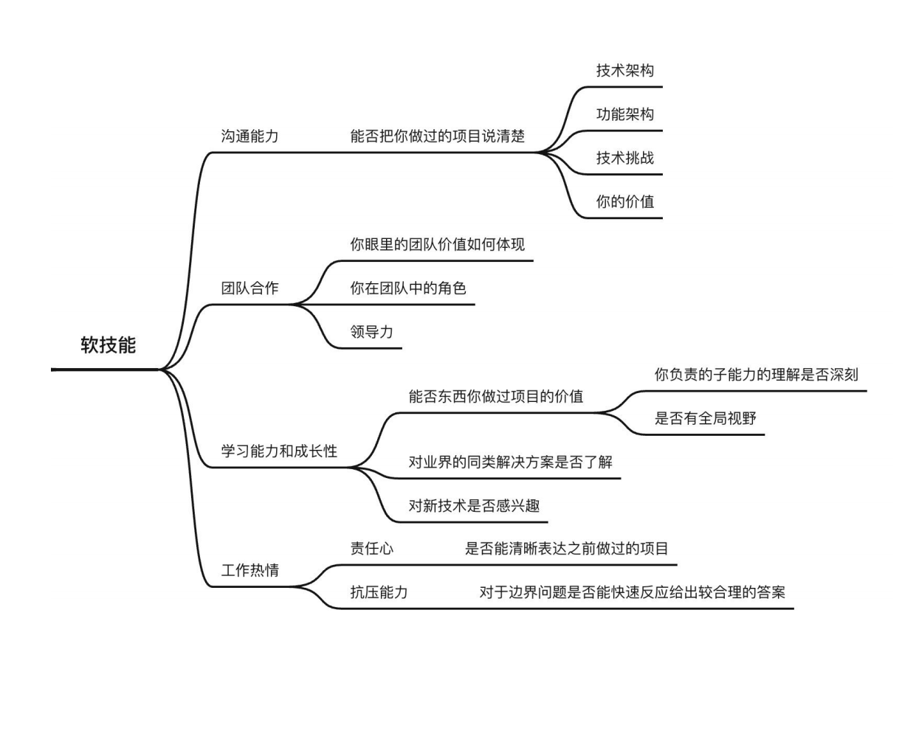
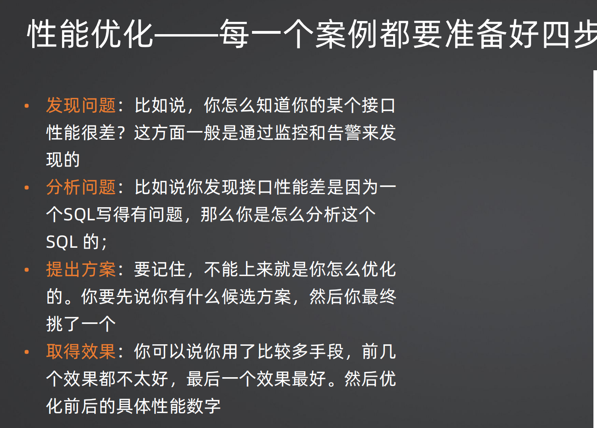
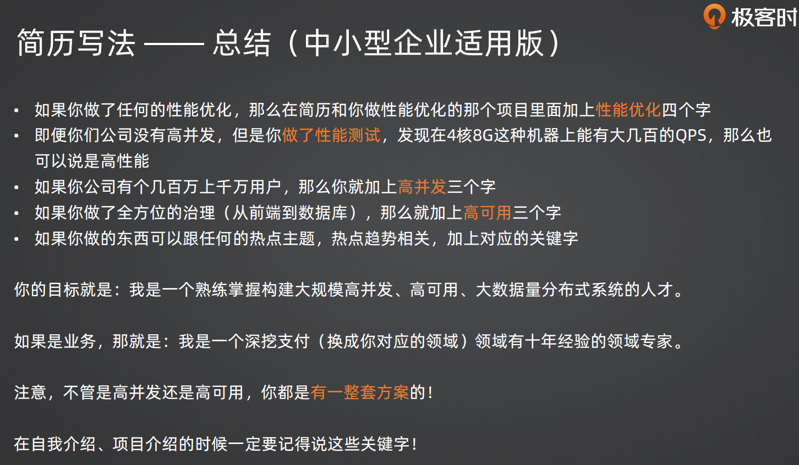
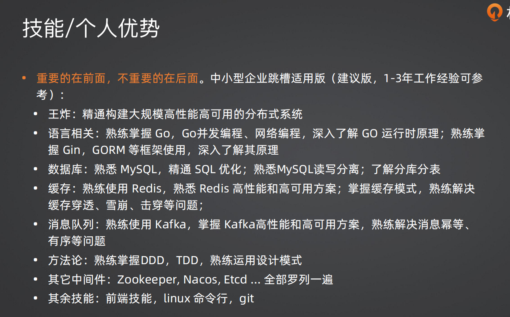

## 1.手写一个hashmap

手写一个哈希表（hashmap）需要考虑以下几个关键点：

1. **哈希函数：** 哈希函数负责将键映射到数组的索引。一个好的哈希函数应该能够均匀地分布键，减少冲突。
2. **冲突解决：** 不同的键可能映射到相同的索引，这就是哈希冲突。常见的解决冲突的方法有链地址法和开放地址法。
3. **数组：** 用于存储哈希表的数据结构。每个索引对应一个桶，每个桶可以存储一个或多个键值对。

下面是一个简单的示例实现，使用链地址法来解决冲突：

### 示例代码1

```go
package main

import (
	"fmt"
	"hash/fnv"
)

// Entry 表示哈希表中的一个键值对
type Entry struct {
	key   string
	value int
	next  *Entry
}

// HashMap 是哈希表的结构
type HashMap struct {
	buckets []*Entry
	size    int
}

// NewHashMap 创建一个新的哈希表
func NewHashMap(size int) *HashMap {
	return &HashMap{
		buckets: make([]*Entry, size),
		size:    size,
	}
}

// hash 计算字符串的哈希值
func hash(key string, size int) uint32 {
	h := fnv.New32a()
	h.Write([]byte(key))
	return h.Sum32() % uint32(size)
}

// Put 向哈希表中插入键值对
func (hm *HashMap) Put(key string, value int) {
	index := hash(key, hm.size)

	// 如果桶为空，直接插入
	if hm.buckets[index] == nil {
		hm.buckets[index] = &Entry{key: key, value: value}
		return
	}

	// 如果桶非空，使用链地址法处理冲突
	entry := hm.buckets[index]
	for entry.next != nil {
		if entry.key == key {
			// 键已存在，更新值
			entry.value = value
			return
		}
		entry = entry.next
	}

	// 插入新的键值对到链表末尾
	entry.next = &Entry{key: key, value: value}
}

// Get 从哈希表中获取键对应的值
func (hm *HashMap) Get(key string) (int, bool) {
	index := hash(key, hm.size)
	entry := hm.buckets[index]

	for entry != nil {
		if entry.key == key {
			return entry.value, true
		}
		entry = entry.next
	}

	return 0, false
}

func main() {
	hashMap := NewHashMap(10)

	hashMap.Put("one", 1)
	hashMap.Put("two", 2)
	hashMap.Put("three", 3)

	val, found := hashMap.Get("two")
	if found {
		fmt.Println("Value for key 'two':", val)
	} else {
		fmt.Println("Key 'two' not found.")
	}

	val, found = hashMap.Get("four")
	if found {
		fmt.Println("Value for key 'four':", val)
	} else {
		fmt.Println("Key 'four' not found.")
	}
}
```

这只是一个简单的例子，实际中可能需要考虑更多的因素，例如动态扩容、性能优化等。

### 示例代码2

这是一个基于拉链法的简单 hashmap 实现：

```go
package main

import (
	"fmt"
	"sync"
)

// Entry 表示 hashmap 中的一个键值对
type Entry struct {
	Key   string
	Value interface{}
}

// HashMap 是我们的 hashmap 结构
type HashMap struct {
	buckets map[int][]Entry
	mu      sync.RWMutex
}

// NewHashMap 创建一个新的 hashmap
func NewHashMap() *HashMap {
	return &HashMap{
		buckets: make(map[int][]Entry),
	}
}

// hash 计算字符串的哈希值
func hash(s string) int {
	h := 0
	for i := 0; i < len(s); i++ {
		h = 31*h + int(s[i])
	}
	return h
}

// Insert 插入键值对
func (hm *HashMap) Insert(key string, value interface{}) {
	hm.mu.Lock()
	defer hm.mu.Unlock()

	hashCode := hash(key)
	bucket := hm.buckets[hashCode]
	entry := Entry{Key: key, Value: value}
	hm.buckets[hashCode] = append(bucket, entry)
}

// Get 获取键对应的值
func (hm *HashMap) Get(key string) (interface{}, bool) {
	hm.mu.RLock()
	defer hm.mu.RUnlock()

	hashCode := hash(key)
	bucket := hm.buckets[hashCode]

	for _, entry := range bucket {
		if entry.Key == key {
			return entry.Value, true
		}
	}

	return nil, false
}

// Delete 删除键值对
func (hm *HashMap) Delete(key string) {
	hm.mu.Lock()
	defer hm.mu.Unlock()

	hashCode := hash(key)
	bucket := hm.buckets[hashCode]

	var updatedBucket []Entry
	for _, entry := range bucket {
		if entry.Key != key {
			updatedBucket = append(updatedBucket, entry)
		}
	}

	hm.buckets[hashCode] = updatedBucket
}

// Print 打印 hashmap 的内容（用于调试）
func (hm *HashMap) Print() {
	hm.mu.RLock()
	defer hm.mu.RUnlock()

	for index, bucket := range hm.buckets {
		fmt.Printf("%d: ", index)
		for _, entry := range bucket {
			fmt.Printf("(%s, %v) ", entry.Key, entry.Value)
		}
		fmt.Println()
	}
}

func main() {
	hm := NewHashMap()

	hm.Insert("one", 1)
	hm.Insert("two", 2)
	hm.Insert("three", 3)

	hm.Print()

	val, exists := hm.Get("two")
	if exists {
		fmt.Println("Value for key 'two':", val)
	} else {
		fmt.Println("Key 'two' not found.")
	}

	hm.Delete("two")

	hm.Print()
}
```

这个例子使用了基本的字符串哈希函数和简单的拉链法来处理碰撞。请注意，这只是一个基本示例，实际上，一个健壮的 hashmap 需要考虑更多的细节和性能优化。

**上面两个代码实现方式略有差异**

这两个 `HashMap` 的定义涉及到了不同的实现方式，其中一个是使用了切片的方式，另一个使用了 `map`。

1. **使用切片的实现方式**:

```go
type HashMap struct {
    buckets []*Entry
    size    int
}
```

这个实现使用了一个切片 (`buckets`) 来存储哈希表的桶，每个桶包含了一个 `Entry` 结构。这个结构可以看作是一个链表节点，因为在哈希冲突的情况下，多个键可能会映射到同一个桶。这种方式的优点是简单，但在高并发环境中可能需要考虑并发访问的安全性。

2. **使用 map 的实现方式**:

```go
type HashMap struct {
    buckets map[int][]Entry
    mu      sync.RWMutex
}
```

这个实现使用了一个 `map` (`buckets`)，其中的键是哈希码，值是一个切片，存储在哈希码下的所有 `Entry`。这种方式在解决冲突时也使用了链表的概念，但是在并发环境中引入了读写锁 (`sync.RWMutex`) 来确保并发访问的安全性。这使得在读多写少的场景中更为高效。

选择其中一种实现方式通常取决于应用的需求和对并发性能的要求。使用 `map` 的实现方式在某些情况下可能更为方便，而使用切片的实现方式可能更为简单。

## 2.go的defer机制

defer 的内部实现分成三种机制:

* 堆上分配:是指整个 defer 直接分配到堆上，缺点就是要被 GC 管理。
* 栈上分配:整个 defer 分配到了 goroutine 栈上，不需要被 GC 管理。比堆上分配性能提升了30%
* 开放编码(Open Code):启用内联的优化，你直观理解就是相当于把你的 defer 内容放到了你的函数最后。

开放编码的启用条件:

* 函数的 defer 数量少于或者等于 8 个;
* 函数的 defer 关键字不能在循环中执行;
* 函数的 return 语句与 defer 语句的乘积小于或者等于 15 个。

开放编码理解：


## 3.切片扩容

切片扩容的原理非常简单，就是重新分配一段连续内存，而后把原本的数据拷贝过去。

在面试中，刷亮点的地方在于你要进一步解释切片扩容的系数。
总结为:

* 当容量小于256的时候，两倍扩容;
* 否则，按照1.25扩容。

低版本是 1024 作为分界点。
面试你要强调几个点:
• 为什么一开始是两倍扩容，后面是1.25倍扩容?
• 为什么低版本是1024作为分界点，而高版本是256?
还有一个问题是，面试官可能会问为什么切片没有缩容?如果你已经实现了泛型工具库，那么你可以说你提供
了切片的删除辅助方法，而后引入了缩容机制。

## 4.手写限流算法

在 Go 语言中，可以使用令牌桶算法实现简单的限流。令牌桶算法允许在固定的时间间隔内发放一定数量的令牌，而请求需要消耗令牌。如果令牌桶中没有足够的令牌，则请求会被拒绝或等待。

以下是一个简单的令牌桶算法的 Go 语言实现：

```go
package main

import (
	"fmt"
	"sync"
	"time"
)

// Limiter 结构体表示限流器
type Limiter struct {
	rate       float64       // 令牌发放速率（令牌/秒）
	capacity   int           // 令牌桶容量
	tokens     int           // 当前令牌数量
	lastUpdate time.Time     // 上次更新令牌数量的时间
	mu         sync.Mutex    // 互斥锁，用于保护令牌数量的并发访问
}

// NewLimiter 创建一个新的限流器
func NewLimiter(rate float64, capacity int) *Limiter {
	return &Limiter{
		rate:     rate,
		capacity: capacity,
		tokens:   capacity,
	}
}

// Allow 检查是否允许执行请求
func (limiter *Limiter) Allow() bool {
	limiter.mu.Lock()
	defer limiter.mu.Unlock()

	now := time.Now()
	elapsed := now.Sub(limiter.lastUpdate).Seconds()

	// 根据经过的时间，向令牌桶中添加令牌
	addedTokens := int(elapsed * limiter.rate)
	if addedTokens > 0 {
		limiter.tokens += addedTokens
		if limiter.tokens > limiter.capacity {
			limiter.tokens = limiter.capacity
		}
		limiter.lastUpdate = now
	}

	// 检查是否有足够的令牌
	if limiter.tokens > 0 {
		limiter.tokens--
		return true
	}

	return false
}

func main() {
	// 创建一个限流器，设置令牌发放速率为 2 令牌/秒，令牌桶容量为 5
	limiter := NewLimiter(2, 5)

	// 模拟执行 10 次请求
	for i := 0; i < 10; i++ {
		if limiter.Allow() {
			fmt.Println("执行请求", i+1)
		} else {
			fmt.Println("请求被限流", i+1)
		}
		time.Sleep(time.Second) // 模拟请求之间的时间间隔
	}
}
```

在这个例子中，`Limiter` 结构体表示令牌桶限流器，通过 `NewLimiter` 函数进行初始化。`Allow` 方法用于检查是否允许执行请求，如果有足够的令牌则允许，否则被限流。

请注意，这只是一个简单的演示，实际使用中可能需要根据具体场景进行调整和优化。

## 5. 降级算法-手写

在 Go 语言中，可以使用简单的降级算法来实现系统的降级策略。降级是一种在系统负载过高或出现异常情况时，临时关闭或简化某些功能，以保证系统的稳定性。以下是一个简单的示例，演示如何在 Go 中实现一个基本的降级算法：

```go
package main

import (
	"fmt"
	"sync"
	"time"
)

// CircuitBreaker 结构体表示断路器
type CircuitBreaker struct {
	mu           sync.Mutex
	isOpen       bool          // 断路器是否打开
	lastOpenTime time.Time     // 上次断路器打开时间
}

// NewCircuitBreaker 创建一个新的断路器
func NewCircuitBreaker() *CircuitBreaker {
	return &CircuitBreaker{}
}

// Allow 检查是否允许执行操作
func (cb *CircuitBreaker) Allow() bool {
	cb.mu.Lock()
	defer cb.mu.Unlock()

	if cb.isOpen {
		// 如果断路器已打开，则检查是否到达重试时间
		elapsed := time.Since(cb.lastOpenTime)
		if elapsed > 5*time.Second {
			// 如果超过重试时间，则关闭断路器
			cb.isOpen = false
			fmt.Println("断路器关闭")
		} else {
			// 否则，拒绝执行操作
			fmt.Println("断路器打开，拒绝执行操作")
			return false
		}
	}

	// 模拟执行操作
	fmt.Println("执行操作")

	// 如果操作执行成功，则返回 true
	return true
}

// Trip 断路器跳闸，即打开断路器
func (cb *CircuitBreaker) Trip() {
	cb.mu.Lock()
	defer cb.mu.Unlock()

	cb.isOpen = true
	cb.lastOpenTime = time.Now()
	fmt.Println("断路器打开")
}

func main() {
	// 创建一个断路器
	circuitBreaker := NewCircuitBreaker()

	// 模拟执行操作
	for i := 0; i < 10; i++ {
		if circuitBreaker.Allow() {
			// 模拟操作成功
			fmt.Println("操作成功")
		} else {
			// 模拟操作失败，触发断路器跳闸
			circuitBreaker.Trip()
		}

		// 模拟操作之间的时间间隔
		time.Sleep(2 * time.Second)
	}
}
```

在这个例子中，`CircuitBreaker` 结构体表示断路器，具有 `Allow` 方法用于检查是否允许执行操作，以及 `Trip` 方法用于触发断路器跳闸（打开断路器）。如果断路器打开，将拒绝执行操作，直到经过一段时间后重试，然后再尝试关闭断路器。

请注意，这只是一个简单的演示，实际应用中可能需要更复杂的逻辑和参数调整，以满足具体业务场景。

## 6. php和golang的区别和golang的优势

Golang 和 PHP 是两种不同的编程语言，各自在特定领域有一些优势。以下是 Golang 相对于 PHP 的一些主要优势：

1. **性能：** Golang 在性能方面通常比 PHP 更高效。它是一门编译型语言，而 PHP 是解释型语言。Golang 的编译器能够生成原生机器码，这使得它在处理并发任务和高负载时更为出色。
2. **并发性：** Golang 的并发模型被设计得非常强大，支持轻松处理大规模并发。这对于构建需要高度并发性能的系统，如网络服务器或分布式系统，非常有利。
3. **静态类型：** Golang 是一种静态类型语言，这意味着变量的类型在编译时就已经确定。这有助于在开发过程中捕获一些潜在的错误，提高代码的可靠性和可维护性。
4. **工具和标准库：** Golang 提供了丰富的标准库和工具集，使得开发者可以更容易地构建高效、可靠的应用程序。标准库包括许多有用的功能，如并发处理、网络编程和加密。
5. **内置并发支持：** Golang 具有内置的并发支持，通过 goroutines 和 channels，使得编写并发代码更为简单。PHP 也支持并发，但 Golang 的并发模型更直观且易于使用。
6. **跨平台支持：** Golang 的编译器能够生成针对不同操作系统和架构的可执行文件，从而实现了跨平台的支持。这使得 Golang 在构建跨平台应用时更具优势。

需要注意的是，选择使用 Golang 还是 PHP 取决于项目的具体需求和开发者的偏好。PHP 在 Web 开发方面有着广泛的应用，尤其是在构建动态网页和服务器端应用时。 Golang 则更适合需要高性能和并发支持的系统，尤其是在云计算和分布式系统领域。

Golang 和 PHP 在内存管理方面有一些显著的差异：

1. **垃圾回收：**

   - **Golang：** Golang 使用自动垃圾回收（Garbage Collection）来管理内存。其垃圾回收器定期检查不再使用的内存，并释放这些内存以供重用。这种方式有助于避免内存泄漏，但也可能在某些情况下引入一些轻微的延迟。
   - **PHP：** PHP 通常使用引用计数来进行垃圾回收。当一个变量被引用时，引用计数增加；当变量不再被引用时，引用计数减少。当引用计数为零时，相关的内存会被释放。PHP 还包含一个垃圾回收器，用于处理循环引用等引用计数难以解决的情况。
2. **内存分配：**

   - **Golang：** Golang 使用效率高的分代内存分配策略。它将内存分为几个代，每代有不同的垃圾回收频率。这有助于减少垃圾回收对应用性能的影响。
   - **PHP：** PHP 通常使用内存池（Memory Pool）技术来提高内存分配效率。内存池允许 PHP 预先分配一块内存，并在需要时从中分配空间，而不是每次都动态分配和释放内存。
3. **手动内存管理：**

   - **Golang：** Golang是一门现代的编程语言，强调自动内存管理，减轻开发者负担，避免了手动内存管理的问题。
   - **PHP：** PHP主要是一种脚本语言，通常由解释器负责内存管理。开发者不需要显式进行内存分配或释放，但需要注意避免循环引用等可能导致内存泄漏的情况。

总体而言，Golang的内存管理更为先进，通过自动垃圾回收和分代内存分配等技术，更好地平衡了性能和开发者的便利性。PHP在内存管理方面可能更依赖于引用计数等较为传统的技术，但在大多数情况下，这对于Web开发等场景仍然是足够的。

Golang（Go）和PHP的垃圾回收（GC）机制存在一些显著的区别，以下是其中一些重要的区别以及Golang的一些优势：

1. **并发垃圾回收：**

   - **Golang：** Golang的垃圾回收器是并发执行的，这意味着它可以与应用程序的其他部分同时运行。这有助于减小垃圾回收对应用性能的影响，特别是在大规模并发的情况下。
   - **PHP：** PHP的垃圾回收通常是暂停-恢复式的，即在进行垃圾回收时会暂停应用程序的执行。这可能导致一些短暂的性能下降，尤其是在大规模并发的环境中。
2. **分代垃圾回收：**

   - **Golang：** Golang使用分代垃圾回收策略，将内存分为几代，每一代有不同的回收频率。这有助于降低对整个内存空间进行回收的频率，提高垃圾回收的效率。
   - **PHP：** PHP的垃圾回收主要基于引用计数，而不同于分代回收。PHP 7引入了一个垃圾回收器来解决引用计数无法解决的一些问题，但它的实现方式与Golang的分代回收不同。
3. **内存池和内存分配：**

   - **Golang：** Golang使用内存池技术，它会在需要时预先分配一块内存，然后在运行时从中分配。这有助于提高内存分配的效率。
   - **PHP：** PHP通常也使用内存池技术，但它的实现方式可能与Golang有所不同。PHP的内存管理由解释器处理，而Golang的内存管理则是由编译器和运行时系统协同工作的。
4. **手动内存管理：**

   - **Golang：** Golang强调自动内存管理，开发者不需要显式进行内存分配或释放。这减轻了程序员的负担，降低了出错的可能性。
   - **PHP：** PHP通常也是自动内存管理的，但开发者需要注意循环引用等可能导致内存泄漏的情况。

Golang的GC机制相对于PHP更先进，它采用并发垃圾回收和分代垃圾回收等先进技术，以确保在高性能和高并发的场景下仍能有效地管理内存。这些特性使得Golang在构建大规模并发应用或服务时具有优势。然而，选择使用哪种语言取决于具体的项目需求和开发者的偏好。

Golang（Go）和PHP是两种在底层实现和设计上有显著差异的编程语言。以下是它们之间一些重要的底层不同之处：

1. **编程范式：**

   - **Golang：** Golang是一门静态类型的、编译型语言，注重简洁性和性能。它采用了一种并发模型，通过goroutines和channels支持轻松处理大规模并发。
   - **PHP：** PHP是一门动态类型的、解释型语言，主要用于Web开发。它的设计目标是简单易用，支持快速开发和动态脚本执行。
2. **并发性和并行性：**

   - **Golang：** Golang在语言级别内置了强大的并发支持，通过goroutines和channels可以轻松实现并发。Golang还通过`sync`包等提供了丰富的并发工具。
   - **PHP：** PHP的并发性相对较弱，虽然可以通过多进程或多线程等手段实现一些并发效果，但它的并发性不如Golang那样内置和直观。
3. **内存管理：**

   - **Golang：** Golang使用了先进的垃圾回收机制，采用分代垃圾回收和并发垃圾回收等策略。它通过内存池技术提高内存分配效率，强调自动内存管理。
   - **PHP：** PHP通常使用引用计数来进行垃圾回收，但在PHP 7中引入了一个简单的垃圾回收器来解决引用计数难以处理的一些情况。PHP的垃圾回收机制相对较简单。
4. **编译和运行：**

   - **Golang：** Golang是一门编译型语言，代码在运行之前需要被编译成机器码。这有助于提高执行效率，但也增加了构建和部署的步骤。
   - **PHP：** PHP是一门解释型语言，代码在运行时被解释器逐行执行。这使得PHP更适合快速开发和灵活性，但可能导致性能相对较低。
5. **静态类型 vs. 动态类型：**

   - **Golang：** Golang是一门静态类型语言，变量的类型在编译时就已经确定。这有助于提高代码的可靠性和性能。
   - **PHP：** PHP是一门动态类型语言，变量的类型在运行时动态确定。这使得PHP更具灵活性，但也增加了一些类型相关的错误的可能性。

这些底层不同使得Golang适用于构建高性能、并发性强的系统，而PHP更适用于Web开发等场景。选择使用哪种语言通常取决于项目的需求、性能要求以及开发者的偏好。

## 7.软技能-沟通和表达



## 8.简历准备

高并发： 性能优化

* 业务相关：比如说优化不合理的业务流程
* 引入缓存：比如说引入Redis，或者引入本地缓存-Redis双重机制，或者缓存预热等

缓存预热（）

缓存永不过期(排行榜，分级推荐书单)

异步延迟队列（削峰填谷）=>hyperf 的delay queue：

底层是redis的 sorted set + 定时任务检查是否执行时间达到了，+异步执行

* 数据库相关优化：数据库本身优化、锁优化和 SQL优化，乐观锁优化

熟练掌握SQL优化，click house优化

* 代码层面优化：Go内存优化（逃逸分析、对象池）、Go并发优化（锁优化，原子操作，goroutine泄露，Go协程池）

对象池

主要思路有有锁改无锁；写锁改读写锁；原子操作（CAS也可以看做是乐观锁）；全局锁。并发优化这个在业务开发里面比较少用

* 异步：引入消息队列



高可用：

redis 单机 想要改造成 Sentinel或Cluster模式

熔断 限流 降级

超时控制-重试（go是内存泄露）

监控和告警

容错：redis崩溃，mysql也会崩溃： redis的集群，mysql主从，mysql库的迁移切割不影响其他业务

• 关键字：高并发、大数据、服务治理、分库分表、分布式事务、分布式锁





项目经验： 准备核心困难-必须是面试官能够理解的（需要准备几个）

**整理文本**
